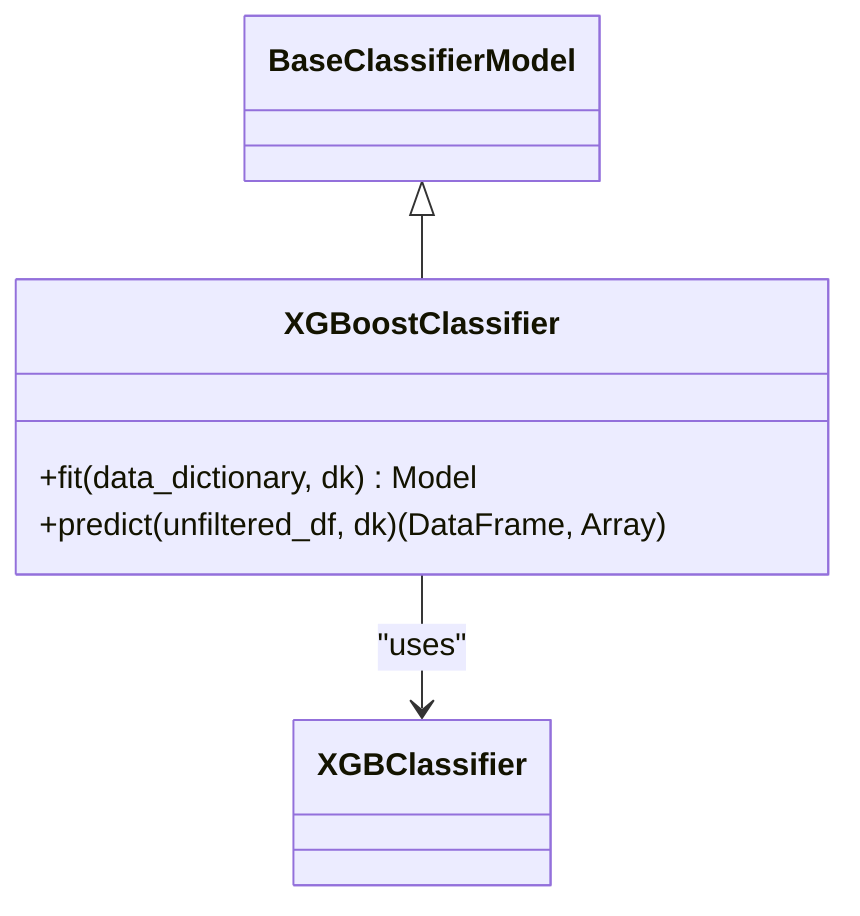
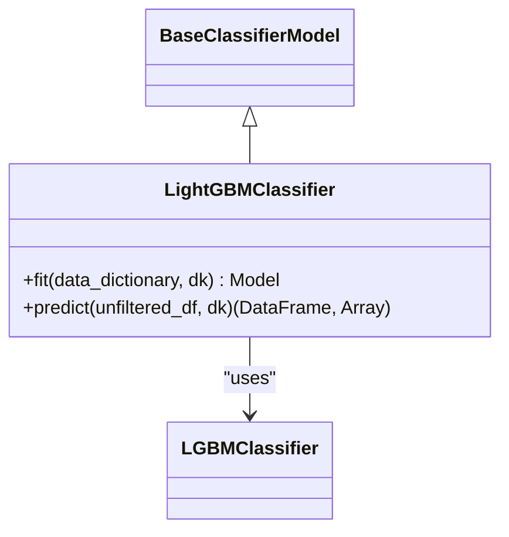
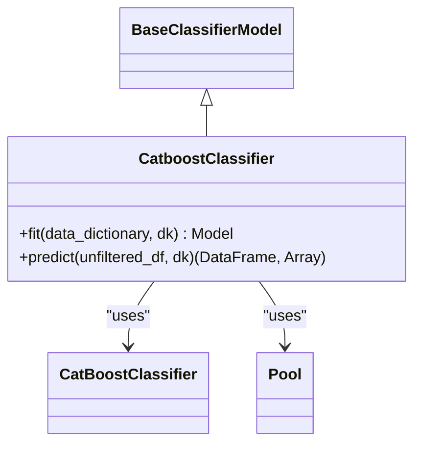
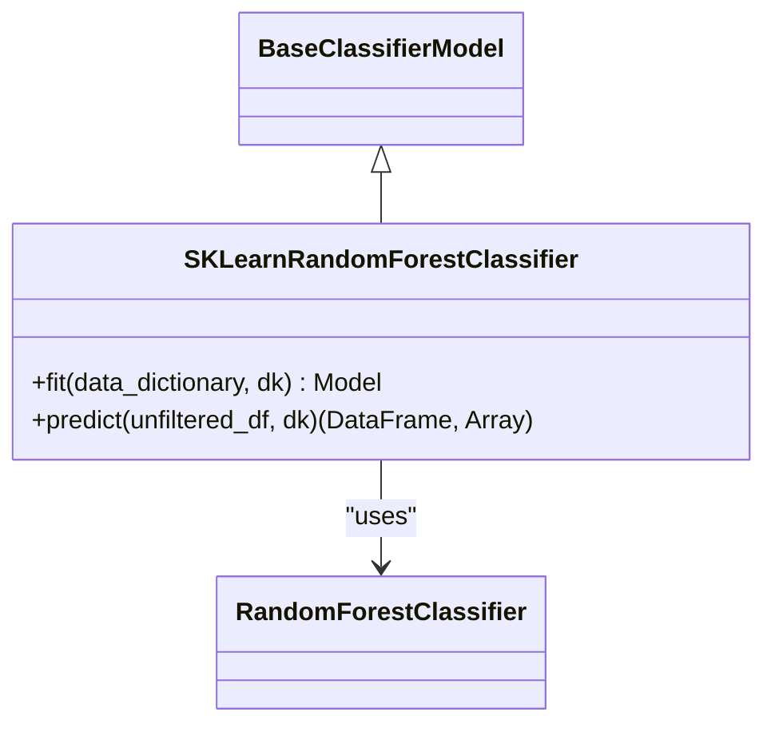
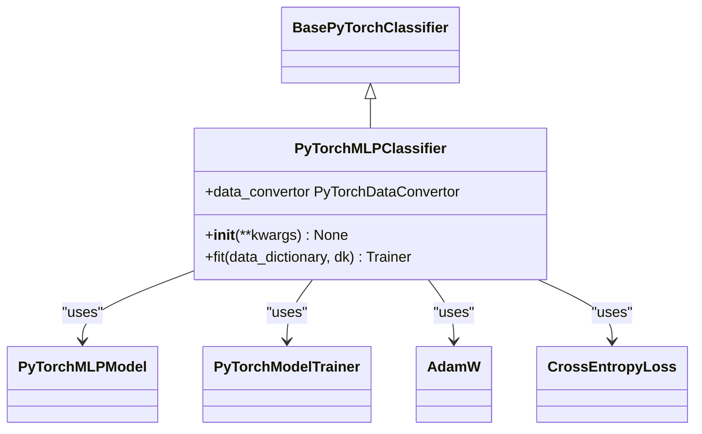

# 分类模型实现

<cite>
**本文档中引用的文件**  
- [XGBoostClassifier.py](file://freqtrade/freqai/prediction_models/XGBoostClassifier.py)
- [LightGBMClassifier.py](file://freqtrade/freqai/prediction_models/LightGBMClassifier.py)
- [CatboostClassifier.py](file://freqtrade/freqai/prediction_models/CatboostClassifier.py)
- [SKLearnRandomForestClassifier.py](file://freqtrade/freqai/prediction_models/SKLearnRandomForestClassifier.py)
- [PyTorchMLPClassifier.py](file://freqtrade/freqai/prediction_models/PyTorchMLPClassifier.py)
- [BaseClassifierModel.py](file://freqtrade/freqai/base_models/BaseClassifierModel.py)
- [BasePyTorchClassifier.py](file://freqtrade/freqai/base_models/BasePyTorchClassifier.py)
- [data_kitchen.py](file://freqtrade/freqai/data_kitchen.py)
</cite>

## 目录
1. [引言](#引言)
2. [模型实现概览](#模型实现概览)
3. [XGBoost分类器](#xgboost分类器)
4. [LightGBM分类器](#lightgbm分类器)
5. [Catboost分类器](#catboost分类器)
6. [随机森林分类器](#随机森林分类器)
7. [PyTorch MLP分类器](#pytorch-mlp分类器)
8. [训练流程与数据处理](#训练流程与数据处理)
9. [预测输出格式](#预测输出格式)
10. [交易信号生成中的应用](#交易信号生成中的应用)
11. [模型配置与参数详解](#模型配置与参数详解)
12. [不平衡数据处理与过拟合控制](#不平衡数据处理与过拟合控制)
13. [集成到交易策略](#集成到交易策略)

## 引言
FreqAI是Freqtrade框架中的机器学习模块，支持多种分类模型用于金融时间序列预测。本文档系统阐述FreqAI支持的分类模型实现，包括XGBoost、LightGBM、Catboost、随机森林及PyTorch MLP分类器。详细描述每种模型的数学原理、训练过程和输出格式（如概率分布或类别标签）。说明分类任务在交易信号生成中的应用场景，例如趋势判断或多类别模式识别。提供模型配置参数详解和典型使用示例，展示如何将分类结果集成到交易策略中。分析各类模型对不平衡数据的处理能力及过拟合风险控制机制。

## 模型实现概览
FreqAI中的分类模型均继承自基础类`BaseClassifierModel`或`BasePyTorchClassifier`，实现了统一的训练和预测接口。模型通过`fit`方法进行训练，`predict`方法进行预测。所有模型均支持特征加权、数据标准化、异常值处理等预处理功能，并可通过配置文件灵活调整训练参数。

**Section sources**
- [BaseClassifierModel.py](file://freqtrade/freqai/base_models/BaseClassifierModel.py#L1-L130)
- [BasePyTorchClassifier.py](file://freqtrade/freqai/base_models/BasePyTorchClassifier.py#L1-L215)

## XGBoost分类器
XGBoost分类器基于梯度提升树算法，通过最小化损失函数迭代构建决策树。在FreqAI中，`XGBoostClassifier`类继承自`BaseClassifierModel`，使用`XGBClassifier`作为底层模型。训练时支持样本权重、验证集评估和增量学习。模型自动处理类别标签编码，支持多分类任务。

**Diagram sources**
- [XGBoostClassifier.py](file://freqtrade/freqai/prediction_models/XGBoostClassifier.py#L1-L88)

**Section sources**
- [XGBoostClassifier.py](file://freqtrade/freqai/prediction_models/XGBoostClassifier.py#L1-L88)

## LightGBM分类器
LightGBM分类器采用基于直方图的决策树算法，具有训练速度快、内存占用低的特点。`LightGBMClassifier`类继承自`BaseClassifierModel`，使用`LGBMClassifier`作为底层模型。支持类别特征处理、样本权重和早停机制。模型在训练时可指定验证集进行性能监控。

**Diagram sources**
- [LightGBMClassifier.py](file://freqtrade/freqai/prediction_models/LightGBMClassifier.py#L1-L58)

**Section sources**
- [LightGBMClassifier.py](file://freqtrade/freqai/prediction_models/LightGBMClassifier.py#L1-L58)

## Catboost分类器
Catboost分类器专为处理类别特征而设计，采用有序提升算法减少过拟合。`CatboostClassifier`类继承自`BaseClassifierModel`，使用`CatBoostClassifier`作为底层模型。支持类别特征自动编码、缺失值处理和GPU加速。模型使用`Pool`对象封装训练数据，支持样本权重。

**Diagram sources**
- [CatboostClassifier.py](file://freqtrade/freqai/prediction_models/CatboostClassifier.py#L1-L61)

**Section sources**
- [CatboostClassifier.py](file://freqtrade/freqai/prediction_models/CatboostClassifier.py#L1-L61)

## 随机森林分类器
随机森林分类器基于集成学习原理，通过构建多个决策树并集成其预测结果。`SKLearnRandomForestClassifier`类继承自`BaseClassifierModel`，使用`RandomForestClassifier`作为底层模型。支持特征重要性评估、OOB误差估计和并行训练。模型不支持增量学习，每次训练均为从头开始。

**Diagram sources**
- [SKLearnRandomForestClassifier.py](file://freqtrade/freqai/prediction_models/SKLearnRandomForestClassifier.py#L1-L84)

**Section sources**
- [SKLearnRandomForestClassifier.py](file://freqtrade/freqai/prediction_models/SKLearnRandomForestClassifier.py#L1-L84)

## PyTorch MLP分类器
PyTorch MLP分类器基于深度神经网络，使用多层感知机进行分类。`PyTorchMLPClassifier`类继承自`BasePyTorchClassifier`，使用自定义的`PyTorchMLPModel`作为网络结构。支持灵活的网络配置、优化器选择和损失函数定义。模型使用`PyTorchModelTrainer`进行训练，支持TensorBoard日志记录。

**Diagram sources**
- [PyTorchMLPClassifier.py](file://freqtrade/freqai/prediction_models/PyTorchMLPClassifier.py#L1-L90)

**Section sources**
- [PyTorchMLPClassifier.py](file://freqtrade/freqai/prediction_models/PyTorchMLPClassifier.py#L1-L90)

## 训练流程与数据处理
FreqAI的训练流程由`DataKitchen`类管理，包括数据加载、特征提取、数据分割和模型训练。训练数据通过`filter_features`方法筛选特征和标签，使用`make_train_test_datasets`方法分割训练集和测试集。特征管道`feature_pipeline`负责数据标准化、降维和异常值处理。训练过程中支持样本加权，通过`weight_factor`参数控制近期数据的权重。

**Section sources**
- [data_kitchen.py](file://freqtrade/freqai/data_kitchen.py#L1-L799)
- [BaseClassifierModel.py](file://freqtrade/freqai/base_models/BaseClassifierModel.py#L1-L130)

## 预测输出格式
分类模型的预测输出包含两类信息：类别标签和类别概率。`predict`方法返回一个包含预测结果的DataFrame和一个`do_predict`数组。DataFrame中包含预测的类别标签及其对应的概率分布。`do_predict`数组标记了因数据缺失或不确定性而被过滤的预测位置。对于多分类任务，概率分布以各分类的置信度形式输出。

**Section sources**
- [BaseClassifierModel.py](file://freqtrade/freqai/base_models/BaseClassifierModel.py#L80-L129)
- [BasePyTorchClassifier.py](file://freqtrade/freqai/base_models/BasePyTorchClassifier.py#L20-L79)

## 交易信号生成中的应用
分类模型在交易信号生成中主要用于趋势判断和模式识别。例如，通过预测未来N根K线的价格方向（上涨/下跌/横盘）生成交易信号。多类别分类可用于识别复杂的市场模式，如头肩顶、双底等技术形态。预测结果可直接作为买入/卖出信号，或与其他指标结合形成复合策略。模型输出的概率分布可用于风险评估，高置信度预测可触发更大仓位。

**Section sources**
- [BaseClassifierModel.py](file://freqtrade/freqai/base_models/BaseClassifierModel.py#L80-L129)
- [BasePyTorchClassifier.py](file://freqtrade/freqai/base_models/BasePyTorchClassifier.py#L20-L79)

## 模型配置与参数详解
模型配置通过`model_training_parameters`参数在配置文件中定义。XGBoost、LightGBM和Catboost支持树的数量、学习率、最大深度等参数。随机森林支持树的数量、最大特征数等参数。PyTorch MLP支持隐藏层维度、dropout率、优化器参数等。通用参数包括`test_size`（测试集比例）、`shuffle`（是否打乱数据）和`weight_factor`（样本权重因子）。

**Section sources**
- [XGBoostClassifier.py](file://freqtrade/freqai/prediction_models/XGBoostClassifier.py#L1-L88)
- [LightGBMClassifier.py](file://freqtrade/freqai/prediction_models/LightGBMClassifier.py#L1-L58)
- [CatboostClassifier.py](file://freqtrade/freqai/prediction_models/CatboostClassifier.py#L1-L61)
- [SKLearnRandomForestClassifier.py](file://freqtrade/freqai/prediction_models/SKLearnRandomForestClassifier.py#L1-L84)
- [PyTorchMLPClassifier.py](file://freqtrade/freqai/prediction_models/PyTorchMLPClassifier.py#L1-L90)

## 不平衡数据处理与过拟合控制
FreqAI通过多种机制处理不平衡数据和过拟合问题。样本权重`sample_weight`可用于平衡不同类别的样本数量。早停机制`early_stopping`防止模型在验证集上过拟合。数据增强和特征选择可提高模型泛化能力。对于时间序列数据，使用时间序列交叉验证而非随机分割。PyTorch模型支持dropout和L2正则化。所有模型均支持增量学习，通过`continual_learning`参数控制。

**Section sources**
- [BaseClassifierModel.py](file://freqtrade/freqai/base_models/BaseClassifierModel.py#L1-L130)
- [BasePyTorchClassifier.py](file://freqtrade/freqai/base_models/BasePyTorchClassifier.py#L1-L215)
- [XGBoostClassifier.py](file://freqtrade/freqai/prediction_models/XGBoostClassifier.py#L1-L88)
- [LightGBMClassifier.py](file://freqtrade/freqai/prediction_models/LightGBMClassifier.py#L1-L58)
- [CatboostClassifier.py](file://freqtrade/freqai/prediction_models/CatboostClassifier.py#L1-L61)
- [SKLearnRandomForestClassifier.py](file://freqtrade/freqai/prediction_models/SKLearnRandomForestClassifier.py#L1-L84)

## 集成到交易策略
分类结果通过`set_freqai_targets`方法集成到交易策略中。用户需在策略中定义目标列名和类别名称。预测结果以DataFrame形式返回，包含类别标签和概率分布。策略可根据预测结果和置信度生成交易信号。`do_predict`数组可用于过滤不可靠的预测。模型支持多目标预测，可同时预测多个市场指标。

**Section sources**
- [BasePyTorchClassifier.py](file://freqtrade/freqai/base_models/BasePyTorchClassifier.py#L80-L215)
- [BaseClassifierModel.py](file://freqtrade/freqai/base_models/BaseClassifierModel.py#L80-L129)