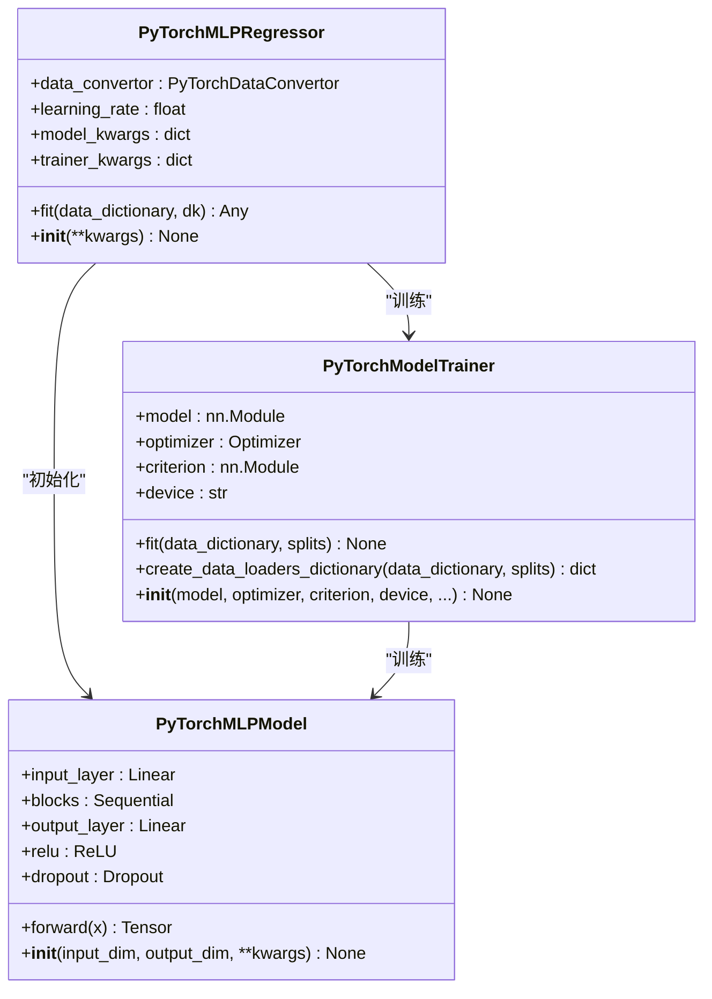
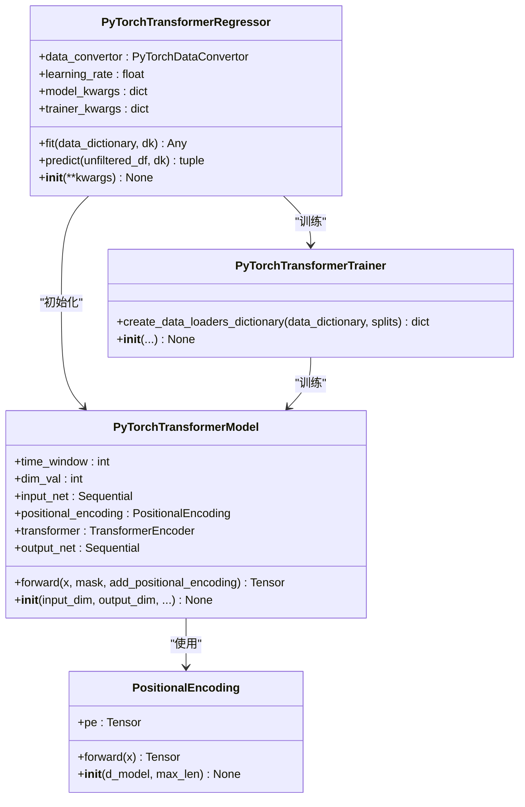

# 回归模型实现

<cite>
**本文档中引用的文件**  
- [XGBoostRegressor.py](file://freqtrade/freqai/prediction_models/XGBoostRegressor.py)
- [LightGBMRegressor.py](file://freqtrade/freqai/prediction_models/LightGBMRegressor.py)
- [CatboostRegressor.py](file://freqtrade/freqai/prediction_models/CatboostRegressor.py)
- [PyTorchMLPRegressor.py](file://freqtrade/freqai/prediction_models/PyTorchMLPRegressor.py)
- [PyTorchTransformerRegressor.py](file://freqtrade/freqai/prediction_models/PyTorchTransformerRegressor.py)
- [BaseRegressionModel.py](file://freqtrade/freqai/base_models/BaseRegressionModel.py)
- [BasePyTorchRegressor.py](file://freqtrade/freqai/base_models/BasePyTorchRegressor.py)
- [PyTorchMLPModel.py](file://freqtrade/freqai/torch/PyTorchMLPModel.py)
- [PyTorchTransformerModel.py](file://freqtrade/freqai/torch/PyTorchTransformerModel.py)
- [PyTorchModelTrainer.py](file://freqtrade/freqai/torch/PyTorchModelTrainer.py)
</cite>

## 目录
1. [简介](#简介)
2. [树模型实现](#树模型实现)
   - [XGBoost回归器](#xgboost回归器)
   - [LightGBM回归器](#lightgbm回归器)
   - [Catboost回归器](#catboost回归器)
3. [神经网络模型实现](#神经网络模型实现)
   - [PyTorchMLPRegressor](#pytorchmlpregressor)
   - [PyTorchTransformerRegressor](#pytorchtransformerregressor)
4. [模型训练与预测流程](#模型训练与预测流程)
5. [模型对比与选型建议](#模型对比与选型建议)
6. [结论](#结论)

## 简介
FreqAI框架提供了多种回归模型实现，用于金融时间序列预测。这些模型可分为两大类：基于决策树的集成学习模型（如XGBoost、LightGBM、Catboost）和基于PyTorch的神经网络模型（如MLP和Transformer）。所有回归模型均继承自统一的基类，确保了接口的一致性。模型通过`fit()`方法进行训练，通过`predict()`方法进行预测，并利用`BaseRegressionModel`提供的标准化数据处理流程。模型配置通过配置文件中的`model_training_parameters`字段进行参数化，支持灵活的超参数调整。

**Section sources**
- [BaseRegressionModel.py](file://freqtrade/freqai/base_models/BaseRegressionModel.py#L1-L131)

## 树模型实现

### XGBoost回归器
XGBoost回归器基于XGBoost库实现，继承自`BaseRegressionModel`。该模型在`fit()`方法中配置训练参数，支持评估集和样本权重。模型初始化时可加载先前的模型进行增量训练。训练过程中使用TensorBoard回调记录训练过程，训练完成后回调被清空以确保模型可序列化。该模型适用于需要高精度预测且能接受较长训练时间的场景，在处理结构化金融数据方面表现出色。

**Section sources**
- [XGBoostRegressor.py](file://freqtrade/freqai/prediction_models/XGBoostRegressor.py#L1-L60)

### LightGBM回归器
LightGBM回归器基于LightGBM库实现，同样继承自`BaseRegressionModel`。其`fit()`方法配置了训练和验证数据集，支持样本权重和初始模型加载。与XGBoost相比，LightGBM采用基于直方图的算法，训练速度更快，内存占用更少，适合大规模数据集的快速训练。该模型在保持较高预测精度的同时，提供了更好的计算效率，适用于需要频繁重训练的实时预测场景。

**Section sources**
- [LightGBMRegressor.py](file://freqtrade/freqai/prediction_models/LightGBMRegressor.py#L1-L54)

### Catboost回归器
Catboost回归器基于Catboost库实现，继承自`BaseRegressionModel`。该模型使用`Pool`数据结构封装训练和测试数据，支持类别特征和样本权重。训练时指定训练目录用于保存中间文件。Catboost在处理类别特征方面具有天然优势，且对过拟合有较强的抵抗力。该模型特别适用于包含大量类别特征的金融数据集，在预测稳定性和鲁棒性方面表现优异。

**Section sources**
- [CatboostRegressor.py](file://freqtrade/freqai/prediction_models/CatboostRegressor.py#L1-L60)

## 神经网络模型实现

### PyTorchMLPRegressor
PyTorchMLPRegressor是基于PyTorch的多层感知机回归器，继承自`BasePyTorchRegressor`。该模型使用`PyTorchMLPModel`作为核心网络架构，包含输入层、多个隐藏层块和输出层。每个隐藏层块由全连接层、ReLU激活函数、Dropout和LayerNorm组成。模型通过`PyTorchModelTrainer`进行训练，支持AdamW优化器和均方误差损失函数。超参数如学习率、隐藏层维度、Dropout率和层数均可通过配置文件灵活调整。该模型适用于捕捉金融时间序列中的非线性关系。

**Diagram sources**
- [PyTorchMLPRegressor.py](file://freqtrade/freqai/prediction_models/PyTorchMLPRegressor.py#L1-L83)
- [PyTorchMLPModel.py](file://freqtrade/freqai/torch/PyTorchMLPModel.py#L1-L96)
- [PyTorchModelTrainer.py](file://freqtrade/freqai/torch/PyTorchModelTrainer.py#L1-L224)

**Section sources**
- [PyTorchMLPRegressor.py](file://freqtrade/freqai/prediction_models/PyTorchMLPRegressor.py#L1-L83)
- [PyTorchMLPModel.py](file://freqtrade/freqai/torch/PyTorchMLPModel.py#L1-L96)

### PyTorchTransformerRegressor
PyTorchTransformerRegressor是基于Transformer架构的回归器，继承自`BasePyTorchRegressor`。该模型的核心是`PyTorchTransformerModel`，它利用自注意力机制捕捉时间序列中的长期依赖关系。模型首先通过线性层和Dropout处理输入，然后添加位置编码以保留序列顺序信息。Transformer编码器处理序列数据后，通过全连接网络进行"伪解码"输出预测结果。该模型特别适用于需要捕捉长期市场记忆和复杂时间依赖的金融预测任务，在处理长序列数据方面具有显著优势。

**Diagram sources**
- [PyTorchTransformerRegressor.py](file://freqtrade/freqai/prediction_models/PyTorchTransformerRegressor.py#L1-L155)
- [PyTorchTransformerModel.py](file://freqtrade/freqai/torch/PyTorchTransformerModel.py#L1-L102)
- [PyTorchModelTrainer.py](file://freqtrade/freqai/torch/PyTorchModelTrainer.py#L1-L224)

**Section sources**
- [PyTorchTransformerRegressor.py](file://freqtrade/freqai/prediction_models/PyTorchTransformerRegressor.py#L1-L155)
- [PyTorchTransformerModel.py](file://freqtrade/freqai/torch/PyTorchTransformerModel.py#L1-L102)

## 模型训练与预测流程
所有回归模型遵循统一的训练和预测流程。训练流程在`BaseRegressionModel`的`train()`方法中定义：首先过滤特征和标签，然后划分训练/测试数据集，接着应用数据管道（包括标准化、PCA、异常值检测等）进行数据预处理，最后调用子类实现的`fit()`方法进行模型训练。预测流程在`predict()`方法中实现：对输入数据应用相同的特征过滤和数据管道变换，然后使用训练好的模型进行预测，最后通过标签管道的逆变换将预测结果还原到原始尺度。PyTorch模型通过`PyTorchModelTrainer`管理训练循环，包括数据加载、前向传播、损失计算、反向传播和参数更新。

**Section sources**
- [BaseRegressionModel.py](file://freqtrade/freqai/base_models/BaseRegressionModel.py#L1-L131)
- [BasePyTorchRegressor.py](file://freqtrade/freqai/base_models/BasePyTorchRegressor.py#L1-L117)

## 模型对比与选型建议
| 模型 | 训练速度 | 内存占用 | 预测精度 | 适用场景 |
| :--- | :--- | :--- | :--- | :--- |
| **XGBoost** | 中等 | 中等 | 高 | 需要高精度预测，数据集适中，可接受较长训练时间 |
| **LightGBM** | 快 | 低 | 高 | 大规模数据集，需要快速训练和低内存占用 |
| **Catboost** | 慢 | 高 | 高 | 数据包含类别特征，需要强抗过拟合能力 |
| **PyTorchMLP** | 慢 | 高 | 中高 | 需要捕捉复杂非线性关系，有足够计算资源 |
| **PyTorchTransformer** | 最慢 | 最高 | 最高 | 需要捕捉长期依赖关系，处理长序列数据 |

选型建议：对于实时性要求高的交易系统，推荐使用LightGBM，在保证较高精度的同时提供最快的训练速度。对于需要极致预测精度且计算资源充足的场景，可选择XGBoost或Catboost。当预测任务涉及复杂的长期时间依赖时，PyTorchTransformerRegressor是最佳选择，尽管其训练成本最高。PyTorchMLPRegressor可作为神经网络模型的入门选择，适用于中等复杂度的非线性建模任务。

## 结论
FreqAI框架提供了丰富的回归模型选择，涵盖了从高效的树模型到强大的神经网络模型。树模型（XGBoost、LightGBM、Catboost）在传统机器学习任务中表现出色，具有训练速度快、解释性强的优点。神经网络模型（PyTorchMLP、PyTorchTransformer）则在处理复杂非线性关系和长期依赖方面具有独特优势。PyTorchTransformerRegressor通过自注意力机制有效捕捉金融时间序列中的长期市场记忆，为复杂预测任务提供了先进的解决方案。用户应根据具体的数据特征、计算资源和实时性要求选择合适的模型。