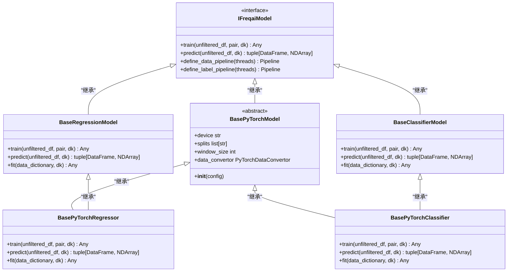
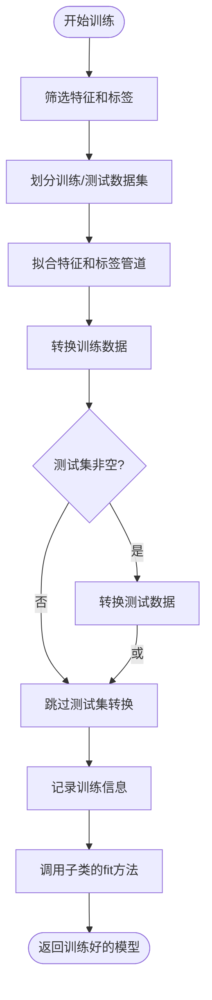
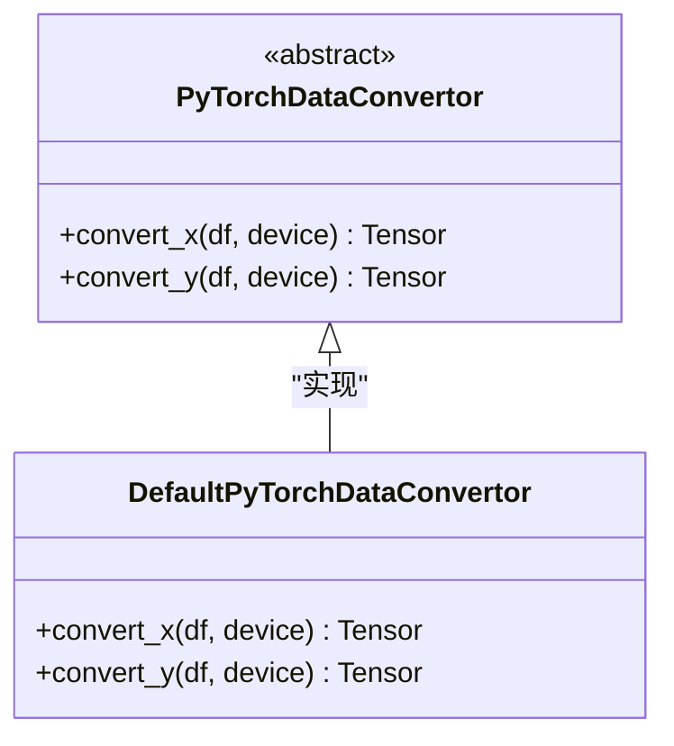

# 基础模型抽象类

<cite>
**本文档中引用的文件**   
- [BaseRegressionModel.py](file://freqtrade/freqai/base_models/BaseRegressionModel.py)
- [BaseClassifierModel.py](file://freqtrade/freqai/base_models/BaseClassifierModel.py)
- [BasePyTorchModel.py](file://freqtrade/freqai/base_models/BasePyTorchModel.py)
- [BasePyTorchRegressor.py](file://freqtrade/freqai/base_models/BasePyTorchRegressor.py)
- [BasePyTorchClassifier.py](file://freqtrade/freqai/base_models/BasePyTorchClassifier.py)
- [freqai_interface.py](file://freqtrade/freqai/freqai_interface.py)
- [data_kitchen.py](file://freqtrade/freqai/data_kitchen.py)
- [PyTorchDataConvertor.py](file://freqtrade/freqai/torch/PyTorchDataConvertor.py)
</cite>

## 目录
1. [引言](#引言)
2. [核心基类设计与继承体系](#核心基类设计与继承体系)
3. [统一模型接口定义](#统一模型接口定义)
4. [数据预处理与特征工程](#数据预处理与特征工程)
5. [训练流程标准化](#训练流程标准化)
6. [自定义模型扩展示例](#自定义模型扩展示例)
7. [深度学习模型通用支持机制](#深度学习模型通用支持机制)
8. [结论](#结论)

## 引言
FreqAI框架为量化交易中的机器学习模型提供了高度模块化和可扩展的架构。其核心设计围绕一组基础模型抽象类展开，这些类定义了回归、分类以及深度学习模型的统一接口和标准化行为。通过继承这些基类，用户可以轻松集成各种机器学习算法，同时确保与FreqAI核心功能（如数据预处理、特征工程、模型训练和预测）的无缝协作。本文档深入解析`BaseRegressionModel`、`BaseClassifierModel`和`BasePyTorchModel`这三个核心抽象类的设计原理、方法规范和继承关系，旨在为开发者提供构建自定义AI交易模型的全面指导。

## 核心基类设计与继承体系
FreqAI框架的模型抽象体系建立在清晰的继承层次之上，确保了代码的复用性和接口的一致性。

**图示来源**
- [BaseRegressionModel.py](file://freqtrade/freqai/base_models/BaseRegressionModel.py#L16-L130)
- [BaseClassifierModel.py](file://freqtrade/freqai/base_models/BaseClassifierModel.py#L16-L128)
- [BasePyTorchModel.py](file://freqtrade/freqai/base_models/BasePyTorchModel.py#L12-L38)
- [BasePyTorchRegressor.py](file://freqtrade/freqai/base_models/BasePyTorchRegressor.py#L15-L116)
- [BasePyTorchClassifier.py](file://freqtrade/freqai/base_models/BasePyTorchClassifier.py#L19-L213)

**本节来源**
- [BaseRegressionModel.py](file://freqtrade/freqai/base_models/BaseRegressionModel.py#L16-L130)
- [BaseClassifierModel.py](file://freqtrade/freqai/base_models/BaseClassifierModel.py#L16-L128)
- [BasePyTorchModel.py](file://freqtrade/freqai/base_models/BasePyTorchModel.py#L12-L38)

## 统一模型接口定义
所有FreqAI模型都必须实现一套统一的核心接口，该接口由`IFreqaiModel`接口定义，并在各个基类中被具体化。这一设计确保了无论底层算法如何，模型与FreqAI系统其他组件的交互方式都保持一致。

### 核心方法
- **`train`**: 这是模型训练的入口点。它接收未经筛选的完整数据框（`unfiltered_df`）、交易对（`pair`）和数据厨房（`dk`）对象。该方法负责执行完整的训练流程，包括数据筛选、特征工程、数据集划分和最终调用`fit`方法进行模型拟合。训练完成后，返回一个可用于推理的已训练模型。
- **`predict`**: 这是模型预测的入口点。它接收用于当前回测或实盘周期的完整数据框（`unfiltered_df`）和数据厨房（`dk`）对象。该方法负责筛选预测特征、应用特征管道进行转换，然后调用底层模型的`predict`方法生成预测结果。最终返回一个包含预测值的数据框和一个指示器数组（`do_predict`），用于标记因数据问题（如NaN值）而被排除的预测。
- **`fit`**: 这是一个抽象方法，必须由所有继承自`BaseRegressionModel`或`BaseClassifierModel`的子类实现。它接收一个包含训练和测试数据集的字典（`data_dictionary`）和数据厨房（`dk`）对象。此方法是用户定义具体模型训练逻辑的地方，例如初始化CatBoost或LightGBM模型并调用其`fit`方法。

## 数据预处理与特征工程
FreqAI框架通过`data_kitchen`对象和`define_data_pipeline`方法，为所有模型提供了标准化的数据预处理和特征工程流程。

### 特征管道（Feature Pipeline）
`define_data_pipeline`方法构建了一个由多个转换步骤组成的流水线（Pipeline），用于处理特征数据。该流水线的构建基于用户在配置文件中的设置，可以包含以下步骤：
- **方差阈值过滤** (`const`): 移除方差为零的常量特征。
- **最小-最大缩放** (`scaler`): 将所有特征缩放到(-1, 1)区间，以加速模型收敛。
- **主成分分析** (`pca`): 当配置启用时，用于降维和去除冗余信息。
- **SVM异常值剔除** (`svm`): 使用支持向量机识别并移除训练数据中的异常值。
- **不相似性指数** (`di`): 计算每个数据点的不相似性指数，用于评估模型预测的不确定性。
- **DBSCAN异常值剔除** (`dbscan`): 使用密度聚类算法识别并移除异常值。
- **噪声注入** (`noise`): 为特征数据添加高斯噪声，以增强模型的鲁棒性。

### 标签管道（Label Pipeline）
`define_label_pipeline`方法构建了一个用于处理标签数据的流水线。目前，它主要包含一个最小-最大缩放器，用于将回归任务的标签值也缩放到(-1, 1)区间，以匹配特征的尺度。

**本节来源**
- [BaseRegressionModel.py](file://freqtrade/freqai/base_models/BaseRegressionModel.py#L40-L60)
- [BaseClassifierModel.py](file://freqtrade/freqai/base_models/BaseClassifierModel.py#L40-L50)
- [freqai_interface.py](file://freqtrade/freqai/freqai_interface.py#L340-L395)

## 训练流程标准化
`train`方法在`BaseRegressionModel`和`BaseClassifierModel`中实现了高度标准化的训练流程，确保了不同模型之间行为的一致性。

**图示来源**
- [BaseRegressionModel.py](file://freqtrade/freqai/base_models/BaseRegressionModel.py#L25-L115)
- [BaseClassifierModel.py](file://freqtrade/freqai/base_models/BaseClassifierModel.py#L25-L115)

**本节来源**
- [BaseRegressionModel.py](file://freqtrade/freqai/base_models/BaseRegressionModel.py#L25-L130)
- [BaseClassifierModel.py](file://freqtrade/freqai/base_models/BaseClassifierModel.py#L25-L128)

## 自定义模型扩展示例
用户可以通过继承`BaseRegressionModel`或`BaseClassifierModel`来创建自定义模型。以下是一个典型的扩展流程：

1.  **创建子类**: 创建一个新类，继承自`BaseRegressionModel`或`BaseClassifierModel`。
2.  **实现`fit`方法**: 在`fit`方法中，根据`data_dictionary`中的数据，初始化具体的机器学习模型（如`CatBoostRegressor`），并调用其`fit`方法进行训练。
3.  **返回模型**: 将训练好的模型实例返回。

例如，`CatboostRegressor`类的`fit`方法会创建一个`CatBoostRegressor`实例，使用训练特征和标签进行拟合，并返回该实例。这种设计模式使得用户可以专注于模型的具体实现，而无需关心数据加载、预处理和管道管理等通用逻辑。

**本节来源**
- [BaseRegressionModel.py](file://freqtrade/freqai/base_models/BaseRegressionModel.py#L16-L130)
- [prediction_models/CatboostRegressor.py](file://freqtrade/freqai/prediction_models/CatboostRegressor.py#L13-L59)

## 深度学习模型通用支持机制
`BasePyTorchModel`为基于PyTorch的深度学习模型提供了专门的支持，解决了深度学习特有的挑战。

### 设备管理与模型状态
- **设备管理**: `__init__`方法会自动检测可用的硬件加速器（CUDA GPU、Apple MPS或CPU），并将`self.device`属性设置为相应的字符串（如`"cuda"`或`"cpu"`）。这确保了模型和数据可以在正确的设备上进行计算。
- **模型类型标识**: 通过设置`self.dd.model_type = "pytorch"`，系统能够识别模型类型，并使用正确的序列化格式（`.zip`）进行保存和加载。

### 数据转换器（Data Convertor）
`BasePyTorchModel`引入了一个关键的抽象——`data_convertor`属性。这是一个必须由子类实现的抽象属性，其类型为`PyTorchDataConvertor`。这个设计模式将Pandas DataFrame到PyTorch Tensor的转换逻辑从模型基类中解耦出来。

**图示来源**
- [PyTorchDataConvertor.py](file://freqtrade/freqai/torch/PyTorchDataConvertor.py#L10-L57)
- [BasePyTorchModel.py](file://freqtrade/freqai/base_models/BasePyTorchModel.py#L12-L38)

**本节来源**
- [BasePyTorchModel.py](file://freqtrade/freqai/base_models/BasePyTorchModel.py#L12-L38)
- [PyTorchDataConvertor.py](file://freqtrade/freqai/torch/PyTorchDataConvertor.py#L10-L57)

### 梯度计算与训练
在`BasePyTorchRegressor`和`BasePyTorchClassifier`的`train`方法中，用户实现的`fit`方法通常会使用`PyTorchModelTrainer`等工具来管理训练循环。这包括前向传播、损失计算、反向传播（梯度计算）和优化器更新等步骤。`BasePyTorchModel`通过提供设备管理和数据转换的基础设施，简化了这些复杂操作的实现。

## 结论
FreqAI框架通过精心设计的`BaseRegressionModel`、`BaseClassifierModel`和`BasePyTorchModel`抽象类，成功地为机器学习模型的集成建立了一个强大而灵活的架构。这些基类不仅定义了统一的`train`、`predict`和`fit`接口，还通过`data_kitchen`和`define_data_pipeline`等机制，实现了数据预处理和特征工程的标准化。对于深度学习模型，`BasePyTorchModel`通过设备管理和`data_convertor`抽象，提供了对PyTorch生态系统的无缝支持。这种分层和模块化的设计，极大地降低了用户开发和集成自定义AI交易模型的门槛，同时保证了整个系统行为的一致性和可维护性。