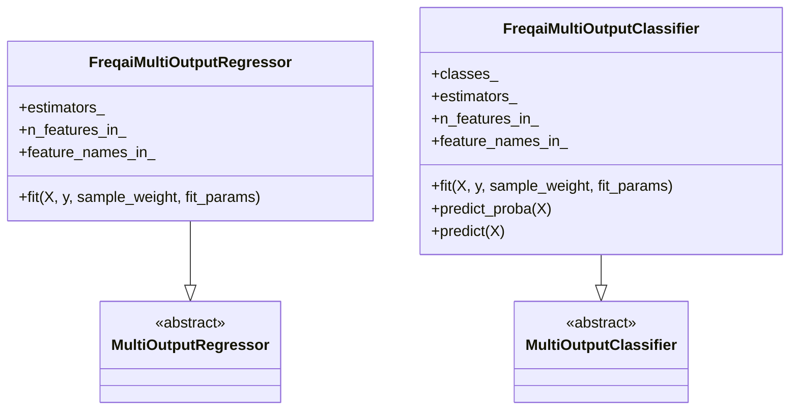
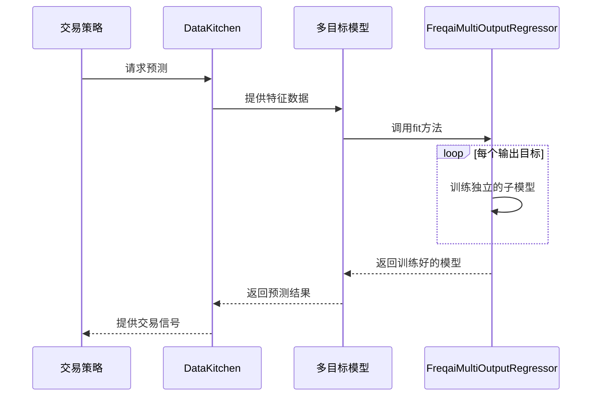

# 多目标与复合模型

<cite>
**本文档中引用的文件**
- [FreqaiMultiOutputRegressor.py](file://freqtrade/freqai/base_models/FreqaiMultiOutputRegressor.py)
- [FreqaiMultiOutputClassifier.py](file://freqtrade/freqai/base_models/FreqaiMultiOutputClassifier.py)
- [LightGBMRegressorMultiTarget.py](file://freqtrade/freqai/prediction_models/LightGBMRegressorMultiTarget.py)
- [CatboostRegressorMultiTarget.py](file://freqtrade/freqai/prediction_models/CatboostRegressorMultiTarget.py)
- [XGBoostRegressorMultiTarget.py](file://freqtrade/freqai/prediction_models/XGBoostRegressorMultiTarget.py)
- [BaseRegressionModel.py](file://freqtrade/freqai/base_models/BaseRegressionModel.py)
</cite>

## 目录
1. [引言](#引言)
2. [核心基类设计](#核心基类设计)
3. [多目标模型实现机制](#多目标模型实现机制)
4. [算法适配策略](#算法适配策略)
5. [应用案例与优势分析](#应用案例与优势分析)
6. [结论](#结论)

## 引言
FreqAI框架中的多目标模型（MultiTarget）旨在解决金融时间序列预测中的复杂性问题，通过同时预测多个相关输出变量来构建更全面的市场认知。与传统的单目标预测不同，多目标模型能够捕捉价格变化、波动率、趋势强度等多个维度的市场状态，为交易决策提供更丰富的信息支持。本文档将深入探讨FreqAI中`FreqaiMultiOutputRegressor`和`FreqaiMultiOutputClassifier`基类的设计原理与技术实现，分析其在XGBoost、LightGBM等算法上的适配策略，并通过实际案例展示其在复合交易信号与风险评估系统中的应用价值。

## 核心基类设计

FreqAI框架通过`FreqaiMultiOutputRegressor`和`FreqaiMultiOutputClassifier`两个核心基类实现了多目标预测功能。这两个类分别继承自scikit-learn的`MultiOutputRegressor`和`MultiOutputClassifier`，并在其基础上进行了关键的扩展和优化，以适应金融AI的特定需求。

**Diagram sources**
- [FreqaiMultiOutputRegressor.py](file://freqtrade/freqai/base_models/FreqaiMultiOutputRegressor.py#L5-L51)
- [FreqaiMultiOutputClassifier.py](file://freqtrade/freqai/base_models/FreqaiMultiOutputClassifier.py#L10-L86)

**Section sources**
- [FreqaiMultiOutputRegressor.py](file://freqtrade/freqai/base_models/FreqaiMultiOutputRegressor.py#L5-L51)
- [FreqaiMultiOutputClassifier.py](file://freqtrade/freqai/base_models/FreqaiMultiOutputClassifier.py#L10-L86)

### FreqaiMultiOutputRegressor工作机制
该类的核心是`fit`方法，它实现了对多维输出变量的并行训练。当输入的标签数据`y`具有多个维度时（形状为`(n_samples, n_outputs)`），该方法会为每个输出变量独立训练一个回归模型。这种"问题转换"（problem transformation）策略将一个复杂的多目标问题分解为多个简单的单目标子问题，从而可以利用现有的单目标学习算法。

关键特性包括：
- **输入验证**：通过`validate_data`函数确保输入数据的正确性，并强制要求`y`至少有两个维度。
- **样本权重支持**：检查底层估计器是否支持`sample_weight`参数，以实现对不同样本重要性的加权。
- **并行训练**：利用`sklearn.utils.parallel.Parallel`实现多模型的并行训练，显著提升训练效率。
- **特征信息继承**：在训练完成后，将第一个子模型的`n_features_in_`和`feature_names_in_`属性复制到主模型，以保持API一致性。

### FreqaiMultiOutputClassifier工作机制
该类在`FreqaiMultiOutputRegressor`的基础上增加了分类任务特有的功能。除了并行训练多个分类器外，它还实现了`predict_proba`和`predict`方法的重写。

`predict_proba`方法通过`np.hstack(super().predict_proba(X))`将各个分类器的预测概率矩阵水平堆叠，然后使用`np.squeeze`压缩维度，确保输出格式的统一。`predict`方法同样进行了维度压缩处理。此外，该类还维护了一个`classes_`列表，用于存储所有子模型的类别标签，并通过`OperationalException`确保所有类标签在整个多目标系统中是唯一的，防止出现类别冲突。

## 多目标模型实现机制

FreqAI的多目标模型通过`prediction_models`目录下的具体实现类（如`LightGBMRegressorMultiTarget`）与`base_models`中的基类协同工作，形成了一套完整的多目标预测解决方案。

**Diagram sources**
- [LightGBMRegressorMultiTarget.py](file://freqtrade/freqai/prediction_models/LightGBMRegressorMultiTarget.py#L23-L73)
- [FreqaiMultiOutputRegressor.py](file://freqtrade/freqai/base_models/FreqaiMultiOutputRegressor.py#L5-L51)

**Section sources**
- [LightGBMRegressorMultiTarget.py](file://freqtrade/freqai/prediction_models/LightGBMRegressorMultiTarget.py#L23-L73)
- [CatboostRegressorMultiTarget.py](file://freqtrade/freqai/prediction_models/CatboostRegressorMultiTarget.py#L24-L77)
- [XGBoostRegressorMultiTarget.py](file://freqtrade/freqai/prediction_models/XGBoostRegressorMultiTarget.py#L24-L60)

### 协方差结构的处理
尽管FreqAI的多目标模型采用独立训练每个子模型的策略，这在理论上会忽略输出变量间的协方差结构，但框架通过其他机制间接地保留了这种关系。首先，所有子模型共享相同的输入特征集，这意味着它们都从相同的市场信息中学习。其次，特征工程过程（由`DataKitchen`管理）会创建包含市场整体状态的特征，这些特征会同时影响所有子模型的预测。最后，交易策略层可以对多个预测结果进行后处理，例如通过加权平均或逻辑规则来融合不同目标的预测，从而显式地建模它们之间的关系。

### 训练流程详解
以`LightGBMRegressorMultiTarget`为例，其`fit`方法首先创建一个`LGBMRegressor`实例作为基础估计器。然后，它为每个输出目标准备独立的验证集（`eval_sets`）和初始模型（`init_models`）。这些参数被组织成一个`fit_params`列表，其中每个元素对应一个子模型的训练参数。最后，创建一个`FreqaiMultiOutputRegressor`实例，并将`LGBMRegressor`作为其估计器，调用`fit`方法开始训练。如果配置了`multitarget_parallel_training`，则会设置`n_jobs`参数以启用多线程并行训练。

## 算法适配策略

FreqAI框架对XGBoost、LightGBM和CatBoost等主流机器学习算法进行了专门的多目标适配，每种算法的实现策略略有不同。

### XGBoost适配
`XGBoostRegressorMultiTarget`的实现相对简单，它直接使用XGBoost原生的多输出支持。XGBoost内部能够处理多维标签，并在训练过程中同时优化所有目标。这种方法的优点是能够更好地捕捉输出间的协方差，但缺点是无法为每个目标提供独立的验证集或初始模型。因此，FreqAI的这个实现更像是一个单目标模型的直接应用，而非真正的多目标架构。

### LightGBM与CatBoost适配
`LightGBMRegressorMultiTarget`和`CatboostRegressorMultiTarget`则采用了更典型的多目标策略。它们利用`FreqaiMultiOutputRegressor`基类，为每个输出目标创建一个独立的LightGBM或CatBoost模型。这种方法的优势在于灵活性高，可以为每个子模型设置不同的超参数、验证集和初始模型，非常适合需要精细调优的场景。同时，通过并行训练，可以有效利用计算资源，缩短整体训练时间。

## 应用案例与优势分析

### 复合交易信号构建
多目标模型可以同时预测未来多个时间点的价格变化（例如，未来1小时、2小时、4小时的涨跌幅）。交易策略可以利用这些预测构建复合信号：只有当短期和中期预测方向一致时才发出交易信号，从而过滤掉噪音，提高信号的可靠性。例如，一个做多信号可能要求1小时和2小时的预测均为正，而4小时的预测为负时则发出平仓信号。

### 风险评估系统
模型可以同时预测价格趋势和波动率。价格趋势预测用于判断方向，而波动率预测用于评估风险。当模型预测到高波动率时，即使方向预测置信度高，交易系统也可以自动降低仓位或设置更宽的止损，实现动态风险管理。

### 优势与局限性
**优势**：
- **信息丰富性**：提供比单目标模型更全面的市场视图。
- **灵活性**：可以轻松扩展以预测任意数量的相关变量。
- **并行化**：独立训练的子模型易于并行化，提高训练效率。

**局限性**：
- **协方差忽略**：独立训练的策略可能无法充分捕捉输出变量间的复杂依赖关系。
- **模型复杂度**：需要维护和管理多个子模型，增加了系统复杂性。
- **过拟合风险**：每个子模型都有过拟合的风险，需要更严格的验证。

## 结论
FreqAI的多目标模型通过精心设计的基类和灵活的实现策略，为复杂的金融预测任务提供了强大的工具。`FreqaiMultiOutputRegressor`和`FreqaiMultiOutputClassifier`基类提供了稳健的多目标训练框架，而具体的算法实现则根据各自的特点进行了优化。尽管在处理输出间协方差方面存在理论上的局限性，但通过特征工程和策略层的后处理，仍然可以构建出高性能的交易系统。未来的发展方向可以包括引入能够显式建模输出协方差的多任务学习算法，进一步提升模型的预测能力。