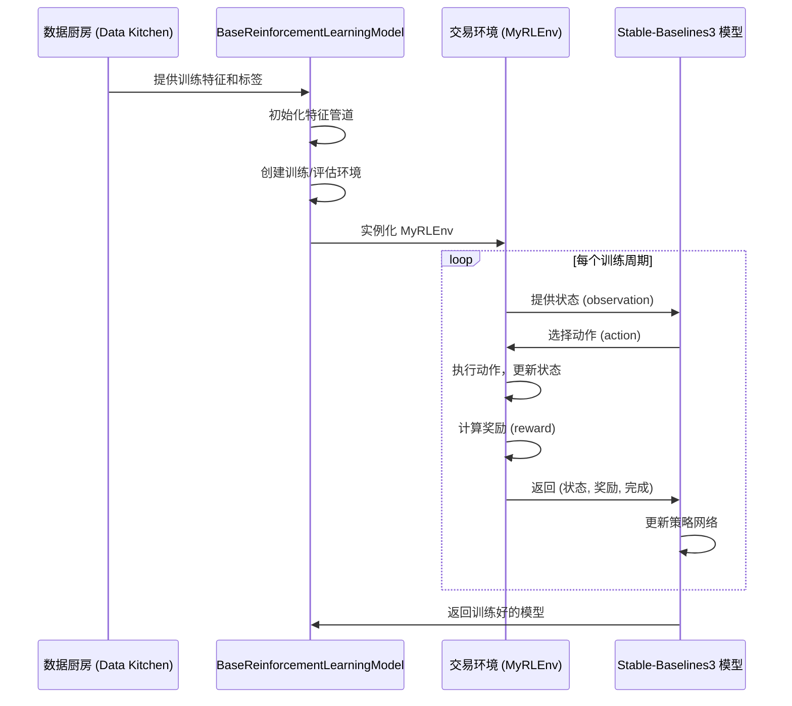
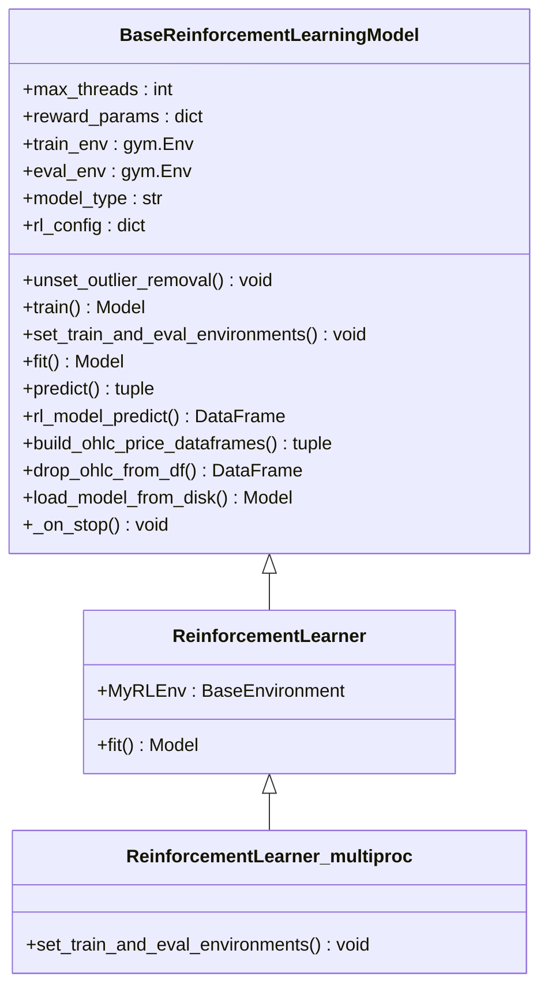
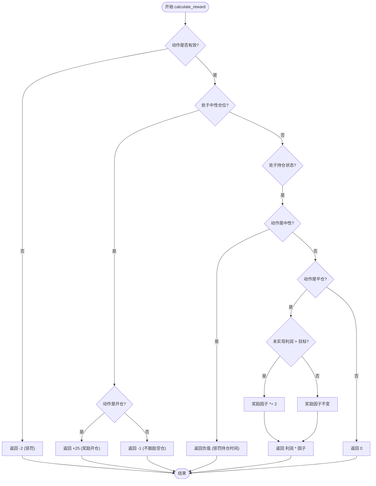
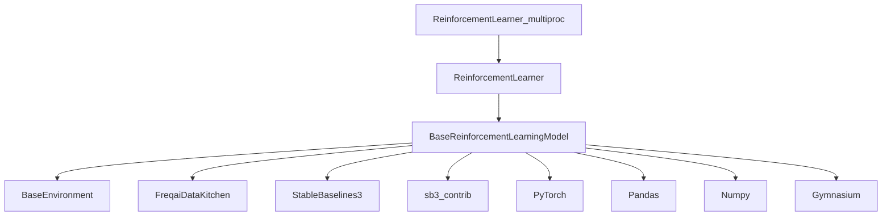

# 强化学习模型

<cite>
**本文档中引用的文件**  
- [BaseReinforcementLearningModel.py](file://freqtrade/freqai/RL/BaseReinforcementLearningModel.py)
- [Base3ActionRLEnv.py](file://freqtrade/freqai/RL/Base3ActionRLEnv.py)
- [Base4ActionRLEnv.py](file://freqtrade/freqai/RL/Base4ActionRLEnv.py)
- [Base5ActionRLEnv.py](file://freqtrade/freqai/RL/Base5ActionRLEnv.py)
- [BaseEnvironment.py](file://freqtrade/freqai/RL/BaseEnvironment.py)
- [ReinforcementLearner.py](file://freqtrade/freqai/prediction_models/ReinforcementLearner.py)
- [ReinforcementLearner_multiproc.py](file://freqtrade/freqai/prediction_models/ReinforcementLearner_multiproc.py)
- [ReinforcementLearner_test_3ac.py](file://tests/freqai/test_models/ReinforcementLearner_test_3ac.py)
- [ReinforcementLearner_test_4ac.py](file://tests/freqai/test_models/ReinforcementLearner_test_4ac.py)
</cite>

## 目录
1. [引言](#引言)
2. [项目结构](#项目结构)
3. [核心组件](#核心组件)
4. [架构概述](#架构概述)
5. [详细组件分析](#详细组件分析)
6. [依赖分析](#依赖分析)
7. [性能考虑](#性能考虑)
8. [故障排除指南](#故障排除指南)
9. [结论](#结论)

## 引言
本文档深入剖析FreqAI中强化学习（Reinforcement Learning, RL）模型的架构设计与训练流程，重点分析`ReinforcementLearner`及其多进程变体`ReinforcementLearner_multiproc`的实现细节。文档详细说明了基于`BaseReinforcementLearningModel`基类的RL框架如何与交易环境（如`Base3ActionRLEnv`）交互，定义状态空间、动作空间和奖励函数。通过试错学习机制，模型旨在优化长期回报并学习最优交易策略。同时，文档探讨了探索-利用权衡、信用分配等核心问题，并提供配置示例、训练监控方法及性能评估指标，指出其在动态仓位管理和风险控制中的潜在应用。

## 项目结构
FreqAI的强化学习模块位于`freqtrade/freqai/`目录下，其结构清晰地分离了基础模型、环境定义和具体预测模型。`RL`子目录包含了所有与强化学习相关的环境和基类，而`prediction_models`目录则存放了具体的模型实现，如`ReinforcementLearner`。`base_models`提供了更通用的模型接口。测试文件位于`tests/freqai/test_models/`，用于验证不同环境下的模型行为。

```mermaid
graph TD
subgraph "freqtrade/freqai"
RL[RL]
base_models[base_models]
prediction_models[prediction_models]
end
subgraph "RL"
BaseReinforcementLearningModel[BaseReinforcementLearningModel.py]
BaseEnvironment[BaseEnvironment.py]
Base3ActionRLEnv[Base3ActionRLEnv.py]
Base4ActionRLEnv[Base4ActionRLEnv.py]
Base5ActionRLEnv[Base5ActionRLEnv.py]
end
subgraph "prediction_models"
ReinforcementLearner[ReinforcementLearner.py]
ReinforcementLearner_multiproc[ReinforcementLearner_multiproc.py]
end
subgraph "测试"
test_3ac[ReinforcementLearner_test_3ac.py]
test_4ac[ReinforcementLearner_test_4ac.py]
end
BaseReinforcementLearningModel --> ReinforcementLearner : "继承"
BaseEnvironment --> Base3ActionRLEnv : "继承"
BaseEnvironment --> Base4ActionRLEnv : "继承"
BaseEnvironment --> Base5ActionRLEnv : "继承"
ReinforcementLearner --> ReinforcementLearner_multiproc : "继承"
ReinforcementLearner --> test_3ac : "测试"
ReinforcementLearner --> test_4ac : "测试"
```

**图示来源**
- [BaseReinforcementLearningModel.py](file://freqtrade/freqai/RL/BaseReinforcementLearningModel.py)
- [Base3ActionRLEnv.py](file://freqtrade/freqai/RL/Base3ActionRLEnv.py)
- [Base4ActionRLEnv.py](file://freqtrade/freqai/RL/Base4ActionRLEnv.py)
- [Base5ActionRLEnv.py](file://freqtrade/freqai/RL/Base5ActionRLEnv.py)
- [ReinforcementLearner.py](file://freqtrade/freqai/prediction_models/ReinforcementLearner.py)
- [ReinforcementLearner_multiproc.py](file://freqtrade/freqai/prediction_models/ReinforcementLearner_multiproc.py)
- [ReinforcementLearner_test_3ac.py](file://tests/freqai/test_models/ReinforcementLearner_test_3ac.py)
- [ReinforcementLearner_test_4ac.py](file://tests/freqai/test_models/ReinforcementLearner_test_4ac.py)

**本节来源**
- [BaseReinforcementLearningModel.py](file://freqtrade/freqai/RL/BaseReinforcementLearningModel.py)
- [Base3ActionRLEnv.py](file://freqtrade/freqai/RL/Base3ActionRLEnv.py)
- [Base4ActionRLEnv.py](file://freqtrade/freqai/RL/Base4ActionRLEnv.py)
- [Base5ActionRLEnv.py](file://freqtrade/freqai/RL/Base5ActionRLEnv.py)
- [ReinforcementLearner.py](file://freqtrade/freqai/prediction_models/ReinforcementLearner.py)
- [ReinforcementLearner_multiproc.py](file://freqtrade/freqai/prediction_models/ReinforcementLearner_multiproc.py)

## 核心组件
核心组件包括`BaseReinforcementLearningModel`，它是所有RL模型的基类，负责处理数据管道、环境设置和模型训练的通用逻辑。`ReinforcementLearner`是其具体实现，定义了训练循环和默认的奖励函数。`ReinforcementLearner_multiproc`通过多进程环境实现了并行训练以提升效率。交易环境如`Base3ActionRLEnv`和`Base5ActionRLEnv`定义了具体的动作空间（如买入、卖出、持有）和状态转换逻辑。

**本节来源**
- [BaseReinforcementLearningModel.py](file://freqtrade/freqai/RL/BaseReinforcementLearningModel.py#L1-L510)
- [ReinforcementLearner.py](file://freqtrade/freqai/prediction_models/ReinforcementLearner.py#L1-L171)
- [ReinforcementLearner_multiproc.py](file://freqtrade/freqai/prediction_models/ReinforcementLearner_multiproc.py#L1-L85)

## 架构概述
FreqAI的RL架构遵循一个清晰的流程：首先，`BaseReinforcementLearningModel`从数据厨房（Data Kitchen）获取特征和标签数据。接着，它通过`set_train_and_eval_environments`方法创建训练和评估环境。`ReinforcementLearner`的`fit`方法使用Stable-Baselines3库中的算法（如PPO）来训练模型。模型在由`BaseEnvironment`派生的自定义环境中进行训练，该环境模拟了交易过程，代理（Agent）根据当前状态（市场数据）选择动作（交易决策），并根据`calculate_reward`函数获得奖励。



**图示来源**
- [BaseReinforcementLearningModel.py](file://freqtrade/freqai/RL/BaseReinforcementLearningModel.py#L1-L510)
- [ReinforcementLearner.py](file://freqtrade/freqai/prediction_models/ReinforcementLearner.py#L1-L171)
- [Base5ActionRLEnv.py](file://freqtrade/freqai/RL/Base5ActionRLEnv.py#L1-L153)

## 详细组件分析
### ReinforcementLearner 分析
`ReinforcementLearner`类继承自`BaseReinforcementLearningModel`，其核心是`fit`方法。该方法配置了神经网络策略（如MLP）的架构，并利用`VecMonitor`包装的环境进行训练。它支持TensorBoard回调以监控训练过程，并实现了基于验证集性能的模型检查点保存。

#### 类图


**图示来源**
- [BaseReinforcementLearningModel.py](file://freqtrade/freqai/RL/BaseReinforcementLearningModel.py#L1-L510)
- [ReinforcementLearner.py](file://freqtrade/freqai/prediction_models/ReinforcementLearner.py#L1-L171)
- [ReinforcementLearner_multiproc.py](file://freqtrade/freqai/prediction_models/ReinforcementLearner_multiproc.py#L1-L85)

#### 交易环境分析
交易环境（如`Base5ActionRLEnv`）定义了代理可以执行的五个动作：`Neutral`（中性）、`Long_enter`（开多）、`Long_exit`（平多）、`Short_enter`（开空）、`Short_exit`（平空）。`step`方法是环境的核心，它根据代理的动作更新仓位、计算未实现利润，并调用`calculate_reward`来确定奖励。

##### 奖励函数流程图


**图示来源**
- [Base5ActionRLEnv.py](file://freqtrade/freqai/RL/Base5ActionRLEnv.py#L1-L153)
- [ReinforcementLearner.py](file://freqtrade/freqai/prediction_models/ReinforcementLearner.py#L1-L171)

**本节来源**
- [ReinforcementLearner.py](file://freqtrade/freqai/prediction_models/ReinforcementLearner.py#L1-L171)
- [Base5ActionRLEnv.py](file://freqtrade/freqai/RL/Base5ActionRLEnv.py#L1-L153)
- [Base3ActionRLEnv.py](file://freqtrade/freqai/RL/Base3ActionRLEnv.py#L1-L140)

## 依赖分析
`ReinforcementLearner`高度依赖于Stable-Baselines3（SB3）和`sb3_contrib`库来提供强化学习算法（如PPO、MaskablePPO）。它通过`gymnasium`库定义的环境接口与`BaseEnvironment`及其子类进行交互。数据处理依赖于`pandas`和`numpy`，而模型训练则使用`PyTorch`。`FreqaiDataKitchen`是连接策略和模型的关键组件，负责特征工程和数据管理。



**图示来源**
- [BaseReinforcementLearningModel.py](file://freqtrade/freqai/RL/BaseReinforcementLearningModel.py#L1-L510)
- [ReinforcementLearner.py](file://freqtrade/freqai/prediction_models/ReinforcementLearner.py#L1-L171)
- [ReinforcementLearner_multiproc.py](file://freqtrade/freqai/prediction_models/ReinforcementLearner_multiproc.py#L1-L85)

**本节来源**
- [BaseReinforcementLearningModel.py](file://freqtrade/freqai/RL/BaseReinforcementLearningModel.py#L1-L510)
- [requirements-freqai-rl.txt](file://requirements-freqai-rl.txt)

## 性能考虑
`ReinforcementLearner_multiproc`通过`SubprocVecEnv`实现了多进程并行训练，可以显著缩短训练时间，尤其是在拥有多个CPU核心的机器上。然而，多进程环境会增加内存开销。`BaseReinforcementLearningModel`在初始化时会限制PyTorch使用的线程数，以避免与主程序竞争资源。使用`VecMonitor`可以有效地监控向量化环境的性能。对于生产环境，应仔细调整`train_cycles`和`max_trade_duration_candles`等参数以平衡训练时间和模型性能。

## 故障排除指南
常见问题包括模型训练不收敛、奖励函数设计不合理导致代理行为异常（如频繁开平仓或永不交易）。应检查日志中是否有“User tried to use SVM with RL”等警告，这些功能在RL模式下被禁用。确保在`feature_engineering_standard`中正确设置了原始价格列（`%-raw_open`, `%-raw_close`等），否则环境将无法构建价格数据。如果使用`MaskablePPO`，请确保环境支持动作掩码。训练过程中，可通过TensorBoard监控奖励、利润和仓位变化。

**本节来源**
- [BaseReinforcementLearningModel.py](file://freqtrade/freqai/RL/BaseReinforcementLearningModel.py#L1-L510)
- [ReinforcementLearner.py](file://freqtrade/freqai/prediction_models/ReinforcementLearner.py#L1-L171)
- [Base5ActionRLEnv.py](file://freqtrade/freqai/RL/Base5ActionRLEnv.py#L1-L153)

## 结论
FreqAI的强化学习框架提供了一个强大且灵活的平台，用于开发基于试错学习的交易策略。通过继承`ReinforcementLearner`并重写`MyRLEnv`中的`calculate_reward`方法，用户可以定制复杂的奖励逻辑，以适应不同的交易目标和风险偏好。多进程支持使得在大规模数据集上训练模型成为可能。尽管配置和调优可能具有挑战性，但该框架为实现动态仓位管理和高级风险控制策略提供了坚实的基础。未来的工作可以集中在设计更精细的奖励函数和探索更先进的RL算法上。