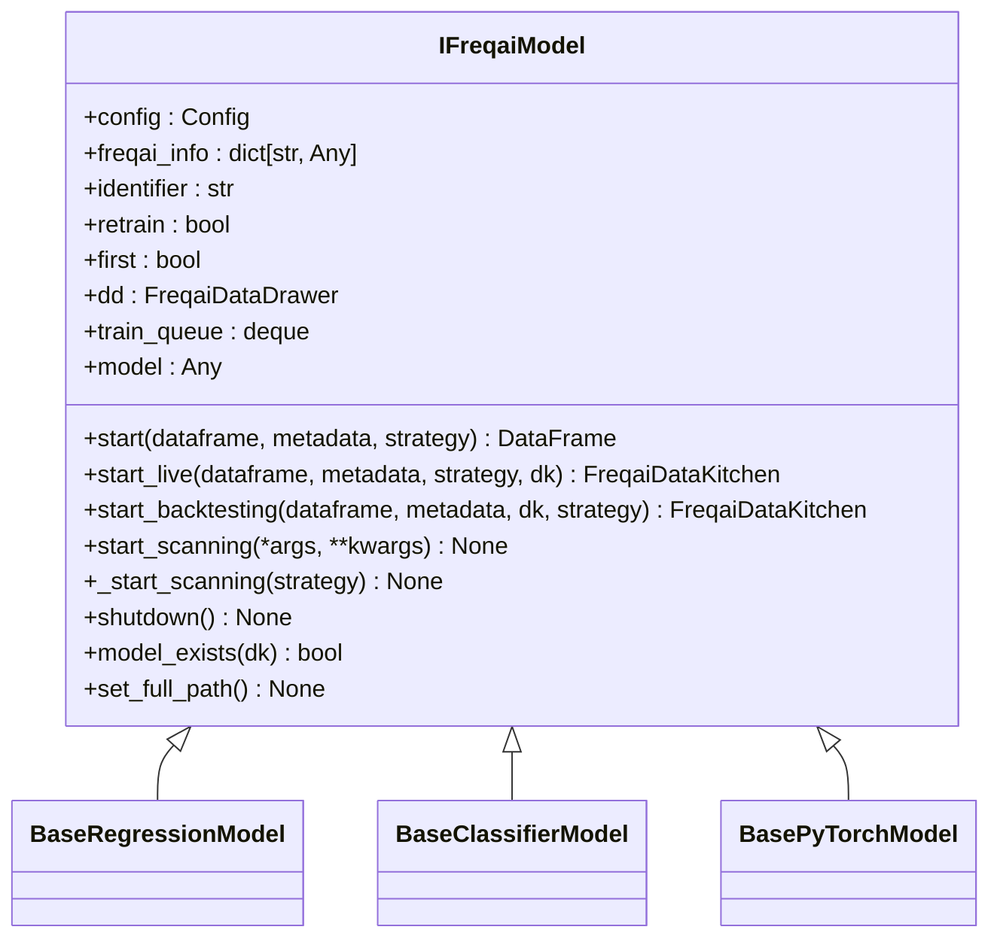
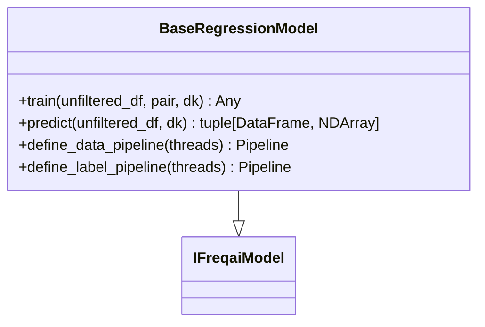
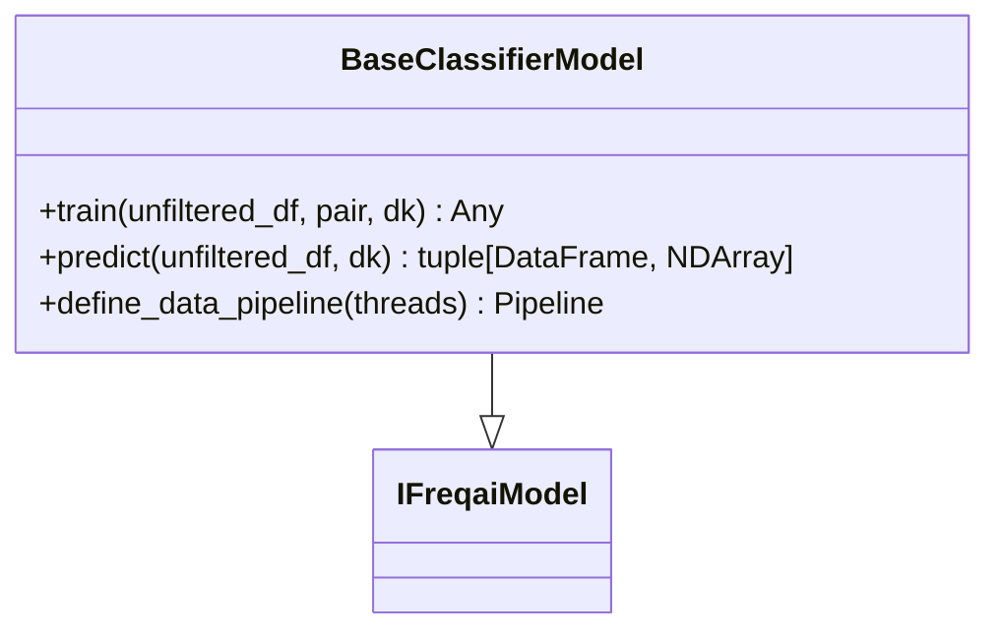
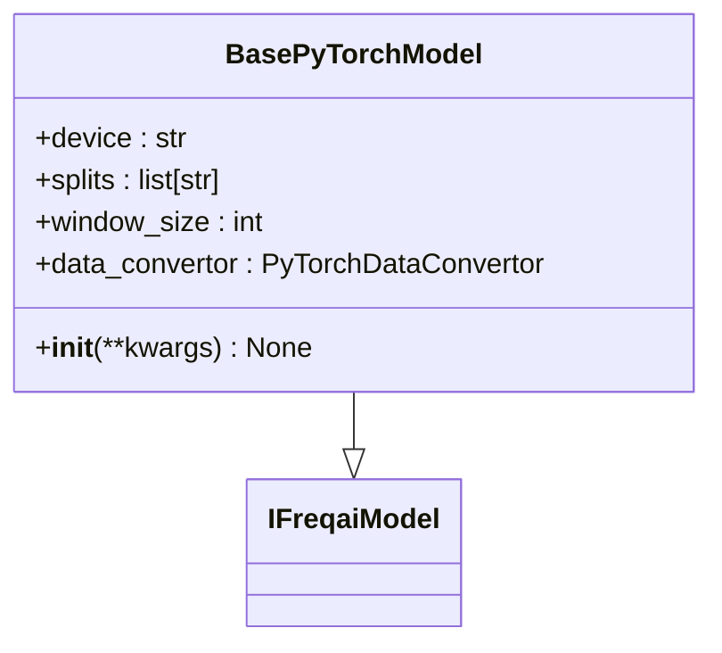
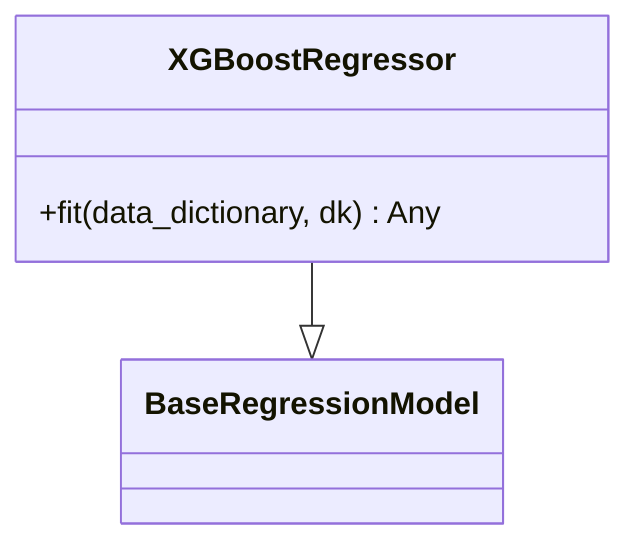
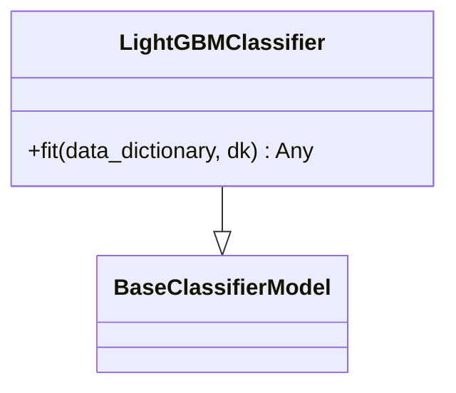
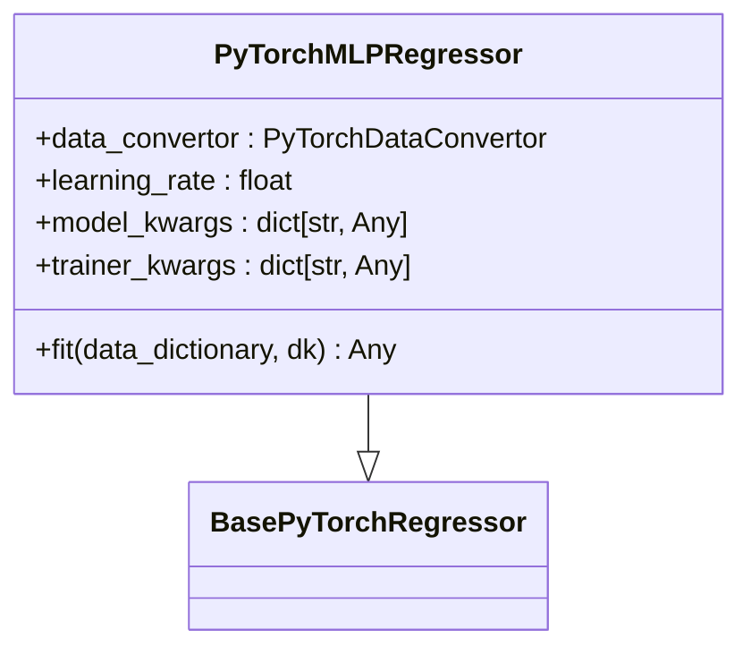
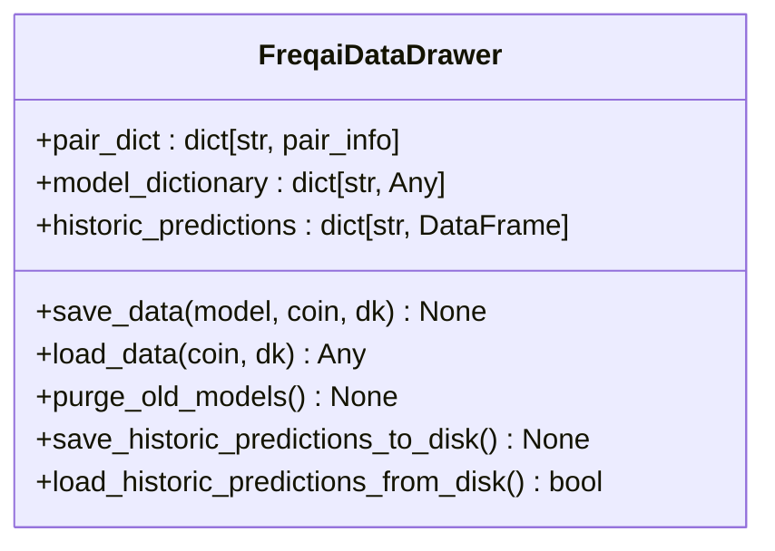
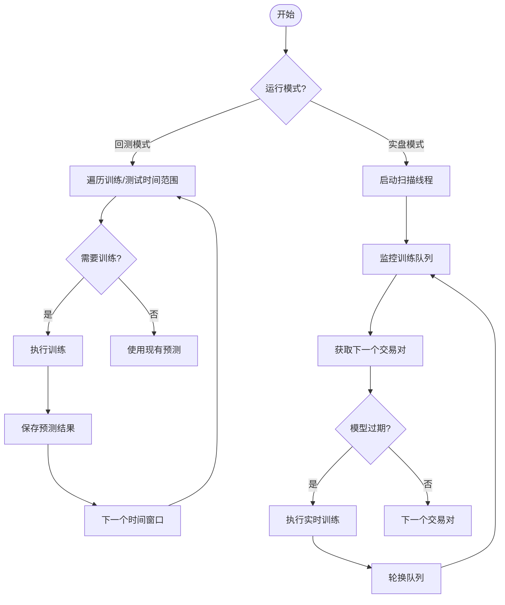
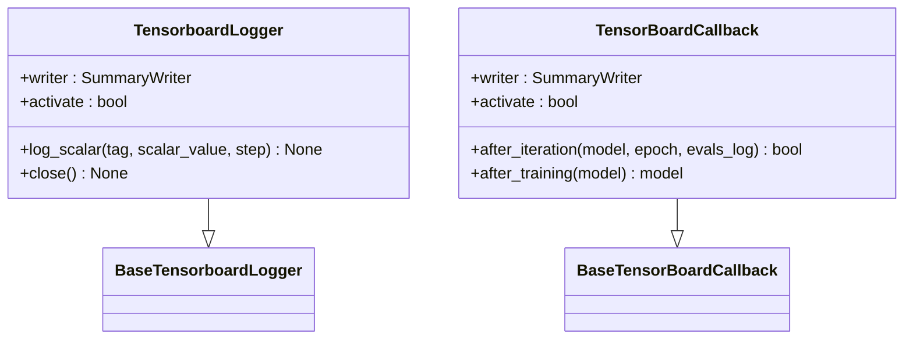

# 模型训练与生命周期管理

<cite>
**本文档中引用的文件**  
- [freqai_interface.py](file://freqtrade/freqai/freqai_interface.py)
- [BaseRegressionModel.py](file://freqtrade/freqai/base_models/BaseRegressionModel.py)
- [BaseClassifierModel.py](file://freqtrade/freqai/base_models/BaseClassifierModel.py)
- [BasePyTorchModel.py](file://freqtrade/freqai/base_models/BasePyTorchModel.py)
- [XGBoostRegressor.py](file://freqtrade/freqai/prediction_models/XGBoostRegressor.py)
- [LightGBMClassifier.py](file://freqtrade/freqai/prediction_models/LightGBMClassifier.py)
- [PyTorchMLPRegressor.py](file://freqtrade/freqai/prediction_models/PyTorchMLPRegressor.py)
- [tensorboard.py](file://freqtrade/freqai/tensorboard/tensorboard.py)
- [data_drawer.py](file://freqtrade/freqai/data_drawer.py)
</cite>

## 目录
1. [模型训练机制概述](#模型训练机制概述)
2. [IFreqaiModel 核心接口分析](#ifreqaimodel-核心接口分析)
3. [基础模型抽象类设计](#基础模型抽象类设计)
4. [具体预测模型实现](#具体预测模型实现)
5. [模型生命周期管理](#模型生命周期管理)
6. [训练流程差异分析](#训练流程差异分析)
7. [TensorBoard监控集成](#tensorboard监控集成)

## 模型训练机制概述

FreqAI的模型训练机制基于滑动窗口策略，通过`IFreqaiModel`接口统一管理模型的训练、预测和生命周期。系统根据配置的`train_period_days`（训练周期）和`live_retrain_hours`（实时重训练周期）参数，动态决定是否需要重新训练模型。在回测模式下，系统会沿着时间轴滑动训练窗口和测试窗口，逐段训练并生成预测结果；在实盘模式下，系统通过独立线程持续扫描交易对，根据模型过期时间自动触发重训练。

模型训练的核心流程包括：数据预处理、特征工程、模型训练、预测生成和结果存储。系统通过`FreqaiDataKitchen`进行数据管理，利用`Datasieve`库构建数据处理管道，实现特征标准化、异常值过滤和主成分分析等功能。训练过程中，系统会自动处理NaN值，并根据配置的测试集比例划分训练集和测试集。

**Section sources**
- [freqai_interface.py](file://freqtrade/freqai/freqai_interface.py#L35-L1039)

## IFreqaiModel 核心接口分析

`IFreqaiModel`是FreqAI系统的核心抽象基类，定义了所有预测模型必须实现的接口和通用功能。该类通过继承`ABC`（抽象基类）确保子类必须实现关键方法。其主要职责包括：

- **模型生命周期管理**：通过`start()`方法作为入口点，统一处理训练和预测逻辑
- **训练条件判断**：在`start_live()`和`start_backtesting()`方法中判断是否需要重新训练
- **资源管理**：通过`shutdown()`方法清理线程和内存资源
- **配置验证**：通过`assert_config()`确保配置文件包含必要的FreqAI参数

核心方法`start()`根据运行模式（回测或实盘）调用不同的执行路径。在实盘模式下，系统启动独立扫描线程（`_start_scanning`），持续监控模型状态并触发重训练；在回测模式下，系统按滑动窗口方式逐段训练模型。

**Diagram sources**
- [freqai_interface.py](file://freqtrade/freqai/freqai_interface.py#L35-L1039)

**Section sources**
- [freqai_interface.py](file://freqtrade/freqai/freqai_interface.py#L35-L1039)

## 基础模型抽象类设计

FreqAI提供了多个基础抽象类，为不同类型的预测模型提供统一的训练和预测框架。这些基础类继承自`IFreqaiModel`，实现了通用的训练流程，同时保留了关键方法供具体模型实现。

### 回归模型基础类

`BaseRegressionModel`为回归型模型（如XGBoost、LightGBM）提供基础实现。其`train()`方法包含完整的训练流程：

1. 使用`filter_features()`过滤特征并处理NaN值
2. 调用`make_train_test_datasets()`划分训练集和测试集
3. 构建特征和标签处理管道（`define_data_pipeline`和`define_label_pipeline`）
4. 对训练数据进行拟合变换
5. 调用抽象的`fit()`方法执行具体模型训练

**Diagram sources**
- [BaseRegressionModel.py](file://freqtrade/freqai/base_models/BaseRegressionModel.py#L16-L130)

### 分类模型基础类

`BaseClassifierModel`为分类模型提供基础实现，与回归模型类似但包含概率预测功能。其`predict()`方法除了返回预测类别外，还会调用`predict_proba()`生成预测概率，并将结果合并到输出DataFrame中。

**Diagram sources**
- [BaseClassifierModel.py](file://freqtrade/freqai/base_models/BaseClassifierModel.py#L16-L128)

### PyTorch模型基础类

`BasePyTorchModel`为基于PyTorch的深度学习模型提供基础框架。该类定义了`data_convertor`抽象属性，要求子类提供将pandas DataFrame转换为PyTorch张量的转换器。同时，该类自动处理GPU/CPU设备选择和模型类型标识。

**Diagram sources**
- [BasePyTorchModel.py](file://freqtrade/freqai/base_models/BasePyTorchModel.py#L12-L38)

**Section sources**
- [BaseRegressionModel.py](file://freqtrade/freqai/base_models/BaseRegressionModel.py#L16-L130)
- [BaseClassifierModel.py](file://freqtrade/freqai/base_models/BaseClassifierModel.py#L16-L128)
- [BasePyTorchModel.py](file://freqtrade/freqai/base_models/BasePyTorchModel.py#L12-L38)

## 具体预测模型实现

### XGBoost回归模型

`XGBoostRegressor`继承自`BaseRegressionModel`，实现了XGBoost算法的具体训练逻辑。该模型通过`fit()`方法配置XGBoost参数，并集成TensorBoard回调（`TBCallback`）实现训练过程监控。模型支持持续学习（continual learning），可通过`get_init_model()`获取先前训练的模型继续训练。

**Diagram sources**
- [XGBoostRegressor.py](file://freqtrade/freqai/prediction_models/XGBoostRegressor.py#L13-L59)

### LightGBM分类模型

`LightGBMClassifier`继承自`BaseClassifierModel`，实现了LightGBM分类器的训练。该模型将标签数据转换为NumPy数组格式，并配置评估集和样本权重，支持模型初始化和增量训练。

**Diagram sources**
- [LightGBMClassifier.py](file://freqtrade/freqai/prediction_models/LightGBMClassifier.py#L12-L57)

### PyTorch MLP回归模型

`PyTorchMLPRegressor`继承自`BasePyTorchRegressor`，实现了多层感知机回归模型。该模型通过`data_convertor`属性指定使用`DefaultPyTorchDataConvertor`进行数据转换，并在`fit()`方法中初始化PyTorch模型、优化器和损失函数。

**Diagram sources**
- [PyTorchMLPRegressor.py](file://freqtrade/freqai/prediction_models/PyTorchMLPRegressor.py#L14-L82)

**Section sources**
- [XGBoostRegressor.py](file://freqtrade/freqai/prediction_models/XGBoostRegressor.py#L13-L59)
- [LightGBMClassifier.py](file://freqtrade/freqai/prediction_models/LightGBMClassifier.py#L12-L57)
- [PyTorchMLPRegressor.py](file://freqtrade/freqai/prediction_models/PyTorchMLPRegressor.py#L14-L82)

## 模型生命周期管理

FreqAI通过`FreqaiDataDrawer`类实现模型的持久化、加载、缓存和过期检查的完整生命周期管理。该类作为中央数据管理器，负责：

- **模型持久化**：通过`save_data()`方法将训练好的模型、数据管道和元数据保存到磁盘
- **模型加载**：通过`load_data()`方法从磁盘或内存缓存中加载模型
- **版本管理**：通过`purge_old_models()`定期清理旧模型版本，保留指定数量的最新模型
- **状态跟踪**：维护`pair_dict`记录每个交易对的模型文件名和训练时间戳

模型存储支持多种格式，由`model_save_type`配置决定：
- `joblib`：使用Cloudpickle序列化
- `pytorch`：保存为ZIP压缩包
- `keras`：保存为H5文件

系统通过`model_exists()`检查模型文件是否存在，并在`extract_data_and_train_model()`中执行完整的训练-保存流程。模型过期检查通过比较当前时间与`trained_timestamp`实现，确保使用最新模型进行预测。

**Diagram sources**
- [data_drawer.py](file://freqtrade/freqai/data_drawer.py#L45-L726)

**Section sources**
- [data_drawer.py](file://freqtrade/freqai/data_drawer.py#L45-L726)

## 训练流程差异分析

### 回测模式训练流程

在回测模式下，系统执行滑动窗口训练，流程如下：
1. 遍历预定义的训练时间范围和测试时间范围
2. 对每个时间窗口，检查是否需要训练（`check_if_backtest_prediction_is_valid`）
3. 如果需要训练，执行完整的数据准备和模型训练流程
4. 生成预测结果并保存到历史预测存储中
5. 滑动到下一个时间窗口，重复过程

该模式确保回测结果的准确性，但计算成本较高，适合策略验证阶段。

### 实盘模式训练流程

在实盘模式下，系统采用实时扫描重训练机制：
1. 启动独立线程（`_start_scanning`）持续监控交易对队列
2. 对每个交易对，检查模型是否过期（`check_if_new_training_required`）
3. 如果需要重训练，立即执行`extract_data_and_train_model`
4. 训练完成后，将交易对移至队列末尾，继续监控下一个交易对

该模式通过多线程实现并行训练，确保模型保持最新状态，适合实时交易场景。

**Section sources**
- [freqai_interface.py](file://freqtrade/freqai/freqai_interface.py#L35-L1039)

## TensorBoard监控集成

FreqAI通过`tensorboard.py`模块集成TensorBoard监控功能，允许用户可视化训练过程。系统通过以下组件实现监控：

- `TensorboardLogger`：封装TensorBoard写入器，提供`log_scalar()`方法记录标量指标
- `TensorBoardCallback`：XGBoost专用回调，自动记录验证和训练指标
- `TBCallback`：在`XGBoostRegressor`中配置，将训练指标发送到TensorBoard

用户可以通过配置`activate_tensorboard`参数启用监控功能。训练过程中，系统会自动记录损失函数、评估指标和系统资源使用情况（CPU负载等）。监控数据保存在模型目录的`tensorboard`子目录中，可通过`tensorboard --logdir`命令启动Web界面查看。

**Diagram sources**
- [tensorboard.py](file://freqtrade/freqai/tensorboard/tensorboard.py#L0-L61)

**Section sources**
- [tensorboard.py](file://freqtrade/freqai/tensorboard/tensorboard.py#L0-L61)