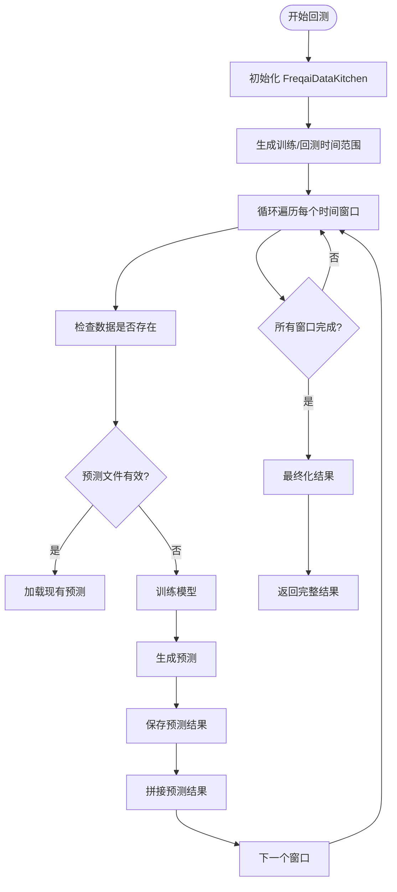
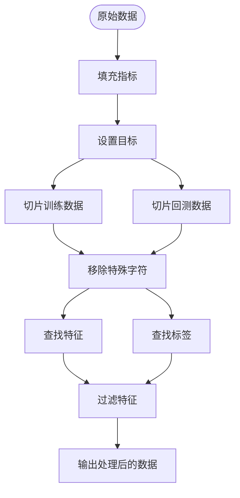
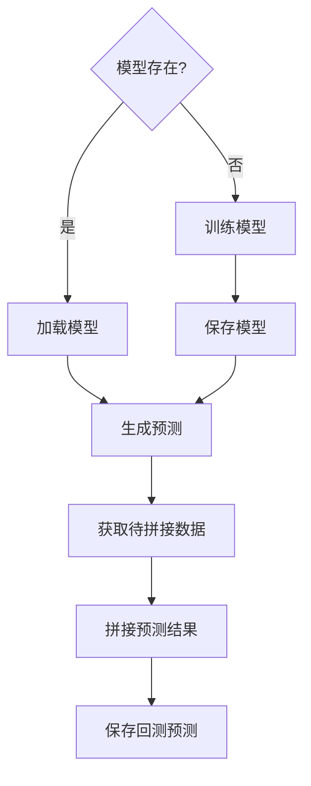
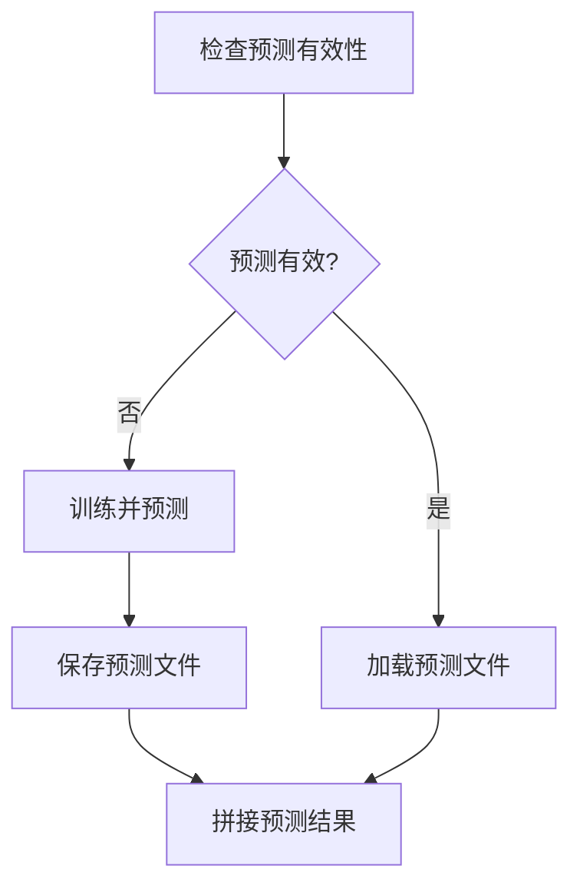

# 回测模式训练流程

<cite>
**本文档引用的文件**   
- [freqai_interface.py](file://freqtrade/freqai/freqai_interface.py)
- [data_kitchen.py](file://freqtrade/freqai/data_kitchen.py)
- [backtesting.py](file://freqtrade/optimize/backtesting.py)
- [timerange.py](file://freqtrade/configuration/timerange.py)
</cite>

## 目录
1. [引言](#引言)
2. [滑动窗口训练机制](#滑动窗口训练机制)
3. [数据处理管道](#数据处理管道)
4. [模型训练与预测拼接](#模型训练与预测拼接)
5. [预测有效性验证与持久化](#预测有效性验证与持久化)
6. [内存优化与配置建议](#内存优化与配置建议)

## 引言
FreqAI的回测模式采用滑动窗口训练机制，通过`start_backtesting`方法实现。该机制将历史数据划分为训练窗口和回测窗口，依次进行模型训练和预测，最终拼接所有预测结果。本文档详细解析该流程的实现原理，包括时间范围生成、数据切片、特征提取、标签生成、模型训练、预测拼接、有效性验证和结果持久化等关键环节。

## 滑动窗口训练机制

FreqAI的回测流程基于滑动窗口范式，通过`FreqaiDataKitchen`组件生成训练和回测时间范围。核心逻辑在`start_backtesting`方法中实现，该方法遍历`training_timeranges`和`backtesting_timeranges`，对每个窗口进行训练和预测。

**Diagram sources**
- [freqai_interface.py](file://freqtrade/freqai/freqai_interface.py#L268-L399)
- [data_kitchen.py](file://freqtrade/freqai/data_kitchen.py#L90-L108)

**Section sources**
- [freqai_interface.py](file://freqtrade/freqai/freqai_interface.py#L268-L399)
- [data_kitchen.py](file://freqtrade/freqai/data_kitchen.py#L90-L108)

## 数据处理管道

数据处理管道包括数据切片、特征提取和标签生成三个主要步骤。`FreqaiDataKitchen`负责管理整个数据处理流程，确保数据在训练和预测阶段的一致性。

### 数据切片
数据切片通过`slice_dataframe`方法实现，根据指定的时间范围从完整数据集中提取子集。训练数据集包含截止到训练窗口结束时间的所有数据，而回测数据集则包含截止到回测窗口结束时间的数据。

### 特征提取
特征提取通过`find_features`方法实现，从策略提供的数据框中提取以"%"开头的列作为特征。这些特征通常由策略中的`feature_engineering_expand_all`和`feature_engineering_expand_basic`方法生成。

### 标签生成
标签生成通过`find_labels`方法实现，从数据框中提取以"&"开头的列作为标签。这些标签通常由策略中的`set_freqai_targets`方法生成，用于监督学习。

**Diagram sources**
- [data_kitchen.py](file://freqtrade/freqai/data_kitchen.py#L34-L735)
- [freqai_interface.py](file://freqtrade/freqai/freqai_interface.py#L343-L363)

**Section sources**
- [data_kitchen.py](file://freqtrade/freqai/data_kitchen.py#L34-L735)
- [freqai_interface.py](file://freqtrade/freqai/freqai_interface.py#L343-L363)

## 模型训练与预测拼接

模型训练与预测拼接是回测流程的核心环节。对于每个时间窗口，系统首先检查模型是否存在，如果不存在则进行训练，然后生成预测并拼接结果。

### 模型训练
模型训练通过`train`方法实现，使用训练数据集训练机器学习模型。训练过程中，系统会检查模型是否已存在，如果存在则直接加载，避免重复训练。

### 预测生成
预测生成通过`predict`方法实现，使用训练好的模型对回测数据集进行预测。预测结果包括标签值、预测置信度等信息。

### 结果拼接
预测结果通过`append_predictions`方法拼接，将当前窗口的预测结果追加到之前窗口的预测结果之后，最终形成完整的回测预测序列。

**Diagram sources**
- [freqai_interface.py](file://freqtrade/freqai/freqai_interface.py#L268-L399)
- [data_kitchen.py](file://freqtrade/freqai/data_kitchen.py#L34-L735)

**Section sources**
- [freqai_interface.py](file://freqtrade/freqai/freqai_interface.py#L268-L399)
- [data_kitchen.py](file://freqtrade/freqai/data_kitchen.py#L34-L735)

## 预测有效性验证与持久化

预测有效性验证和持久化是确保回测结果可靠性和可复现性的关键步骤。系统通过`check_if_backtest_prediction_is_valid`方法验证预测文件的有效性，并通过`save_backtesting_prediction`方法将预测结果持久化存储。

### 有效性验证
有效性验证通过比较预测文件的长度和回测数据集的长度来判断预测文件是否有效。如果长度匹配且包含日期列，则认为预测文件有效，可以直接加载使用。

### 结果持久化
结果持久化通过`save_backtesting_prediction`方法实现，将预测结果保存为feather文件格式。这不仅节省了存储空间，还提高了读写效率。

**Diagram sources**
- [data_kitchen.py](file://freqtrade/freqai/data_kitchen.py#L908-L957)
- [freqai_interface.py](file://freqtrade/freqai/freqai_interface.py#L268-L399)

**Section sources**
- [data_kitchen.py](file://freqtrade/freqai/data_kitchen.py#L908-L957)
- [freqai_interface.py](file://freqtrade/freqai/freqai_interface.py#L268-L399)

## 内存优化与配置建议

为了处理大规模历史数据，FreqAI采用了多种内存优化策略。同时，合理的配置参数可以显著提升回测效率和准确性。

### 内存优化策略
- **数据分块处理**：将大规模数据集分块处理，避免一次性加载过多数据导致内存溢出。
- **缓存机制**：使用`DataHandler`组件缓存已处理的数据，避免重复计算。
- **数据类型优化**：使用合适的数据类型（如int32、float32）减少内存占用。

### 配置参数优化建议
- **train_period_days**：根据数据特性和模型复杂度合理设置训练周期，过短可能导致模型欠拟合，过长可能增加训练时间。
- **backtest_period_days**：设置合适的回测周期，确保有足够的数据进行验证。
- **data_kitchen_thread_count**：根据CPU核心数设置合适的线程数，充分利用多核优势。
- **save_backtest_models**：根据存储空间和复现需求决定是否保存所有模型。

**Section sources**
- [data_kitchen.py](file://freqtrade/freqai/data_kitchen.py#L34-L735)
- [freqai_interface.py](file://freqtrade/freqai/freqai_interface.py#L40-L74)