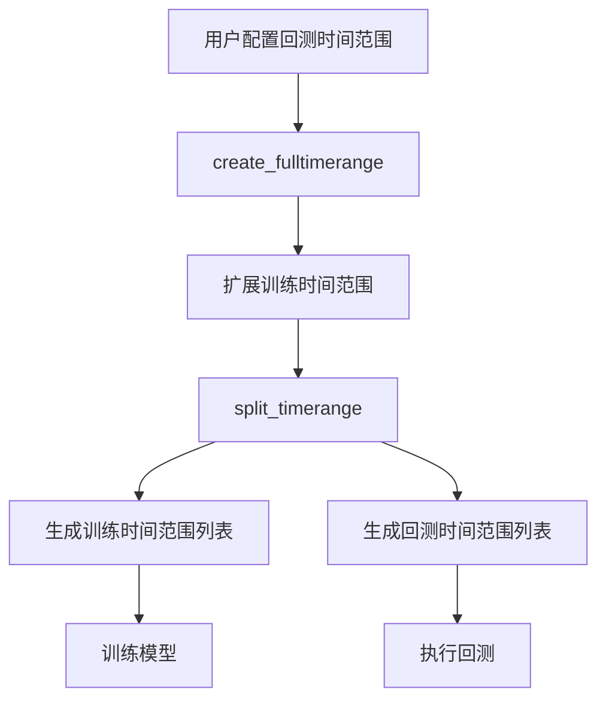
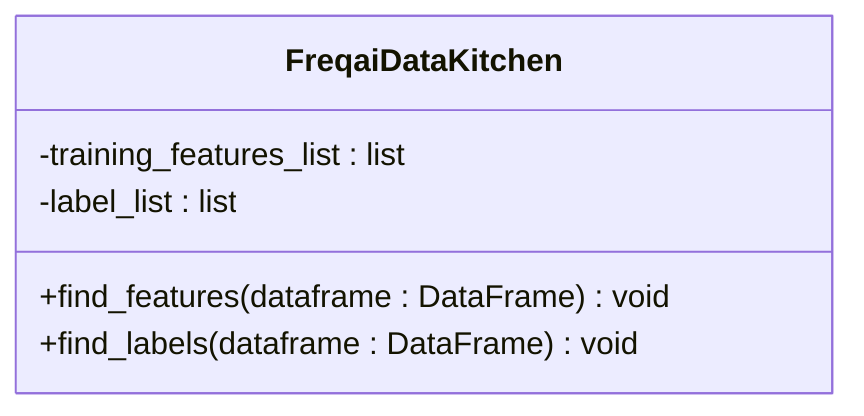
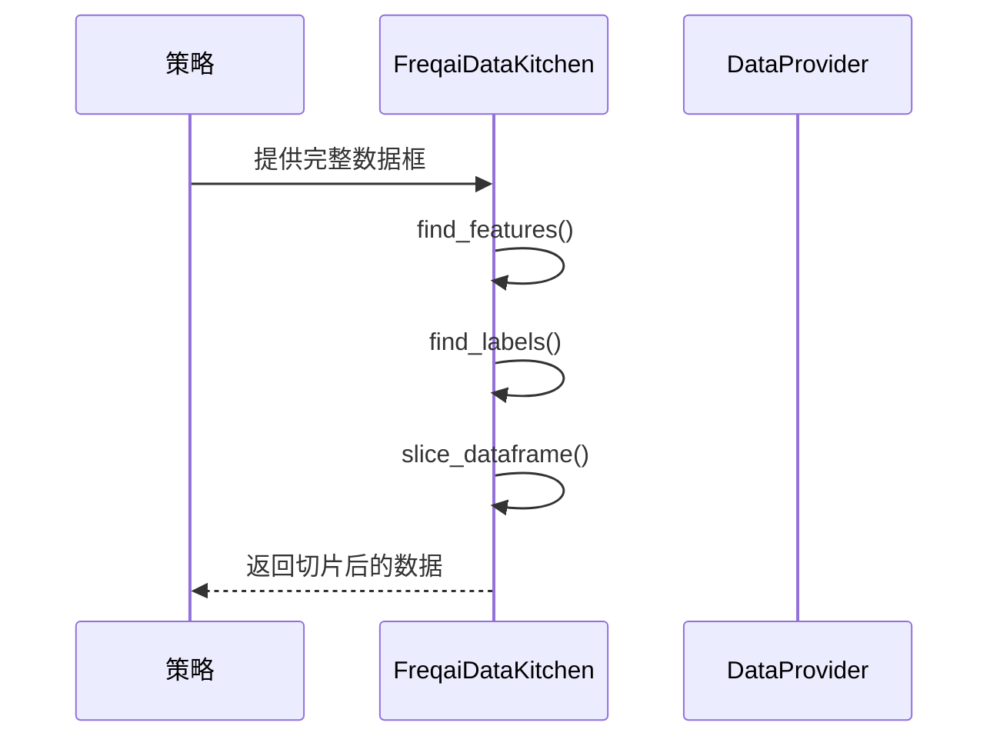

# 数据准备与切片

<cite>
**Referenced Files in This Document**  
- [data_kitchen.py](file://freqtrade/freqai/data_kitchen.py#L60-L1034)
</cite>

## 目录
1. [引言](#引言)
2. [数据切片与时间范围处理](#数据切片与时间范围处理)
3. [特征与标签识别](#特征与标签识别)
4. [完整时间范围与缓冲区处理](#完整时间范围与缓冲区处理)
5. [配置参数最佳实践](#配置参数最佳实践)

## 引言
本文档深入解析FreqAI在回测模式下的数据准备流程，重点阐述`FreqaiDataKitchen`类中`slice_dataframe`、`find_features`和`find_labels`方法的实现机制。详细说明如何根据`training_timeranges`和`backtesting_timeranges`对原始数据进行切片处理，以及特征（以%开头的列）和标签（以&开头的列）的自动识别与提取过程。同时，解释`create_fulltimerange`方法如何扩展回测时间范围以确保训练数据的完整性，并结合`buffer_timerange`方法说明时间范围缓冲区的处理逻辑。

**Section sources**
- [data_kitchen.py](file://freqtrade/freqai/data_kitchen.py#L60-L1034)

## 数据切片与时间范围处理

`FreqaiDataKitchen`类负责管理回测和训练过程中的数据切片与时间范围处理。其核心机制通过`create_fulltimerange`和`split_timerange`方法实现。

**Diagram sources**  
- [data_kitchen.py](file://freqtrade/freqai/data_kitchen.py#L481-L517)
- [data_kitchen.py](file://freqtrade/freqai/data_kitchen.py#L321-L378)

`create_fulltimerange`方法接收用户配置的回测时间范围和`backtest_period_days`参数，将训练时间范围向前扩展指定天数，确保有足够的历史数据用于训练。该方法还会验证时间范围的有效性，不允许使用开放式的结束时间。

`split_timerange`方法则将扩展后的完整时间范围分割成多个子时间范围，形成交替的训练和回测周期。每个训练周期长度由`train_period_days`决定，每个回测周期长度由`backtest_period_days`决定。该方法确保回测的结束时间与用户配置的总时间范围一致。

**Section sources**
- [data_kitchen.py](file://freqtrade/freqai/data_kitchen.py#L481-L517)
- [data_kitchen.py](file://freqtrade/freqai/data_kitchen.py#L321-L378)

## 特征与标签识别

`FreqaiDataKitchen`通过`find_features`和`find_labels`方法实现特征和标签的自动识别。

**Diagram sources**  
- [data_kitchen.py](file://freqtrade/freqai/data_kitchen.py#L394-L407)
- [data_kitchen.py](file://freqtrade/freqai/data_kitchen.py#L409-L412)

`find_features`方法扫描数据框的所有列名，提取所有以`%`符号开头的列作为特征。如果未找到任何特征，将抛出异常。识别出的特征列表存储在`training_features_list`属性中。

`find_labels`方法同样扫描列名，提取所有以`&`符号开头的列作为标签。这些标签通常代表模型需要预测的目标变量。识别出的标签列表存储在`label_list`属性中。

`slice_dataframe`方法根据当前的时间范围对数据框进行切片，确保只使用指定时间范围内的数据。在回测模式下，该方法会同时应用开始和结束时间的过滤。

**Diagram sources**  
- [data_kitchen.py](file://freqtrade/freqai/data_kitchen.py#L380-L392)
- [data_kitchen.py](file://freqtrade/freqai/data_kitchen.py#L394-L407)
- [data_kitchen.py](file://freqtrade/freqai/data_kitchen.py#L409-L412)

**Section sources**
- [data_kitchen.py](file://freqtrade/freqai/data_kitchen.py#L380-L392)
- [data_kitchen.py](file://freqtrade/freqai/data_kitchen.py#L394-L407)
- [data_kitchen.py](file://freqtrade/freqai/data_kitchen.py#L409-L412)

## 完整时间范围与缓冲区处理

`create_fulltimerange`方法通过向前扩展训练时间范围来确保模型有足够的历史数据进行训练。该方法首先解析用户配置的回测时间范围，然后将开始时间向前移动`backtest_period_days`指定的天数。

`buffer_timerange`方法用于在指标计算完成后对时间范围进行缓冲处理。当预测极值点时，边缘处的数据可能不完整，该方法通过在开始和结束时间上增加缓冲区来解决此问题。缓冲区的大小由`buffer_train_data_candles`配置参数决定。

**Diagram sources**  
- [data_kitchen.py](file://freqtrade/freqai/data_kitchen.py#L481-L517)
- [data_kitchen.py](file://freqtrade/freqai/data_kitchen.py#L980-L1000)

**Section sources**
- [data_kitchen.py](file://freqtrade/freqai/data_kitchen.py#L481-L517)
- [data_kitchen.py](file://freqtrade/freqai/data_kitchen.py#L980-L1000)

## 配置参数最佳实践

对于`train_period_days`和`backtest_period_days`等配置参数，建议遵循以下最佳实践：

1. **train_period_days**: 应设置为足够长的时间以包含足够的市场周期，通常建议设置为28天或更长。过短的训练周期可能导致模型过拟合。
2. **backtest_period_days**: 应设置为合理的回测长度，通常建议设置为7天。过长的回测周期可能导致训练频率过低。
3. **buffer_train_data_candles**: 当使用极值点预测时，应根据极值点计算的窗口大小设置适当的缓冲区，通常建议设置为窗口大小的一半。

这些参数的合理配置对于模型的稳定性和预测准确性至关重要。

**Section sources**
- [data_kitchen.py](file://freqtrade/freqai/data_kitchen.py#L321-L378)
- [data_kitchen.py](file://freqtrade/freqai/data_kitchen.py#L481-L517)
- [data_kitchen.py](file://freqtrade/freqai/data_kitchen.py#L980-L1000)