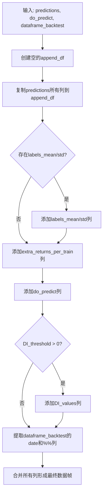
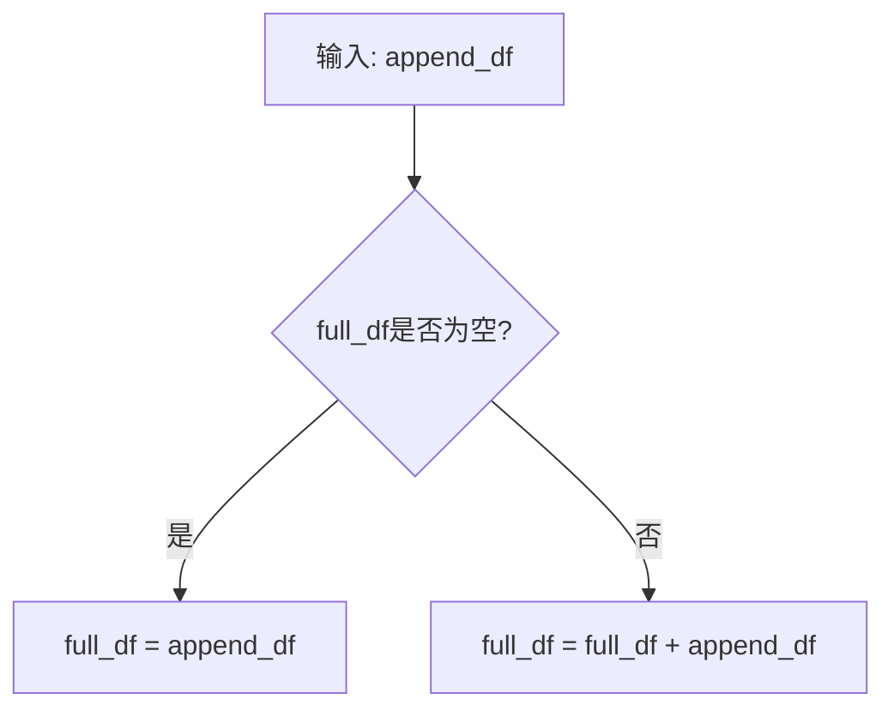
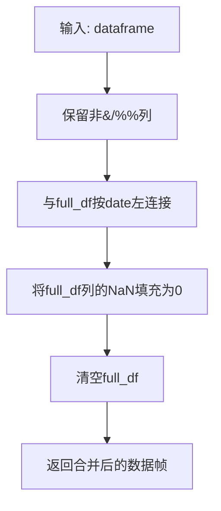
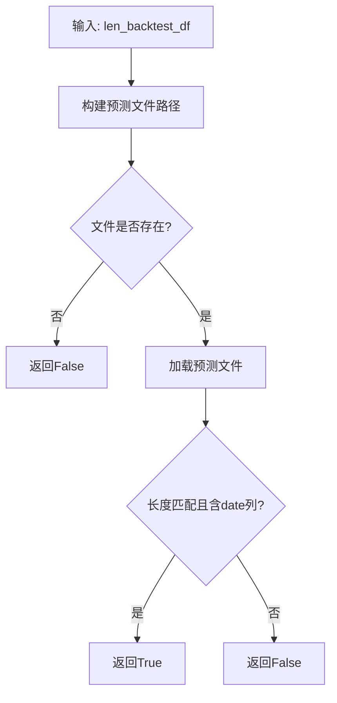
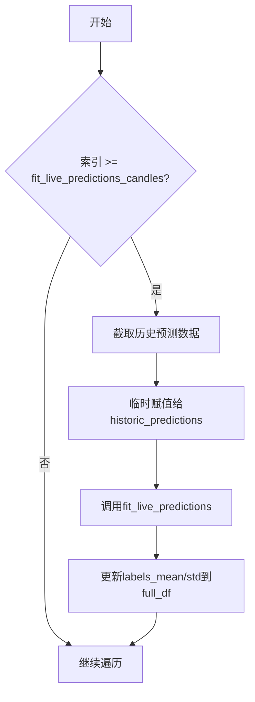

# 预测结果拼接与验证

<cite>
**本文档引用的文件**   
- [freqai_interface.py](file://freqtrade/freqai/freqai_interface.py)
- [data_kitchen.py](file://freqtrade/freqai/data_kitchen.py)
- [BaseRegressionModel.py](file://freqtrade/freqai/base_models/BaseRegressionModel.py)
- [BaseClassifierModel.py](file://freqtrade/freqai/base_models/BaseClassifierModel.py)
- [XGBoostRegressor.py](file://freqtrade/freqai/prediction_models/XGBoostRegressor.py)
- [XGBoostClassifier.py](file://freqtrade/freqai/prediction_models/XGBoostClassifier.py)
</cite>

## 目录
1. [引言](#引言)
2. [预测数据生成机制](#预测数据生成机制)
3. [预测结果拼接与累积](#预测结果拼接与累积)
4. [回测预测有效性验证](#回测预测有效性验证)
5. [中间结果缓存策略](#中间结果缓存策略)
6. [实时预测模拟机制](#实时预测模拟机制)
7. [结论](#结论)

## 引言
本文档深入解析Freqtrade框架中回测模式下预测结果的拼接与验证机制。重点阐述`predict`方法如何生成预测数据，以及`get_predictions_to_append`方法如何将预测结果、不确定性指标（DI_values）和保护信号（do_predict）整合到结果数据帧中。详细说明`append_predictions`和`fill_predictions`方法在累积和填充预测结果中的作用，以及`backtesting_fit_live_predictions`方法如何模拟实时预测场景。同时，重点分析`check_if_backtest_prediction_is_valid`方法对预测有效性的验证逻辑，以及`save_backtesting_prediction`对中间预测结果的缓存策略，确保回测结果的准确性和可复现性。

## 预测数据生成机制

`predict`方法是生成预测数据的核心入口，由`IFreqaiModel`接口定义，并在`BaseRegressionModel`和`BaseClassifierModel`等基类中实现。该方法接收一个完整的数据帧（`unfiltered_df`）和一个`FreqaiDataKitchen`对象（`dk`），经过一系列数据处理和模型推理后，返回预测结果。

在回归模型（`BaseRegressionModel`）中，`predict`方法首先通过`find_features`和`filter_features`方法从输入数据帧中提取并过滤出用于预测的特征。随后，使用`feature_pipeline`对特征数据进行转换，该过程会检查并标记异常值（outliers）。模型使用转换后的特征进行预测，得到原始预测值。接着，通过`label_pipeline`的逆变换将预测值还原到原始标签空间。最后，该方法会检查特征管道中是否配置了差异性指数（DI）阈值，如果配置了，则将`dk.DI_values`设置为DI值，否则初始化为零数组。同时，将异常值标记数组`outliers`赋值给`dk.do_predict`，作为保护信号。

在分类模型（`BaseClassifierModel`）中，流程类似，但会额外调用`predict_proba`方法获取每个类别的预测概率，并将这些概率与主预测结果合并到同一个数据帧中。

**Section sources**
- [BaseRegressionModel.py](file://freqtrade/freqai/base_models/BaseRegressionModel.py#L96-L130)
- [BaseClassifierModel.py](file://freqtrade/freqai/base_models/BaseClassifierModel.py#L86-L128)
- [freqai_interface.py](file://freqtrade/freqai/freqai_interface.py#L975-L987)

## 预测结果拼接与累积

### 预测结果整合
`get_predictions_to_append`方法负责将`predict`方法生成的预测结果整合成一个可用于回测的完整数据帧。该方法接收三个参数：`predictions`（预测结果数据帧）、`do_predict`（保护信号数组）和`dataframe_backtest`（回测期间的原始数据帧）。

整合过程如下：
1.  **复制预测结果**：将`predictions`中的所有列直接复制到新的`append_df`中。
2.  **添加统计信息**：如果`dk.data`字典中存在`labels_mean`和`labels_std`，则将这些均值和标准差信息作为新列添加到`append_df`中。
3.  **添加额外返回值**：将`dk.data["extra_returns_per_train"]`中的任何额外返回值也添加为新列。
4.  **添加保护信号**：将`do_predict`数组作为`do_predict`列添加。
5.  **添加不确定性指标**：如果配置了`DI_threshold`，则将`dk.DI_values`作为`DI_values`列添加。
6.  **合并原始数据**：最后，将`dataframe_backtest`中的`date`列和以`%%`开头的用户自定义列与`append_df`进行合并，形成最终的输出数据帧。

**Diagram sources**
- [data_kitchen.py](file://freqtrade/freqai/data_kitchen.py#L423-L453)

### 预测结果累积
`append_predictions`方法负责将当前回测周期生成的`append_df`累积到一个全局的`full_df`中。该方法非常简单，如果`full_df`为空，则直接赋值；否则，使用`pd.concat`将其与`append_df`在行方向上连接，形成一个包含所有历史预测结果的完整数据帧。

**Diagram sources**
- [data_kitchen.py](file://freqtrade/freqai/data_kitchen.py#L455-L463)

### 填充最终结果
`fill_predictions`方法在回测结束后被调用，其作用是将累积的`full_df`与原始策略数据帧进行合并，以确保返回给策略的数据帧大小一致。该方法首先保留原始数据帧中不以`&`或`%%`开头的列，然后使用`pd.merge`以`date`列为键，将`full_df`左连接到这些保留的列上。最后，将合并后数据帧中来自`full_df`的列的`NaN`值填充为0，并清空`full_df`。

**Diagram sources**
- [data_kitchen.py](file://freqtrade/freqai/data_kitchen.py#L465-L479)

**Section sources**
- [data_kitchen.py](file://freqtrade/freqai/data_kitchen.py#L423-L479)

## 回测预测有效性验证

`check_if_backtest_prediction_is_valid`方法用于检查针对当前回测周期的预测文件是否已经存在且有效。该方法接收`len_backtest_df`参数，即当前回测数据帧的长度。

验证逻辑如下：
1.  **构建路径**：根据模型标识符和回测预测文件夹，构建预测文件的预期路径。
2.  **检查文件存在性**：检查该路径下的文件是否存在。
3.  **验证文件内容**：如果文件存在，则调用`get_backtesting_prediction`方法加载该文件。只有当加载的预测数据帧的长度与当前回测数据帧的长度完全一致，并且包含`date`列时，才认为该预测文件是有效的，返回`True`。
4.  **返回结果**：如果文件不存在或内容无效，则返回`False`，表示需要重新生成预测。

此机制可以避免在回测过程中重复进行耗时的预测计算，从而显著提高回测效率。

**Diagram sources**
- [data_kitchen.py](file://freqtrade/freqai/data_kitchen.py#L926-L957)

**Section sources**
- [data_kitchen.py](file://freqtrade/freqai/data_kitchen.py#L926-L957)

## 中间结果缓存策略

`save_backtesting_prediction`方法负责将当前回测周期生成的`append_df`保存到磁盘，作为中间预测结果的缓存。该方法首先确保预测文件夹存在，然后使用`to_feather`方法将`append_df`以Feather文件格式保存到`backtesting_results_path`指定的路径。

这种缓存策略与`check_if_backtest_prediction_is_valid`方法配合使用，形成了一个高效的预测结果复用机制。当用户进行多次回测或中断后继续回测时，系统可以快速加载已缓存的预测结果，而无需重新运行模型预测，极大地节省了计算资源和时间，保证了回测结果的可复现性。

**Section sources**
- [data_kitchen.py](file://freqtrade/freqai/data_kitchen.py#L908-L917)

## 实时预测模拟机制

`backtesting_fit_live_predictions`方法旨在在回测模式下模拟实时预测场景中的`fit_live_predictions`行为。当配置了`fit_live_predictions_candles`参数时，该方法会被调用。

其工作流程是：
1.  **遍历回测数据**：对`dk.full_df`中的每一行（即每一个时间点）进行遍历。
2.  **模拟历史窗口**：当遍历的索引达到`fit_live_predictions_candles`指定的数量时，开始模拟。它会从`dk.full_df`中截取当前索引之前指定数量的历史预测数据，并将其临时赋值给`self.dd.historic_predictions`。
3.  **调用拟合函数**：调用`self.fit_live_predictions(self.dk, self.dk.pair)`，该函数会基于这个临时的历史数据集计算并更新当前时间点的`labels_mean`和`labels_std`等统计信息。
4.  **更新结果**：将计算出的均值和标准差等信息更新回`dk.full_df`中对应的位置。

通过这种方式，回测过程能够更真实地模拟出在实时交易中，模型如何利用不断积累的历史预测来动态调整其统计指标，从而影响策略的决策。

**Diagram sources**
- [freqai_interface.py](file://freqtrade/freqai/freqai_interface.py#L866-L908)

**Section sources**
- [freqai_interface.py](file://freqtrade/freqai/freqai_interface.py#L866-L908)

## 结论
本文档详细解析了Freqtrade框架中回测模式下预测结果的完整生命周期。从`predict`方法生成原始预测，到`get_predictions_to_append`进行结果整合，再到`append_predictions`和`fill_predictions`完成累积与填充，整个流程清晰高效。`check_if_backtest_prediction_is_valid`和`save_backtesting_prediction`构成的缓存机制，确保了回测的性能和结果的可复现性。最后，`backtesting_fit_live_predictions`方法巧妙地模拟了实时预测的动态特性。这一系列机制共同保障了Freqtrade回测的准确性、高效性和真实性。