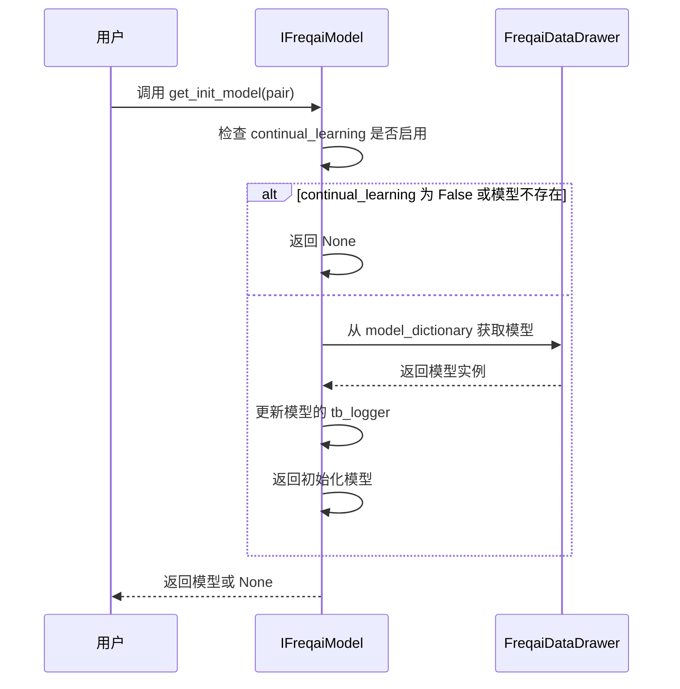
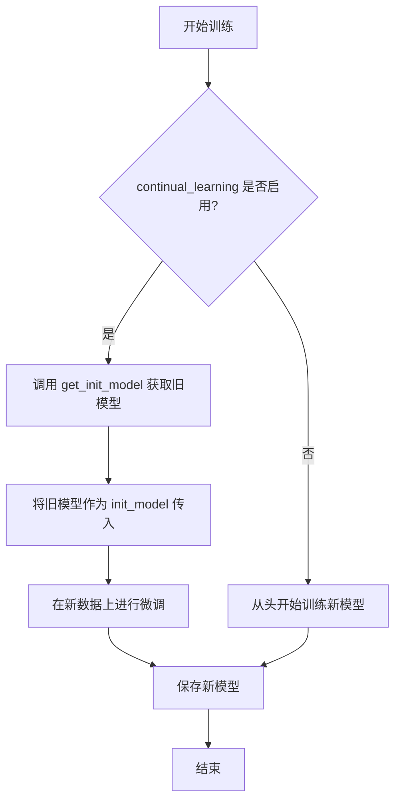

# 增量训练与持续学习

<cite>
**本文档引用的文件**   
- [freqai_interface.py](file://freqtrade/freqai/freqai_interface.py)
- [data_drawer.py](file://freqtrade/freqai/data_drawer.py)
- [data_kitchen.py](file://freqtrade/freqai/data_kitchen.py)
- [BaseReinforcementLearningModel.py](file://freqtrade/freqai/RL/BaseReinforcementLearningModel.py)
- [BaseRegressionModel.py](file://freqtrade/freqai/base_models/BaseRegressionModel.py)
- [BaseClassifierModel.py](file://freqtrade/freqai/base_models/BaseClassifierModel.py)
- [config_freqai.example.json](file://config_examples/config_freqai.example.json)
</cite>

## 目录
1. [增量训练与持续学习机制概述](#增量训练与持续学习机制概述)
2. [模型初始化与参数继承](#模型初始化与参数继承)
3. [启用持续学习时的模型微调](#启用持续学习时的模型微调)
4. [增量训练的影响分析](#增量训练的影响分析)
5. [适用场景与配置建议](#适用场景与配置建议)
6. [案例分析：模型更新频率与资源消耗的平衡](#案例分析模型更新频率与资源消耗的平衡)

### 增量训练与持续学习机制概述
FreqAI的增量训练和持续学习（continual_learning）机制旨在通过复用已有模型的知识，实现模型的高效更新。该机制允许模型在新数据上进行微调，而不是从零开始训练，从而在保持模型性能的同时，显著提升训练效率。持续学习通过`continual_learning`配置项控制，当启用时，系统会从内存或磁盘加载先前训练的模型作为新训练的起点，实现知识的继承和累积。

**Section sources**
- [freqai_interface.py](file://freqtrade/freqai/freqai_interface.py#L99)
- [config_freqai.example.json](file://config_examples/config_freqai.example.json#L65)

### 模型初始化与参数继承
在FreqAI中，`get_init_model`方法是实现模型初始化和参数继承的核心。该方法通过检查`data_drawer`（数据抽屉）中的`model_dictionary`来获取指定交易对的已有模型。如果`continual_learning`被启用且该交易对的模型存在于字典中，则返回该模型实例；否则，返回`None`，表示需要从头开始训练。



**Diagram sources**
- [freqai_interface.py](file://freqtrade/freqai/freqai_interface.py#L755-L763)
- [data_drawer.py](file://freqtrade/freqai/data_drawer.py#L75)

**Section sources**
- [freqai_interface.py](file://freqtrade/freqai/freqai_interface.py#L755-L763)
- [data_drawer.py](file://freqtrade/freqai/data_drawer.py#L75)

### 启用持续学习时的模型微调
当`continual_learning`被启用时，模型的训练过程会发生根本性变化。以`CatboostClassifier`为例，其`fit`方法在训练时会调用`get_init_model`获取已有模型，并将其作为`init_model`参数传递给`CatBoostClassifier`的`fit`方法。这使得新模型的训练过程能够以旧模型的权重和结构为基础，仅对新数据进行增量学习，从而实现高效的微调。



**Diagram sources**
- [freqai_interface.py](file://freqtrade/freqai/freqai_interface.py#L755-L763)
- [prediction_models/CatboostClassifier.py](file://freqtrade/freqai/prediction_models/CatboostClassifier.py#L13-L60)

**Section sources**
- [freqai_interface.py](file://freqtrade/freqai/freqai_interface.py#L755-L763)
- [prediction_models/CatboostClassifier.py](file://freqtrade/freqai/prediction_models/CatboostClassifier.py#L13-L60)

### 增量训练的影响分析
#### 对模型性能的影响
增量训练通常能更快地适应市场变化，因为它基于已有的、经过验证的知识进行更新。这有助于模型在新数据上快速收敛，保持对市场动态的敏感性。然而，如果新数据与旧数据的分布差异过大，可能会导致模型性能下降，即发生“灾难性遗忘”。

#### 对收敛速度的影响
由于模型的初始权重已经接近最优解，增量训练的收敛速度远快于从零开始的训练。这大大减少了每次重新训练所需的时间，使得模型可以更频繁地更新。

#### 对过拟合风险的影响
增量训练的风险在于，如果新数据集较小或存在偏差，模型可能会过度拟合这些新数据，而忽略了历史数据中的普遍规律。因此，需要通过合理的数据划分和正则化技术来控制过拟合风险。

**Section sources**
- [freqai_interface.py](file://freqtrade/freqai/freqai_interface.py#L58-L117)
- [BaseRegressionModel.py](file://freqtrade/freqai/base_models/BaseRegressionModel.py#L23-L94)

### 适用场景与配置建议
#### 适用场景
- **高频交易策略**：需要模型快速响应市场变化。
- **数据流持续更新**：新数据不断产生，需要模型定期更新。
- **计算资源有限**：无法承受长时间的全量训练。

#### 配置建议
- **启用持续学习**：在`config.json`中设置`"continual_learning": true`。
- **合理设置训练周期**：通过`"train_period_days"`和`"live_retrain_hours"`平衡模型的新鲜度和稳定性。
- **模型清理**：使用`"purge_old_models"`参数自动清理旧模型，避免磁盘空间耗尽。
- **监控模型性能**：通过`"write_metrics_to_disk"`记录训练和推理时间，监控系统性能。

```json
{
  "freqai": {
    "enabled": true,
    "continual_learning": true,
    "train_period_days": 15,
    "live_retrain_hours": 6,
    "purge_old_models": 2,
    "write_metrics_to_disk": true
  }
}
```

**Section sources**
- [config_freqai.example.json](file://config_examples/config_freqai.example.json#L65-L88)

### 案例分析：模型更新频率与资源消耗的平衡
在实际应用中，一个常见的挑战是平衡模型的更新频率与系统资源消耗。例如，将`live_retrain_hours`设置为1小时，虽然能确保模型非常“新鲜”，但会频繁触发训练任务，消耗大量CPU和内存资源。反之，设置为24小时则资源消耗极低，但模型可能无法及时适应市场变化。

一个有效的策略是采用动态更新频率。例如，当市场波动率（通过`DI_threshold`等指标衡量）较高时，缩短更新周期（如每2小时）；当市场平稳时，延长更新周期（如每12小时）。这需要在策略中实现自适应逻辑，根据实时指标动态调整`live_retrain_hours`，从而在模型性能和资源消耗之间取得最佳平衡。

**Section sources**
- [freqai_interface.py](file://freqtrade/freqai/freqai_interface.py#L99)
- [data_kitchen.py](file://freqtrade/freqai/data_kitchen.py#L67)
- [config_freqai.example.json](file://config_examples/config_freqai.example.json#L70-L71)