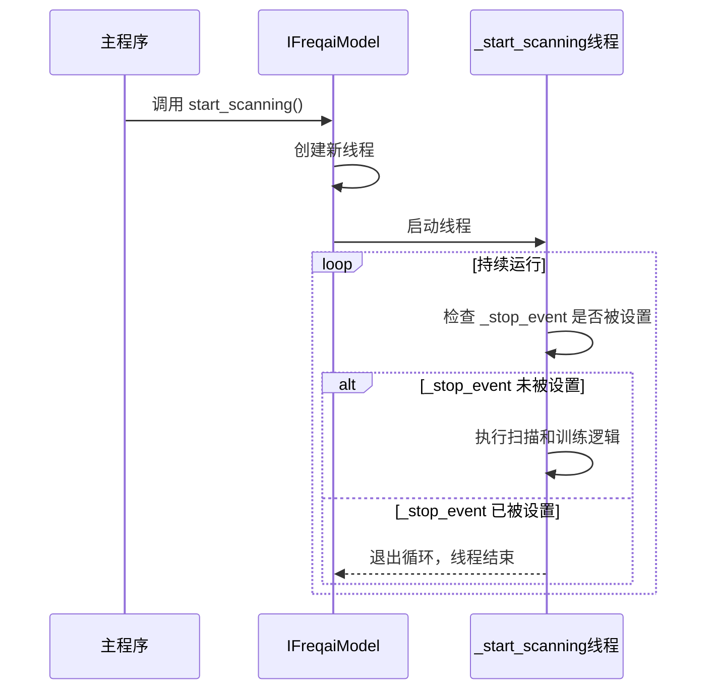

# 多线程扫描与训练调度

<cite>
**本文档引用的文件**   
- [freqai_interface.py](file://freqtrade/freqai/freqai_interface.py)
- [data_kitchen.py](file://freqtrade/freqai/data_kitchen.py)
- [interface.py](file://freqtrade/strategy/interface.py)
</cite>

## 目录
1. [引言](#引言)
2. [核心组件分析](#核心组件分析)
3. [_start_scanning线程工作原理](#_start_scanning线程工作原理)
4. [train_queue优先级管理与轮询调度](#train_queue优先级管理与轮询调度)
5. [线程安全停止机制与异常处理](#线程安全停止机制与异常处理)
6. [扫描线程与主交易循环的协同工作](#扫描线程与主交易循环的协同工作)
7. [线程性能监控与优化最佳实践](#线程性能监控与优化最佳实践)
8. [结论](#结论)

## 引言
本文档全面解析Freqtrade系统中_start_scanning线程的工作原理和调度机制。该线程是FreqAI（Freqtrade AI）模块的核心组件，负责在独立线程中持续扫描交易对，以实现模型的实时重训练，从而保持模型的“年轻化”和预测准确性。文档将深入分析train_queue如何管理待训练交易对的优先级，以及通过rotate(-1)实现的轮询调度机制。同时，将阐述线程安全的停止机制（_stop_event）和异常处理策略，分析scanning线程与主交易循环的协同工作模式，以及如何在保证交易实时性的同时完成模型重训练。最后，提供线程性能监控、资源占用优化和死锁预防的最佳实践。

## 核心组件分析

本文档主要分析以下核心组件：

- **IFreqaiModel**: FreqAI模型的基类，定义了模型训练、预测和扫描的核心接口与逻辑。
- **FreqaiDataKitchen**: 数据管理与分析工具，为每个交易对提供非持久化的数据容器，负责数据的加载、处理和特征提取。
- **IStrategy**: 交易策略接口，定义了策略与FreqAI模块交互的接口，如数据提供、指标填充等。

**Section sources**
- [freqai_interface.py](file://freqtrade/freqai/freqai_interface.py#L35-L1039)
- [data_kitchen.py](file://freqtrade/freqai/data_kitchen.py#L34-L1033)
- [interface.py](file://freqtrade/strategy/interface.py#L50-L1882)

## _start_scanning线程工作原理

_start_scanning线程是FreqAI模块实现模型实时重训练的关键。该线程在系统启动后由start_scanning方法启动，作为一个独立的后台线程运行，其主要职责是持续监控交易对列表，并根据预设条件触发模型的重新训练。

### 线程启动与生命周期
线程的启动由`start_scanning`方法触发。该方法创建一个`threading.Thread`实例，目标函数为`_start_scanning`，并将新线程添加到`_threads`列表中，然后启动线程。线程的生命周期由`_stop_event`事件控制。在`_start_scanning`方法的主循环中，会持续检查`_stop_event`的状态。当系统需要关闭时，`shutdown`方法会调用`_stop_event.set()`，这将导致主循环的条件`while not self._stop_event.is_set():`变为False，从而优雅地退出循环并结束线程。



**Diagram sources **
- [freqai_interface.py](file://freqtrade/freqai/freqai_interface.py#L212-L218)
- [freqai_interface.py](file://freqtrade/freqai/freqai_interface.py#L220-L266)
- [freqai_interface.py](file://freqtrade/freqai/freqai_interface.py#L190-L198)

### 扫描与训练流程
线程的核心逻辑位于`_start_scanning`方法中。其工作流程如下：
1.  **休眠与检查**: 线程首先休眠1秒（`time.sleep(1)`），以避免过度消耗CPU资源。然后检查`_stop_event`以响应停止信号。
2.  **获取交易对**: 从`train_queue`的队首获取一个交易对。
3.  **白名单验证**: 检查该交易对是否仍在当前策略的白名单（whitelist）中。如果不在，则将其从队列中移除并发出警告。
4.  **检查重训练条件**: 通过`FreqaiDataKitchen`的`check_if_new_training_required`方法，根据配置的`live_retrain_hours`等参数，判断该交易对的模型是否需要重新训练。
5.  **执行训练**: 如果需要重训练，则调用`extract_data_and_train_model`方法进行数据提取和模型训练。此过程被`try-except`块包围，以捕获并处理训练过程中可能出现的任何异常，防止线程崩溃。
6.  **队列轮询**: 训练成功后，调用`train_queue.rotate(-1)`将已训练的交易对移动到队列末尾，实现轮询调度。
7.  **数据持久化**: 将历史预测和度量指标保存到磁盘。

## train_queue优先级管理与轮询调度

`train_queue`是一个`collections.deque`（双端队列）实例，用于管理待训练的交易对序列。其优先级管理和调度机制是确保模型更新公平性和效率的关键。

### 优先级初始化
`train_queue`的初始状态由`_set_train_queue`方法决定。该方法的逻辑如下：
1.  **首次运行**: 如果系统是首次运行或没有可用的模型元数据，则`train_queue`会直接根据配置文件中的`pair_whitelist`（交易对白名单）顺序进行初始化。
2.  **后续运行**: 如果系统之前运行过并保存了模型元数据，则会根据每个交易对模型的`trained_timestamp`（训练时间戳）进行排序。训练时间越早的交易对，其优先级越高，会被排在队列的前面。这样可以确保所有交易对的模型都能得到相对均衡的更新机会，避免某些交易对长期得不到训练。

### 轮询调度机制
轮询调度的核心是`rotate(-1)`方法的调用。当一个交易对完成训练后，`rotate(-1)`会将队列中的所有元素向左移动一位，而队首的元素（即刚训练完的交易对）则被移动到队列的末尾。

这种机制实现了**循环调度**（Round-Robin Scheduling）：
- **公平性**: 每个交易对在完成一次训练后，都会被放到队列末尾，等待下一轮的调度。这确保了所有交易对都有平等的机会被重新训练。
- **简单高效**: `deque`的`rotate`操作是O(1)时间复杂度，非常高效，不会成为性能瓶颈。
- **动态适应**: 队列的顺序会随着训练的进行而动态变化。新加入白名单的交易对会从队首开始，而频繁需要重训练的交易对可能会在队列中停留更久。

```mermaid
flowchart TD
A[初始队列: A, B, C, D] --> B[训练 A]
B --> C[rotate(-1)]
C --> D[新队列: B, C, D, A]
D --> E[训练 B]
E --> F[rotate(-1)]
F --> G[新队列: C, D, A, B]
G --> H[...]
```

**Diagram sources **
- [freqai_interface.py](file://freqtrade/freqai/freqai_interface.py#L765-L790)
- [freqai_interface.py](file://freqtrade/freqai/freqai_interface.py#L262)

**Section sources**
- [freqai_interface.py](file://freqtrade/freqai/freqai_interface.py#L93-L93)
- [freqai_interface.py](file://freqtrade/freqai/freqai_interface.py#L765-L790)

## 线程安全停止机制与异常处理

### 线程安全停止机制
线程安全的停止是通过`threading.Event`对象`_stop_event`实现的。这是一种标准的、线程安全的信号机制。
- **设置信号**: 当系统需要关闭时，`shutdown`方法会调用`self._stop_event.set()`。这个操作是原子的，可以安全地从主线程调用。
- **检查信号**: `_start_scanning`线程在每次循环开始时，通过`while not self._stop_event.is_set():`检查事件状态。`is_set()`方法也是线程安全的。
- **优雅退出**: 一旦`_stop_event`被设置，主循环的条件将不再满足，线程会自然退出循环，执行后续的清理工作（如`join`等待），从而实现优雅、安全的终止，避免了强制终止线程可能带来的资源泄漏或数据不一致问题。

### 异常处理策略
在模型训练过程中，可能会遇到各种异常，例如数据下载失败、模型训练库内部错误等。`_start_scanning`方法通过`try-except`块对`extract_data_and_train_model`的调用进行包裹。
- **捕获异常**: `except Exception as msg:` 捕获所有类型的异常。
- **日志记录**: 使用`logger.exception`记录异常的完整堆栈信息，这对于调试和问题排查至关重要。
- **错误隔离**: 异常被捕获后，线程不会崩溃，而是会打印错误日志，然后`continue`到下一次循环，去处理队列中的下一个交易对。这确保了单个交易对的训练失败不会影响整个扫描线程的正常运行，保证了系统的健壮性。

**Section sources**
- [freqai_interface.py](file://freqtrade/freqai/freqai_interface.py#L106-L106)
- [freqai_interface.py](file://freqtrade/freqai/freqai_interface.py#L190-L198)
- [freqai_interface.py](file://freqtrade/freqai/freqai_interface.py#L220-L266)

## 扫描线程与主交易循环的协同工作

扫描线程（scanning thread）与主交易循环（main trading loop）是并行工作的，它们通过共享状态和数据来协同完成交易决策。

### 协同工作模式
1.  **主循环请求预测**: 主交易循环在每个新的K线（candle）生成时，会调用`IFreqaiModel.start`方法，请求对当前白名单中的所有交易对进行预测。
2.  **启动扫描线程**: 在`start_live`方法中，如果`scanning`标志为`False`，则会调用`start_scanning`来启动扫描线程。这意味着扫描线程通常在主循环第一次运行时被启动。
3.  **并行执行**: 一旦扫描线程启动，它就在后台独立运行，持续检查并重训练模型。与此同时，主循环继续执行其交易逻辑，包括获取预测、生成买卖信号、下单等。
4.  **数据共享**: 两个线程通过共享的`self.dd`（`FreqaiDataDrawer`）和模型文件系统进行数据交换。扫描线程训练完成后，会将新模型和预测结果保存到磁盘。主循环在需要时会从磁盘加载最新的模型和数据。
5.  **保证实时性**: 这种设计的关键在于**解耦**。主循环的执行时间不会被模型训练的耗时所阻塞。即使某个交易对的模型训练需要几分钟，主循环仍然可以使用旧的、但仍然有效的模型进行预测和交易，从而保证了交易的实时性。

### 保证交易实时性的关键
- **非阻塞性训练**: 模型训练在独立线程中进行，不会阻塞主交易循环。
- **模型缓存与过期检查**: 主循环在加载模型时，会通过`check_if_model_expired`方法检查模型是否过期。如果模型未过期，则直接使用；如果过期，则返回空值或使用降级策略，而不是等待新模型训练完成。
- **增量更新**: 扫描线程只对需要重训练的交易对进行训练，避免了对所有交易对进行全量训练，大大减少了后台任务的负担。

**Section sources**
- [freqai_interface.py](file://freqtrade/freqai/freqai_interface.py#L80-L80)
- [freqai_interface.py](file://freqtrade/freqai/freqai_interface.py#L401-L468)
- [freqai_interface.py](file://freqtrade/freqai/freqai_interface.py#L129-L171)

## 线程性能监控与优化最佳实践

为了确保多线程系统的稳定和高效，以下是一些性能监控和优化的最佳实践：

### 性能监控
1.  **训练时间监控**: `train_timer`方法会记录训练所有交易对所需的总时间。应监控此指标，如果训练时间过长，可能需要优化模型或减少交易对数量。
2.  **推理时间监控**: `inference_timer`方法会记录对整个交易对列表进行预测的总时间。这直接影响交易的实时性，应确保其远小于K线周期。
3.  **日志分析**: 通过分析日志中的`Training`、`Done training`、`Total time spent training`等信息，可以了解每个交易对的训练耗时和整体性能。

### 资源占用优化
1.  **合理设置`live_retrain_hours`**: 过于频繁的重训练会消耗大量CPU和I/O资源。应根据市场波动性和模型性能，找到一个平衡点。
2.  **优化模型复杂度**: 使用更轻量级的模型（如线性模型、浅层神经网络）可以显著减少训练时间。
3.  **限制并行度**: 虽然`_start_scanning`是单线程的，但模型训练内部可能使用多线程（如LightGBM）。应通过`data_kitchen_thread_count`等参数合理限制线程数，避免过度占用CPU。

### 死锁预防
1.  **避免在锁中进行耗时操作**: 在FreqAI的代码中，没有明显的锁竞争。但最佳实践是，任何持有锁的代码块都应尽可能短，避免在锁内进行网络请求或长时间的计算。
2.  **使用`threading.Event`进行通信**: 如文档所示，使用`Event`进行线程间通信是安全且推荐的方式，避免了复杂的锁机制。
3.  **避免循环依赖**: 确保线程间的依赖关系是清晰的、单向的。例如，扫描线程只负责训练和写入，主循环只负责读取和预测，避免相互等待。

## 结论
`_start_scanning`线程是FreqAI模块实现动态、实时模型更新的核心。它通过`train_queue`的优先级队列和`rotate(-1)`的轮询调度机制，公平地管理多个交易对的模型重训练。其线程安全的停止机制（`_stop_event`）和健壮的异常处理策略确保了系统的稳定运行。通过与主交易循环的并行协同工作，系统在保证交易实时性的同时，实现了模型的持续优化。遵循性能监控和资源优化的最佳实践，可以确保该多线程系统在高负载下依然高效、可靠地运行。