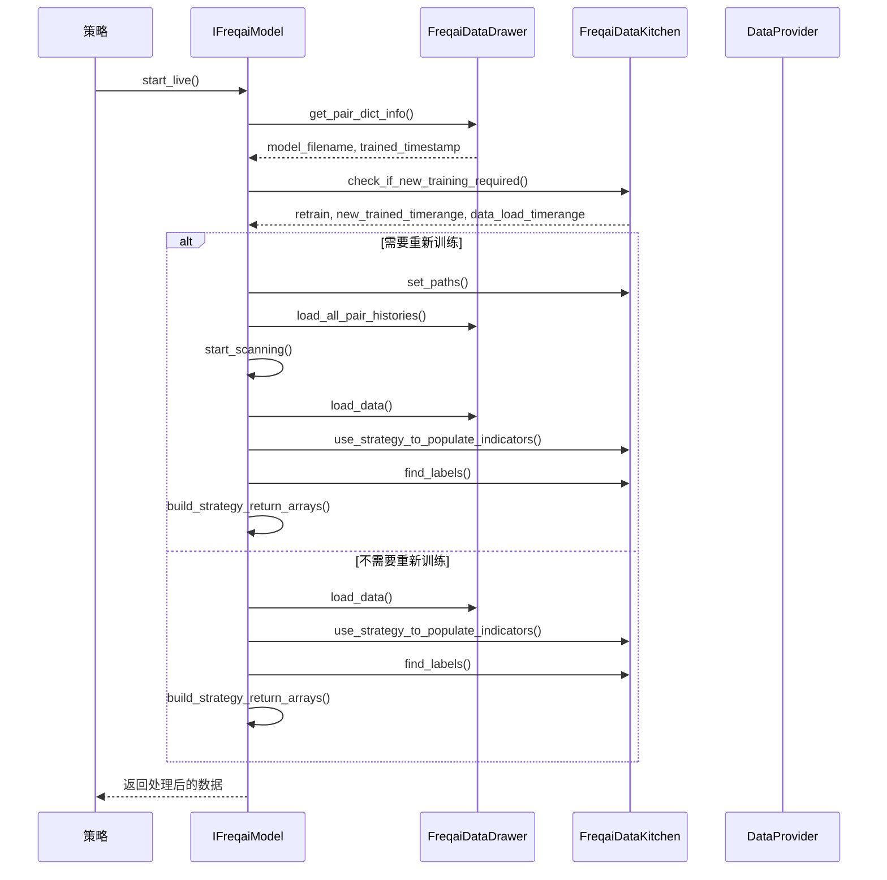

# 实盘模式训练流程

<cite>
**本文档引用的文件**   
- [freqai_interface.py](file://freqtrade/freqai/freqai_interface.py)
- [data_kitchen.py](file://freqtrade/freqai/data_kitchen.py)
- [data_drawer.py](file://freqtrade/freqai/data_drawer.py)
- [dataprovider.py](file://freqtrade/data/dataprovider.py)
- [interface.py](file://freqtrade/strategy/interface.py)
</cite>

## 目录
1. [引言](#引言)
2. [核心流程分析](#核心流程分析)
3. [实时扫描与重训练机制](#实时扫描与重训练机制)
4. [数据提取与模型训练](#数据提取与模型训练)
5. [持续学习与模型热更新](#持续学习与模型热更新)
6. [性能优化与异常处理](#性能优化与异常处理)
7. [结论](#结论)

## 引言
FreqAI是Freqtrade框架中的一个高级机器学习模块，专为加密货币交易策略设计。它通过在实盘模式下动态地重新训练模型来适应市场变化，从而提高预测的准确性。本文档旨在深入解析FreqAI在实盘模式下的模型训练流程，以`start_live`方法为核心，详细说明实时扫描重训练机制、增量训练、模型热更新和持续学习（continual_learning）的实现方式，并结合DataProvider组件探讨如何在保证交易实时性的同时完成模型重训练。

## 核心流程分析

FreqAI在实盘模式下的核心流程始于`start_live`方法，该方法负责检查是否需要重新训练模型，并在必要时执行重新训练和重置模型的操作。整个过程涉及多个关键组件，包括`FreqaiDataDrawer`、`FreqaiDataKitchen`和`DataProvider`，它们共同协作以确保模型能够及时更新并保持高性能。



**Diagram sources**
- [freqai_interface.py](file://freqtrade/freqai/freqai_interface.py#L401-L468)
- [data_kitchen.py](file://freqtrade/freqai/data_kitchen.py#L535-L587)
- [data_drawer.py](file://freqtrade/freqai/data_drawer.py#L45-L764)
- [dataprovider.py](file://freqtrade/data/dataprovider.py#L38-L621)

**Section sources**
- [freqai_interface.py](file://freqtrade/freqai/freqai_interface.py#L401-L468)
- [data_kitchen.py](file://freqtrade/freqai/data_kitchen.py#L535-L587)
- [data_drawer.py](file://freqtrade/freqai/data_drawer.py#L45-L764)
- [dataprovider.py](file://freqtrade/data/dataprovider.py#L38-L621)

## 实时扫描与重训练机制

### 重新训练条件判断

`check_if_new_training_required`方法是实时扫描与重训练机制的核心，它决定了何时需要重新训练模型。此方法通过比较当前时间与上次训练的时间戳来判断是否超过了用户设定的`live_retrain_hours`。如果超过了这个时间间隔，则返回`True`表示需要重新训练。

```python
def check_if_new_training_required(
    self, trained_timestamp: int
) -> tuple[bool, TimeRange, TimeRange]:
    time = datetime.now(tz=UTC).timestamp()
    trained_timerange = TimeRange()
    data_load_timerange = TimeRange()

    timeframes = self.freqai_config["feature_parameters"].get("include_timeframes")

    max_tf_seconds = 0
    for tf in timeframes:
        secs = timeframe_to_seconds(tf)
        if secs > max_tf_seconds:
            max_tf_seconds = secs

    # We notice that users like to use exotic indicators where
    # they do not know the required timeperiod. Here we include a factor
    # of safety by multiplying the user considered "max" by 2.
    max_period = self.config.get("startup_candle_count", 20) * 2
    additional_seconds = max_period * max_tf_seconds

    if trained_timestamp != 0:
        elapsed_time = (time - trained_timestamp) / SECONDS_IN_HOUR
        retrain = elapsed_time > self.freqai_config.get("live_retrain_hours", 0)
        if retrain:
            trained_timerange.startts = int(
                time - self.freqai_config.get("train_period_days", 0) * SECONDS_IN_DAY
            )
            trained_timerange.stopts = int(time)
            # we want to load/populate indicators on more data than we plan to train on so
            # because most of the indicators have a rolling timeperiod, and are thus NaNs
            # unless they have data further back in time before the start of the train period
            data_load_timerange.startts = int(
                time
                - self.freqai_config.get("train_period_days", 0) * SECONDS_IN_DAY
                - additional_seconds
            )
            data_load_timerange.stopts = int(time)
    else:  # user passed no live_trained_timerange in config
        trained_timerange.startts = int(
            time - self.freqai_config.get("train_period_days", 0) * SECONDS_IN_DAY
        )
        trained_timerange.stopts = int(time)

        data_load_timerange.startts = int(
            time
            - self.freqai_config.get("train_period_days", 0) * SECONDS_IN_DAY
            - additional_seconds
        )
        data_load_timerange.stopts = int(time)
        retrain = True

    return retrain, trained_timerange, data_load_timerange
```

**Section sources**
- [data_kitchen.py](file://freqtrade/freqai/data_kitchen.py#L535-L587)

### _scanning线程工作原理

`_start_scanning`方法在一个独立的线程中运行，持续监控各个交易对是否需要重新训练。当检测到某个交易对需要重新训练时，它会调用`extract_data_and_train_model`方法进行数据提取和模型训练。

```python
def _start_scanning(self, strategy: IStrategy) -> None:
    """
    Function designed to constantly scan pairs for retraining on a separate thread (intracandle)
    to improve model youth. This function is agnostic to data preparation/collection/storage,
    it simply trains on what ever data is available in the self.dd.
    :param strategy: IStrategy = The user defined strategy class
    """
    while not self._stop_event.is_set():
        time.sleep(1)
        pair = self.train_queue[0]

        # ensure pair is available in dp
        if pair not in strategy.dp.current_whitelist():
            self.train_queue.popleft()
            logger.warning(f"{pair} not in current whitelist, removing from train queue.")
            continue

        (_, trained_timestamp) = self.dd.get_pair_dict_info(pair)

        dk = FreqaiDataKitchen(self.config, self.live, pair)
        (
            retrain,
            new_trained_timerange,
            data_load_timerange,
        ) = dk.check_if_new_training_required(trained_timestamp)

        if retrain:
            self.train_timer("start")
            dk.set_paths(pair, new_trained_timerange.stopts)
            try:
                self.extract_data_and_train_model(
                    new_trained_timerange, pair, strategy, dk, data_load_timerange
                )
            except Exception as msg:
                logger.exception(
                    f"Training {pair} raised exception {msg.__class__.__name__}. "
                    f"Message: {msg}, skipping."
                )

            self.train_timer("stop", pair)

            # only rotate the queue after the first has been trained.
            self.train_queue.rotate(-1)

            self.dd.save_historic_predictions_to_disk()
            if self.freqai_info.get("write_metrics_to_disk", False):
                self.dd.save_metric_tracker_to_disk()
```

**Section sources**
- [freqai_interface.py](file://freqtrade/freqai/freqai_interface.py#L220-L266)

## 数据提取与模型训练

### extract_data_and_train_model方法

`extract_data_and_train_model`方法负责从数据提供者获取数据，填充特征，训练模型，并保存训练结果。该方法首先从`FreqaiDataDrawer`获取基础和相关数据帧，然后使用策略填充指标，最后调用`train`方法进行模型训练。

```python
def extract_data_and_train_model(
    self,
    new_trained_timerange: TimeRange,
    pair: str,
    strategy: IStrategy,
    dk: FreqaiDataKitchen,
    data_load_timerange: TimeRange,
):
    """
    Retrieve data and train model.
    :param new_trained_timerange: TimeRange = the timerange to train the model on
    :param metadata: dict = strategy provided metadata
    :param strategy: IStrategy = user defined strategy object
    :param dk: FreqaiDataKitchen = non-persistent data container for current coin/loop
    :param data_load_timerange: TimeRange = the amount of data to be loaded
                                for populating indicators
                                (larger than new_trained_timerange so that
                                new_trained_timerange does not contain any NaNs)
    """

    corr_dataframes, base_dataframes = self.dd.get_base_and_corr_dataframes(
        data_load_timerange, pair, dk
    )

    unfiltered_dataframe = dk.use_strategy_to_populate_indicators(
        strategy, corr_dataframes=corr_dataframes, base_dataframes=base_dataframes, pair=pair
    )

    trained_timestamp = new_trained_timerange.stopts

    buffered_timerange = dk.buffer_timerange(new_trained_timerange)

    unfiltered_dataframe = dk.slice_dataframe(buffered_timerange, unfiltered_dataframe)

    # find the features indicated by strategy and store in datakitchen
    dk.find_features(unfiltered_dataframe)
    dk.find_labels(unfiltered_dataframe)

    self.tb_logger = get_tb_logger(self.dd.model_type, dk.data_path, self.activate_tensorboard)
    model = self.train(unfiltered_dataframe, pair, dk)
    self.tb_logger.close()

    self.dd.pair_dict[pair]["trained_timestamp"] = trained_timestamp
    dk.set_new_model_names(pair, trained_timestamp)
    self.dd.save_data(model, pair, dk)

    if self.plot_features:
        plot_feature_importance(model, pair, dk, self.plot_features)

    self.dd.purge_old_models()
```

**Section sources**
- [freqai_interface.py](file://freqtrade/freqai/freqai_interface.py#L590-L639)

### DataProvider组件的作用

`DataProvider`组件在数据提取过程中起着至关重要的作用。它负责从交易所获取历史数据，并将其提供给`FreqaiDataKitchen`用于填充指标和训练模型。`DataProvider`还支持外部消息消费者，允许从外部源获取数据。

```python
class DataProvider:
    def __init__(
        self,
        config: Config,
        exchange: Exchange | None,
        pairlists=None,
        rpc: RPCManager | None = None,
    ) -> None:
        self._config = config
        self._exchange = exchange
        self._pairlists = pairlists
        self.__rpc = rpc
        self.__cached_pairs: dict[PairWithTimeframe, tuple[DataFrame, datetime]] = {}
        self.__slice_index: dict[str, int] = {}
        self.__slice_date: datetime | None = None

        self.__cached_pairs_backtesting: dict[PairWithTimeframe, DataFrame] = {}
        self.__producer_pairs_df: dict[
            str, dict[PairWithTimeframe, tuple[DataFrame, datetime]]
        ] = {}
        self.__producer_pairs: dict[str, list[str]] = {}
        self._msg_queue: deque = deque()

        self._default_candle_type = self._config.get("candle_type_def", CandleType.SPOT)
        self._default_timeframe = self._config.get("timeframe", "1h")

        self.__msg_cache = PeriodicCache(
            maxsize=1000, ttl=timeframe_to_seconds(self._default_timeframe)
        )

        self.producers = self._config.get("external_message_consumer", {}).get("producers", [])
        self.external_data_enabled = len(self.producers) > 0
```

**Section sources**
- [dataprovider.py](file://freqtrade/data/dataprovider.py#L38-L621)

## 持续学习与模型热更新

### 增量训练

增量训练是指在已有模型的基础上继续训练，而不是从头开始训练。这有助于保持模型的连续性和稳定性。FreqAI通过`continual_learning`参数控制是否启用增量训练。

```python
def get_init_model(self, pair: str) -> Any:
    if pair not in self.dd.model_dictionary or not self.continual_learning:
        init_model = None
    else:
        init_model = self.dd.model_dictionary[pair]
        # Set "fresh" tb_logger - the one in model_dictionary has the writer closed.
        init_model.tb_logger = self.tb_logger

    return init_model
```

**Section sources**
- [freqai_interface.py](file://freqtrade/freqai/freqai_interface.py#L755-L763)

### 模型热更新

模型热更新是指在不中断交易的情况下更新模型。FreqAI通过将新训练的模型加载到内存中，并在下一个周期使用新模型来进行预测，从而实现模型热更新。

```python
def build_strategy_return_arrays(
    self, dataframe: DataFrame, dk: FreqaiDataKitchen, pair: str, trained_timestamp: int
) -> None:
    # hold the historical predictions in memory so we are sending back
    # correct array to strategy

    if pair not in self.dd.model_return_values:
        # first predictions are made on entire historical candle set coming from strategy. This
        # allows FreqUI to show full return values.
        pred_df, do_preds = self.predict(dataframe, dk)
        if pair not in self.dd.historic_predictions:
            self.set_initial_historic_predictions(pred_df, dk, pair, dataframe)
        self.dd.set_initial_return_values(pair, pred_df, dataframe)

        dk.return_dataframe = self.dd.attach_return_values_to_return_dataframe(pair, dataframe)
        return
    elif self.dk.check_if_model_expired(trained_timestamp):
        pred_df = DataFrame(np.zeros((2, len(dk.label_list))), columns=dk.label_list)
        do_preds = np.ones(2, dtype=np.int_) * 2
        dk.DI_values = np.zeros(2)
        logger.warning(
            f"Model expired for {pair}, returning null values to strategy. Strategy "
            "construction should take care to consider this event with "
            "prediction == 0 and do_predict == 2"
        )
    else:
        # remaining predictions are made only on the most recent candles for performance and
        # historical accuracy reasons.
        pred_df, do_preds = self.predict(dataframe.iloc[-self.CONV_WIDTH :], dk, first=False)

    if self.freqai_info.get("fit_live_predictions_candles", 0) and self.live:
        self.fit_live_predictions(dk, pair)
    self.dd.append_model_predictions(pair, pred_df, do_preds, dk, dataframe)
    dk.return_dataframe = self.dd.attach_return_values_to_return_dataframe(pair, dataframe)

    return
```

**Section sources**
- [freqai_interface.py](file://freqtrade/freqai/freqai_interface.py#L470-L505)

## 性能优化与异常处理

### 性能优化

为了提高性能，FreqAI采用了多种优化措施，包括多线程处理、数据缓存和异步操作。例如，`_start_scanning`方法在一个独立的线程中运行，避免了阻塞主交易循环。

```python
def start_scanning(self, *args, **kwargs) -> None:
    """
    Start `self._start_scanning` in a separate thread
    """
    _thread = threading.Thread(target=self._start_scanning, args=args, kwargs=kwargs)
    self._threads.append(_thread)
    _thread.start()
```

**Section sources**
- [freqai_interface.py](file://freqtrade/freqai/freqai_interface.py#L212-L218)

### 异常处理

FreqAI在训练和预测过程中加入了详细的异常处理机制，确保即使在出现错误的情况下也能继续运行。例如，在`_start_scanning`方法中，如果训练过程中发生异常，会记录日志并跳过当前交易对。

```python
try:
    self.extract_data_and_train_model(
        new_trained_timerange, pair, strategy, dk, data_load_timerange
    )
except Exception as msg:
    logger.exception(
        f"Training {pair} raised exception {msg.__class__.__name__}. "
        f"Message: {msg}, skipping."
    )
```

**Section sources**
- [freqai_interface.py](file://freqtrade/freqai/freqai_interface.py#L220-L266)

## 结论

FreqAI在实盘模式下的模型训练流程是一个复杂而高效的过程，涉及多个组件的协同工作。通过`start_live`方法启动，利用`check_if_new_training_required`判断是否需要重新训练，`_start_scanning`线程实现实时扫描，`extract_data_and_train_model`方法完成数据提取和模型训练，以及`DataProvider`组件提供数据支持。此外，通过增量训练和模型热更新实现了持续学习，同时通过多线程处理和异常处理机制保证了系统的稳定性和性能。这些特性使得FreqAI能够在动态变化的市场环境中保持高精度的预测能力。