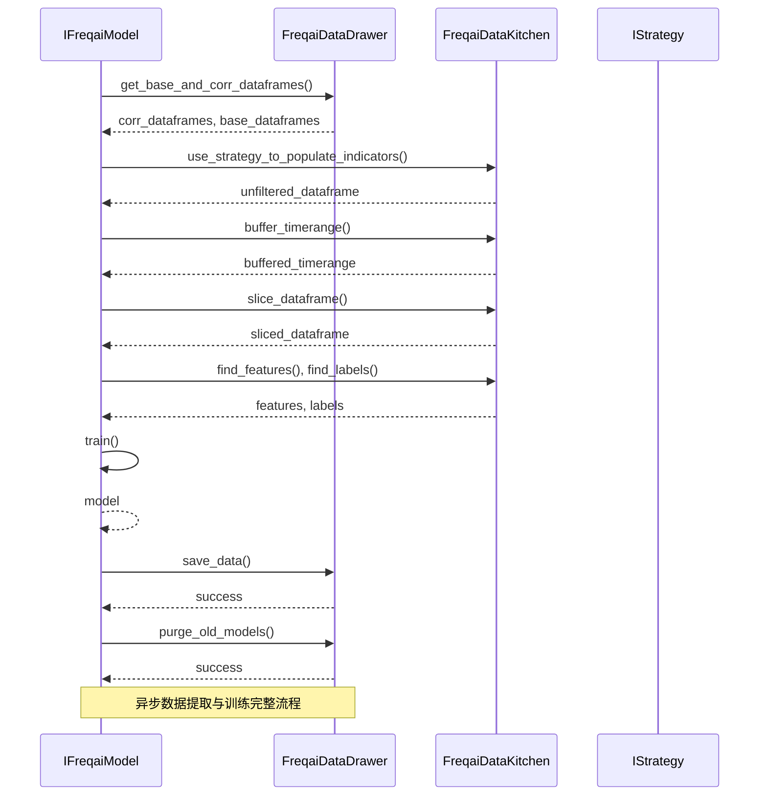
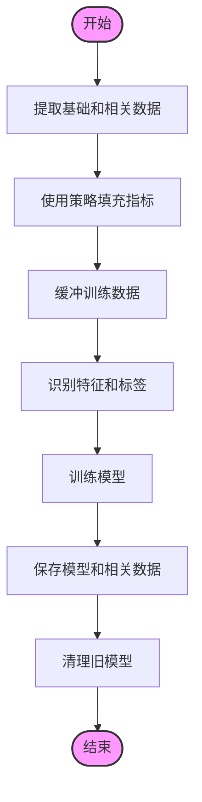

# 异步数据提取与训练

<cite>
**本文档引用的文件 **  
- [freqai_interface.py](file://freqtrade/freqai/freqai_interface.py)
- [data_drawer.py](file://freqtrade/freqai/data_drawer.py)
- [data_kitchen.py](file://freqtrade/freqai/data_kitchen.py)
- [dataprovider.py](file://freqtrade/data/dataprovider.py)
</cite>

## 目录
1. [简介](#简介)
2. [异步数据提取与训练流程](#异步数据提取与训练流程)
3. [数据获取与指标填充](#数据获取与指标填充)
4. [特征工程与数据缓冲](#特征工程与数据缓冲)
5. [模型训练与生命周期管理](#模型训练与生命周期管理)
6. [高并发场景下的性能分析](#高并发场景下的性能分析)
7. [结论](#结论)

## 简介
本文档深入解析Freqtrade框架中`extract_data_and_train_model`方法的异步处理流程。该方法是FreqAI模块的核心，负责在交易策略中实现数据提取、特征工程、模型训练和预测的完整闭环。文档将详细阐述数据提取、特征工程、模型训练与保存的完整生命周期，并结合DataProvider组件分析高并发场景下的性能瓶颈与优化策略。

## 异步数据提取与训练流程

`extract_data_and_train_model`方法是FreqAI模块中负责数据提取与模型训练的核心入口。该方法在异步环境中执行，确保在不影响交易策略主循环的情况下完成模型的重新训练。其主要职责包括：从历史数据中提取基础和相关数据对、通过策略填充指标、对训练数据进行缓冲处理、执行特征工程、训练模型、保存模型以及清理旧模型。

该方法的执行流程体现了典型的机器学习工作流，从数据准备到模型部署，每一步都经过精心设计以确保模型的准确性和实时性。通过异步处理，该方法能够在后台持续监控模型的有效性，并在必要时触发重新训练，从而保持模型的时效性和预测能力。

**图表来源**
- [freqai_interface.py](file://freqtrade/freqai/freqai_interface.py#L590-L639)
- [data_drawer.py](file://freqtrade/freqai/data_drawer.py#L706-L736)
- [data_kitchen.py](file://freqtrade/freqai/data_kitchen.py#L777-L865)

**章节来源**
- [freqai_interface.py](file://freqtrade/freqai/freqai_interface.py#L590-L639)

## 数据获取与指标填充

### 基础与相关数据对的获取
`get_base_and_corr_dataframes`方法负责从内存中的历史数据中检索与当前交易对相关的数据框。该方法首先获取用户配置中指定的时间框架和相关交易对列表，然后遍历这些时间框架，为当前交易对（基础数据）和相关交易对（相关数据）分别提取数据。基础数据框包含当前交易对在所有指定时间框架下的OHLCV数据，而相关数据框则包含配置中指定的相关交易对的数据，用于捕捉市场间的相关性。

该方法通过`historic_data`字典访问所有交易对的历史数据，并使用`slice_dataframe`方法根据指定的时间范围进行切片。通过这种方式，FreqAI能够高效地复用已加载的数据，避免了重复的I/O操作，显著提升了数据准备的效率。

**章节来源**
- [data_drawer.py](file://freqtrade/freqai/data_drawer.py#L706-L736)

### 指标填充的作用
`use_strategy_to_populate_indicators`方法利用用户定义的策略来填充指标。该方法接收策略对象、基础数据框和相关数据框作为输入，调用策略中的`feature_engineering_*`系列方法来计算技术指标。这些指标是模型训练的输入特征，其质量和多样性直接影响模型的预测性能。

该方法首先检查用户是否使用了已弃用的`populate_any_indicators`函数，以确保代码的兼容性。然后，它遍历所有指定的时间框架，调用策略的`feature_engineering_standard`和`feature_engineering_expand_*`方法来填充标准特征和扩展特征。对于相关交易对，该方法会确保它们的指标在最后被填充，以避免特征命名冲突。最终，该方法返回一个包含所有填充指标的完整数据框。

**章节来源**
- [data_kitchen.py](file://freqtrade/freqai/data_kitchen.py#L777-L865)

## 特征工程与数据缓冲

### 训练数据的缓冲处理机制
`buffer_timerange`方法用于缓冲训练时间范围的开始和结束时间。这一机制主要用于处理那些在时间序列边缘无法准确计算的指标，例如使用`argrelextrema`函数寻找局部极值。通过在训练时间范围的前后各增加一个缓冲区（由`buffer_train_data_candles`参数指定），模型可以在一个更完整的时间序列上进行训练，从而提高预测的准确性。

缓冲区的大小以K线数量表示，方法会将其转换为秒数，并相应地调整时间范围的开始和结束时间戳。需要注意的是，如果目标是预测价格变动，由于未来的价格数据为NaN，模型会自动忽略这些边缘数据，因此缓冲机制在这种情况下不是必需的。

**章节来源**
- [data_kitchen.py](file://freqtrade/freqai/data_kitchen.py#L980-L1000)

### 特征工程中的职责
`find_features`和`find_labels`方法是特征工程中的关键步骤，负责从策略提供的数据框中识别出特征和标签。

`find_features`方法通过遍历数据框的列名，筛选出所有以`%`符号开头的列，这些列即为模型训练所需的特征。特征通常是由策略中的`feature_engineering_*`方法生成的技术指标。如果未找到任何特征，该方法会抛出异常，提示用户检查策略配置。

`find_labels`方法则负责识别标签，即模型需要预测的目标变量。它通过筛选出所有以`&`符号开头的列来实现。标签通常是由策略中的`set_freqai_targets`方法定义的，例如未来的价格变动方向或幅度。

这两个方法将识别出的特征和标签列表存储在`FreqaiDataKitchen`对象中，供后续的模型训练和预测使用。

**章节来源**
- [data_kitchen.py](file://freqtrade/freqai/data_kitchen.py#L394-L412)

## 模型训练与生命周期管理

### 模型训练、保存与清理
`extract_data_and_train_model`方法在完成数据准备和特征工程后，进入模型训练阶段。它首先调用`train`方法，使用经过缓冲和切片的`unfiltered_dataframe`来训练模型。训练完成后，模型会被传递给`save_data`方法进行持久化存储。

`save_data`方法负责保存与模型相关的所有数据，包括模型文件本身、特征和标签的预处理管道（pipeline）、训练数据以及元数据。根据配置中指定的`model_type`，模型文件会被保存为不同的格式，如`joblib`、`keras`或`pytorch`。同时，相关的管道和元数据也会被序列化并保存到磁盘，确保模型在加载时能够恢复完整的训练状态。

为了防止磁盘空间被过多的旧模型占用，`purge_old_models`方法会在每次训练后被调用。该方法根据配置中的`purge_old_models`参数，保留指定数量的最新模型，其余的旧模型文件夹将被删除。这一机制确保了模型版本的管理，同时避免了存储空间的无限增长。

**图表来源**
- [freqai_interface.py](file://freqtrade/freqai/freqai_interface.py#L590-L639)
- [data_drawer.py](file://freqtrade/freqai/data_drawer.py#L503-L559)
- [data_drawer.py](file://freqtrade/freqai/data_drawer.py#L439-L479)

**章节来源**
- [data_drawer.py](file://freqtrade/freqai/data_drawer.py#L503-L559)
- [data_drawer.py](file://freqtrade/freqai/data_drawer.py#L439-L479)

## 高并发场景下的性能分析

### DataProvider组件的性能瓶颈
在高并发场景下，`DataProvider`组件可能成为性能瓶颈。`DataProvider`负责为策略提供实时和历史的市场数据，包括OHLCV数据、订单簿和交易数据。在`extract_data_and_train_model`的异步流程中，`DataProvider`被频繁调用以获取相关交易对的数据。

主要的性能瓶颈体现在以下几个方面：
1.  **I/O密集型操作**：`get_pair_dataframe`方法在实时模式下会直接从交易所API获取数据，这是一个网络I/O密集型操作。在高并发情况下，大量的API请求可能导致网络延迟增加，甚至触发交易所的速率限制。
2.  **内存占用**：`DataProvider`会缓存已获取的数据以提高效率。然而，在交易对数量众多且时间框架较细的情况下，缓存会占用大量内存，可能导致内存压力。
3.  **数据同步**：在异步训练过程中，`DataProvider`需要确保提供给`use_strategy_to_populate_indicators`的数据是最新的。如果数据同步机制不够高效，可能会导致模型使用过时的数据进行训练。

### 优化策略
针对上述性能瓶颈，可以采取以下优化策略：
1.  **数据预加载与缓存**：利用`FreqaiDataDrawer`的`load_all_pair_histories`方法，在启动时预先加载所有交易对的历史数据到内存中。这可以避免在每次训练时都进行I/O操作，显著提升数据获取速度。
2.  **减少相关交易对数量**：合理配置`include_corr_pairlist`，避免引入过多的相关交易对。每个相关交易对都会增加数据获取和处理的开销。
3.  **优化数据获取频率**：调整`live_retrain_hours`参数，避免过于频繁的模型重训练，从而减少对`DataProvider`的调用频率。
4.  **使用高性能数据格式**：配置`dataformat_ohlcv`为`parquet`等高性能格式，可以加快历史数据的读取速度。

通过这些优化策略，可以有效缓解`DataProvider`在高并发场景下的性能压力，确保异步训练流程的稳定和高效。

**章节来源**
- [dataprovider.py](file://freqtrade/data/dataprovider.py#L38-L621)

## 结论
`extract_data_and_train_model`方法通过一个精心设计的异步流程，实现了从数据提取到模型部署的完整闭环。该流程高效地整合了`FreqaiDataDrawer`、`FreqaiDataKitchen`和`IStrategy`等多个组件，确保了模型训练的准确性和实时性。通过对基础和相关数据的获取、指标填充、数据缓冲和特征工程，该方法为模型提供了高质量的训练数据。模型的保存和旧模型清理机制则保证了模型版本的有序管理和存储空间的合理利用。在高并发场景下，虽然`DataProvider`可能成为性能瓶颈，但通过数据预加载、合理配置和优化数据格式等策略，可以有效提升系统的整体性能。这一设计充分体现了Freqtrade框架在自动化机器学习交易中的先进性和实用性。