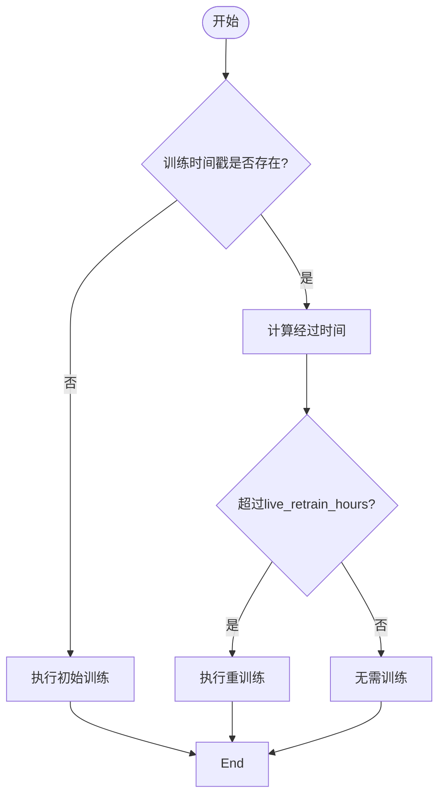

# 重新训练条件判断

<cite>
**Referenced Files in This Document**   
- [data_kitchen.py](file://freqtrade/freqai/data_kitchen.py#L535-L587)
- [freqai_interface.py](file://freqtrade/freqai/freqai_interface.py#L300-L330)
- [config_freqai.example.json](file://config_examples/config_freqai.example.json#L52-L54)
- [schema.json](file://build_helpers/schema.json#L1410-L1420)
</cite>

## 目录
1. [方法实现逻辑](#方法实现逻辑)
2. [配置参数说明](#配置参数说明)
3. [时间戳与时间范围管理](#时间戳与时间范围管理)
4. [安全因子机制](#安全因子机制)
5. [处理流程分析](#处理流程分析)
6. [配置调优建议](#配置调优建议)
7. [常见问题排查](#常见问题排查)

## 方法实现逻辑

`check_if_new_training_required` 方法是 FreqAI 模块中用于判断是否需要重新训练模型的核心逻辑。该方法通过比较当前时间与上次训练时间戳的间隔，结合配置参数来决定是否触发重新训练。

方法首先获取当前时间戳，并从配置中获取所有使用的时间框架（timeframes）。然后计算这些时间框架中的最大时间间隔（以秒为单位），这是为了确保数据加载范围能够覆盖最长时间框架的需求。

当存在有效的训练时间戳（即 `trained_timestamp != 0`）时，方法计算自上次训练以来经过的时间（以小时为单位），并与配置中的 `live_retrain_hours` 参数进行比较。如果经过的时间超过了设定的阈值，则返回需要重新训练的标志。

对于初始训练（即没有历史训练时间戳的情况），方法会直接返回需要训练的标志，并设置相应的训练时间范围。

**Section sources**
- [data_kitchen.py](file://freqtrade/freqai/data_kitchen.py#L535-L587)

## 配置参数说明

### live_retrain_hours 参数
`live_retrain_hours` 参数定义了模型在需要重新训练之前可以运行的最大小时数。这是一个关键的周期性重训练控制参数，用于确保模型能够定期更新以适应市场变化。

在配置文件中，该参数位于 `freqai` 配置块内，示例如下：
```json
"freqai": {
    "train_period_days": 15,
    "live_retrain_hours": 0,
    ...
}
```

当设置为 0 时，表示禁用周期性重训练功能。非零值则表示每隔指定小时数进行一次模型重训练。

### train_period_days 参数
`train_period_days` 参数指定了用于训练模型的历史数据天数。这个参数决定了模型训练时所使用的数据量，直接影响模型的学习能力和泛化性能。

该参数同样位于 `freqai` 配置块中，与 `live_retrain_hours` 配合使用，共同控制模型的训练策略。

**Section sources**
- [config_freqai.example.json](file://config_examples/config_freqai.example.json#L52-L54)
- [schema.json](file://build_helpers/schema.json#L1410-L1420)

## 时间戳与时间范围管理

### 训练时间戳管理
训练时间戳（`trained_timestamp`）是判断是否需要重新训练的关键依据。系统通过比较当前时间与该时间戳的差值来决定是否触发重训练。时间戳在每次成功完成训练后会被更新，存储在模型元数据中。

### 训练时间范围（trained_timerange）
训练时间范围是模型实际用于训练的数据时间窗口。其计算方式为：从当前时间向前推移 `train_period_days` 天。例如，如果当前时间为 T，`train_period_days` 为 15，则训练时间范围为 [T-15天, T]。

```mermaid
flowchart TD
A[当前时间 T] --> B[减去 train_period_days]
B --> C[得到训练开始时间]
C --> D[形成训练时间范围 [T-N天, T]]
```

### 数据加载时间范围（data_load_timerange）
数据加载时间范围比训练时间范围更宽，因为它需要额外的历史数据来填充指标的初始 NaN 值。其计算方式是在训练时间范围的基础上，向前扩展一个安全缓冲区。

缓冲区大小由最大时间框架和 `startup_candle_count` 参数共同决定，确保所有技术指标都能获得足够的历史数据来完成计算。

**Section sources**
- [data_kitchen.py](file://freqtrade/freqai/data_kitchen.py#L535-L587)

## 安全因子机制

`startup_candle_count` 安全因子是 FreqAI 设计中的一个重要保护机制。由于用户可能使用复杂或自定义的技术指标，而这些指标所需的历史数据长度往往难以准确预估。

系统通过以下方式实现安全保护：
1. 获取配置中的 `startup_candle_count` 值（默认为20）
2. 将该值乘以2作为安全系数
3. 与最大时间框架相乘，得到额外需要加载的数据时长

这种设计确保了即使对于需要大量历史数据的复杂指标，也能获得足够的数据来避免 NaN 值问题，从而保证模型训练的稳定性和可靠性。


**Section sources**
- [data_kitchen.py](file://freqtrade/freqai/data_kitchen.py#L560-L565)

## 处理流程分析

### 初始训练流程
当系统首次运行或没有找到历史训练记录时，会进入初始训练流程：
1. 设置训练时间范围为当前时间向前 `train_period_days` 天
2. 设置数据加载范围为训练时间范围再向前扩展安全缓冲区
3. 标记为需要训练状态
4. 执行完整的模型训练过程

### 周期性重训练流程
对于已有训练记录的周期性重训练：
1. 计算自上次训练以来的经过时间
2. 与 `live_retrain_hours` 配置值比较
3. 如果超过阈值，则执行与初始训练相同的准备流程
4. 更新训练时间戳并保存新模型

两种流程在数据准备阶段的逻辑基本相同，主要区别在于是否需要进行时间间隔判断。



**Section sources**
- [data_kitchen.py](file://freqtrade/freqai/data_kitchen.py#L535-L587)
- [freqai_interface.py](file://freqtrade/freqai/freqai_interface.py#L300-L330)

## 配置调优建议

1. **平衡训练频率与性能**：`live_retrain_hours` 值不宜过小，否则会导致频繁训练影响交易性能；也不宜过大，以免模型过时。建议根据市场波动性调整，高波动市场可设为4-8小时，低波动市场可设为12-24小时。

2. **合理设置训练数据量**：`train_period_days` 应根据策略特性设置。短期策略可设为7-15天，长期策略可设为30-60天。过长的数据可能导致模型对近期市场变化不敏感。

3. **监控资源消耗**：重训练会消耗大量计算资源，建议监控CPU和内存使用情况，必要时调整 `data_kitchen_thread_count` 参数。

4. **考虑市场周期**：可以将重训练周期与主要市场开盘时间对齐，如在主要交易所开盘前完成训练。

## 常见问题排查

1. **频繁触发重训练**：检查 `live_retrain_hours` 是否设置过小，或系统时间是否正确。

2. **训练数据不足**：确保有足够的历史数据可供下载，可通过 `freqtrade download-data` 命令预先下载。

3. **NaN 值问题**：如果出现大量 NaN 值，可能是 `startup_candle_count` 设置过小，建议适当增加该值。

4. **模型性能下降**：如果发现模型性能随时间下降，可尝试缩短 `live_retrain_hours` 值以提高更新频率。

5. **磁盘空间不足**：定期清理旧模型文件，通过设置 `purge_old_models` 参数控制保留的模型数量。