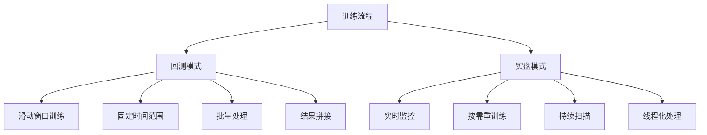
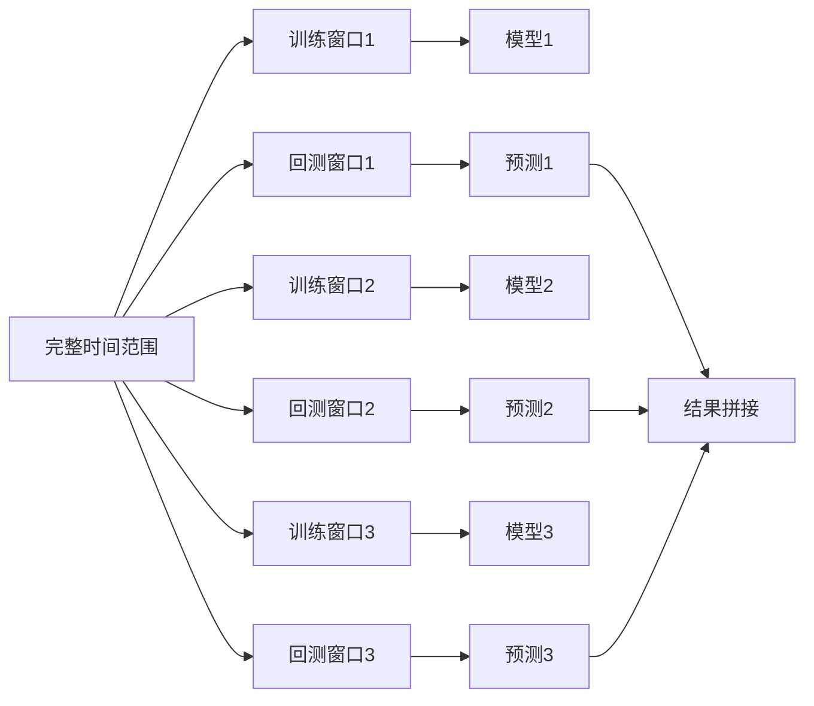
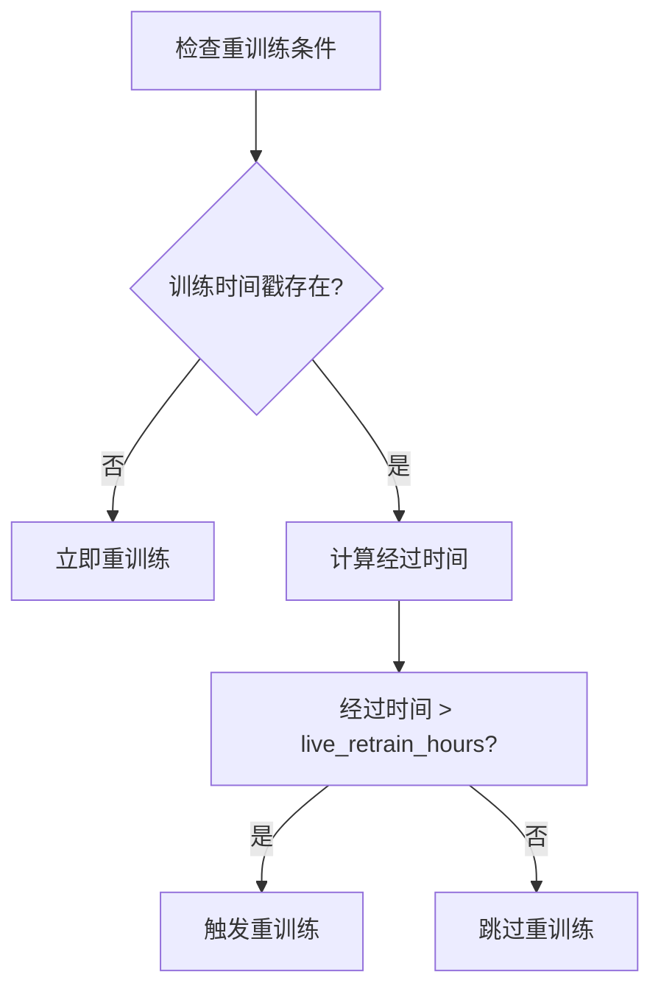
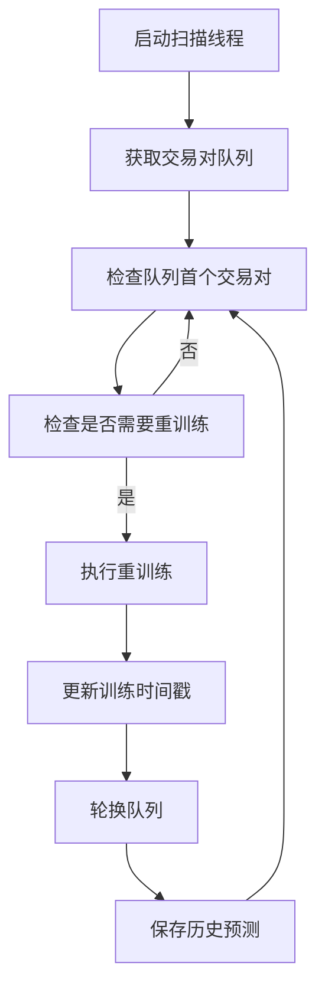
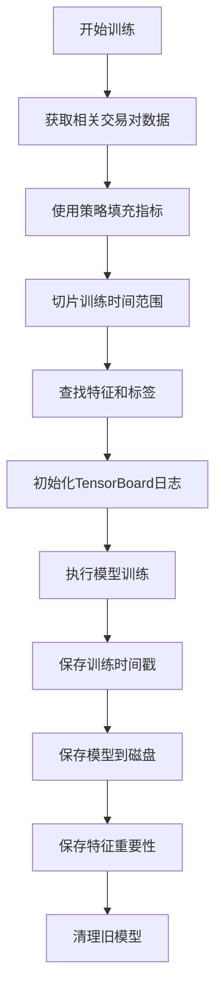
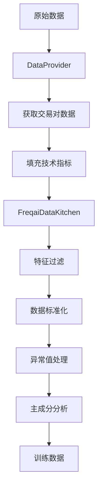
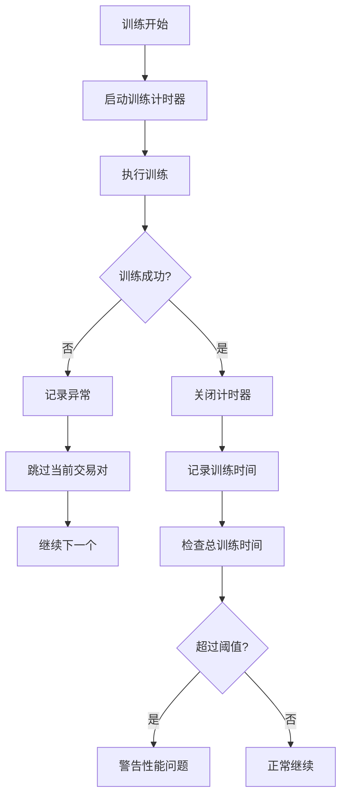
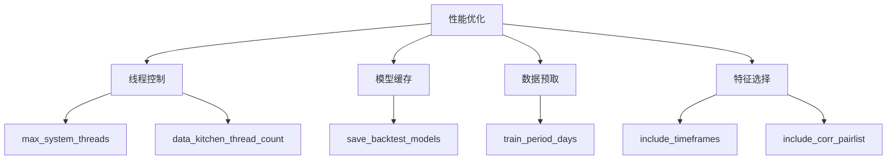

# 模型训练流程

<cite>
**本文档引用的文件**   
- [IFreqaiModel.py](file://freqtrade/freqai/freqai_interface.py)
- [FreqaiDataKitchen.py](file://freqtrade/freqai/data_kitchen.py)
- [BaseRegressionModel.py](file://freqtrade/freqai/base_models/BaseRegressionModel.py)
- [BaseClassifierModel.py](file://freqtrade/freqai/base_models/BaseClassifierModel.py)
- [dataprovider.py](file://freqtrade/data/dataprovider.py)
</cite>

## 目录
1. [训练流程概述](#训练流程概述)
2. [核心训练方法分析](#核心训练方法分析)
3. [回测与实盘模式差异](#回测与实盘模式差异)
4. [滑动窗口训练机制](#滑动窗口训练机制)
5. [训练周期控制](#训练周期控制)
6. [实时扫描重训练](#实时扫描重训练)
7. [数据提取与训练过程](#数据提取与训练过程)
8. [特征工程与数据预处理](#特征工程与数据预处理)
9. [时序控制与异常处理](#时序控制与异常处理)
10. [性能优化配置](#性能优化配置)

## 训练流程概述

FreqAI的模型训练流程以IFreqaiModel类为核心，通过start、start_backtesting和start_live三个主要方法实现。该流程结合了DataProvider和FreqaiDataKitchen组件，构建了一个完整的机器学习训练和预测系统。系统支持回测模式和实盘模式两种不同的训练策略，能够根据配置参数自动调整训练行为。训练流程包括数据提取、特征工程、模型训练、预测生成等多个阶段，每个阶段都经过精心设计以确保模型的准确性和实时性。

**Section sources**
- [IFreqaiModel.py](file://freqtrade/freqai/freqai_interface.py#L129-L171)

## 核心训练方法分析

### start方法

start方法是FreqAI模型的入口点，根据运行模式决定调用start_backtesting还是start_live方法。该方法首先初始化数据提供者和数据厨房组件，然后根据运行模式选择相应的训练策略。在实盘模式下，会启动推理计时器来监控性能；在回测模式下，会根据配置决定是否使用历史预测模型。

### start_backtesting方法

start_backtesting方法实现了回测模式下的滑动窗口训练机制。该方法遍历预定义的训练和回测时间范围，对每个时间窗口进行独立的模型训练和预测。训练数据和回测数据的划分由配置文件中的train_period_days和backtest_period_days参数控制。该方法还负责处理模型存在性检查、特征列表验证和预测结果的拼接。

### start_live方法

start_live方法处理实盘模式下的模型训练和预测。该方法首先检查是否需要重新训练模型，然后加载必要的历史数据。如果尚未启动扫描线程，它会启动一个独立的线程来持续监控模型重训练需求。该方法还负责处理相关交易对数据的缓存，以提高多交易对处理的性能。

**Section sources**
- [IFreqaiModel.py](file://freqtrade/freqai/freqai_interface.py#L129-L171)
- [IFreqaiModel.py](file://freqtrade/freqai/freqai_interface.py#L268-L399)
- [IFreqaiModel.py](file://freqtrade/freqai/freqai_interface.py#L401-L468)

## 回测与实盘模式差异

**Diagram sources**
- [IFreqaiModel.py](file://freqtrade/freqai/freqai_interface.py#L268-L399)
- [IFreqaiModel.py](file://freqtrade/freqai/freqai_interface.py#L401-L468)

回测模式和实盘模式在训练流程上存在显著差异。回测模式采用滑动窗口方法，将整个回测期划分为多个连续的训练-回测窗口，对每个窗口独立训练模型并生成预测，最后将所有预测结果拼接成完整的回测结果。这种模式适合历史数据的全面分析和策略验证。

实盘模式则采用实时监控和按需重训练的策略。系统持续监控市场数据，当满足重训练条件时（如经过指定的retrain_hours），启动模型重训练。这种模式通过start_scanning方法在独立线程中运行，确保主交易循环不受训练过程影响，保证了系统的实时性和响应速度。

## 滑动窗口训练机制

**Diagram sources**
- [IFreqaiModel.py](file://freqtrade/freqai/freqai_interface.py#L268-L399)

滑动窗口训练机制是FreqAI回测模式的核心。该机制将整个回测期划分为一系列连续的训练窗口和回测窗口。对于每个窗口组合：
1. 使用训练窗口的数据训练模型
2. 使用回测窗口的数据进行预测
3. 将预测结果保存
4. 窗口向前滑动，重复上述过程

这种机制确保了模型始终使用最新的历史数据进行训练，同时避免了未来数据泄露问题。训练窗口的大小由train_period_days参数控制，回测窗口的大小由backtest_period_days参数控制。通过这种方式，系统能够模拟真实交易环境中的模型更新过程。

## 训练周期控制

训练周期控制通过check_if_new_training_required方法实现，该方法判断是否需要重新训练模型。触发条件包括：

**Diagram sources**
- [FreqaiDataKitchen.py](file://freqtrade/freqai/data_kitchen.py#L535-L587)

具体判断逻辑如下：
- 如果没有历史训练时间戳，则立即触发重训练
- 如果有历史训练时间戳，则计算距离上次训练的经过时间
- 如果经过时间超过配置的live_retrain_hours，则触发重训练
- 否则跳过重训练，使用现有模型进行预测

这种方法确保了模型的新鲜度，同时避免了过于频繁的重训练导致的性能问题。用户可以通过调整live_retrain_hours参数来平衡模型更新频率和系统性能。

## 实时扫描重训练

实时扫描重训练功能通过独立线程实现，确保不影响主交易循环的性能。其工作流程如下：

**Diagram sources**
- [IFreqaiModel.py](file://freqtrade/freqai/freqai_interface.py#L212-L218)
- [IFreqaiModel.py](file://freqtrade/freqai/freqai_interface.py#L220-L266)

该功能的关键特点包括：
- 在独立线程中运行，避免阻塞主交易循环
- 维护一个训练队列，按照训练时间戳排序
- 优先训练最久未更新的模型
- 训练完成后轮换队列，确保所有交易对都能得到及时更新
- 支持优雅关闭，确保训练过程完整结束

## 数据提取与训练过程

extract_data_and_train_model方法负责完整的数据提取和模型训练过程：

**Diagram sources**
- [IFreqaiModel.py](file://freqtrade/freqai/freqai_interface.py#L590-L639)

该过程的详细步骤包括：
1. 从数据提供者获取基础数据和相关交易对数据
2. 使用策略的feature_engineering_*方法填充技术指标
3. 根据训练时间范围切片数据
4. 识别特征列（以%开头）和标签列（以&开头）
5. 初始化TensorBoard日志记录器（如果启用）
6. 调用train方法执行模型训练
7. 更新交易对字典中的训练时间戳
8. 保存模型、元数据和特征重要性到磁盘
9. 清理过期的旧模型以节省存储空间

## 特征工程与数据预处理

特征工程和数据预处理通过FreqaiDataKitchen和DataProvider组件协同完成：

**Diagram sources**
- [FreqaiDataKitchen.py](file://freqtrade/freqai/data_kitchen.py#L535-L587)
- [dataprovider.py](file://freqtrade/data/dataprovider.py#L0-L622)

具体流程包括：
- DataProvider负责从交易所获取原始OHLCV数据
- 使用策略的feature_engineering_*方法计算技术指标
- FreqaiDataKitchen负责特征过滤，只保留以%开头的特征列
- 数据预处理管道包括标准化、异常值检测、主成分分析等步骤
- define_data_pipeline方法配置预处理步骤，支持SVM、DBSCAN等异常值移除方法
- DI_threshold参数控制差异性指数，用于识别模型不确定的预测

## 时序控制与异常处理

时序控制和异常处理机制确保训练过程的稳定性和可靠性：

**Diagram sources**
- [IFreqaiModel.py](file://freqtrade/freqai/freqai_interface.py#L734-L753)
- [IFreqaiModel.py](file://freqtrade/freqai/freqai_interface.py#L711-L732)

关键机制包括：
- train_timer和inference_timer分别监控训练和推理时间
- 异常捕获机制确保单个交易对的训练失败不会影响整体流程
- 性能监控警告当训练时间过长时可能影响交易执行
- 线程安全的关闭机制确保资源正确释放
- 历史预测保存确保模型状态的持久化

## 性能优化配置

通过配置参数可以优化训练性能：

**Diagram sources**
- [IFreqaiModel.py](file://freqtrade/freqai/freqai_interface.py#L109-L109)
- [IFreqaiModel.py](file://freqtrade/freqai/freqai_interface.py#L72-L72)

主要优化参数包括：
- max_system_threads：控制系统使用的最大线程数
- data_kitchen_thread_count：设置数据处理线程数
- save_backtest_models：控制是否保存回测模型
- train_period_days：调整训练数据量
- include_timeframes：选择使用的K线周期
- include_corr_pairlist：控制相关交易对的数量
- principal_component_analysis：启用主成分分析减少特征维度

这些参数的合理配置可以显著提升训练效率，平衡模型性能和计算资源消耗。