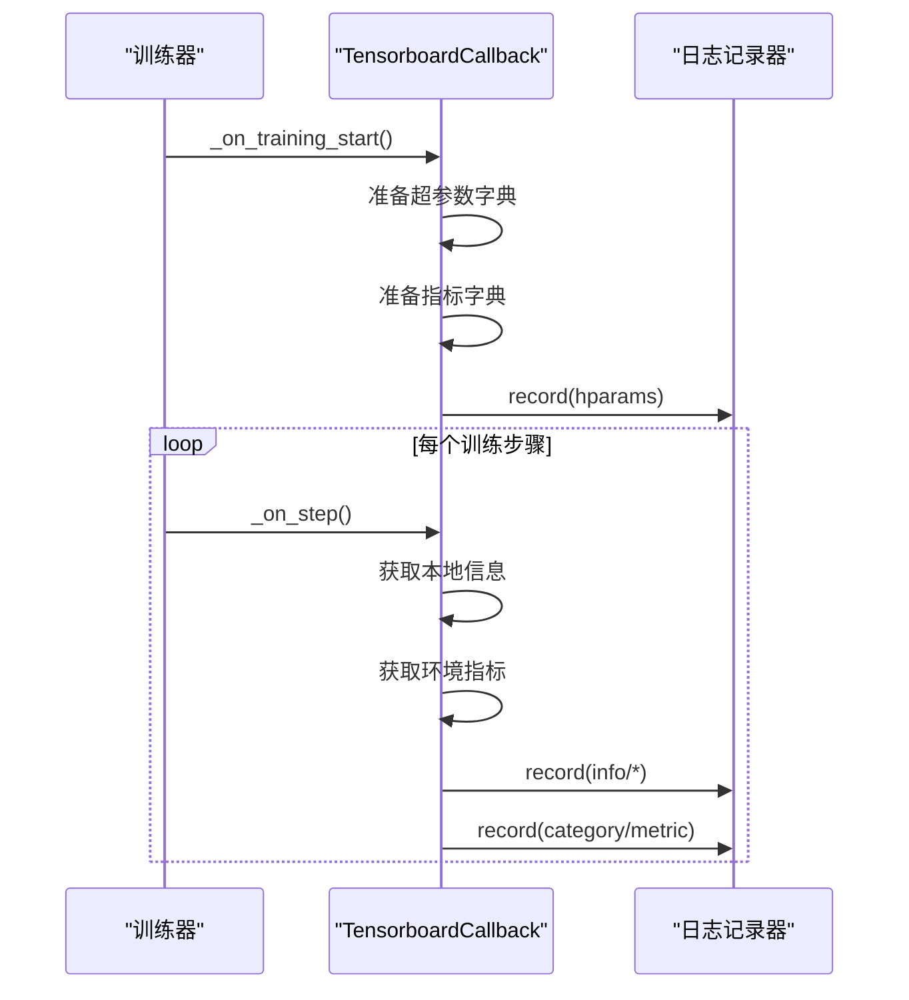
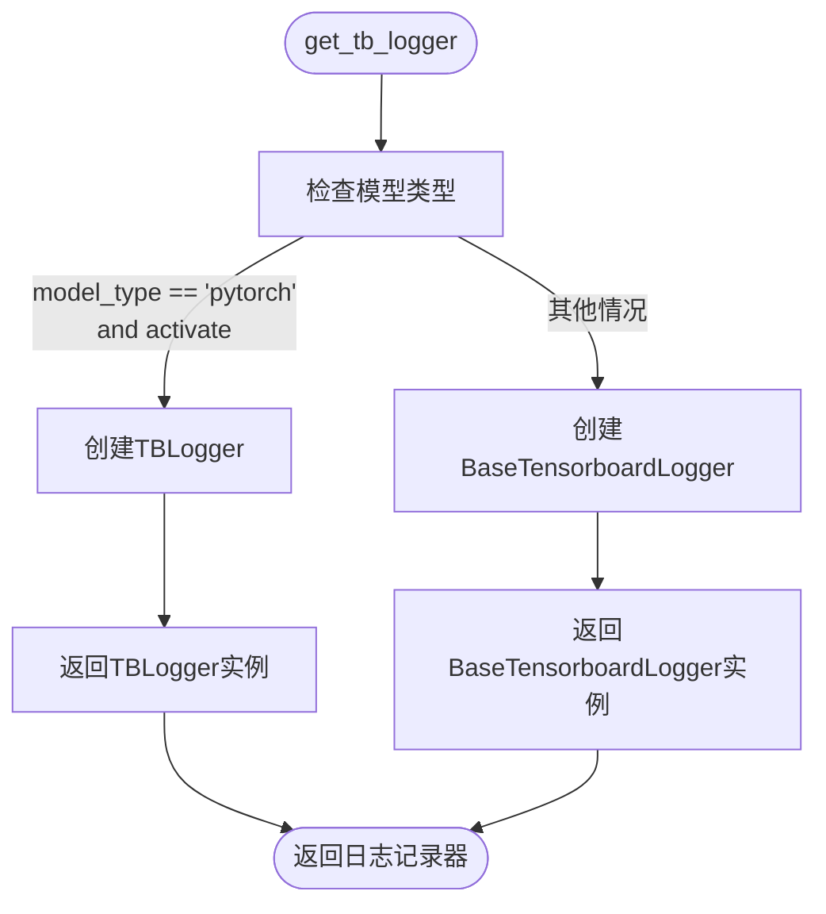
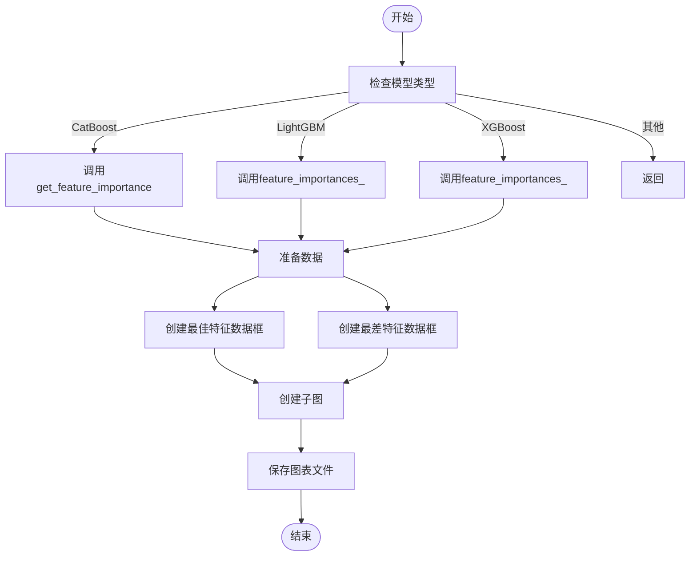

# 训练过程监控

<cite>
**本文档中引用的文件**  
- [TensorboardCallback.py](file://freqtrade/freqai/tensorboard/TensorboardCallback.py)
- [tensorboard.py](file://freqtrade/freqai/tensorboard/tensorboard.py)
- [base_tensorboard.py](file://freqtrade/freqai/tensorboard/base_tensorboard.py)
- [utils.py](file://freqtrade/freqai/utils.py)
- [freqai_interface.py](file://freqtrade/freqai/freqai_interface.py)
- [data_kitchen.py](file://freqtrade/freqai/data_kitchen.py)
- [config_freqai.example.json](file://config_examples/config_freqai.example.json)
</cite>

## 目录
1. [简介](#简介)
2. [activate_tensorboard 配置项机制](#activatetensorboard-配置项机制)
3. [TensorboardCallback 集成机制](#tensorboardcallback-集成机制)
4. [日志记录器工厂方法](#日志记录器工厂方法)
5. [关键指标监控](#关键指标监控)
6. [配置示例与最佳实践](#配置示例与最佳实践)
7. [特征重要性图表生成](#特征重要性图表生成)
8. [性能瓶颈分析](#性能瓶颈分析)

## 简介
本文档详细介绍如何使用TensorBoard对FreqAI模型训练过程进行监控。涵盖activate_tensorboard配置项的作用机制、TensorboardCallback如何集成到训练流程中、get_tb_logger工厂方法如何根据模型类型创建相应的日志记录器。同时说明如何监控损失函数、特征重要性、训练时间等关键指标，并提供配置示例和最佳实践指导。

## activate_tensorboard 配置项机制
`activate_tensorboard` 配置项用于控制是否激活TensorBoard日志记录功能。该配置项在`freqai_interface.py`中初始化，默认值为`True`，表示默认启用TensorBoard监控。

当配置项设置为`True`时，系统将创建实际的TensorBoard日志记录器，用于记录训练过程中的各种指标；当设置为`False`时，系统将使用基础日志记录器，不进行实际的日志记录操作。

该配置项位于配置文件的`freqai`部分，通过`freqai_info.get("activate_tensorboard", True)`获取其值，允许用户在配置文件中灵活控制监控功能的开启与关闭。

**Section sources**
- [freqai_interface.py](file://freqtrade/freqai/freqai_interface.py#L115)

## TensorboardCallback 集成机制
`TensorboardCallback`类继承自`stable_baselines3`的`BaseCallback`，专门用于在强化学习训练过程中记录额外的指标到TensorBoard。该回调在训练开始时记录超参数信息，并在每个训练步骤中记录环境指标。

在训练开始阶段，`_on_training_start`方法会记录算法名称、学习率等超参数信息以及初始的评估指标。在每个训练步骤中，`_on_step`方法会遍历本地信息和环境指标，将它们分类记录到TensorBoard中，包括信息类指标和各类环境指标。

该回调机制通过`self.logger.record`方法将数据写入TensorBoard，实现了对训练过程的细粒度监控。



**Diagram sources**
- [TensorboardCallback.py](file://freqtrade/freqai/tensorboard/TensorboardCallback.py#L9-L60)

**Section sources**
- [TensorboardCallback.py](file://freqtrade/freqai/tensorboard/TensorboardCallback.py#L9-L60)

## 日志记录器工厂方法
`get_tb_logger`工厂方法根据模型类型和激活状态创建相应的日志记录器。该方法位于`utils.py`文件中，是TensorBoard集成的核心组件。

当模型类型为"pytorch"且激活状态为`True`时，方法返回`TBLogger`实例；否则返回`BaseTensorboardLogger`实例。这种设计实现了对不同模型类型的灵活支持，同时保持了统一的接口。

工厂方法的实现遵循了依赖倒置原则，通过返回抽象基类的实例，使得上层代码无需关心具体实现细节，提高了系统的可扩展性和可维护性。



**Diagram sources**
- [utils.py](file://freqtrade/freqai/utils.py#L196-L204)

**Section sources**
- [utils.py](file://freqtrade/freqai/utils.py#L196-L204)

## 关键指标监控
FreqAI系统通过TensorBoard监控多种关键训练指标，包括损失函数、特征重要性、训练时间等。这些指标通过不同的机制进行收集和记录。

损失函数指标通过`TensorboardCallback`在训练过程中实时记录，包括训练损失、验证损失等。特征重要性指标通过`plot_feature_importance`函数生成，分析模型中各特征的相对重要性。训练时间指标通过`inference_timer`和`train_timer`方法进行累计统计。

系统还通过`metric_tracker`记录推理时间和训练时间等性能指标，帮助用户分析模型的计算效率和性能瓶颈。

**Section sources**
- [tensorboard.py](file://freqtrade/freqai/tensorboard/tensorboard.py#L16-L29)
- [freqai_interface.py](file://freqtrade/freqai/freqai_interface.py#L750-L780)
- [data_drawer.py](file://freqtrade/freqai/data_drawer.py#L91)

## 配置示例与最佳实践
在配置文件中，可以通过`freqai`部分的`activate_tensorboard`选项控制TensorBoard的启用状态。建议在开发和调试阶段启用该功能，在生产环境中根据需要决定是否启用。

日志目录由系统自动管理，存储在用户数据目录下的`models`子目录中。监控频率由训练过程自然决定，每个训练步骤都会记录一次指标。

最佳实践包括：合理设置日志目录权限、定期清理旧的日志文件、在分布式训练环境中确保日志目录的可访问性、根据磁盘空间情况调整日志保留策略。

```json
{
  "freqai": {
    "enabled": true,
    "activate_tensorboard": true,
    "train_period_days": 15,
    "backtest_period_days": 7
  }
}
```

**Section sources**
- [config_freqai.example.json](file://config_examples/config_freqai.example.json#L1-L92)

## 特征重要性图表生成
`plot_feature_importance`函数负责生成特征重要性图表。该函数支持多种机器学习库，包括CatBoost、LightGBM和XGBoost，能够自动识别模型类型并提取相应的特征重要性数据。

函数首先根据模型类型调用相应的方法获取特征重要性，然后创建包含最佳和最差特征的子图。图表以水平条形图的形式展示，左侧显示最重要的特征，右侧显示最不重要的特征。

生成的图表保存为HTML文件，便于在浏览器中查看和分享。用户可以通过`plot_feature_importances`配置项控制是否生成此类图表，并通过`count_max`参数指定显示的特征数量。



**Diagram sources**
- [utils.py](file://freqtrade/freqai/utils.py#L93-L154)

**Section sources**
- [utils.py](file://freqtrade/freqai/utils.py#L93-L154)

## 性能瓶颈分析
通过`metric_tracker`和`inference_timer`等工具，系统能够全面分析训练性能瓶颈。`metric_tracker`记录每个交易对的推理时间，帮助识别计算密集型的交易对。

`train_timer`累计记录整个交易对列表的训练时间，当训练时间超过单个K线周期的1/4时，系统会发出警告，提示用户可能存在性能问题。

结合TensorBoard记录的损失函数变化曲线和训练时间指标，用户可以分析模型收敛速度与计算效率之间的关系，优化模型结构和训练参数，提高整体训练效率。

**Section sources**
- [freqai_interface.py](file://freqtrade/freqai/freqai_interface.py#L750-L780)
- [data_drawer.py](file://freqtrade/freqai/data_drawer.py#L91)