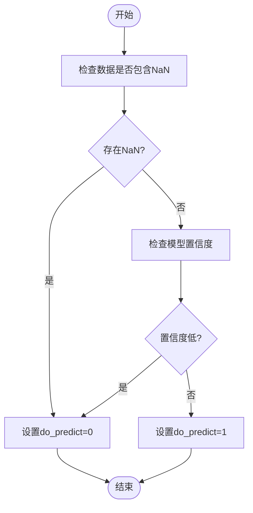
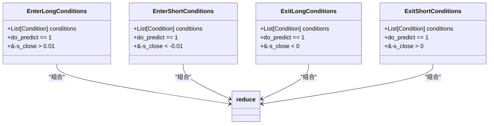
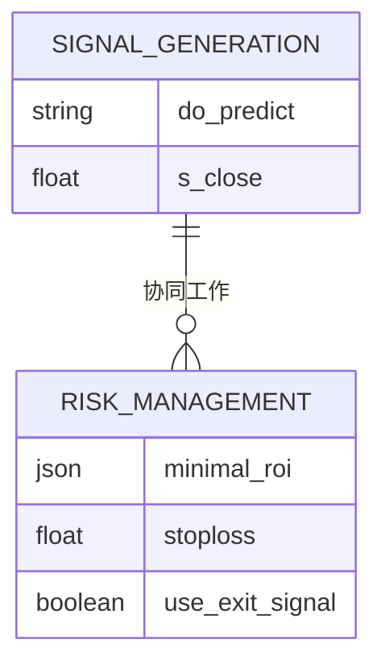
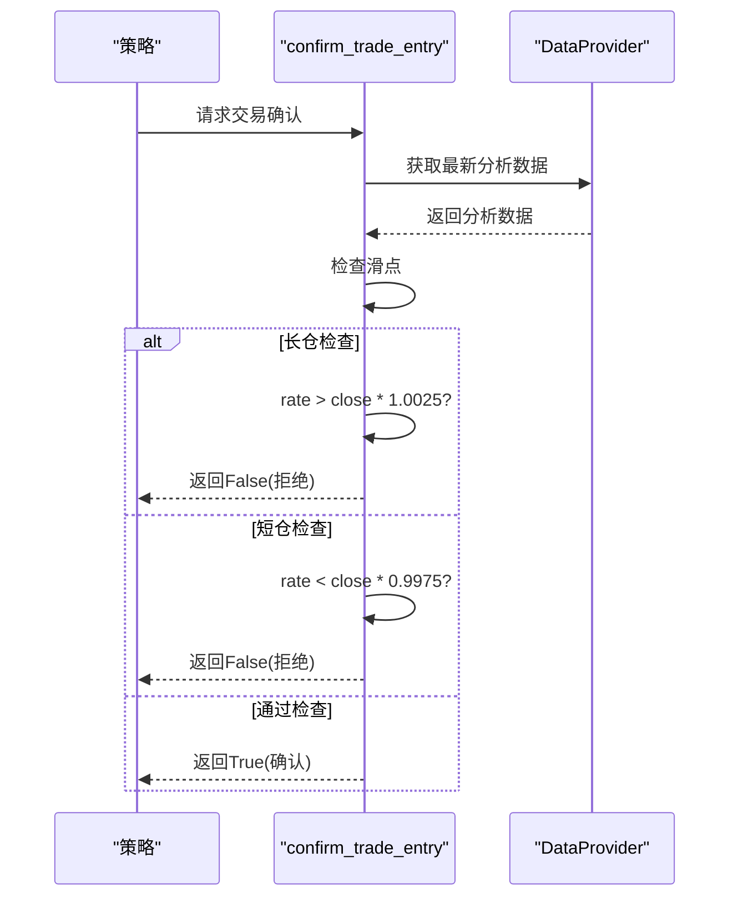

# 交易信号生成

<cite>
**本文档引用的文件**
- [FreqaiExampleStrategy.py](file://freqtrade/templates/FreqaiExampleStrategy.py)
- [interface.py](file://freqtrade/strategy/interface.py)
- [data_drawer.py](file://freqtrade/freqai/data_drawer.py)
- [data_kitchen.py](file://freqtrade/freqai/data_kitchen.py)
- [freqai_interface.py](file://freqtrade/freqai/freqai_interface.py)
</cite>

## 目录
1. [简介](#简介)
2. [信号生成流程](#信号生成流程)
3. [进入/退出条件构建](#进入退出条件构建)
4. [风险管理协同](#风险管理协同)
5. [交易确认机制](#交易确认机制)

## 简介
本文档深入解析如何利用FreqAI模型输出生成实际交易信号的完整流程。以FreqaiExampleStrategy.py中的`populate_entry_trend`和`populate_exit_trend`方法为例，详细说明如何结合`do_predict`标志位和`&-s_close`预测值构建多条件进入/退出规则。

**Section sources**
- [FreqaiExampleStrategy.py](file://freqtrade/templates/FreqaiExampleStrategy.py#L1-L50)

## 信号生成流程

### do_predict标志位机制
`do_predict`标志位作为有效预测指示器，其值为1时表示模型对当前预测结果具有足够信心。该标志位由FreqAI系统在数据预处理阶段生成，用于过滤掉因数据缺失或模型不确定性导致的不可靠预测。

**Diagram sources**
- [data_kitchen.py](file://freqtrade/freqai/data_kitchen.py#L212-L298)
- [data_drawer.py](file://freqtrade/freqai/data_drawer.py#L332-L397)

### 预测收益率判断
`&-s_close`预测值表示模型对未来价格变动的预测收益率。正数表示预测价格上涨（多头机会），负数表示预测价格下跌（空头机会）。通过设置阈值来判断交易机会：

- 多头进入：`&-s_close > 0.01`（预测收益率超过1%）
- 空头进入：`&-s_close < -0.01`（预测收益率低于-1%）
- 多头退出：`&-s_close < 0`（预测收益率转为负值）
- 空头退出：`&-s_close > 0`（预测收益率转为正值）

**Section sources**
- [FreqaiExampleStrategy.py](file://freqtrade/templates/FreqaiExampleStrategy.py#L240-L268)

## 进入退出条件构建

### 多条件组合编程模式
使用`reduce`函数将多个进入条件进行逻辑与（&）组合，确保所有条件同时满足时才触发交易信号。这种模式提高了信号的可靠性。

**Diagram sources**
- [FreqaiExampleStrategy.py](file://freqtrade/templates/FreqaiExampleStrategy.py#L240-L268)

**Section sources**
- [FreqaiExampleStrategy.py](file://freqtrade/templates/FreqaiExampleStrategy.py#L240-L268)

## 风险管理协同

### ROI与止损参数
信号生成逻辑与风险管理参数协同工作，形成完整的交易决策系统：

- `minimal_roi`：定义了不同持有时间的最小收益率目标
- `stoploss`：设置最大可接受亏损比例
- `use_exit_signal`：启用基于指标的退出信号

**Diagram sources**
- [interface.py](file://freqtrade/strategy/interface.py#L70-L74)
- [FreqaiExampleStrategy.py](file://freqtrade/templates/FreqaiExampleStrategy.py#L15-L18)

**Section sources**
- [FreqaiExampleStrategy.py](file://freqtrade/templates/FreqaiExampleStrategy.py#L15-L18)
- [interface.py](file://freqtrade/strategy/interface.py#L70-L74)

## 交易确认机制

### confirm_trade_entry方法
`confirm_trade_entry`方法实现基于最新市场数据的交易确认，防止滑点过大导致的不利成交。该方法在交易执行前被调用，通过比较当前报价与最新收盘价来控制成交质量。

**Diagram sources**
- [FreqaiExampleStrategy.py](file://freqtrade/templates/FreqaiExampleStrategy.py#L270-L292)
- [interface.py](file://freqtrade/strategy/interface.py#L352-L386)

**Section sources**
- [FreqaiExampleStrategy.py](file://freqtrade/templates/FreqaiExampleStrategy.py#L270-L292)
- [interface.py](file://freqtrade/strategy/interface.py#L352-L386)