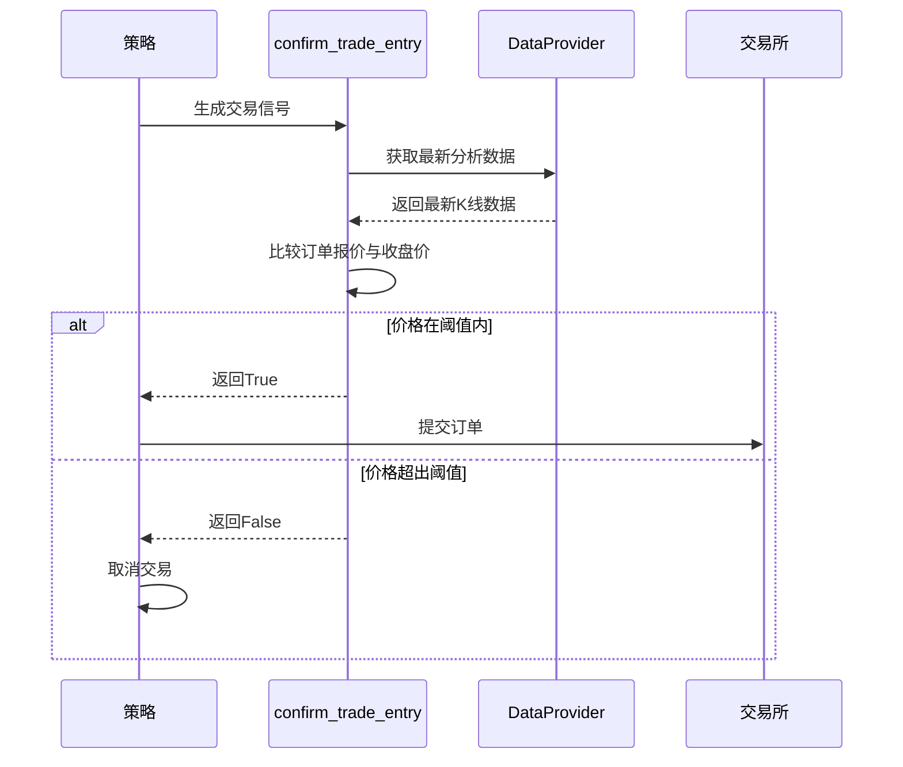
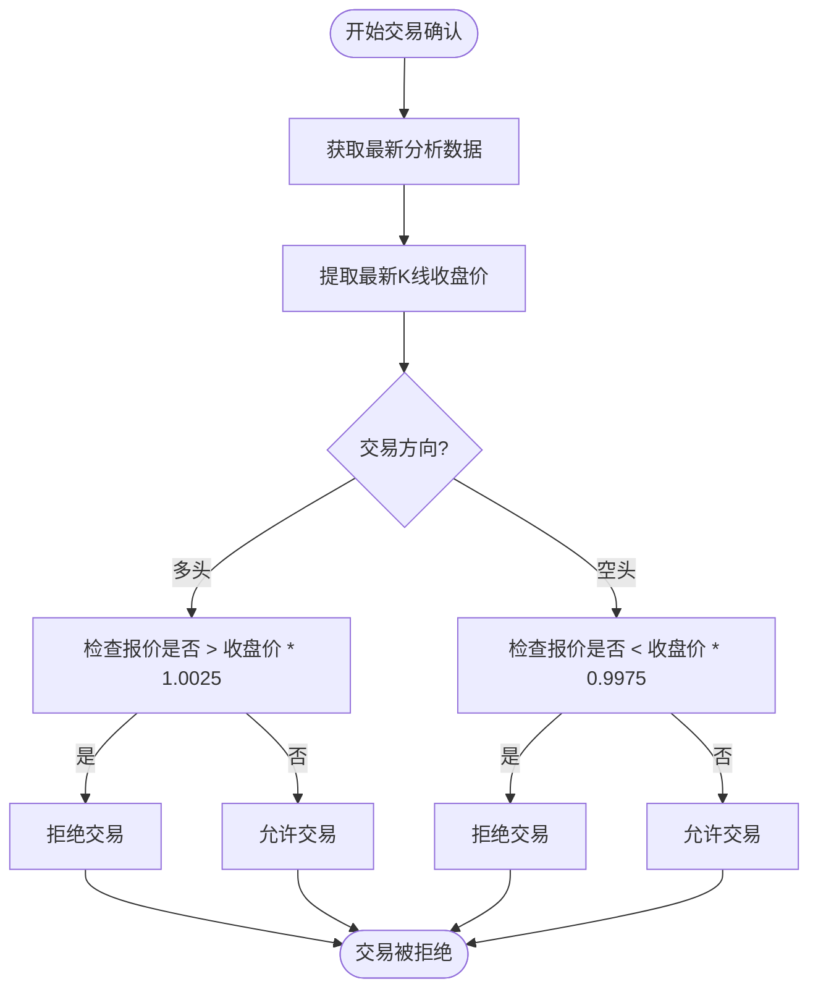

# 交易确认与滑点控制

<cite>
**Referenced Files in This Document**   
- [FreqaiExampleStrategy.py](file://freqtrade/templates/FreqaiExampleStrategy.py)
- [interface.py](file://freqtrade/strategy/interface.py)
- [dataprovider.py](file://freqtrade/data/dataprovider.py)
</cite>

## 目录
1. [引言](#引言)
2. [核心组件分析](#核心组件分析)
3. [交易确认流程](#交易确认流程)
4. [滑点控制机制](#滑点控制机制)
5. [数据提供者角色](#数据提供者角色)
6. [扩展实践指南](#扩展实践指南)
7. [结论](#结论)

## 引言
在自动化交易系统中，交易信号的生成与最终执行之间存在着关键的确认环节。`confirm_trade_entry`方法作为交易执行前的最后一道防线，承担着防止因市场剧烈波动或流动性不足导致的过大滑点成交的重要职责。本文档以Freqtrade框架中的`FreqaiExampleStrategy.py`策略为例，深入解析该方法的实现原理、工作机制及其在保护策略收益方面的重要性。

## 核心组件分析

`confirm_trade_entry`方法是策略类中的一个可选回调函数，它在交易订单即将被提交到交易所之前被调用。该方法通过`DataProvider`获取交易对的最新分析数据，并将当前订单的报价与最新K线收盘价进行比较，从而决定是否允许交易执行。

**Section sources**
- [FreqaiExampleStrategy.py](file://freqtrade/templates/FreqaiExampleStrategy.py#L270-L292)
- [interface.py](file://freqtrade/strategy/interface.py#L352-L386)

## 交易确认流程

`confirm_trade_entry`方法在交易信号生成流程中扮演着至关重要的角色。当策略根据技术指标或机器学习模型生成买入或卖出信号后，系统并不会立即下单，而是会调用`confirm_trade_entry`方法进行最终确认。这一机制确保了交易决策的实时性和准确性，避免了因数据延迟或市场突变导致的不利成交。

该方法的调用时机非常关键，必须在交易执行前完成，但又不能进行过于复杂的计算或网络请求，以免影响交易的及时性。因此，该方法的设计需要在确认精度和执行效率之间取得平衡。

**Diagram sources**
- [FreqaiExampleStrategy.py](file://freqtrade/templates/FreqaiExampleStrategy.py#L270-L292)
- [dataprovider.py](file://freqtrade/data/dataprovider.py#L379-L401)

**Section sources**
- [FreqaiExampleStrategy.py](file://freqtrade/templates/FreqaiExampleStrategy.py#L270-L292)

## 滑点控制机制

`confirm_trade_entry`方法的核心功能之一是滑点控制。在`FreqaiExampleStrategy.py`的实现中，该方法通过设定±0.25%的阈值来防止过大滑点成交。具体实现如下：

1.  **获取最新数据**：通过`self.dp.get_analyzed_dataframe(pair, self.timeframe)`获取指定交易对和时间框架的最新分析数据。
2.  **提取收盘价**：从返回的数据框中提取最新一根K线的收盘价。
3.  **价格比较**：
    *   对于多头交易（`side == "long"`），如果订单报价高于最新收盘价的1.0025倍（即高出0.25%），则拒绝交易。
    *   对于空头交易（`side == "short"`），如果订单报价低于最新收盘价的0.9975倍（即低出0.25%），则拒绝交易。

这种机制有效地保护了策略免受市场剧烈波动的影响。例如，在新闻发布或重大事件发生时，市场价格可能会瞬间跳空，导致按原信号价格成交会造成巨大损失。通过设置合理的滑点阈值，策略可以避免在这种极端行情下成交，从而保护账户资金。

**Diagram sources**
- [FreqaiExampleStrategy.py](file://freqtrade/templates/FreqaiExampleStrategy.py#L270-L292)

**Section sources**
- [FreqaiExampleStrategy.py](file://freqtrade/templates/FreqaiExampleStrategy.py#L270-L292)

## 数据提供者角色

`DataProvider`是连接策略与市场数据的核心组件。它负责为策略提供实时和历史的K线数据、订单簿数据以及其他市场信息。在`confirm_trade_entry`方法中，`DataProvider`通过`get_analyzed_dataframe`方法提供经过分析处理的最新数据。

`get_analyzed_dataframe`方法会根据当前的运行模式（实盘、模拟盘或回测）返回相应的数据。在实盘和模拟盘模式下，它返回完整的数据框；而在回测模式下，为了防止未来数据泄露，它只返回截至当前时间点的有限数量的K线数据。

**Section sources**
- [dataprovider.py](file://freqtrade/data/dataprovider.py#L379-L401)

## 扩展实践指南

`confirm_trade_entry`方法为策略开发者提供了极大的灵活性，可以根据需要集成更复杂的确认逻辑。以下是一些扩展实践的建议：

*   **大盘趋势过滤**：在确认交易前，检查主要市场指数（如BTC/USDT）的趋势。例如，只有当大盘处于上升趋势时，才允许执行多头交易。
*   **K线形态排除**：识别并排除特定的K线形态，如长上影线或长下影线，这些形态可能预示着短期价格反转。
*   **流动性检查**：通过查询订单簿数据，检查目标交易对的买卖盘深度。如果流动性不足，则拒绝交易，以避免大额滑点。
*   **波动率过滤**：计算近期价格波动率，当波动率超过预设阈值时暂停交易，避免在高风险时期成交。

通过这些扩展，可以构建更加稳健和智能的交易确认系统，进一步提升策略的稳定性和盈利能力。

## 结论
`confirm_trade_entry`方法是Freqtrade策略框架中一个强大而灵活的工具。它不仅实现了基本的滑点控制，防止了因市场剧烈波动导致的不利成交，还为开发者提供了扩展交易确认逻辑的空间。通过合理利用`DataProvider`提供的数据，可以构建出能够适应复杂市场环境的智能交易系统，从而有效保护策略收益，提升整体交易质量。