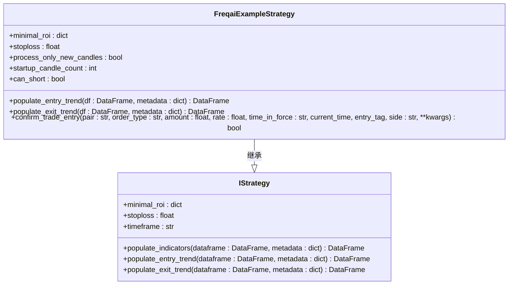
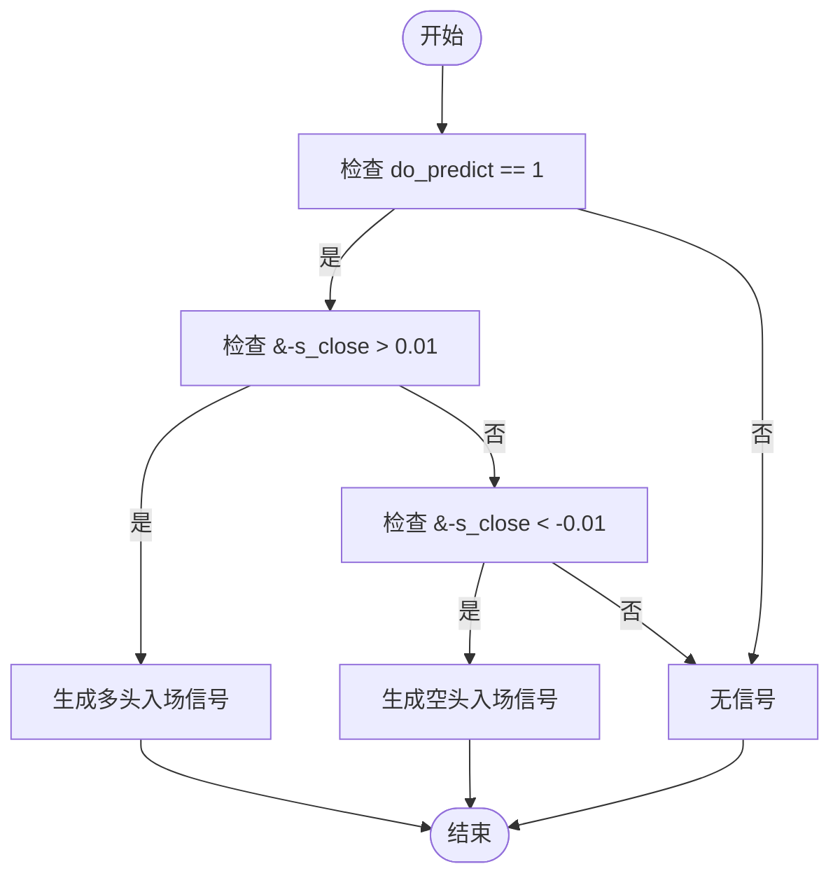
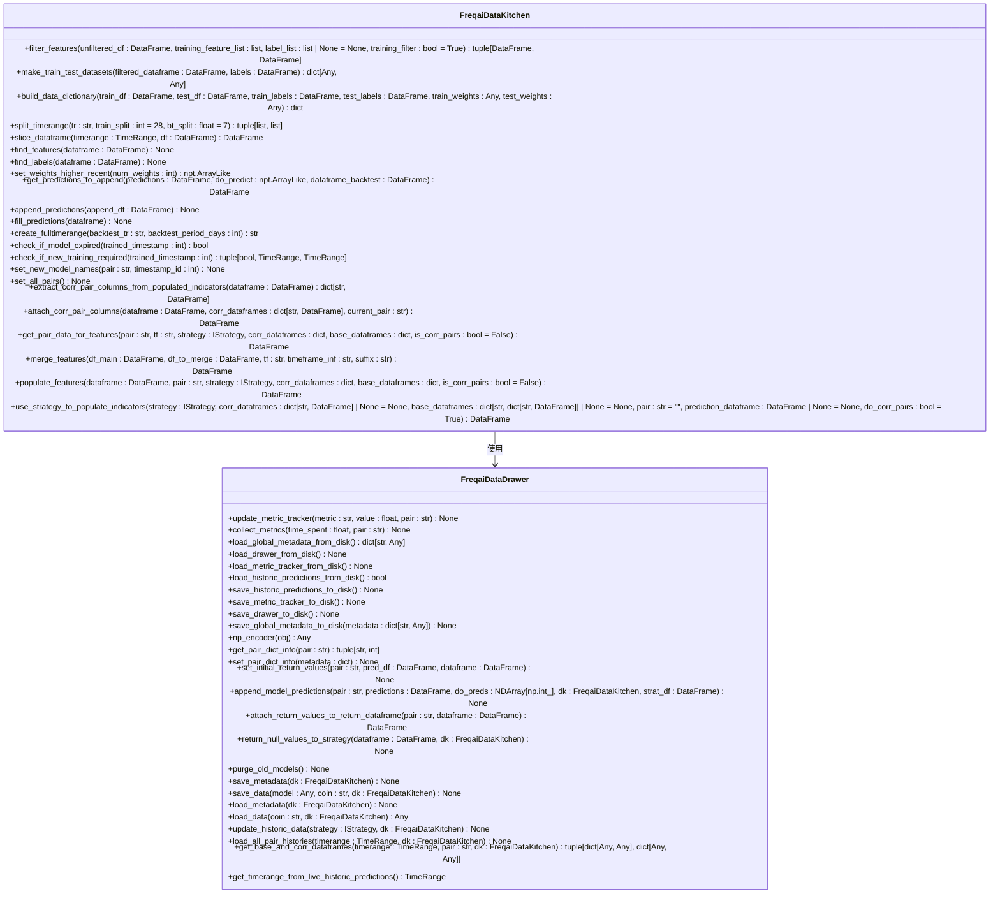
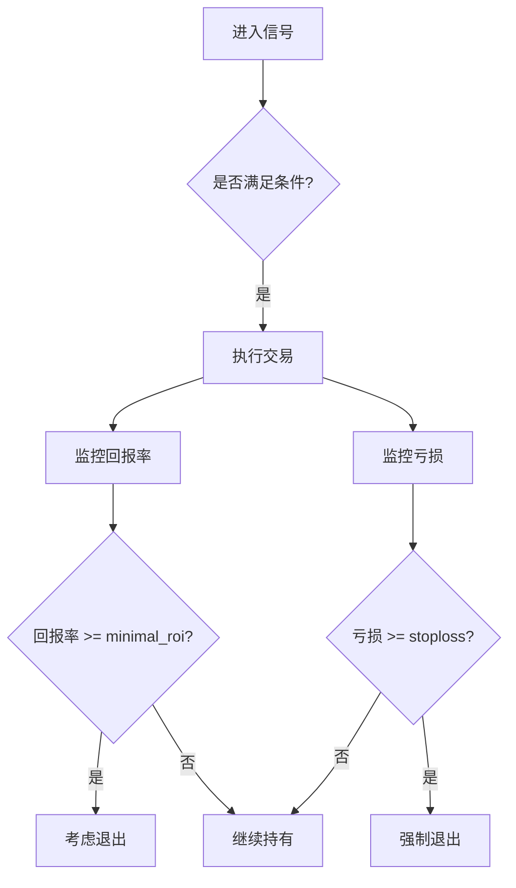

# 进入信号生成

<cite>
**本文档引用的文件**   
- [FreqaiExampleStrategy.py](file://freqtrade/templates/FreqaiExampleStrategy.py)
- [interface.py](file://freqtrade/strategy/interface.py)
- [data_drawer.py](file://freqtrade/freqai/data_drawer.py)
- [data_kitchen.py](file://freqtrade/freqai/data_kitchen.py)
- [parameters.py](file://freqtrade/strategy/parameters.py)
</cite>

## 目录
1. [简介](#简介)
2. [进入信号生成机制](#进入信号生成机制)
3. [多条件逻辑组合](#多条件逻辑组合)
4. [风险管理协同](#风险管理协同)
5. [策略扩展与优化](#策略扩展与优化)
6. [结论](#结论)

## 简介
本文档深入解析FreqAI策略中进入信号的生成机制。以`FreqaiExampleStrategy.py`中的`populate_entry_trend`方法为核心，详细说明如何通过`do_predict == 1`作为有效预测的开关条件，结合`&-s_close`预测值（收益率）与预设阈值（如0.01和-0.01）来判断多头和空头入场机会。文档将解释使用Python内置的`reduce`函数与`lambda`表达式对多个条件（列表）进行逻辑与（&）操作的编程模式，确保所有条件同时满足。同时，分析该逻辑如何与策略的`minimal_roi`和`stoploss`等风险管理参数协同工作，形成完整的交易决策。

**Section sources**
- [FreqaiExampleStrategy.py](file://freqtrade/templates/FreqaiExampleStrategy.py#L1-L293)

## 进入信号生成机制

### 核心组件分析
进入信号的生成是FreqAI策略的核心功能之一，主要通过`populate_entry_trend`方法实现。该方法位于`FreqaiExampleStrategy`类中，负责根据机器学习模型的预测结果生成交易信号。



**Diagram sources**
- [FreqaiExampleStrategy.py](file://freqtrade/templates/FreqaiExampleStrategy.py#L13-L292)
- [interface.py](file://freqtrade/strategy/interface.py#L50-L238)

### 信号生成逻辑
进入信号的生成依赖于两个关键条件：`do_predict`标志和`&-s_close`预测值。`do_predict`是一个布尔标志，用于指示模型是否对当前预测有信心。当`do_predict == 1`时，表示模型认为当前的预测是可靠的，可以作为交易决策的依据。

`&-s_close`是模型预测的未来收益率，通过`set_freqai_targets`方法设置。该值表示未来一段时间内价格的预期变化率。当`&-s_close > 0.01`时，表示模型预测价格将上涨超过1%，这是一个多头入场信号；当`&-s_close < -0.01`时，表示模型预测价格将下跌超过1%，这是一个空头入场信号。



**Diagram sources**
- [FreqaiExampleStrategy.py](file://freqtrade/templates/FreqaiExampleStrategy.py#L242-L256)

**Section sources**
- [FreqaiExampleStrategy.py](file://freqtrade/templates/FreqaiExampleStrategy.py#L242-L256)

## 多条件逻辑组合

### 逻辑与操作
在`populate_entry_trend`方法中，使用了Python内置的`reduce`函数与`lambda`表达式来对多个条件进行逻辑与（&）操作。这种编程模式确保了所有条件必须同时满足才能生成交易信号。

```python
enter_long_conditions = [
    df["do_predict"] == 1,
    df["&-s_close"] > 0.01,
]

if enter_long_conditions:
    df.loc[
        reduce(lambda x, y: x & y, enter_long_conditions), ["enter_long", "enter_tag"]
    ] = (1, "long")
```

`reduce`函数将一个二元函数（在这里是`lambda x, y: x & y`）应用于序列中的所有元素，从左到右，以将序列减少为单个值。在这个例子中，`reduce`函数将所有条件进行逻辑与操作，只有当所有条件都为真时，最终结果才为真。

### 条件列表的动态构建
条件列表的动态构建允许策略在运行时根据不同的市场情况调整交易逻辑。例如，可以添加更多的技术指标过滤器来增强信号的可靠性。



**Diagram sources**
- [data_kitchen.py](file://freqtrade/freqai/data_kitchen.py#L777-L865)
- [data_drawer.py](file://freqtrade/freqai/data_drawer.py#L631-L682)

**Section sources**
- [data_kitchen.py](file://freqtrade/freqai/data_kitchen.py#L777-L865)
- [data_drawer.py](file://freqtrade/freqai/data_drawer.py#L631-L682)

## 风险管理协同

### 最小回报率（minimal_roi）
`minimal_roi`参数定义了策略的最小回报率目标。当交易的回报率达到或超过这个阈值时，策略将考虑退出交易。在`FreqaiExampleStrategy`中，`minimal_roi`被设置为`{"0": 0.1, "240": -1}`，这意味着在0分钟时，最小回报率为10%，而在240分钟后，最小回报率变为-1%。

### 止损（stoploss）
`stoploss`参数定义了策略的最大亏损容忍度。当交易的亏损达到或超过这个阈值时，策略将自动退出交易以限制损失。在`FreqaiExampleStrategy`中，`stoploss`被设置为`-0.05`，这意味着最大亏损容忍度为5%。



**Diagram sources**
- [FreqaiExampleStrategy.py](file://freqtrade/templates/FreqaiExampleStrategy.py#L27-L40)

**Section sources**
- [FreqaiExampleStrategy.py](file://freqtrade/templates/FreqaiExampleStrategy.py#L27-L40)

## 策略扩展与优化

### 修改阈值
可以通过修改`&-s_close`的阈值来调整进入信号的敏感度。例如，将阈值从0.01调整为0.02，可以减少信号的频率，但可能会错过一些较小的盈利机会。

### 添加技术指标过滤器
可以添加技术指标过滤器来增强信号的可靠性。例如，可以添加RSI超买超卖指标来过滤掉在超买或超卖区域的信号。

```python
enter_long_conditions = [
    df["do_predict"] == 1,
    df["&-s_close"] > 0.01,
    df["rsi"] < 70,  # RSI未超买
]

enter_short_conditions = [
    df["do_predict"] == 1,
    df["&-s_close"] < -0.01,
    df["rsi"] > 30,  # RSI未超卖
]
```

### 信号过于频繁的解决方案
当信号过于频繁时，可以采取以下措施：
1. **增加阈值**：提高`&-s_close`的阈值，减少信号的频率。
2. **添加过滤器**：添加更多的技术指标过滤器，如RSI、MACD等，以提高信号的可靠性。
3. **调整模型参数**：调整模型的训练参数，如`train_period_days`和`backtest_period_days`，以优化模型的预测性能。

**Section sources**
- [FreqaiExampleStrategy.py](file://freqtrade/templates/FreqaiExampleStrategy.py#L242-L256)
- [parameters.py](file://freqtrade/strategy/parameters.py#L1-L381)

## 结论
本文档详细解析了FreqAI策略中进入信号的生成机制，包括核心组件、信号生成逻辑、多条件逻辑组合、风险管理协同以及策略扩展与优化。通过深入理解这些机制，用户可以更好地利用FreqAI策略进行交易决策，并根据实际需求进行定制和优化。

**Section sources**
- [FreqaiExampleStrategy.py](file://freqtrade/templates/FreqaiExampleStrategy.py#L1-L293)
- [interface.py](file://freqtrade/strategy/interface.py#L50-L238)
- [data_kitchen.py](file://freqtrade/freqai/data_kitchen.py#L777-L865)
- [data_drawer.py](file://freqtrade/freqai/data_drawer.py#L631-L682)
- [parameters.py](file://freqtrade/strategy/parameters.py#L1-L381)