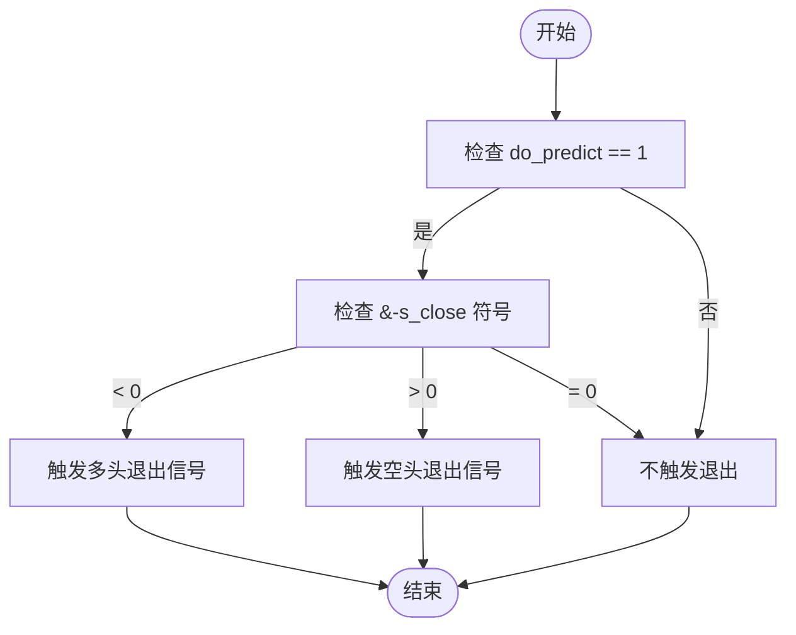
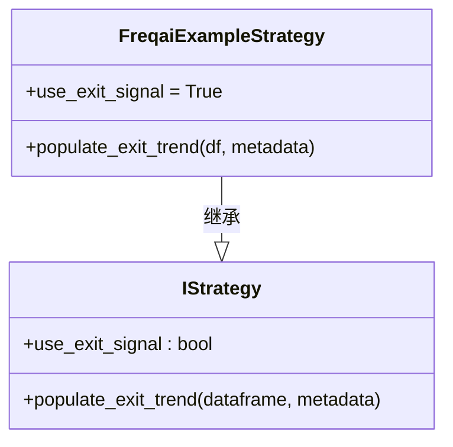
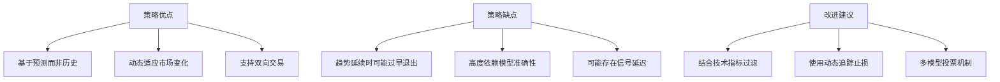
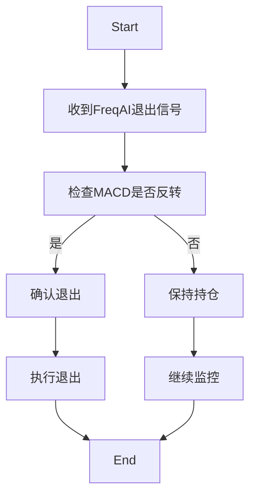

# 退出信号生成

<cite>
**本文档中引用的文件**  
- [FreqaiExampleStrategy.py](file://freqtrade/templates/FreqaiExampleStrategy.py)
- [interface.py](file://freqtrade/strategy/interface.py)
</cite>

## 目录
1. [简介](#简介)
2. [退出信号生成逻辑](#退出信号生成逻辑)
3. [与use_exit_signal配置项的关联](#与use_exit_signal配置项的关联)
4. [策略优缺点分析](#策略优缺点分析)
5. [退出逻辑优化方案](#退出逻辑优化方案)
6. [结论](#结论)

## 简介
本文档详细阐述基于FreqAI模型输出的退出信号生成逻辑，重点分析`FreqaiExampleStrategy.py`中`populate_exit_trend`方法的实现机制。该策略利用机器学习模型预测未来价格走势，并根据预测结果动态生成退出信号，替代传统的ROI止盈机制。

**Section sources**
- [FreqaiExampleStrategy.py](file://freqtrade/templates/FreqaiExampleStrategy.py#L1-L50)

## 退出信号生成逻辑

### 核心实现机制
退出信号的生成基于两个关键指标：`do_predict`标志位和`&-s_close`预测值。在`FreqaiExampleStrategy.py`的`populate_exit_trend`方法中，通过以下条件判断来触发退出：

- **多头仓位退出条件**：当`do_predict == 1`且`&-s_close < 0`时，平掉多头仓位
- **空头仓位退出条件**：当`do_predict == 1`且`&-s_close > 0`时，平掉空头仓位



**Diagram sources**
- [FreqaiExampleStrategy.py](file://freqtrade/templates/FreqaiExampleStrategy.py#L183-L208)

### 预测值计算
`&-s_close`目标值的计算方式为未来一段时间内收盘价均值与当前收盘价的比率减1，具体公式如下：

```
&-s_close = (未来label_period_candles根K线的收盘价均值 / 当前收盘价) - 1
```

当该值为负时，表示模型预测未来价格将下跌；为正时则预测价格上涨。

**Section sources**
- [FreqaiExampleStrategy.py](file://freqtrade/templates/FreqaiExampleStrategy.py#L183-L208)

## 与use_exit_signal配置项的关联

### 配置项作用
`use_exit_signal`是策略中的一个关键配置参数，用于控制是否启用基于技术指标的退出信号。当设置为`True`时，系统会检查`exit_long`和`exit_short`列的值来决定是否平仓。



**Diagram sources**
- [interface.py](file://freqtrade/strategy/interface.py#L110-L1459)
- [FreqaiExampleStrategy.py](file://freqtrade/templates/FreqaiExampleStrategy.py#L41)

### 执行流程
当`use_exit_signal`启用时，交易引擎会按照以下流程处理退出信号：

1. 调用`populate_indicators`方法生成所有指标
2. 检查`populate_exit_trend`方法生成的退出信号
3. 如果满足退出条件，则执行平仓操作

此机制完全替代了传统的ROI止盈方式，实现了基于市场预测的动态退出。

**Section sources**
- [interface.py](file://freqtrade/strategy/interface.py#L1459)
- [FreqaiExampleStrategy.py](file://freqtrade/templates/FreqaiExampleStrategy.py#L41)

## 策略优缺点分析

### 优点
- **前瞻性**：基于对未来价格走势的预测，而非历史数据
- **动态性**：能够根据市场变化实时调整退出策略
- **灵活性**：可同时处理多头和空头仓位的退出

### 缺点
- **过早退出风险**：在趋势延续时可能因短期预测反转而过早退出
- **模型依赖性**：退出信号质量高度依赖于预测模型的准确性
- **信号延迟**：机器学习模型的计算和更新可能存在时间延迟



**Diagram sources**
- [FreqaiExampleStrategy.py](file://freqtrade/templates/FreqaiExampleStrategy.py#L183-L208)

**Section sources**
- [FreqaiExampleStrategy.py](file://freqtrade/templates/FreqaiExampleStrategy.py#L183-L208)

## 退出逻辑优化方案

### 结合MACD反转信号
通过结合MACD指标的反转信号，可以有效过滤假信号，避免在趋势延续时过早退出。



**Diagram sources**
- [FreqaiExampleStrategy.py](file://freqtrade/templates/FreqaiExampleStrategy.py#L183-L208)

### 动态追踪止损实现
使用动态追踪止损可以更好地保护利润，同时允许盈利仓位继续运行。

```python
# 伪代码示例
def dynamic_trailing_stop(current_profit, max_profit):
    if current_profit < max_profit * 0.8:  # 回撤超过20%
        return True  # 触发退出
    return False
```

**Section sources**
- [FreqaiExampleStrategy.py](file://freqtrade/templates/FreqaiExampleStrategy.py#L183-L208)

## 结论
基于FreqAI模型的退出信号生成逻辑提供了一种先进的动态退出机制，通过预测未来价格走势来决定平仓时机。虽然该方法具有前瞻性优势，但也存在过早退出的风险。最佳实践是将机器学习预测与传统技术指标相结合，构建多层次的退出决策系统，以提高策略的稳定性和盈利能力。