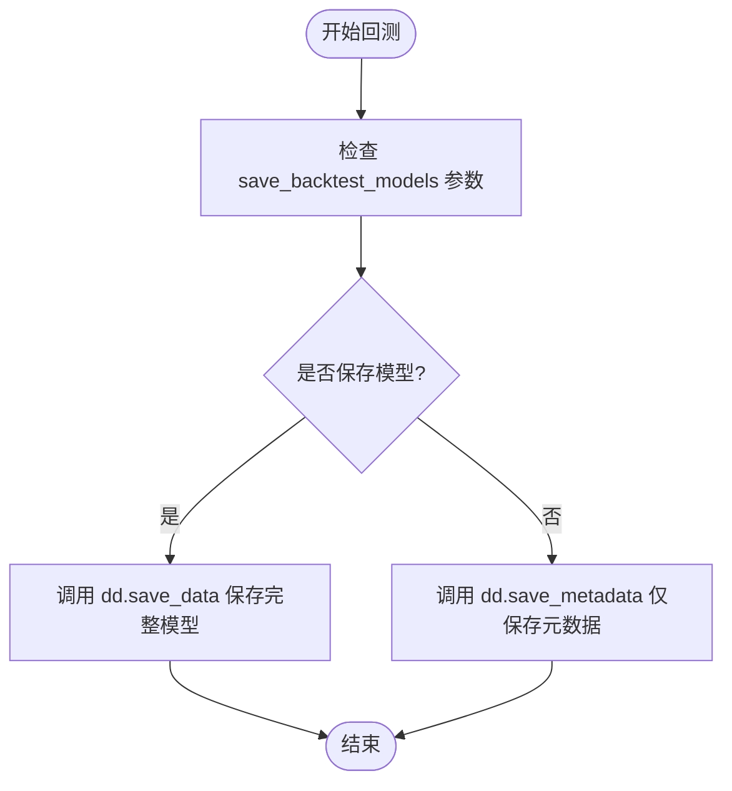

# 回测模型保存控制

<cite>
**本文档中引用的文件**  
- [freqai_interface.py](file://freqtrade/freqai/freqai_interface.py)
- [data_drawer.py](file://freqtrade/freqai/data_drawer.py)
- [data_kitchen.py](file://freqtrade/freqai/data_kitchen.py)
</cite>

## 目录
1. [简介](#简介)
2. [核心参数行为分析](#核心参数行为分析)
3. [回测流程中的模型持久化逻辑](#回测流程中的模型持久化逻辑)
4. [磁盘空间与可复现性影响](#磁盘空间与可复现性影响)
5. [最佳实践建议](#最佳实践建议)

## 简介
本文档深入解析 `save_backtest_models` 参数在回测场景下的行为逻辑，说明其如何控制模型持久化策略。分析当该参数启用时，系统在 `start_backtesting` 流程中如何调用 `dd.save_data` 保存每个训练窗口的模型，以及禁用时仅保存元数据的行为差异。结合代码路径说明该设置对磁盘空间占用和结果可复现性的影响，并提供最佳实践建议。

## 核心参数行为分析
`save_backtest_models` 参数是 FreqAI 模块中用于控制回测期间模型持久化行为的关键配置项。该参数在 `IFreqaiModel` 类初始化时从配置中读取，默认值为 `True`。

当参数启用时，系统会在每个训练窗口完成后将训练好的模型及其相关数据（包括特征管道、标签管道、训练数据等）完整保存到磁盘；当参数禁用时，系统仅保存元数据信息，不保存实际的模型文件。

该参数的设置直接影响回测结果的可复现性和磁盘空间占用。

**Section sources**
- [freqai_interface.py](file://freqtrade/freqai/freqai_interface.py#L100-L105)

## 回测流程中的模型持久化逻辑
在回测流程中，`start_backtesting` 方法会遍历训练时间范围和回测时间范围的组合，对每个时间窗口执行训练和预测操作。

当 `save_backtest_models` 参数为 `True` 时，在每个训练周期结束后，系统会调用 `dd.save_data(self.model, pair, dk)` 方法，将当前训练得到的模型对象、特征管道、标签管道以及训练数据完整保存到以时间戳命名的子目录中。

当该参数为 `False` 时，系统不会调用 `save_data`，而是调用 `dd.save_metadata(dk)` 仅保存元数据信息，包括数据路径、模型文件名、训练特征列表和标签列表等。

这种设计允许用户在需要完整复现能力时保存所有模型，或在进行大规模回测研究时仅保存必要元数据以节省磁盘空间。

**Diagram sources**
- [freqai_interface.py](file://freqtrade/freqai/freqai_interface.py#L300-L320)
- [data_drawer.py](file://freqtrade/freqai/data_drawer.py#L600-L650)

**Section sources**
- [freqai_interface.py](file://freqtrade/freqai/freqai_interface.py#L286-L341)
- [data_drawer.py](file://freqtrade/freqai/data_drawer.py#L600-L650)

## 磁盘空间与可复现性影响
`save_backtest_models` 参数的设置对磁盘空间占用和结果可复现性有显著影响：

- **启用时（True）**：每个训练窗口都会生成一个包含模型文件（如 `.joblib`）、特征管道、标签管道和训练数据的完整目录。这会显著增加磁盘空间占用，但确保了完全的可复现性，因为所有中间模型都可被重新加载用于验证或分析。

- **禁用时（False）**：仅保存轻量级的元数据 JSON 文件，大幅减少磁盘空间占用。适用于大规模参数搜索或初步性能评估，但牺牲了完整复现能力，因为无法重新加载特定时间点的模型状态。

测试用例表明，启用该参数时，系统会创建多个模型文件夹（如测试中创建了 2 或 9 个文件夹），而禁用时则不会生成模型文件。

**Section sources**
- [freqai_interface.py](file://freqtrade/freqai/freqai_interface.py#L242-L376)
- [data_drawer.py](file://freqtrade/freqai/data_drawer.py#L600-L650)

## 最佳实践建议
根据使用场景，建议采用以下最佳实践：

1. **研究与开发阶段**：启用 `save_backtest_models` 以确保完全可复现性，便于调试和模型性能分析。
2. **大规模参数优化**：禁用该参数以节省磁盘空间和 I/O 开销，专注于整体策略性能评估。
3. **生产环境回测**：根据存储容量和复现需求权衡设置，建议保留关键回测的完整模型。
4. **长期历史分析**：考虑结合 `purge_old_models` 参数自动清理旧模型，避免磁盘空间耗尽。

通过合理配置 `save_backtest_models` 参数，用户可以在存储效率和科学严谨性之间取得平衡，优化回测工作流程。

**Section sources**
- [freqai_interface.py](file://freqtrade/freqai/freqai_interface.py#L100-L105)
- [data_drawer.py](file://freqtrade/freqai/data_drawer.py#L600-L650)