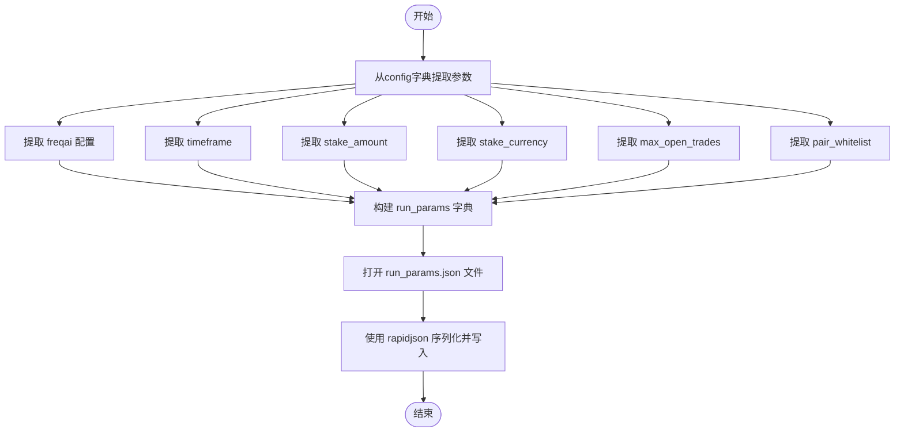

# 实验参数持久化

<cite>
**Referenced Files in This Document**   
- [utils.py](file://freqtrade/freqai/utils.py#L157-L179)
- [data_kitchen.py](file://freqtrade/freqai/data_kitchen.py#L34-L1033)
- [configuration.py](file://freqtrade/configuration/configuration.py#L456-L509)
</cite>

## 目录
1. [引言](#引言)
2. [核心功能分析](#核心功能分析)
3. [参数提取与序列化流程](#参数提取与序列化流程)
4. [文件结构与内容](#文件结构与内容)
5. [在实验可复现性中的作用](#在实验可复现性中的作用)
6. [结论](#结论)

## 引言
`record_params`函数是Freqtrade框架中FreqAI模块的关键组件，负责确保机器学习交易实验的完全可复现性。该函数通过从系统配置中提取关键运行参数并将其序列化到持久化文件中，为实验结果的验证、问题排查和跨实验对比提供了坚实的基础。本文档详细分析该函数的实现机制、参数提取过程及其在实验生命周期中的重要作用。

## 核心功能分析

`record_params`函数的核心功能是捕获并持久化实验的关键配置参数，以确保任何后续的分析或复现都能基于完全相同的实验条件。该函数位于`freqtrade/freqai/utils.py`文件中，作为FreqAI模块的工具函数被调用。

**Section sources**
- [utils.py](file://freqtrade/freqai/utils.py#L157-L179)

## 参数提取与序列化流程

`record_params`函数的执行流程清晰且高效，主要分为参数提取和文件写入两个阶段。

### 参数提取过程

函数从传入的`config`字典中提取以下关键参数：
- **FreqAI配置**：通过`config.get("freqai", {})`获取完整的FreqAI模块配置，包括训练周期、回测周期、特征参数等。
- **时间框架**：通过`config.get("timeframe")`获取主交易时间框架（如"5m"、"1h"）。
- **下注金额**：通过`config.get("stake_amount")`获取每次交易的下注金额。
- **下注货币**：通过`config.get("stake_currency")`获取下注的货币类型（如"USDT"）。
- **最大开仓数**：通过`config.get("max_open_trades")`获取同时允许的最大开仓交易数量。
- **交易对列表**：通过`config.get("exchange", {}).get("pair_whitelist")`获取交易所配置中的交易对白名单。

这些参数的提取使用了Python字典的`.get()`方法，确保了在配置项缺失时能够返回安全的默认值（如空字典或`None`），从而增强了函数的健壮性。



**Diagram sources**
- [utils.py](file://freqtrade/freqai/utils.py#L157-L179)

**Section sources**
- [utils.py](file://freqtrade/freqai/utils.py#L157-L179)

## 文件结构与内容

`record_params`函数将提取的参数序列化为JSON格式，并写入由`full_path`参数指定的目录下的`run_params.json`文件。该文件的结构是一个包含多个键值对的JSON对象，每个键对应一个实验参数。

```json
{
    "freqai": {
        "enabled": true,
        "train_period_days": 30,
        "backtest_period_days": 7,
        "feature_parameters": {
            "include_timeframes": ["5m", "15m"],
            "include_corr_pairlist": ["BTC/USDT"]
        }
    },
    "timeframe": "5m",
    "stake_amount": 100,
    "stake_currency": "USDT",
    "max_open_trades": 5,
    "pairs": ["ETH/USDT", "BTC/USDT", "ADA/USDT"]
}
```

该文件的生成时机通常是在FreqAI模型训练或回测开始之前，由`FreqaiDataKitchen`类在初始化数据厨房时调用`record_params`函数来完成。这确保了在任何数据处理或模型训练发生之前，实验的“快照”已经被记录下来。

**Section sources**
- [utils.py](file://freqtrade/freqai/utils.py#L157-L179)
- [data_kitchen.py](file://freqtrade/freqai/data_kitchen.py#L34-L1033)

## 在实验可复现性中的作用

`run_params.json`文件在确保实验的完全可复现性方面扮演着至关重要的角色。

### 结果验证
当需要验证一个实验的结果时，研究人员可以首先检查`run_params.json`文件，确认实验所使用的配置与预期完全一致。例如，可以验证是否使用了正确的交易对列表、时间框架和下注金额，从而排除因配置错误导致结果偏差的可能性。

### 问题排查
在排查模型表现不佳或出现异常行为的问题时，`run_params.json`文件提供了一个可靠的基准。通过比较不同实验的参数文件，可以快速识别出导致问题的配置变更。例如，如果一个模型在某个版本后性能下降，通过对比`run_params.json`文件，可以发现是否无意中修改了`freqai`模块的某个关键参数。

### 实验对比
在进行A/B测试或多组实验对比时，`run_params.json`文件使得跨实验的参数比较变得简单而精确。研究人员可以编写脚本自动读取和解析这些文件，生成参数对比报告，从而清晰地展示不同实验之间的差异，为决策提供数据支持。

**Section sources**
- [utils.py](file://freqtrade/freqai/utils.py#L157-L179)
- [data_kitchen.py](file://freqtrade/freqai/data_kitchen.py#L34-L1033)
- [configuration.py](file://freqtrade/configuration/configuration.py#L456-L509)

## 结论
`record_params`函数通过系统性地捕获和持久化实验的关键运行参数，为Freqtrade框架中的机器学习交易实验提供了坚实的可复现性基础。其简洁的设计和对关键配置的全面覆盖，使得`run_params.json`文件成为实验生命周期中不可或缺的审计和验证工具。这一机制不仅提升了研究的严谨性，也为团队协作和知识传承提供了便利。