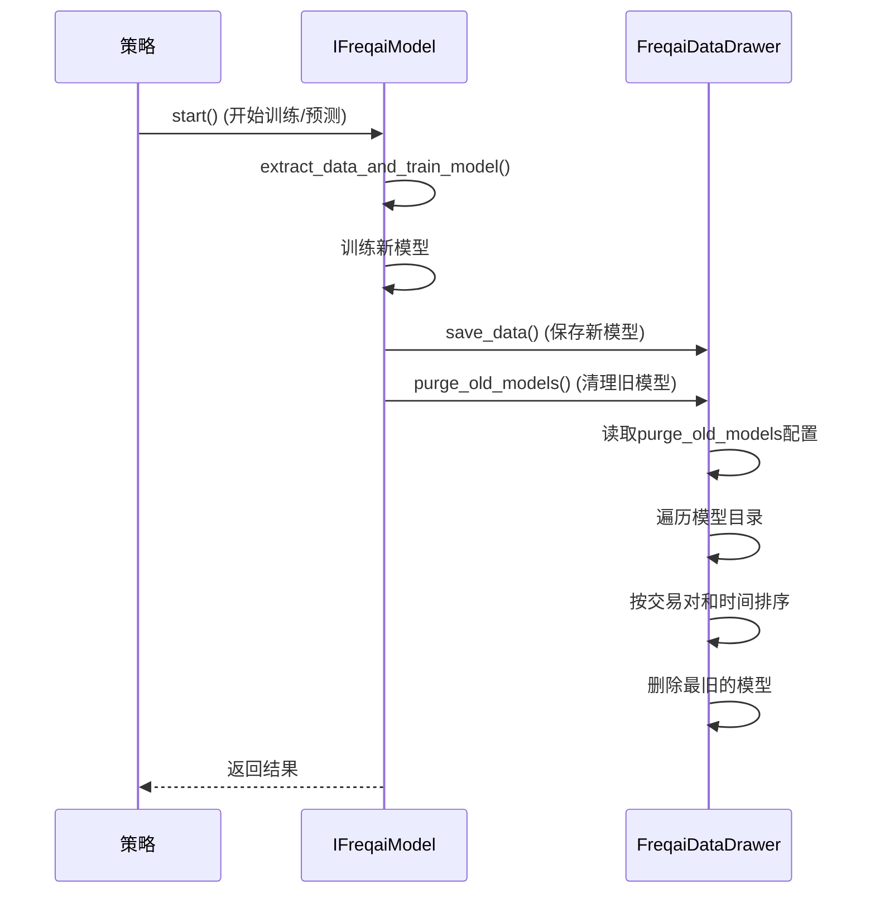

# 旧模型清理机制

<cite>
**本文档引用的文件**   
- [data_drawer.py](file://freqtrade/freqai/data_drawer.py)
- [freqai_interface.py](file://freqtrade/freqai/freqai_interface.py)
- [config_schema.py](file://freqtrade/config_schema/config_schema.py)
</cite>

## 目录
1. [简介](#简介)
2. [核心组件分析](#核心组件分析)
3. [旧模型清理机制工作原理](#旧模型清理机制工作原理)
4. [触发时机与执行流程](#触发时机与执行流程)
5. [配置项解析](#配置项解析)
6. [长期运行与高频训练场景的重要性](#长期运行与高频训练场景的重要性)
7. [存储成本与历史模型保留的平衡建议](#存储成本与历史模型保留的平衡建议)

## 简介
Freqtrade的FreqAI模块通过机器学习模型为交易策略提供预测支持。在长期运行和高频训练场景下，系统会持续生成大量模型文件，可能导致磁盘空间迅速耗尽。为解决此问题，系统实现了`purge_old_models`机制，通过读取配置项`max_model_count`（在代码中对应`purge_old_models`），自动遍历模型目录，按时间排序并删除最旧的模型文件，确保磁盘空间效率。本文档详细说明该机制的工作原理、触发时机，并分析其在不同场景下的重要性，最后提供配置建议以平衡存储成本与历史模型保留需求。

## 核心组件分析

**Section sources**
- [data_drawer.py](file://freqtrade/freqai/data_drawer.py#L439-L479)
- [freqai_interface.py](file://freqtrade/freqai/freqai_interface.py#L639)

## 旧模型清理机制工作原理

`purge_old_models`方法是FreqAI数据管理器（`FreqaiDataDrawer`）中的一个核心功能，其主要职责是维护模型存储的磁盘空间效率。该方法的工作流程如下：

1.  **读取配置**：方法首先从`self.freqai_info`字典中读取`purge_old_models`配置项的值，该值决定了系统需要保留的模型数量上限。
2.  **遍历模型目录**：方法获取模型存储的根目录`self.full_path`，并列出该目录下所有子目录，这些子目录即为已保存的模型。
3.  **解析模型信息**：使用正则表达式`r"sub-train-(\w+)_(\d{10})"`解析每个模型目录的名称。该模式匹配形如`sub-train-BTC_1672531200`的目录名，从中提取出交易对（如`BTC`）和时间戳（如`1672531200`）。
4.  **构建删除字典**：创建一个名为`delete_dict`的字典，以交易对（`coin`）为键，存储该交易对的所有模型目录及其时间戳。这确保了清理操作是按交易对独立进行的。
5.  **按时间排序并删除**：对于每个交易对，如果其模型数量超过配置的上限`num_keep`，则将该交易对的所有模型按时间戳升序（即从最旧到最新）排序。然后，计算需要删除的模型数量（`num_delete = len(sorted_dict) - num_keep`），并循环删除最旧的`num_delete`个模型目录。

此机制确保了每个交易对只保留最新的`num_keep`个模型，从而有效控制了磁盘空间的占用。

**Section sources**
- [data_drawer.py](file://freqtrade/freqai/data_drawer.py#L439-L479)

## 触发时机与执行流程

`purge_old_models`方法的触发时机非常明确，它在每次成功完成模型训练后立即执行。具体流程如下：

1.  **模型训练完成**：当`IFreqaiModel`类中的`extract_data_and_train_model`方法成功训练完一个新模型并将其保存到磁盘后。
2.  **调用清理方法**：紧接着，`extract_data_and_train_model`方法会调用`self.dd.purge_old_models()`，这里的`self.dd`即为`FreqaiDataDrawer`实例。
3.  **执行清理**：`purge_old_models`方法随即被调用，开始执行上述的清理流程。

这种设计确保了模型存储的“先进先出”（FIFO）原则，即在生成一个新模型的同时，会检查并清理掉最旧的模型（如果数量已超限），从而在磁盘空间上形成一个动态的、大小可控的“滑动窗口”。

**Diagram sources**
- [freqai_interface.py](file://freqtrade/freqai/freqai_interface.py#L639)
- [data_drawer.py](file://freqtrade/freqai/data_drawer.py#L439-L479)

## 配置项解析

`purge_old_models`是FreqAI配置中的一个关键参数，其定义和行为如下：

*   **位置**：位于配置文件的`freqai`对象下。
*   **类型**：可以是布尔值（`true`/`false`）或数字（`number`）。
*   **默认值**：`2`。
*   **行为**：
    *   如果设置为`false`或`0`，则禁用清理功能，所有模型将被永久保留。
    *   如果设置为`true`，则等同于设置为`2`，系统将保留每个交易对最新的2个模型。
    *   如果设置为一个大于0的数字（如`5`），则系统将保留每个交易对最新的5个模型。

该配置项在`config_schema.py`中被明确定义，确保了其合法性和默认值。

**Section sources**
- [config_schema.py](file://freqtrade/config_schema/config_schema.py#L1061-L1068)

## 长期运行与高频训练场景的重要性

在长期运行和高频训练的场景下，`purge_old_models`机制的重要性尤为突出：

1.  **防止磁盘空间耗尽**：这是最直接的重要性。在高频训练模式下，系统可能每小时甚至每几分钟就为每个交易对生成一个新模型。若不进行清理，模型文件将呈指数级增长，迅速耗尽服务器或本地机器的磁盘空间，最终导致系统崩溃或交易中断。
2.  **保障系统稳定性**：磁盘空间不足不仅影响Freqtrade本身，还可能影响操作系统和其他关键服务。自动清理机制是保障整个交易系统长期稳定运行的“安全阀”。
3.  **优化I/O性能**：大量的文件会增加文件系统的索引负担。定期清理旧文件有助于保持文件系统的健康，避免因文件过多导致的读写性能下降。
4.  **简化管理**：手动管理成百上千个模型文件是不现实的。自动化清理机制极大地简化了运维工作，让交易者可以专注于策略本身，而非繁琐的文件管理。

**Section sources**
- [data_drawer.py](file://freqtrade/freqai/data_drawer.py#L439-L479)

## 存储成本与历史模型保留的平衡建议

`purge_old_models`的配置需要在存储成本和历史模型保留之间找到一个平衡点。以下是一些建议：

*   **保守型（推荐）**：设置为`2`或`3`。这是默认值，也是大多数场景下的最佳选择。它保留了最近的模型，允许用户进行短期的模型性能回溯和比较，同时能有效控制磁盘空间。
*   **研究型**：设置为`5`到`10`。如果用户正在进行策略研究，需要对比过去一段时间内多个模型的性能，可以适当提高此值。但需密切关注磁盘使用情况。
*   **成本敏感型**：设置为`1`。如果磁盘空间非常紧张，且用户只关心当前模型，可以只保留最新的一个模型。这能最大化节省空间。
*   **禁用清理**：设置为`false`。仅建议在进行一次性大规模回测时使用，回测完成后应手动清理或重新启用自动清理。长期禁用此功能风险极高。

**总结建议**：对于绝大多数长期运行的实盘或模拟盘交易，强烈建议启用此功能，并将`purge_old_models`设置为`2`或`3`。这能在极小的存储开销下，提供足够的模型历史信息用于故障排查和性能分析，是成本与功能的最佳平衡。

**Section sources**
- [data_drawer.py](file://freqtrade/freqai/data_drawer.py#L439-L479)
- [config_schema.py](file://freqtrade/config_schema/config_schema.py#L1061-L1068)