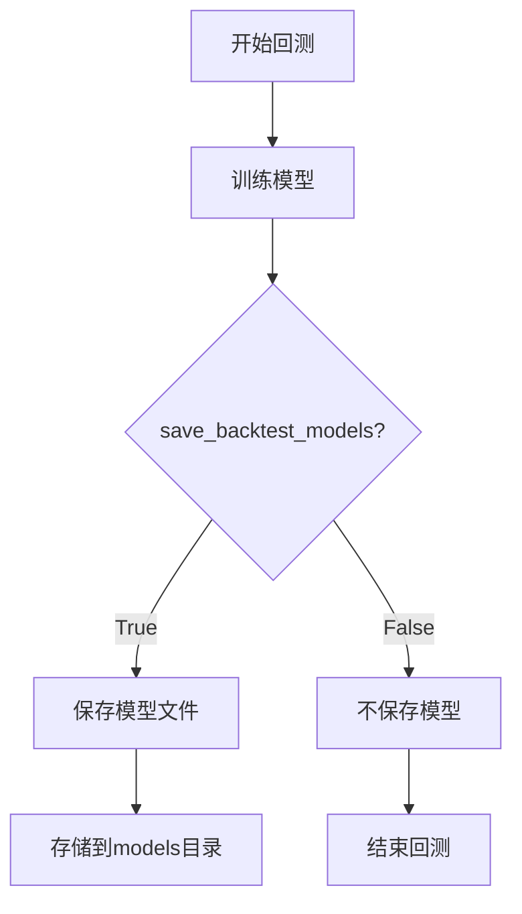
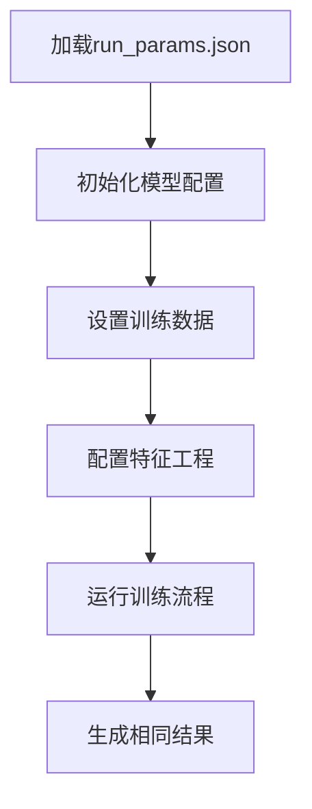
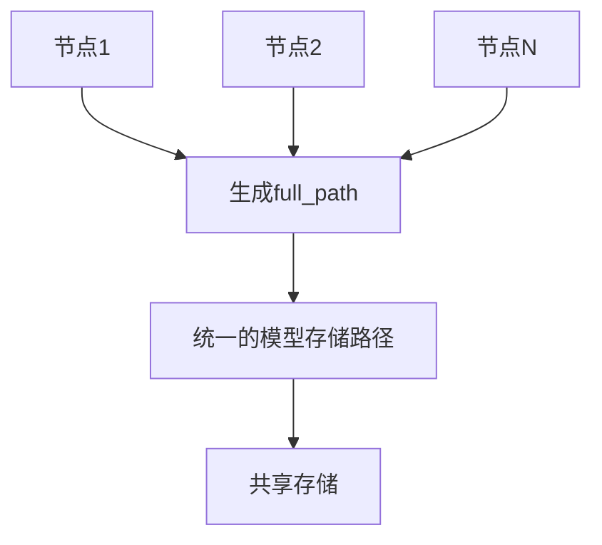

# 模型标识与存储管理

<cite>
**Referenced Files in This Document**   
- [backtesting.py](file://freqtrade/optimize/backtesting.py)
- [data_kitchen.py](file://freqtrade/freqai/data_kitchen.py)
- [directory_operations.py](file://freqtrade/configuration/directory_operations.py)
</cite>

## 目录
1. [简介](#简介)
2. [模型文件路径生成与版本控制](#模型文件路径生成与版本控制)
3. [回测场景下的模型保存策略](#回测场景下的模型保存策略)
4. [运行参数记录与实验复现](#运行参数记录与实验复现)
5. [分布式训练环境中的路径应用](#分布式训练环境中的路径应用)

## 简介
本文档详细阐述了Freqtrade系统中模型标识与存储管理的核心机制。重点分析了identifier参数在模型文件路径生成和版本控制中的关键作用，说明了如何通过不同的identifier实现多实验管理。同时，文档解释了save_backtest_models参数在回测场景下的模型保存策略，以及purge_old_models机制如何根据max_model_count限制磁盘占用。此外，还介绍了如何利用run_params.json实现完全可复现的实验，并说明了full_path生成规则在分布式训练环境中的应用注意事项。

## 模型文件路径生成与版本控制

### identifier参数的核心作用
`identifier`参数在Freqtrade的FreqAI模块中扮演着至关重要的角色，主要用于模型文件路径的生成和版本控制。该参数的值直接决定了模型存储的目录结构，使得不同实验的模型可以被有效隔离和管理。

当进行模型训练和回测时，系统会根据配置中的`identifier`值创建一个唯一的模型存储路径。这个路径通常位于用户数据目录下的`models`文件夹中，格式为`user_data_dir/models/{identifier}`。通过为不同的实验设置不同的`identifier`，用户可以轻松地管理多个实验的模型文件，避免命名冲突和版本混淆。

`identifier`不仅用于路径生成，还作为实验的唯一标识符，帮助用户追踪和比较不同实验的结果。在进行多实验管理时，用户可以通过切换`identifier`来快速切换不同的模型配置和训练数据，从而实现高效的实验迭代和性能对比。

```mermaid
graph TD
A[配置文件] --> B[读取identifier参数]
B --> C[生成模型存储路径]
C --> D[models/{identifier}]
D --> E[存储训练模型]
D --> F[存储回测结果]
D --> G[存储特征数据]
```

**Diagram sources**
- [data_kitchen.py](file://freqtrade/freqai/data_kitchen.py#L34-L1033)

**Section sources**
- [data_kitchen.py](file://freqtrade/freqai/data_kitchen.py#L34-L1033)

### 多实验管理机制
通过使用不同的`identifier`，Freqtrade支持高效的多实验管理。每个`identifier`对应一个独立的实验环境，包括模型文件、训练数据和回测结果。这种设计使得用户可以并行运行多个实验，而不会相互干扰。

在实际应用中，用户可以根据实验目的为`identifier`赋予有意义的名称，例如`experiment_v1`、`baseline_model`或`optimized_strategy`。这样不仅便于识别和管理，还能在团队协作中提供清晰的实验上下文。

此外，`identifier`还与模型的版本控制紧密相关。每次使用相同的`identifier`进行训练时，系统会自动覆盖旧的模型文件，确保始终使用最新的模型进行预测。这种机制简化了模型更新流程，同时保留了历史实验的完整记录。

## 回测场景下的模型保存策略

### save_backtest_models参数
`save_backtest_models`参数控制着在回测场景下是否保存训练好的模型。当该参数设置为`True`时，系统会在每次回测后保存模型文件，以便后续分析和复用。这对于需要反复验证和优化策略的场景非常有用。

保存的模型文件包含了训练过程中学到的所有参数和特征，可以用于后续的预测或作为其他实验的起点。通过保存回测模型，用户可以深入分析模型在不同市场条件下的表现，识别潜在的过拟合问题，并进行更精细的调优。



**Diagram sources**
- [data_kitchen.py](file://freqtrade/freqai/data_kitchen.py#L34-L1033)

**Section sources**
- [data_kitchen.py](file://freqtrade/freqai/data_kitchen.py#L34-L1033)

### purge_old_models机制
为了防止磁盘空间被过多的旧模型文件占用，Freqtrade提供了`purge_old_models`机制。该机制根据`max_model_count`参数限制每个实验目录中保存的模型文件数量。

当模型文件数量超过`max_model_count`时，系统会自动删除最旧的模型文件，确保磁盘占用在可控范围内。这种策略既保留了足够的历史模型用于分析，又避免了无限制的存储增长。

`max_model_count`的设置需要根据具体的使用场景和存储容量进行权衡。对于频繁进行实验的用户，可以设置较高的值以保留更多的历史记录；而对于存储空间有限的环境，则应适当降低该值。

## 运行参数记录与实验复现

### record_params函数
`record_params`函数负责记录每次运行的参数配置，是实现完全可复现实验的关键组件。该函数会将所有相关的配置参数、训练数据信息和模型设置保存到一个JSON文件中，通常命名为`run_params.json`。

通过记录完整的运行参数，用户可以在任何时候精确地重现之前的实验。这对于验证实验结果、进行性能对比和分享研究成果至关重要。`run_params.json`文件包含了所有必要的信息，包括但不限于：
- 模型配置参数
- 训练数据范围
- 特征工程设置
- 优化目标函数

### run_params.json的复现方法
利用`run_params.json`文件，用户可以轻松实现完全可复现的实验。具体步骤如下：
1. 将`run_params.json`文件加载到新的实验配置中
2. 使用记录的参数初始化模型和训练环境
3. 运行相同的训练和回测流程

这种方法确保了实验条件的一致性，消除了因参数微小差异导致的结果波动。对于科学研究和策略开发来说，这种可复现性是保证结果可靠性的基础。



**Diagram sources**
- [data_kitchen.py](file://freqtrade/freqai/data_kitchen.py#L34-L1033)

**Section sources**
- [data_kitchen.py](file://freqtrade/freqai/data_kitchen.py#L34-L1033)

## 分布式训练环境中的路径应用

### full_path生成规则
在分布式训练环境中，`full_path`的生成规则需要特别注意。`full_path`是模型文件的完整存储路径，由用户数据目录、模型目录和`identifier`共同构成。

在分布式环境下，确保所有节点使用相同的`full_path`规则至关重要。这要求：
- 所有节点共享相同的用户数据目录
- `identifier`在所有节点上保持一致
- 文件系统权限设置正确，确保所有节点都能读写模型文件



**Diagram sources**
- [data_kitchen.py](file://freqtrade/freqai/data_kitchen.py#L34-L1033)

**Section sources**
- [data_kitchen.py](file://freqtrade/freqai/data_kitchen.py#L34-L1033)

### 分布式环境注意事项
在分布式训练环境中应用`full_path`时，需要注意以下几点：
1. **网络延迟**：频繁的模型文件读写可能受到网络延迟的影响，建议使用高速网络连接。
2. **并发访问**：多个节点同时访问同一模型文件可能导致冲突，需要实现适当的锁机制。
3. **存储容量**：分布式环境通常涉及大量数据，需要确保共享存储有足够的容量。
4. **数据一致性**：确保所有节点看到的模型文件视图一致，避免因缓存导致的数据不一致问题。

通过合理规划和配置，`full_path`机制可以在分布式环境中高效运行，支持大规模的模型训练和回测任务。