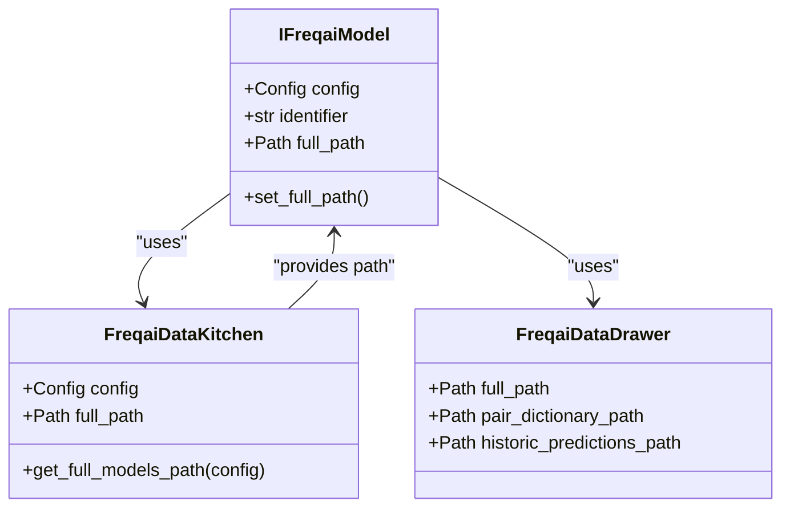
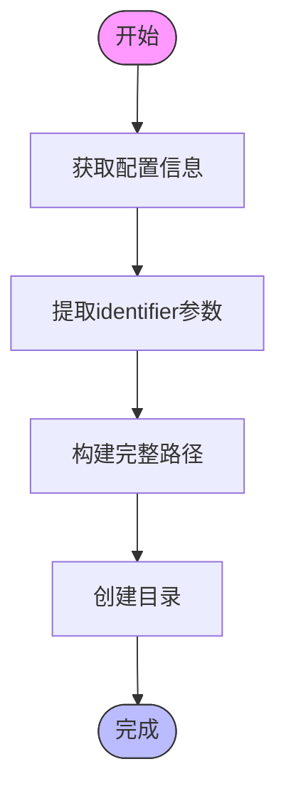

# 模型标识与路径生成

<cite>
**Referenced Files in This Document**   
- [IFreqaiModel.py](file://freqtrade/freqai/freqai_interface.py)
- [data_kitchen.py](file://freqtrade/freqai/data_kitchen.py)
- [data_drawer.py](file://freqtrade/freqai/data_drawer.py)
</cite>

## 目录
1. [简介](#简介)
2. [identifier参数的核心作用](#identifier参数的核心作用)
3. [路径生成机制分析](#路径生成机制分析)
4. [多实验管理中的实际应用](#多实验管理中的实际应用)
5. [代码示例与目录结构影响](#代码示例与目录结构影响)
6. [模型版本控制与实验隔离策略](#模型版本控制与实验隔离策略)
7. [结论](#结论)

## 简介
本文档详细阐述了FreqAI模型持久化中identifier参数的核心作用。identifier参数作为模型的唯一标识符，不仅影响模型文件的存储路径生成，还在多实验管理和模型版本控制中发挥着关键作用。通过分析set_full_path方法如何结合user_data_dir和identifier创建唯一的模型存储目录，本文将展示该机制在实际应用中的重要性。

## identifier参数的核心作用

identifier参数在FreqAI模型持久化中扮演着至关重要的角色。它作为模型的唯一标识符，直接影响模型文件的存储路径生成。在FreqAI系统中，identifier参数通过`IFreqaiModel`类的初始化过程被设置，其值来源于配置文件中的`freqai`部分。



**Diagram sources**
- [IFreqaiModel.py](file://freqtrade/freqai/freqai_interface.py#L68)
- [data_kitchen.py](file://freqtrade/freqai/data_kitchen.py#L959)
- [data_drawer.py](file://freqtrade/freqai/data_drawer.py#L34)

**Section sources**
- [IFreqaiModel.py](file://freqtrade/freqai/freqai_interface.py#L58-L117)

## 路径生成机制分析

路径生成机制的核心在于`set_full_path`方法，该方法结合`user_data_dir`和`identifier`创建唯一的模型存储目录。当`IFreqaiModel`被初始化时，`set_full_path`方法被调用，根据配置中的`user_data_dir`和`identifier`构建完整的路径。

```python
def set_full_path(self) -> None:
    """
    Creates and sets the full path for the identifier
    """
    self.full_path = Path(self.config["user_data_dir"] / "models" / f"{self.identifier}")
    self.full_path.mkdir(parents=True, exist_ok=True)
```

此方法确保了每个具有不同identifier的模型都有其独立的存储空间，避免了模型文件的冲突。同时，`get_full_models_path`方法在`FreqaiDataKitchen`类中提供了类似的路径生成功能，确保了路径的一致性和可预测性。



**Diagram sources**
- [IFreqaiModel.py](file://freqtrade/freqai/freqai_interface.py#L583)
- [data_kitchen.py](file://freqtrade/freqai/data_kitchen.py#L959)

**Section sources**
- [IFreqaiModel.py](file://freqtrade/freqai/freqai_interface.py#L583-L588)
- [data_kitchen.py](file://freqtrade/freqai/data_kitchen.py#L959-L965)

## 多实验管理中的实际应用

在多实验管理中，identifier参数的命名策略对于实验的隔离和管理至关重要。通过为不同的实验设置不同的identifier，可以轻松地在多个实验之间切换，而不会影响其他实验的数据和模型。

例如，当进行参数调优时，可以为每个参数组合设置一个独特的identifier，如`experiment_v1`, `experiment_v2`等。这样，每个实验的模型和数据都会被存储在独立的目录中，便于后续的分析和比较。

此外，identifier参数还支持模型的版本控制。通过在identifier中包含版本信息，如`model_v1_0`, `model_v2_0`等，可以轻松地管理和回滚到特定版本的模型。

## 代码示例与目录结构影响

以下代码示例展示了不同identifier配置对目录结构的影响：

```python
# 示例1：基础配置
config = {
    "user_data_dir": "/path/to/user_data",
    "freqai": {
        "identifier": "experiment_v1"
    }
}
# 生成的目录结构：/path/to/user_data/models/experiment_v1/

# 示例2：版本控制
config = {
    "user_data_dir": "/path/to/user_data",
    "freqai": {
        "identifier": "model_v2_0"
    }
}
# 生成的目录结构：/path/to/user_data/models/model_v2_0/
```

通过这些示例可以看出，identifier参数直接决定了模型文件的存储位置，从而影响了整个项目的目录结构。

## 模型版本控制与实验隔离策略

为了实现有效的模型版本控制和实验隔离，建议采用以下策略：

1. **命名规范**：为identifier参数制定统一的命名规范，如`project_name_experiment_version`，以确保命名的一致性和可读性。
2. **版本管理**：在identifier中包含版本信息，便于追踪和管理不同版本的模型。
3. **实验隔离**：为每个实验分配唯一的identifier，确保实验之间的数据和模型不会相互干扰。

通过这些策略，可以有效地管理多个实验和模型版本，提高开发效率和模型的可维护性。

## 结论
identifier参数在FreqAI模型持久化中起着至关重要的作用。它不仅影响模型文件的存储路径生成，还在多实验管理和模型版本控制中发挥着关键作用。通过合理设置identifier参数，可以实现模型的有效管理和版本控制，提高开发效率和模型的可维护性。