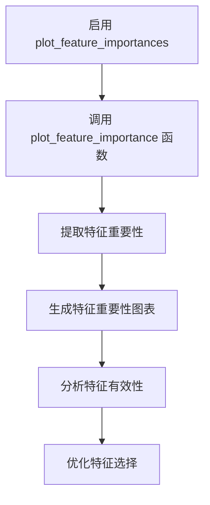

# 模型行为配置

<cite>
**本文档中引用的文件**   
- [config.json](file://user_data/config.json)
- [utils.py](file://freqtrade/freqai/utils.py)
- [data_kitchen.py](file://freqtrade/freqai/data_kitchen.py)
- [freqai_interface.py](file://freqtrade/freqai/freqai_interface.py)
</cite>

## 目录
1. [简介](#简介)
2. [特征工程与目标定义](#特征工程与目标定义)
3. [模型训练与数据划分](#模型训练与数据划分)
4. [模型持久化与版本管理](#模型持久化与版本管理)
5. [调试与监控](#调试与监控)
6. [特征重要性分析](#特征重要性分析)
7. [结论](#结论)

## 简介
本文档详细介绍了如何通过配置文件（config.json）中的freqai参数来调整和优化FreqAI模型的行为。重点说明了feature_parameters中关键参数的作用及其对特征工程和目标定义的影响，解释了model_training_parameters如何控制训练过程的超参数，以及data_split_parameters对数据划分的影响。同时，阐述了identifier参数在模型持久化和版本管理中的重要性，并说明了save_backtest_models、activate_tensorboard等调试与监控选项的使用场景。最后，介绍了如何通过plot_feature_importances参数启用特征重要性分析，并结合utils.py中的工具函数进行模型性能评估。

**Section sources**
- [config.json](file://user_data/config.json#L0-L93)

## 特征工程与目标定义

在FreqAI系统中，`feature_parameters` 是配置文件中的核心部分，它直接决定了特征工程和目标定义的方式。该参数包含多个关键子参数，如 `label_period_candles`、`include_timeframes` 和 `indicator_periods_candles`，这些参数共同作用于模型的输入数据生成过程。

`label_period_candles` 参数定义了用于生成标签的时间周期长度，即模型预测目标的时间跨度。例如，如果设置为5，则模型将基于未来5个K线的价格变动来生成标签。这直接影响了模型的学习目标，是分类还是回归任务的关键设定。

`include_timeframes` 参数指定了用于提取特征的多个时间框架。通过多时间框架分析，模型可以获得更丰富的市场信息，从而提高预测准确性。例如，同时使用15分钟和1小时的时间框架可以捕捉到短期波动和长期趋势。

`indicator_periods_candles` 参数则定义了技术指标计算时所使用的K线数量。不同的指标周期会影响特征的敏感度和稳定性，合理设置这些周期有助于避免过拟合或欠拟合问题。

此外，`include_shifted_candles` 参数允许将历史K线特征进行位移，以增加特征的多样性。而 `buffer_train_data_candles` 参数则用于在训练数据的开始和结束处添加缓冲区，确保边缘数据的完整性。

**Section sources**
- [freqai_interface.py](file://freqtrade/freqai/freqai_interface.py#L58-L117)
- [data_kitchen.py](file://freqtrade/freqai/data_kitchen.py#L777-L865)

## 模型训练与数据划分

`model_training_parameters` 和 `data_split_parameters` 是控制模型训练过程和数据划分的重要参数。`model_training_parameters` 包含了模型训练所需的超参数，如学习率、迭代次数等，这些参数直接影响模型的收敛速度和最终性能。

`data_split_parameters` 则定义了训练集和测试集的划分方式。通过调整 `test_size` 参数，用户可以控制训练集和测试集的比例，从而平衡模型的泛化能力和过拟合风险。此外，`shuffle` 参数决定了是否在划分数据前对数据进行随机打乱，这对于防止数据顺序带来的偏差非常重要。

在实际应用中，合理的数据划分策略对于模型的稳定性和可靠性至关重要。例如，在时间序列数据中，通常不建议随机打乱数据，因为这会破坏时间上的连续性。相反，应采用时间顺序划分的方法，确保训练集和测试集的时间连续性。

**Section sources**
- [freqai_interface.py](file://freqtrade/freqai/freqai_interface.py#L58-L117)
- [data_kitchen.py](file://freqtrade/freqai/data_kitchen.py#L127-L210)

## 模型持久化与版本管理

`identifier` 参数在模型持久化和版本管理中扮演着至关重要的角色。每个模型实例都有一个唯一的标识符，这个标识符不仅用于区分不同的模型，还用于保存和加载模型的状态。通过设置不同的 `identifier`，用户可以在同一配置下运行多个独立的模型实验，便于对比不同参数设置的效果。

当 `identifier` 被重用时，系统会尝试加载之前保存的模型状态，从而实现模型的持续学习和更新。这种机制特别适用于需要长期运行的交易策略，因为它允许模型在新数据到来时自动更新，而无需从头开始训练。

此外，`save_backtest_models` 参数控制是否在回测过程中保存所有模型。启用此选项可以帮助用户更好地理解模型在不同时间段的表现，并为后续的优化提供依据。

**Section sources**
- [freqai_interface.py](file://freqtrade/freqai/freqai_interface.py#L58-L117)
- [data_kitchen.py](file://freqtrade/freqai/data_kitchen.py#L589-L593)

## 调试与监控

为了帮助用户更好地理解和优化模型，FreqAI提供了多种调试与监控选项。`activate_tensorboard` 参数允许用户激活TensorBoard，这是一个强大的可视化工具，可以实时监控模型的训练过程，包括损失函数的变化、梯度分布等关键指标。

通过TensorBoard，用户可以直观地观察到模型的训练动态，及时发现潜在的问题，如过拟合或欠拟合。此外，`write_metrics_to_disk` 参数可以将训练过程中的各种度量指标写入磁盘，方便后续分析和报告生成。

这些调试与监控功能极大地提高了模型开发的透明度和可控性，使得用户能够更加自信地部署和维护复杂的机器学习模型。

**Section sources**
- [freqai_interface.py](file://freqtrade/freqai/freqai_interface.py#L58-L117)
- [tensorboard.py](file://freqtrade/freqai/tensorboard/tensorboard.py#L1-L100)

## 特征重要性分析

`plot_feature_importances` 参数允许用户启用特征重要性分析，这对于理解模型决策过程和优化特征选择至关重要。通过调用 `plot_feature_importance` 函数，用户可以获得模型中各个特征的重要性排名，从而识别出对预测结果影响最大的特征。

该函数支持多种常见的机器学习库，如CatBoost、LightGBM和XGBoost，能够自动提取并展示特征重要性。生成的图表不仅显示了最重要的特征，还展示了最不重要的特征，帮助用户全面了解特征的有效性。

结合 `utils.py` 中的工具函数，用户可以进一步分析模型性能，例如通过绘制特征重要性图来指导特征工程的改进方向。

**Diagram sources**
- [utils.py](file://freqtrade/freqai/utils.py#L93-L154)

**Section sources**
- [utils.py](file://freqtrade/freqai/utils.py#L93-L154)

## 结论
通过合理配置 `freqai` 参数，用户可以有效地调整和优化FreqAI模型的行为。从特征工程到模型训练，再到调试与监控，每一个环节都至关重要。特别是 `identifier` 参数在模型持久化和版本管理中的作用，以及 `plot_feature_importances` 参数在特征重要性分析中的应用，为用户提供了强大的工具来提升模型性能。希望本文档能帮助用户更好地理解和利用这些高级功能，构建更加智能和可靠的交易策略。