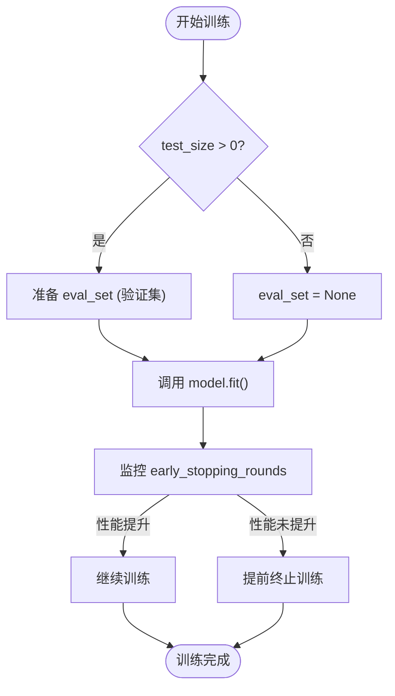
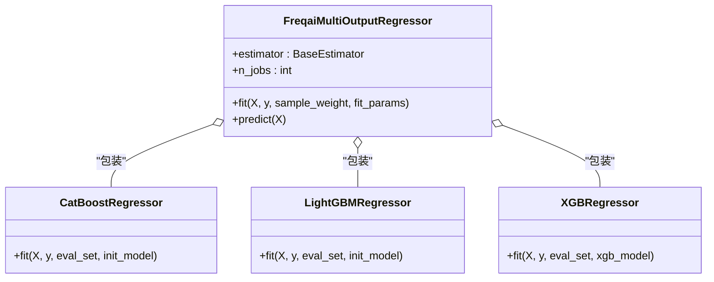

# 传统机器学习模型超参数

<cite>
**本文档中引用的文件**  
- [CatboostRegressor.py](file://freqtrade/freqai/prediction_models/CatboostRegressor.py)
- [LightGBMRegressor.py](file://freqtrade/freqai/prediction_models/LightGBMRegressor.py)
- [XGBoostRegressor.py](file://freqtrade/freqai/prediction_models/XGBoostRegressor.py)
- [CatboostRegressorMultiTarget.py](file://freqtrade/freqai/prediction_models/CatboostRegressorMultiTarget.py)
- [LightGBMRegressorMultiTarget.py](file://freqtrade/freqai/prediction_models/LightGBMRegressorMultiTarget.py)
- [XGBoostRegressorMultiTarget.py](file://freqtrade/freqai/prediction_models/XGBoostRegressorMultiTarget.py)
- [CatboostClassifier.py](file://freqtrade/freqai/prediction_models/CatboostClassifier.py)
- [LightGBMClassifier.py](file://freqtrade/freqai/prediction_models/LightGBMClassifier.py)
- [XGBoostClassifier.py](file://freqtrade/freqai/prediction_models/XGBoostClassifier.py)
- [CatboostClassifierMultiTarget.py](file://freqtrade/freqai/prediction_models/CatboostClassifierMultiTarget.py)
- [LightGBMClassifierMultiTarget.py](file://freqtrade/freqai/prediction_models/LightGBMClassifierMultiTarget.py)
- [BaseRegressionModel.py](file://freqtrade/freqai/base_models/BaseRegressionModel.py)
- [BaseClassifierModel.py](file://freqtrade/freqai/base_models/BaseClassifierModel.py)
- [FreqaiMultiOutputRegressor.py](file://freqtrade/freqai/base_models/FreqaiMultiOutputRegressor.py)
- [FreqaiMultiOutputClassifier.py](file://freqtrade/freqai/base_models/FreqaiMultiOutputClassifier.py)
</cite>

## 目录
1. [简介](#简介)
2. [核心超参数配置](#核心超参数配置)
3. [正则化与树结构参数](#正则化与树结构参数)
4. [集成学习与训练控制参数](#集成学习与训练控制参数)
5. [早停机制与验证集配置](#早停机制与验证集配置)
6. [多目标回归模型参数配置](#多目标回归模型参数配置)
7. [分类与回归任务的参数差异](#分类与回归任务的参数差异)
8. [结论](#结论)

## 简介
本文档详细说明在Freqtrade框架中，如何为Catboost、LightGBM和XGBoost等传统梯度提升树模型配置训练超参数。文档涵盖模型训练中的关键参数设置，包括集成参数、正则化参数、树结构控制参数以及早停机制的实现方式。同时，分析多目标预测模型的特殊配置要求，并对比分类与回归任务在参数使用上的差异。

**Section sources**
- [BaseRegressionModel.py](file://freqtrade/freqai/base_models/BaseRegressionModel.py#L1-L132)
- [BaseClassifierModel.py](file://freqtrade/freqai/base_models/BaseClassifierModel.py#L1-L130)

## 核心超参数配置
在Freqtrade中，Catboost、LightGBM和XGBoost模型的核心超参数通过`model_training_parameters`字典统一配置。这些参数包括：

- **n_estimators**: 决定集成模型中弱学习器（决策树）的数量。数值越大模型越复杂，但可能过拟合。
- **max_depth**: 控制每棵决策树的最大深度，限制模型复杂度以防止过拟合。
- **learning_rate**: 学习率，控制每棵树对最终预测结果的贡献程度。较小的学习率需要更多的树来收敛。
- **subsample**: 训练每棵树时使用的样本比例，用于引入随机性，增强模型泛化能力。
- **colsample_bytree**: 训练每棵树时使用的特征比例，通过特征随机采样降低过拟合风险。

这些参数通过`**self.model_training_parameters`传递给各模型构造函数，在`fit`方法中实例化模型时应用。

**Section sources**
- [CatboostRegressor.py](file://freqtrade/freqai/prediction_models/CatboostRegressor.py#L35-L40)
- [LightGBMRegressor.py](file://freqtrade/freqai/prediction_models/LightGBMRegressor.py#L34-L36)
- [XGBoostRegressor.py](file://freqtrade/freqai/prediction_models/XGBoostRegressor.py#L38-L40)

## 正则化与树结构参数
模型通过多种参数控制正则化和树结构以提升泛化性能：

- **l1/l2_regularization**: L1和L2正则化参数（如XGBoost的`reg_alpha`和`reg_lambda`）用于惩罚模型复杂度，防止过拟合。
- **min_data_in_leaf**: LightGBM中的参数，指定叶节点所需的最小样本数，防止生成过细的树分支。
- **min_child_samples**: 与`min_data_in_leaf`类似，控制分裂后子节点的最小样本量。
- **max_bin**: LightGBM中用于控制特征值分箱的数量，影响训练速度和模型精度。

这些参数均包含在`model_training_parameters`中，根据所选模型类型自动适配。

**Section sources**
- [LightGBMRegressor.py](file://freqtrade/freqai/prediction_models/LightGBMRegressor.py#L34)
- [XGBoostRegressor.py](file://freqtrade/freqai/prediction_models/XGBoostRegressor.py#L38)

## 集成学习与训练控制参数
Freqtrade支持通过以下参数控制集成学习行为：

- **bagging_temperature**: Catboost特有参数，控制Bootstrap样本的温度，影响样本权重分布。
- **thread_training**: 通过`multitarget_parallel_training`配置项控制是否启用多目标并行训练。当设置为`True`时，`FreqaiMultiOutputRegressor`的`n_jobs`将设置为目标变量数量，实现并行化训练。
- **init_model**: 支持从先前训练的模型继续训练（增量学习），通过`get_init_model`方法获取初始模型。

这些参数在`fit`方法中根据`freqai_info`配置动态调整。

**Section sources**
- [CatboostRegressorMultiTarget.py](file://freqtrade/freqai/prediction_models/CatboostRegressorMultiTarget.py#L70-L73)
- [LightGBMRegressorMultiTarget.py](file://freqtrade/freqai/prediction_models/LightGBMRegressorMultiTarget.py#L68-L71)

## 早停机制与验证集配置
所有模型均支持早停机制，通过`eval_set`参数实现：

- 在`fit`方法中，若`test_size`大于0，则使用测试集作为验证集。
- **Catboost**: 使用`Pool`对象封装验证集，通过`eval_set`参数传入。
- **LightGBM**: 将测试特征和标签作为元组列表传入`eval_set`。
- **XGBoost**: 支持多个评估集，通常将测试集和训练集都作为评估集传入。

早停轮数`early_stopping_rounds`作为`model_training_parameters`的一部分，在模型构造时设置，训练过程中若验证集性能不再提升则提前终止。

**Diagram sources**
- [CatboostRegressor.py](file://freqtrade/freqai/prediction_models/CatboostRegressor.py#L25-L50)
- [LightGBMRegressor.py](file://freqtrade/freqai/prediction_models/LightGBMRegressor.py#L25-L45)
- [XGBoostRegressor.py](file://freqtrade/freqai/prediction_models/XGBoostRegressor.py#L25-L50)

## 多目标回归模型参数配置
对于多目标回归任务，Freqtrade使用`FreqaiMultiOutputRegressor`包装器：

- 每个目标变量独立训练一个模型，支持不同的`fit_params`（如不同的`eval_set`和`init_model`）。
- `fit_params`为列表，每个元素对应一个目标的训练参数。
- 支持并行训练，通过设置`n_jobs`等于目标数量来加速训练过程。
- 所有基础模型参数仍通过`model_training_parameters`统一配置。

多目标分类模型（如`CatboostClassifierMultiTarget`）采用相同的架构，使用`FreqaiMultiOutputClassifier`包装器。

**Diagram sources**
- [FreqaiMultiOutputRegressor.py](file://freqtrade/freqai/base_models/FreqaiMultiOutputRegressor.py#L1-L53)
- [CatboostRegressorMultiTarget.py](file://freqtrade/freqai/prediction_models/CatboostRegressorMultiTarget.py#L1-L79)
- [LightGBMRegressorMultiTarget.py](file://freqtrade/freqai/prediction_models/LightGBMRegressorMultiTarget.py#L1-L74)

**Section sources**
- [CatboostRegressorMultiTarget.py](file://freqtrade/freqai/prediction_models/CatboostRegressorMultiTarget.py#L1-L79)
- [LightGBMRegressorMultiTarget.py](file://freqtrade/freqai/prediction_models/LightGBMRegressorMultiTarget.py#L1-L74)
- [XGBoostRegressorMultiTarget.py](file://freqtrade/freqai/prediction_models/XGBoostRegressorMultiTarget.py#L1-L61)

## 分类与回归任务的参数差异
分类与回归模型在参数配置上存在以下关键差异：

- **损失函数**: 分类模型（如`CatboostClassifier`）显式设置`loss_function="MultiClass"`，而回归模型使用默认回归损失。
- **标签处理**: 分类模型需对非整数标签进行编码（如`XGBoostClassifier`使用`LabelEncoder`），回归模型直接使用连续值。
- **预测输出**: 分类模型除预测类别外，还输出各类别的概率（`predict_proba`），而回归模型仅输出预测值。
- **多目标实现**: 分类和回归的多目标版本分别继承自`FreqaiMultiOutputClassifier`和`FreqaiMultiOutputRegressor`，但训练逻辑相似。

尽管实现细节不同，两类任务的超参数配置接口保持一致，均通过`model_training_parameters`传入。

**Section sources**
- [CatboostClassifier.py](file://freqtrade/freqai/prediction_models/CatboostClassifier.py#L35-L37)
- [XGBoostClassifier.py](file://freqtrade/freqai/prediction_models/XGBoostClassifier.py#L30-L35)
- [XGBoostClassifier.py](file://freqtrade/freqai/prediction_models/XGBoostClassifier.py#L75-L88)

## 结论
Freqtrade为Catboost、LightGBM和XGBoost等传统机器学习模型提供了统一且灵活的超参数配置接口。通过`model_training_parameters`字典，用户可以精细控制模型的集成、正则化、树结构等关键参数。框架支持早停机制和多目标预测，并清晰区分了分类与回归任务的处理逻辑。这种设计既保证了模型性能的可调性，又维持了配置的一致性和易用性。