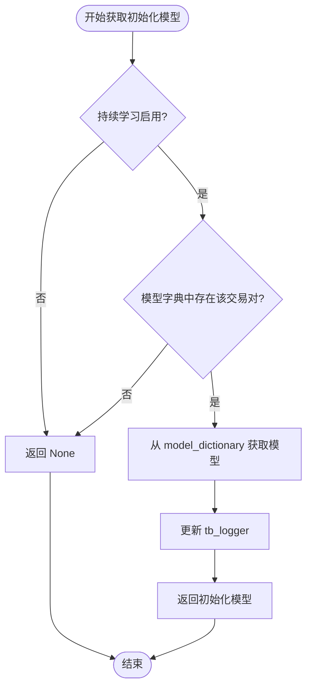
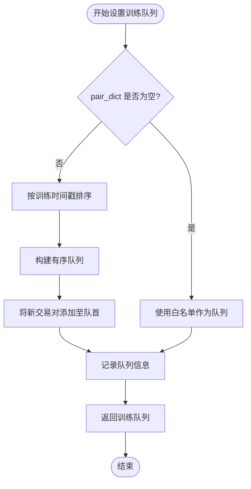

# 持续学习与在线更新

<cite>
**本文档中引用的文件**  
- [freqai_interface.py](file://freqtrade/freqai/freqai_interface.py)
- [data_drawer.py](file://freqtrade/freqai/data_drawer.py)
- [CatboostRegressor.py](file://freqtrade/freqai/prediction_models/CatboostRegressor.py)
- [LightGBMRegressor.py](file://freqtrade/freqai/prediction_models/LightGBMRegressor.py)
- [CatboostClassifier.py](file://freqtrade/freqai/prediction_models/CatboostClassifier.py)
- [LightGBMClassifier.py](file://freqtrade/freqai/prediction_models/LightGBMClassifier.py)
- [CatboostRegressorMultiTarget.py](file://freqtrade/freqai/prediction_models/CatboostRegressorMultiTarget.py)
- [LightGBMRegressorMultiTarget.py](file://freqtrade/freqai/prediction_models/LightGBMRegressorMultiTarget.py)
- [LightGBMClassifierMultiTarget.py](file://freqtrade/freqai/prediction_models/LightGBMClassifierMultiTarget.py)
- [CatboostClassifierMultiTarget.py](file://freqtrade/freqai/prediction_models/CatboostClassifierMultiTarget.py)
</cite>

## 目录
1. [持续学习机制](#持续学习机制)
2. [模型字典与内存管理](#模型字典与内存管理)
3. [初始化模型与权重继承](#初始化模型与权重继承)
4. [训练队列管理策略](#训练队列管理策略)
5. [并行训练控制与多线程实现](#并行训练控制与多线程实现)

## 持续学习机制

`continual_learning` 参数是实现模型增量更新的核心配置项。当该参数设置为 `True` 时，系统将启用持续学习模式，允许模型在已有训练成果的基础上进行增量训练，而非从零开始重新训练。此机制通过检查配置中的 `freqai` 模块是否存在 `continual_learning` 字段并获取其布尔值来激活。若未显式配置，则默认为 `False`。在持续学习模式下，系统会尝试从内存中的模型字典加载先前训练的模型作为新训练的初始化权重，从而提升训练效率并保持模型的连续性。

**节来源**
- [freqai_interface.py](file://freqtrade/freqai/freqai_interface.py#L99)

## 模型字典与内存管理

`model_dictionary` 是 `FreqaiDataDrawer` 类中的一个核心字典结构，用于在内存中维护所有已训练模型的引用。该字典以交易对（pair）为键，存储对应的模型实例，确保在需要时能够快速访问和复用。每当一个模型完成训练后，系统会将其引用存入 `model_dictionary`，以便后续训练或预测时直接调用。这种内存管理机制避免了频繁的磁盘I/O操作，显著提升了系统性能。同时，`model_dictionary` 与磁盘上的模型文件保持同步，确保即使在系统重启后也能恢复模型状态。

**节来源**
- [data_drawer.py](file://freqtrade/freqai/data_drawer.py#L75)

## 初始化模型与权重继承

`init_model` 参数在持续学习中扮演着关键角色，它决定了新训练过程是否基于先前训练的模型权重进行初始化。通过 `get_init_model` 方法，系统能够根据当前交易对从 `model_dictionary` 中获取对应的先前模型。如果 `continual_learning` 为 `True` 且该交易对已有训练记录，则返回对应的模型实例作为 `init_model`；否则返回 `None`，表示从零开始训练。此机制确保了模型能够在已有知识的基础上进行微调，有效避免了灾难性遗忘问题，并加速了模型收敛过程。

**图来源**
- [freqai_interface.py](file://freqtrade/freqai/freqai_interface.py#L755-L763)

**节来源**
- [freqai_interface.py](file://freqtrade/freqai/freqai_interface.py#L755-L763)

## 训练队列管理策略

训练队列（`train_queue`）的管理策略由 `_set_train_queue` 方法实现，该方法根据训练时间戳对交易对进行优先级排序。系统首先检查是否存在已有的训练时间戳记录，若不存在则直接使用当前交易对白名单作为训练队列。若存在历史记录，则按照训练时间戳升序排列交易对，确保最近未训练的交易对优先参与训练。对于白名单中新增的交易对，系统会将其添加到队列前端，保证新资产能够及时得到训练。此策略有效平衡了模型的新鲜度与训练资源的分配。

**图来源**
- [freqai_interface.py](file://freqtrade/freqai/freqai_interface.py#L765-L790)

**节来源**
- [freqai_interface.py](file://freqtrade/freqai/freqai_interface.py#L765-L790)

## 并行训练控制与多线程实现

`max_training_processes` 参数用于控制并行训练的进程数，防止系统资源耗尽。系统通过 `threading.Thread` 实现多线程训练，每个线程负责一个交易对的训练任务。训练线程在 `_start_scanning` 方法中启动，该方法持续监控训练队列并触发模型重训练。系统通过 `wait_for_training_iteration_on_reload` 配置项决定在关闭时是否等待当前训练迭代完成，确保训练过程的完整性。多线程机制结合训练队列的优先级调度，实现了高效的并行训练架构，同时通过资源监控避免了系统过载。

**节来源**
- [freqai_interface.py](file://freqtrade/freqai/freqai_interface.py#L93)
- [freqai_interface.py](file://freqtrade/freqai/freqai_interface.py#L_start_scanning)