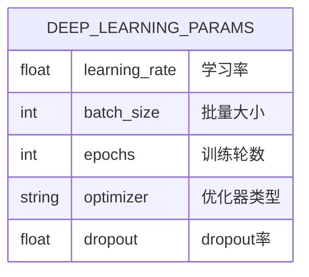
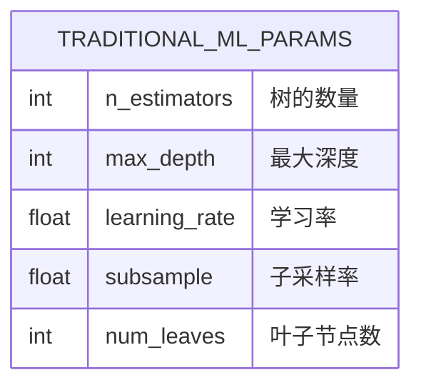
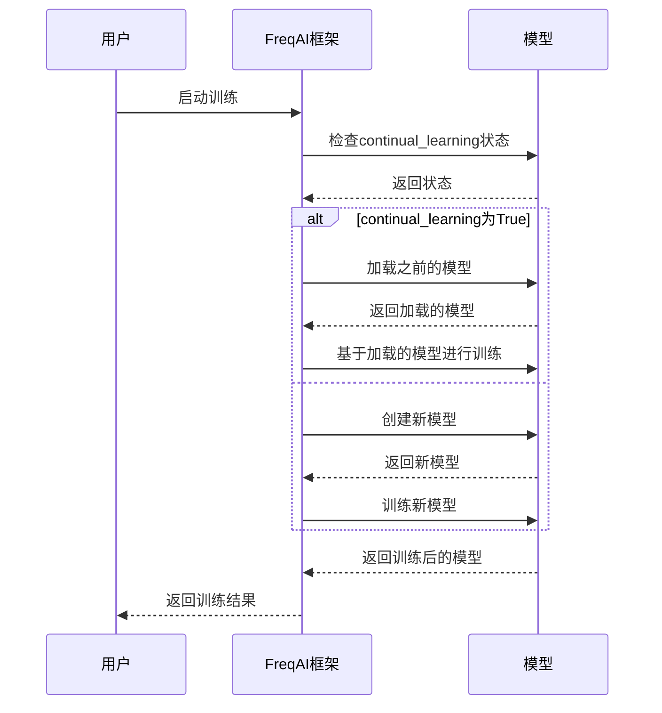
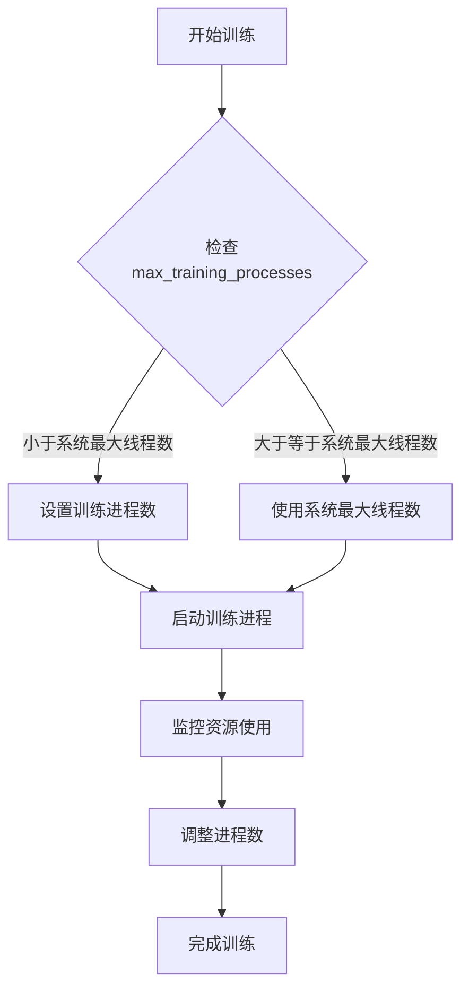
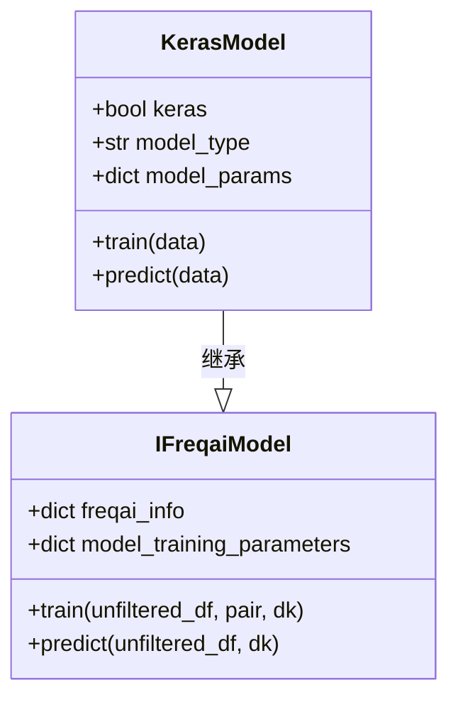
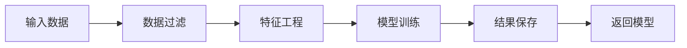
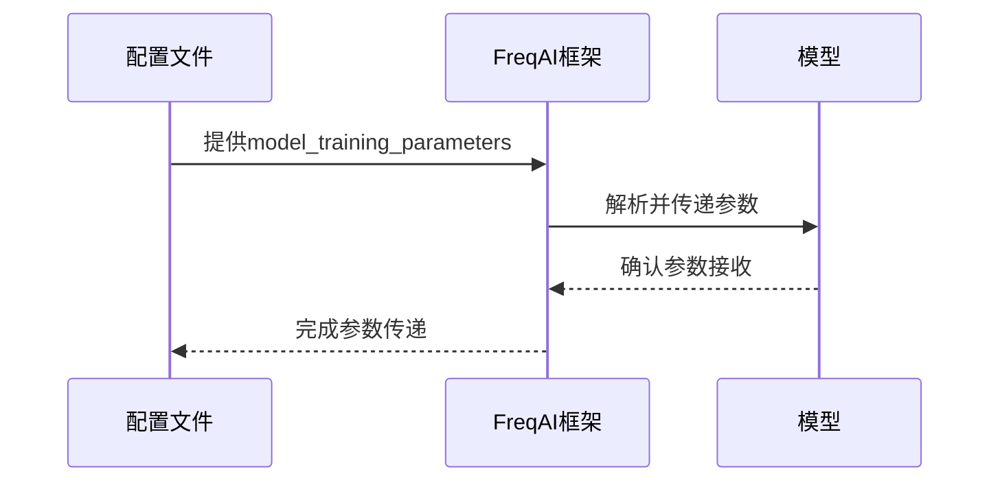
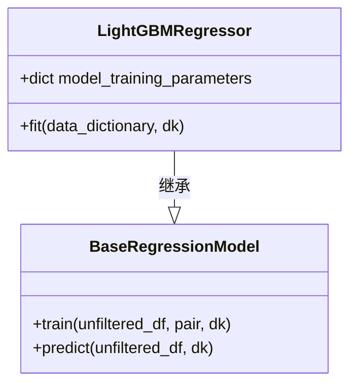
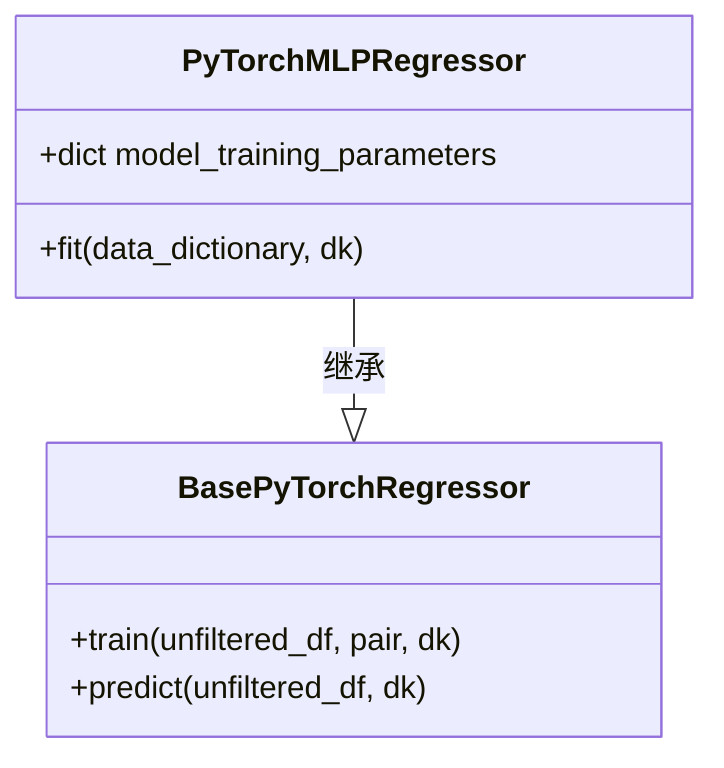

# 模型训练超参数

<cite>
**本文档中引用的文件**   
- [IFreqaiModel.py](file://freqtrade/freqai/freqai_interface.py)
- [BaseRegressionModel.py](file://freqtrade/freqai/base_models/BaseRegressionModel.py)
- [BaseClassifierModel.py](file://freqtrade/freqai/base_models/BaseClassifierModel.py)
- [BasePyTorchRegressor.py](file://freqtrade/freqai/base_models/BasePyTorchRegressor.py)
- [BasePyTorchClassifier.py](file://freqtrade/freqai/base_models/BasePyTorchClassifier.py)
- [BaseReinforcementLearningModel.py](file://freqtrade/freqai/RL/BaseReinforcementLearningModel.py)
- [XGBoostRegressor.py](file://freqtrade/freqai/prediction_models/XGBoostRegressor.py)
- [CatboostRegressor.py](file://freqtrade/freqai/prediction_models/CatboostRegressor.py)
- [LightGBMRegressor.py](file://freqtrade/freqai/prediction_models/LightGBMRegressor.py)
- [PyTorchMLPRegressor.py](file://freqtrade/freqai/prediction_models/PyTorchMLPRegressor.py)
- [config_freqai.example.json](file://config_examples/config_freqai.example.json)
</cite>

## 目录
1. [引言](#引言)
2. [核心训练超参数](#核心训练超参数)
3. [持续学习机制](#持续学习机制)
4. [多进程训练控制](#多进程训练控制)
5. [Keras模型集成](#keras模型集成)
6. [底层模型训练流程](#底层模型训练流程)
7. [超参数传递机制](#超参数传递机制)
8. [具体模型实现](#具体模型实现)

## 引言
本文档深入解析FreqAI框架中的模型训练超参数配置，涵盖深度学习与传统机器学习模型的关键参数。文档详细阐述了`batch_size`、`epochs`、`learning_rate`等深度学习相关参数，以及`n_estimators`、`max_depth`等传统机器学习模型参数的配置与作用。同时，文档解释了持续学习（continual_learning）功能如何实现模型的在线更新，以及`max_training_processes`对多进程训练的控制作用。此外，文档还说明了Keras参数在TensorFlow/Keras模型集成中的特殊配置要求，并结合`IFreqaiModel`类的`train`方法实现机制，展示超参数如何传递给底层预测模型（如Catboost、XGBoost、PyTorch等）。

## 核心训练超参数
FreqAI框架中的模型训练超参数主要分为深度学习和传统机器学习两大类。这些参数通过`model_training_parameters`字段在配置文件中进行设置，用于控制模型的训练过程和性能。

### 深度学习超参数
深度学习超参数主要用于控制神经网络的训练过程，包括学习率、批量大小、训练轮数等。这些参数在PyTorch模型中尤为重要，直接影响模型的收敛速度和最终性能。

**图表来源**
- [PyTorchMLPRegressor.py](file://freqtrade/freqai/prediction_models/PyTorchMLPRegressor.py#L1-L83)

### 传统机器学习超参数
传统机器学习超参数主要用于控制树模型等算法的训练过程，包括树的数量、最大深度、学习率等。这些参数在XGBoost、Catboost、LightGBM等模型中起着关键作用。

**图表来源**
- [XGBoostRegressor.py](file://freqtrade/freqai/prediction_models/XGBoostRegressor.py#L1-L60)
- [CatboostRegressor.py](file://freqtrade/freqai/prediction_models/CatboostRegressor.py#L1-L60)
- [LightGBMRegressor.py](file://freqtrade/freqai/prediction_models/LightGBMRegressor.py#L1-L54)

## 持续学习机制
持续学习（continual_learning）是FreqAI框架中的一个重要功能，它允许模型在不重新训练的情况下进行在线更新。这一机制通过`continual_learning`参数进行控制，当设置为`True`时，模型会在每次训练时基于之前的模型状态进行增量学习。

### 实现原理
持续学习的实现依赖于模型的初始化和状态保存。在`IFreqaiModel`类中，`get_init_model`方法负责获取初始模型，如果`continual_learning`被激活，该方法会从磁盘加载之前的模型作为初始状态。

**图表来源**
- [IFreqaiModel.py](file://freqtrade/freqai/freqai_interface.py#L35-L1039)
- [BaseReinforcementLearningModel.py](file://freqtrade/freqai/RL/BaseReinforcementLearningModel.py#L1-L510)

## 多进程训练控制
多进程训练控制通过`max_training_processes`参数实现，该参数限制了同时进行训练的进程数量。这一机制有助于平衡系统资源的使用，避免因过多的并发训练导致系统性能下降。

### 控制机制
`max_training_processes`参数在`IFreqaiModel`类的初始化过程中被读取，并用于设置系统的最大线程数。通过限制并发进程数量，系统可以更有效地管理CPU和内存资源。

**图表来源**
- [IFreqaiModel.py](file://freqtrade/freqai/freqai_interface.py#L35-L1039)

## Keras模型集成
Keras模型集成在FreqAI框架中具有特殊的配置要求。当使用Keras模型时，需要通过`keras`参数进行标识，以便框架正确处理模型的训练和预测过程。

### 特殊配置
Keras模型的特殊配置主要体现在数据预处理和模型保存方面。由于Keras模型的架构和训练方式与其他模型有所不同，框架需要进行相应的调整以确保兼容性。

**图表来源**
- [IFreqaiModel.py](file://freqtrade/freqai/freqai_interface.py#L35-L1039)
- [data_kitchen.py](file://freqtrade/freqai/data_kitchen.py#L1-L1033)

## 底层模型训练流程
底层模型的训练流程由`IFreqaiModel`类的`train`方法统一管理。该方法负责数据预处理、模型训练和结果返回，是整个训练过程的核心。

### 训练流程
训练流程包括数据过滤、特征工程、模型训练和结果保存等步骤。每个步骤都经过精心设计，以确保模型能够高效地学习和泛化。

**图表来源**
- [IFreqaiModel.py](file://freqtrade/freqai/freqai_interface.py#L953-L960)
- [BaseRegressionModel.py](file://freqtrade/freqai/base_models/BaseRegressionModel.py#L1-L131)
- [BaseClassifierModel.py](file://freqtrade/freqai/base_models/BaseClassifierModel.py#L1-L129)

## 超参数传递机制
超参数传递机制确保了配置文件中的参数能够正确地传递给底层模型。这一机制通过`model_training_parameters`字段实现，该字段包含了所有需要传递给模型的超参数。

### 传递过程
超参数的传递过程包括读取配置、解析参数和应用参数三个步骤。每个步骤都确保了参数的准确性和一致性。

**图表来源**
- [IFreqaiModel.py](file://freqtrade/freqai/freqai_interface.py#L65-L67)
- [XGBoostRegressor.py](file://freqtrade/freqai/prediction_models/XGBoostRegressor.py#L1-L60)
- [CatboostRegressor.py](file://freqtrade/freqai/prediction_models/CatboostRegressor.py#L1-L60)
- [LightGBMRegressor.py](file://freqtrade/freqai/prediction_models/LightGBMRegressor.py#L1-L54)

## 具体模型实现
具体模型的实现展示了不同模型如何利用超参数进行训练。以下是一些典型模型的实现示例。

### XGBoost回归模型
XGBoost回归模型通过`fit`方法实现具体的训练逻辑。该方法利用`model_training_parameters`中的参数来配置XGBoost模型，并进行训练。

**图表来源**
- [XGBoostRegressor.py](file://freqtrade/freqai/prediction_models/XGBoostRegressor.py#L1-L60)

### Catboost回归模型
Catboost回归模型同样通过`fit`方法实现训练逻辑。该方法利用`model_training_parameters`中的参数来配置Catboost模型，并进行训练。

**图表来源**
- [CatboostRegressor.py](file://freqtrade/freqai/prediction_models/CatboostRegressor.py#L1-L60)

### LightGBM回归模型
LightGBM回归模型通过`fit`方法实现训练逻辑。该方法利用`model_training_parameters`中的参数来配置LightGBM模型，并进行训练。

**图表来源**
- [LightGBMRegressor.py](file://freqtrade/freqai/prediction_models/LightGBMRegressor.py#L1-L54)

### PyTorch MLP回归模型
PyTorch MLP回归模型通过`fit`方法实现训练逻辑。该方法利用`model_training_parameters`中的参数来配置PyTorch模型，并进行训练。

**图表来源**
- [PyTorchMLPRegressor.py](file://freqtrade/freqai/prediction_models/PyTorchMLPRegressor.py#L1-L83)