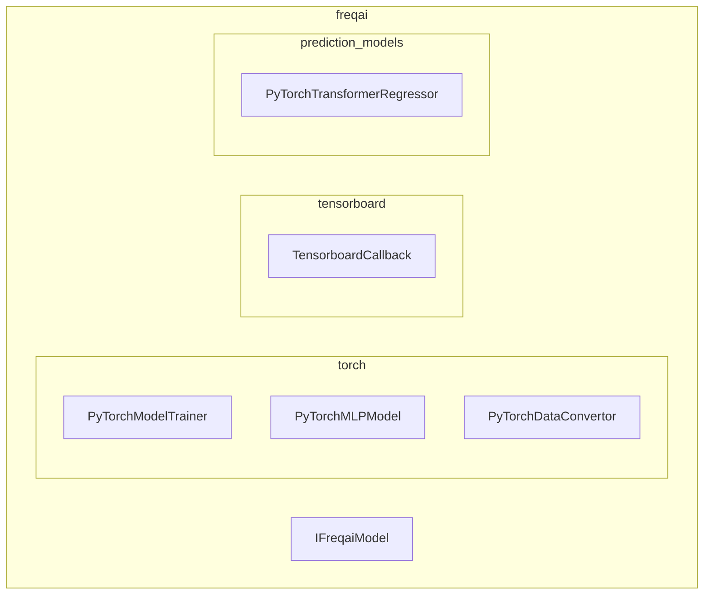
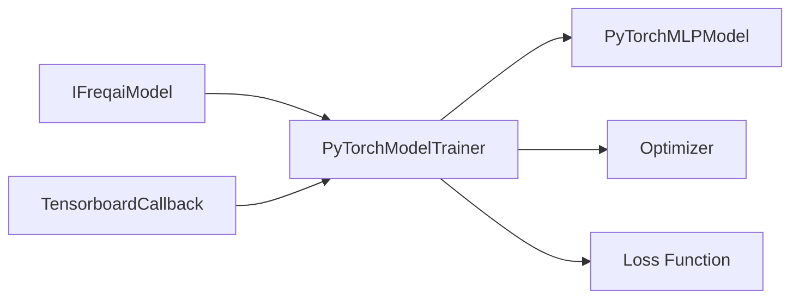
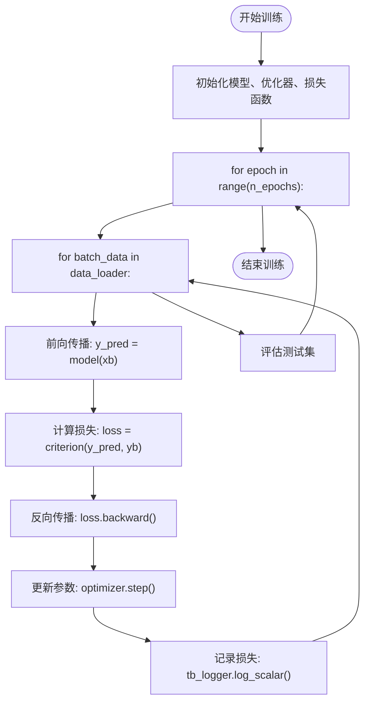
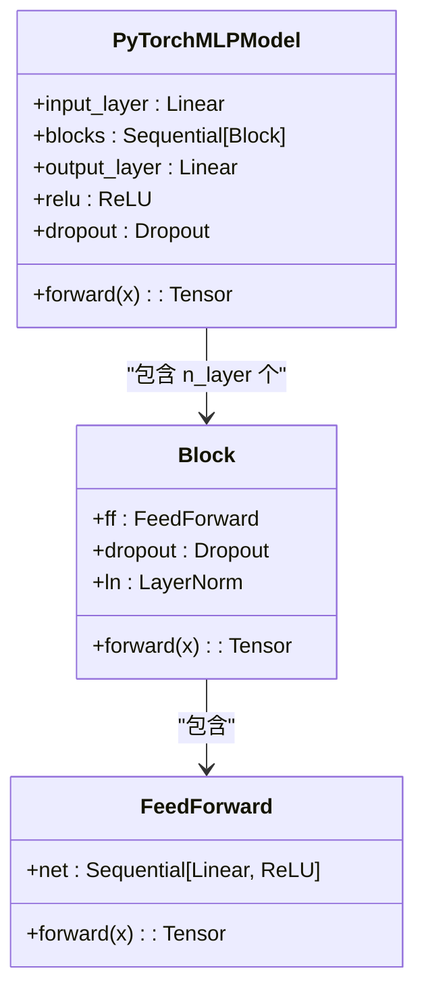
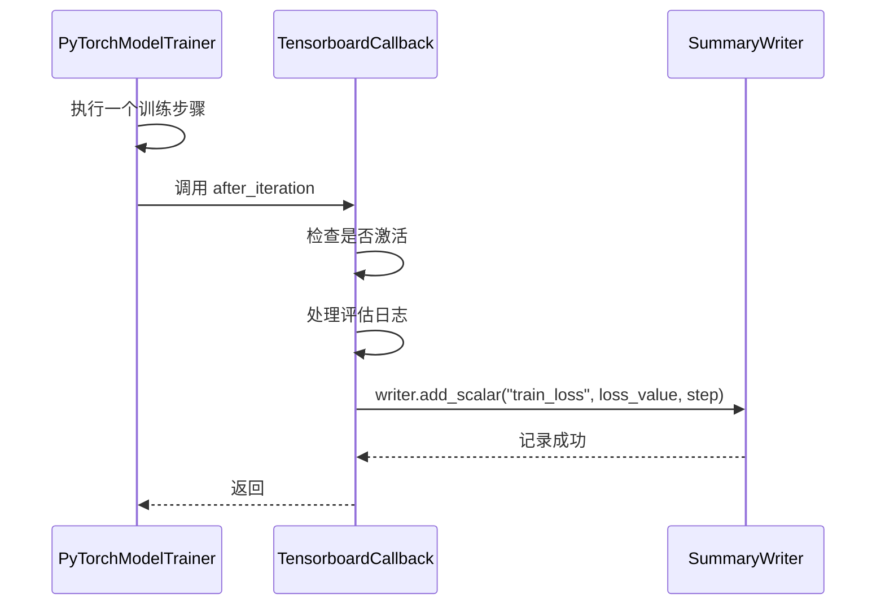
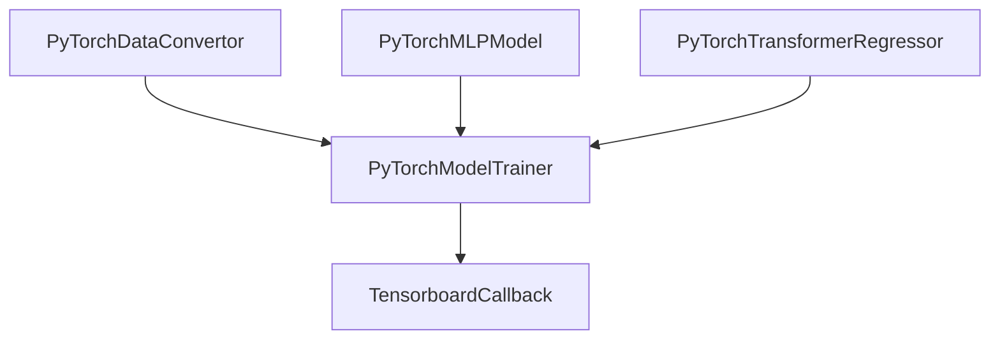

# 深度学习模型超参数

<cite>
**本文档中引用的文件**  
- [PyTorchModelTrainer.py](file://freqtrade/freqai/torch/PyTorchModelTrainer.py)
- [PyTorchMLPModel.py](file://freqtrade/freqai/torch/PyTorchMLPModel.py)
- [freqai_interface.py](file://freqtrade/freqai/freqai_interface.py)
- [TensorboardCallback.py](file://freqtrade/freqai/tensorboard/TensorboardCallback.py)
- [PyTorchTransformerRegressor.py](file://freqtrade/freqai/prediction_models/PyTorchTransformerRegressor.py)
</cite>

## 目录
1. [引言](#引言)
2. [项目结构](#项目结构)
3. [核心组件](#核心组件)
4. [架构概述](#架构概述)
5. [详细组件分析](#详细组件分析)
6. [依赖分析](#依赖分析)
7. [性能考量](#性能考量)
8. [故障排除指南](#故障排除指南)
9. [结论](#结论)

## 引言
本文档深入解析FreqAI模块中基于PyTorch和TensorFlow/Keras的深度学习模型训练超参数配置。重点涵盖`batch_size`、`epochs`、`learning_rate`、`optimizer_type`、`loss_function`等关键参数的配置方法。结合`PyTorchModelTrainer`类的实现，详细说明网络结构（如`hidden_layer_sizes`）、正则化参数（`dropout`、`weight_decay`）以及学习率调度器的配置。同时，文档将阐述训练循环中的梯度裁剪、早停机制（`early_stopping_patience`）和验证集划分（`validation_split`）的实现方式，并解释多工作器（`multi_worker`）模式下的分布式训练配置及如何通过TensorBoard回调监控训练过程。

## 项目结构
FreqAI模块的项目结构围绕机器学习模型的训练、推理和数据处理进行组织。核心功能位于`freqtrade/freqai`目录下，其中`torch`子目录包含PyTorch相关的模型和训练器实现，`tensorboard`子目录负责训练过程的可视化监控，`prediction_models`子目录则存放具体的模型实现（如MLP、Transformer等）。

**图示来源**
- [PyTorchModelTrainer.py](file://freqtrade/freqai/torch/PyTorchModelTrainer.py)
- [PyTorchMLPModel.py](file://freqtrade/freqai/torch/PyTorchMLPModel.py)
- [TensorboardCallback.py](file://freqtrade/freqai/tensorboard/TensorboardCallback.py)
- [PyTorchTransformerRegressor.py](file://freqtrade/freqai/prediction_models/PyTorchTransformerRegressor.py)
- [freqai_interface.py](file://freqtrade/freqai/freqai_interface.py)

**本节来源**
- [PyTorchModelTrainer.py](file://freqtrade/freqai/torch/PyTorchModelTrainer.py)
- [PyTorchMLPModel.py](file://freqtrade/freqai/torch/PyTorchMLPModel.py)

## 核心组件
本文档的核心组件包括`PyTorchModelTrainer`类，它是PyTorch模型训练的主控制器，负责执行训练循环、管理优化器和损失函数；`PyTorchMLPModel`类，代表一个可配置的多层感知机网络；`IFreqaiModel`接口，定义了所有FreqAI模型的通用行为；以及`TensorboardCallback`类，用于将训练指标记录到TensorBoard进行可视化。

**本节来源**
- [PyTorchModelTrainer.py](file://freqtrade/freqai/torch/PyTorchModelTrainer.py#L19-L195)
- [PyTorchMLPModel.py](file://freqtrade/freqai/torch/PyTorchMLPModel.py#L1-L96)
- [freqai_interface.py](file://freqtrade/freqai/freqai_interface.py#L65-L67)

## 架构概述
FreqAI的深度学习训练架构采用模块化设计。`IFreqaiModel`作为顶层接口，协调数据准备、模型训练和预测。`PyTorchModelTrainer`实现具体的训练逻辑，它接收一个`PyTorchMLPModel`实例，并使用配置的优化器和损失函数对其进行训练。训练过程中的关键指标通过`TensorboardCallback`被记录下来，实现训练过程的实时监控。

**图示来源**
- [PyTorchModelTrainer.py](file://freqtrade/freqai/torch/PyTorchModelTrainer.py)
- [PyTorchMLPModel.py](file://freqtrade/freqai/torch/PyTorchMLPModel.py)

## 详细组件分析
### PyTorchModelTrainer 分析
`PyTorchModelTrainer`类是训练循环的核心。它通过`fit`方法执行训练，该方法接收一个包含训练和测试数据的数据字典。训练过程在一个嵌套循环中进行：外层循环遍历`epochs`，内层循环遍历由`DataLoader`提供的`batches`。在每个`batch`上，它执行前向传播、计算损失、反向传播计算梯度，并使用优化器更新模型参数。

#### 训练循环与超参数

**图示来源**
- [PyTorchModelTrainer.py](file://freqtrade/freqai/torch/PyTorchModelTrainer.py#L100-L150)

#### PyTorchMLPModel 网络结构
`PyTorchMLPModel`类实现了可配置的多层感知机。其网络结构由`model_training_parameters`中的`hidden_dim`、`n_layer`和`dropout_percent`等参数决定。`__init__`方法根据这些参数动态构建网络层。

**图示来源**
- [PyTorchMLPModel.py](file://freqtrade/freqai/torch/PyTorchMLPModel.py#L1-L96)

**本节来源**
- [PyTorchModelTrainer.py](file://freqtrade/freqai/torch/PyTorchModelTrainer.py)
- [PyTorchMLPModel.py](file://freqtrade/freqai/torch/PyTorchMLPModel.py)

### TensorBoard 回调机制
`TensorboardCallback`类负责将训练过程中的损失等指标写入TensorBoard日志文件，实现训练过程的可视化监控。

**图示来源**
- [TensorboardCallback.py](file://freqtrade/freqai/tensorboard/TensorboardCallback.py#L32-L60)

**本节来源**
- [TensorboardCallback.py](file://freqtrade/freqai/tensorboard/TensorboardCallback.py)

## 依赖分析
FreqAI的深度学习组件之间存在清晰的依赖关系。`PyTorchModelTrainer`依赖于`PyTorchDataConvertor`将Pandas DataFrame转换为PyTorch张量，并依赖于具体的模型（如`PyTorchMLPModel`）进行前向和反向传播。`TensorboardCallback`则依赖于`PyTorchModelTrainer`提供的训练指标。

**图示来源**
- [PyTorchModelTrainer.py](file://freqtrade/freqai/torch/PyTorchModelTrainer.py)
- [PyTorchDataConvertor.py](file://freqtrade/freqai/torch/PyTorchDataConvertor.py)
- [PyTorchTransformerRegressor.py](file://freqtrade/freqai/prediction_models/PyTorchTransformerRegressor.py)

**本节来源**
- [PyTorchModelTrainer.py](file://freqtrade/freqai/torch/PyTorchModelTrainer.py)
- [PyTorchDataConvertor.py](file://freqtrade/freqai/torch/PyTorchDataConvertor.py)

## 性能考量
在配置超参数时，`batch_size`和`n_epochs`的选择对训练速度和内存消耗有直接影响。较大的`batch_size`可以提高GPU利用率，但会增加内存占用。`n_epochs`的设置应与`n_steps`协同考虑，以确保模型得到充分训练。此外，`multi_worker`训练模式可以通过并行化来加速大规模数据集的训练。

## 故障排除指南
如果遇到训练不收敛的问题，应首先检查`learning_rate`是否设置得过高或过低。如果出现内存溢出，应尝试减小`batch_size`。如果TensorBoard没有数据显示，应确认`activate_tensorboard`配置项已启用，并检查日志文件的输出路径是否正确。

**本节来源**
- [PyTorchModelTrainer.py](file://freqtrade/freqai/torch/PyTorchModelTrainer.py#L180-L185)
- [freqai_interface.py](file://freqtrade/freqai/freqai_interface.py#L65-L67)

## 结论
本文档详细解析了FreqAI中深度学习模型的超参数配置和训练流程。通过理解`model_training_parameters`的配置方式、`PyTorchModelTrainer`的训练循环以及`TensorboardCallback`的监控机制，用户可以有效地定制和优化其机器学习模型，以适应不同的交易策略需求。