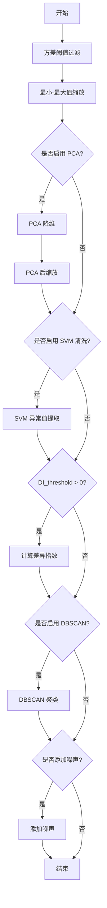

# 异常值检测与清洗

<cite>
**本文档中引用的文件**  
- [freqai_interface.py](file://freqtrade/freqai/freqai_interface.py)
- [data_kitchen.py](file://freqtrade/freqai/data_kitchen.py)
</cite>

## 目录
1. [DI_threshold 机制解析](#di_threshold-机制解析)
2. [SVM 与 DBSCAN 异常值清洗原理](#svm-与-dbscan-异常值清洗原理)
3. [数据清洗管道集成](#数据清洗管道集成)
4. [模型训练稳定性影响](#模型训练稳定性影响)
5. [启用场景与风险分析](#启用场景与风险分析)

## DI_threshold 机制解析

DI_threshold（差异指数阈值）是 FreqAI 中用于评估特征数据异常程度的关键参数。该阈值通过 DissimilarityIndex 变换器在数据预处理管道中实现，用于识别与正常数据模式显著偏离的样本。当特征数据经过 DissimilarityIndex 处理时，系统会计算每个数据点的差异指数值（DI_values），若该值超过预设的 DI_threshold，则该数据点将被标记为异常。此机制有助于在模型训练和预测阶段过滤掉可能干扰模型判断的异常特征，从而提升模型的鲁棒性。

**Section sources**
- [freqai_interface.py](file://freqtrade/freqai/freqai_interface.py#L527-L555)
- [data_kitchen.py](file://freqtrade/freqai/data_kitchen.py#L1020-L1039)

## SVM 与 DBSCAN 异常值清洗原理

`use_SVM_to_remove_outliers` 和 `use_DBSCAN_to_remove_outliers` 是两种集成在 FreqAI 数据管道中的异常值检测方法。`use_SVM_to_remove_outliers` 利用支持向量机（SVM）的异常检测能力，通过配置 `svm_params`（如 nu 参数）来识别并移除训练数据中的离群点。`use_DBSCAN_to_remove_outliers` 则采用基于密度的 DBSCAN 算法，根据数据点的局部密度来发现异常值，特别适用于识别任意形状的簇和噪声点。这两种方法作为数据预处理步骤，被添加到数据管道（Pipeline）中，在特征标准化后执行，确保输入模型的数据质量。

**Section sources**
- [freqai_interface.py](file://freqtrade/freqai/freqai_interface.py#L527-L555)

## 数据清洗管道集成

数据清洗步骤通过 `define_data_pipeline` 方法集成到特征处理流程中。该方法构建了一个由多个预处理步骤组成的流水线（Pipeline），包括方差阈值过滤、最小-最大值缩放、主成分分析（PCA）、SVM 异常值提取、差异指数计算、DBSCAN 聚类和噪声添加。这些步骤按顺序执行，形成一个完整的数据预处理链。`define_data_pipeline` 在模型初始化时被调用，并将生成的管道赋值给 `feature_pipeline`，在训练和预测阶段通过 `fit_transform` 和 `transform` 方法应用，确保数据清洗与模型训练流程无缝衔接。

**Diagram sources**
- [freqai_interface.py](file://freqtrade/freqai/freqai_interface.py#L527-L555)

## 模型训练稳定性影响

集成数据清洗步骤对模型训练稳定性有显著影响。通过移除异常值和标准化特征，模型能够学习到更一致的数据模式，减少因噪声数据导致的过拟合风险。DI_threshold 机制通过动态标记不确定的预测，帮助策略在高风险时期避免交易。然而，过度清洗可能导致信息丢失，特别是当市场出现真实但罕见的波动时，模型可能无法正确响应。因此，合理配置清洗参数对于平衡模型的稳健性和灵敏度至关重要。

**Section sources**
- [freqai_interface.py](file://freqtrade/freqai/freqai_interface.py#L527-L555)
- [data_kitchen.py](file://freqtrade/freqai/data_kitchen.py#L1020-L1039)

## 启用场景与风险分析

在数据质量较差或市场波动剧烈的场景下，应启用这些清洗功能以提高模型可靠性。例如，当特征数据包含大量由数据源错误或市场闪崩引起的异常值时，SVM 和 DBSCAN 清洗能有效净化数据。然而，这些功能可能带来性能开销，增加数据预处理时间。此外，存在数据偏差风险：过于严格的阈值可能导致模型忽略真实但极端的市场信号，从而错失交易机会。用户需根据具体策略和数据特性，谨慎调整 `DI_threshold`、`nu` 参数和 `n_jobs`，以在性能、稳定性和灵敏度之间取得最佳平衡。

**Section sources**
- [freqai_interface.py](file://freqtrade/freqai/freqai_interface.py#L527-L555)
- [data_kitchen.py](file://freqtrade/freqai/data_kitchen.py#L1020-L1039)