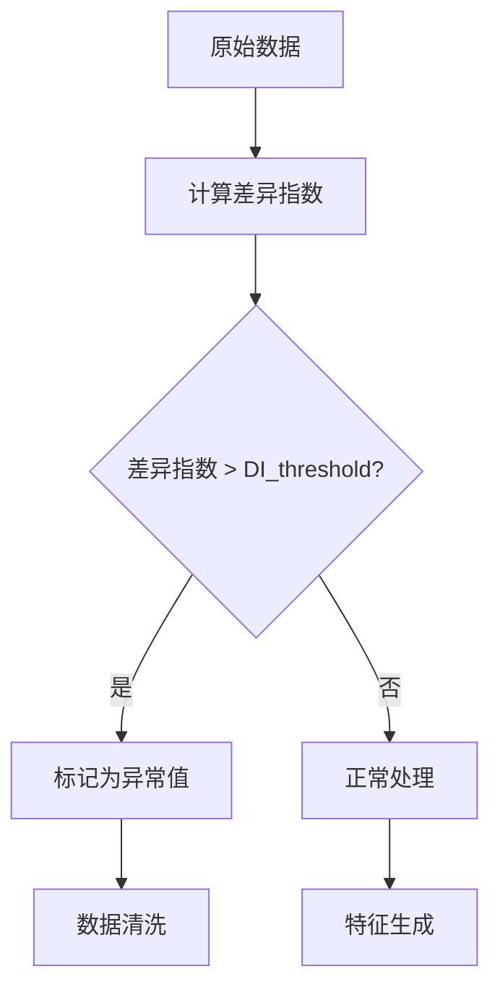
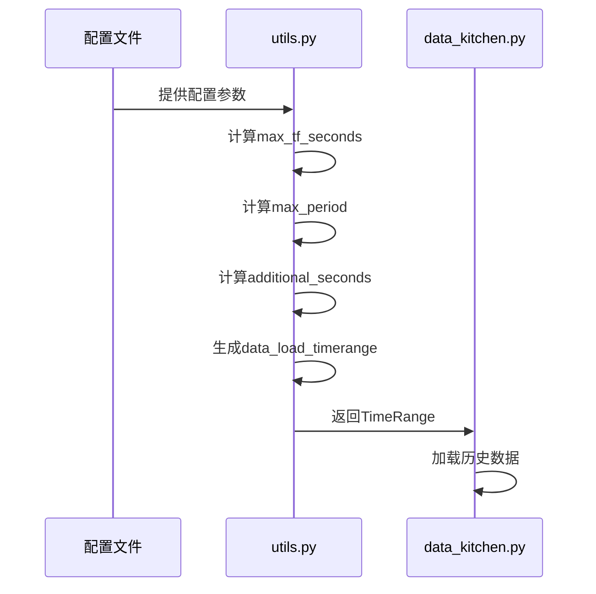

# 特征工程参数

<cite>
**Referenced Files in This Document**   
- [config.json](file://user_data/config.json)
- [utils.py](file://freqtrade/freqai/utils.py)
- [data_kitchen.py](file://freqtrade/freqai/data_kitchen.py)
- [data_drawer.py](file://freqtrade/freqai/data_drawer.py)
</cite>

## 目录
1. [配置项详解](#配置项详解)
2. [异常值检测机制](#异常值检测机制)
3. [数据清洗策略](#数据清洗策略)
4. [特征降维技术](#特征降维技术)
5. [数据预加载机制](#数据预加载机制)
6. [实际配置示例](#实际配置示例)

## 配置项详解

`config.json`文件中`freqai`部分的`feature_parameters`配置项对特征生成和目标定义具有决定性影响。`label_period_candles`参数定义了标签生成的时间周期，直接影响预测目标的时间跨度。较长的周期适合趋势跟踪策略，而较短的周期更适合高频交易。

`include_timeframes`参数指定用于特征提取的时间框架，支持多时间框架分析。通过包含不同时间周期（如15分钟、1小时、4小时）的数据，模型能够捕捉到不同时间尺度的市场动态，从而提高预测的准确性。`indicator_periods_candles`参数则定义了技术指标的计算周期，这些周期直接影响特征的敏感度和稳定性。

**Section sources**
- [config.json](file://user_data/config.json#L1-L94)

## 异常值检测机制

`DI_threshold`（差异指数阈值）在异常值检测中扮演关键角色。当特征值的差异指数超过设定阈值时，系统会将其标记为异常值。这一机制通过计算特征值与其历史分布的偏离程度来识别潜在的市场异常，有助于防止模型被极端值误导。在`data_drawer.py`中，当`DI_threshold`大于0时，系统会将`DI_values`添加到预测数据框中，以便后续处理。

**Diagram sources**
- [data_drawer.py](file://freqtrade/freqai/data_drawer.py#L45-L764)

**Section sources**
- [data_drawer.py](file://freqtrade/freqai/data_drawer.py#L45-L764)

## 数据清洗策略

`use_SVM_to_remove_outliers`和`use_DBSCAN_to_remove_outliers`是两种数据清洗策略。SVM（支持向量机）方法通过构建超平面来识别和移除异常值，适用于线性可分的数据集。DBSCAN（基于密度的空间聚类应用噪声）则通过密度聚类来识别异常点，能够有效处理非线性分布的数据。这两种方法在`data_kitchen.py`中实现，通过`filter_features`函数对特征数据进行清洗，确保训练数据的质量。

**Section sources**
- [data_kitchen.py](file://freqtrade/freqai/data_kitchen.py#L34-L1033)

## 特征降维技术

`principal_component_analysis`（主成分分析）对特征降维具有显著影响。通过将高维特征空间投影到低维空间，PCA能够保留数据的主要方差，同时减少特征数量。这不仅降低了模型的复杂度，还减少了过拟合的风险。在`data_kitchen.py`中，PCA通过`feature_pipeline`实现，对特征数据进行标准化和降维处理，提高模型的训练效率和预测性能。

**Section sources**
- [data_kitchen.py](file://freqtrade/freqai/data_kitchen.py#L34-L1033)

## 数据预加载机制

`get_required_data_timerange`函数在`utils.py`中定义，负责计算数据预加载的时间范围。该函数综合考虑了`train_period_days`、`startup_candle_count`和`indicator_periods_candles`等参数，确保在模型训练前加载足够的历史数据。具体来说，它计算了最大时间框架的秒数，并结合最大指标周期，确定了额外需要加载的数据量，从而保证了特征计算的完整性。

**Diagram sources**
- [utils.py](file://freqtrade/freqai/utils.py#L61-L90)
- [data_kitchen.py](file://freqtrade/freqai/data_kitchen.py#L34-L1033)

**Section sources**
- [utils.py](file://freqtrade/freqai/utils.py#L61-L90)

## 实际配置示例

在不同市场条件下，参数调整策略有所不同。例如，在高波动市场中，可以增加`DI_threshold`以更严格地过滤异常值；在低波动市场中，则可以降低该阈值以保留更多数据。对于多时间框架分析，可以根据市场节奏选择合适的时间组合，如在趋势市场中使用较长的时间框架，在震荡市场中使用较短的时间框架。通过灵活调整这些参数，可以优化模型在不同市场环境下的表现。

**Section sources**
- [config.json](file://user_data/config.json#L1-L94)
- [utils.py](file://freqtrade/freqai/utils.py#L61-L90)
- [data_kitchen.py](file://freqtrade/freqai/data_kitchen.py#L34-L1033)