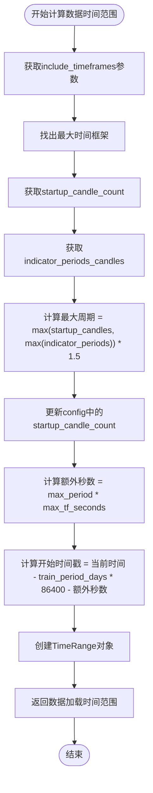
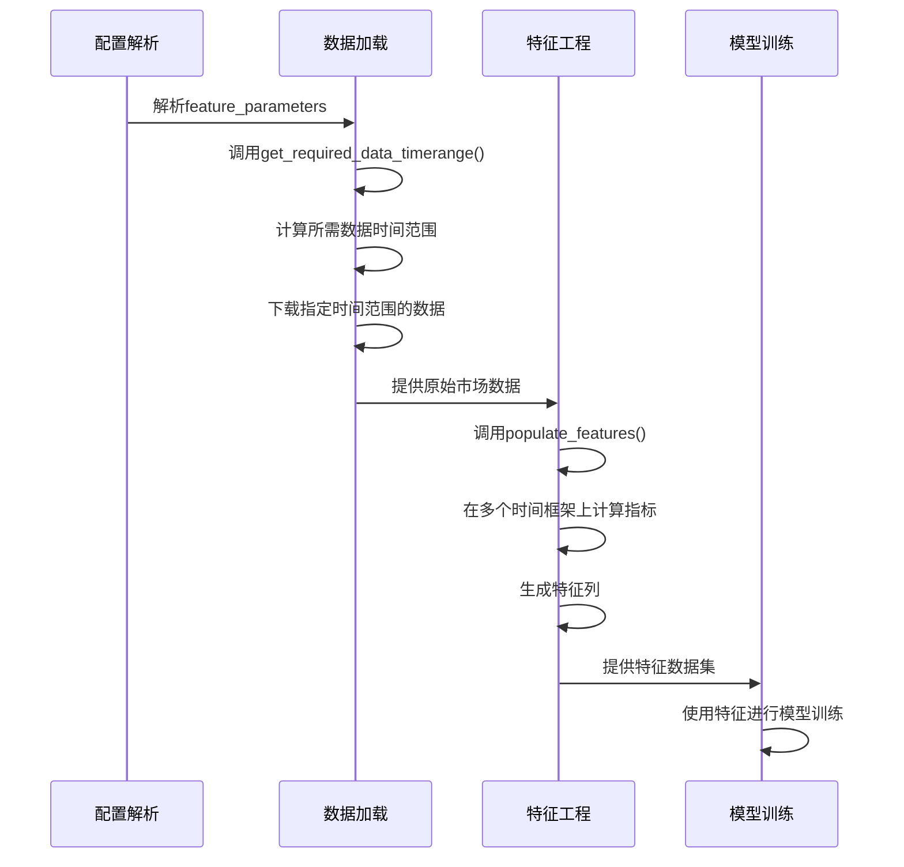

# 特征生成参数

<cite>
**本文档中引用的文件**
- [config.json](file://user_data/config.json)
- [utils.py](file://freqtrade/freqai/utils.py)
- [data_kitchen.py](file://freqtrade/freqai/data_kitchen.py)
- [config_schema.py](file://freqtrade/config_schema/config_schema.py)
</cite>

## 目录
1. [引言](#引言)
2. [特征生成参数详解](#特征生成参数详解)
3. [数据预加载机制](#数据预加载机制)
4. [实际配置示例](#实际配置示例)
5. [结论](#结论)

## 引言
FreqAI是Freqtrade中的机器学习模块，用于构建基于人工智能的交易策略。该系统通过特征工程将市场数据转换为模型可理解的输入，其中`feature_parameters`配置项在特征生成过程中起着关键作用。本文档详细解释了`feature_parameters`中与特征生成相关的参数如何影响数据准备和模型输入，以及它们如何通过`get_required_data_timerange`函数触发数据预加载机制。

## 特征生成参数详解

### label_period_candles（标签周期）
`label_period_candles`参数定义了用于生成预测标签的时间周期长度。该参数直接影响模型对未来价格变动的预测窗口大小。较长的周期可能捕捉到更宏观的趋势，而较短的周期则更适合高频交易策略。在配置中，该参数的值决定了标签生成函数的计算范围，从而影响模型的预测粒度和响应速度。

### include_timeframes（包含的时间框架）
`include_timeframes`参数指定用于特征生成的多个时间框架。多时间框架分析允许模型同时考虑不同时间尺度的市场行为，例如结合15分钟和1小时的指标来做出交易决策。系统会自动确保主时间框架包含在此列表中，如果未明确指定，会将其添加到列表开头。这种多尺度分析增强了模型对市场结构的理解能力。

### indicator_periods_candles（指标周期）
`indicator_periods_candles`参数定义了用于计算技术指标的蜡烛图周期。这些周期直接影响特征工程中使用的各种技术指标（如移动平均线、RSI等）的计算。系统会取这些周期中的最大值，并乘以1.5的安全系数来确定启动蜡烛数量，确保有足够的历史数据来填充指标的初始NaN值。

**参数交互关系**
这些参数共同决定了特征工程的数据需求：
- `include_timeframes`确定了需要获取哪些时间框架的数据
- `indicator_periods_candles`决定了每个时间框架需要多少历史数据
- `label_period_candles`影响了标签生成的计算窗口

**Section sources**
- [data_kitchen.py](file://freqtrade/freqai/data_kitchen.py#L719-L775)
- [config_schema.py](file://freqtrade/config_schema/config_schema.py#L1161-L1206)

## 数据预加载机制

### get_required_data_timerange函数
`get_required_data_timerange`函数是FreqAI数据预加载机制的核心。该函数根据配置参数计算所需的数据时间范围，确保在模型训练前有足够的历史数据可供使用。



**Diagram sources**
- [utils.py](file://freqtrade/freqai/utils.py#L61-L90)

### 数据切片行为
在回测和实盘交易中，数据切片行为受到这些参数的显著影响：

1. **回测模式**：系统会根据`timerange`配置精确切片数据，确保只使用指定时间段内的数据进行测试。
2. **实盘模式**：系统会持续加载最新的市场数据，并根据`live_retrain_hours`参数决定何时重新训练模型。

`slice_dataframe`方法负责执行实际的数据切片操作，根据是否处于实盘模式采用不同的切片逻辑：
- 回测模式：使用开始和结束日期进行精确切片
- 实盘模式：只使用开始日期，获取所有可用的最新数据



**Diagram sources**
- [utils.py](file://freqtrade/freqai/utils.py#L61-L90)
- [data_kitchen.py](file://freqtrade/freqai/data_kitchen.py#L380-L392)

**Section sources**
- [utils.py](file://freqtrade/freqai/utils.py#L61-L90)
- [data_kitchen.py](file://freqtrade/freqai/data_kitchen.py#L380-L392)

## 实际配置示例

### 多时间框架策略配置
```json
{
    "freqai": {
        "enabled": true,
        "train_period_days": 30,
        "backtest_period_days": 7,
        "feature_parameters": {
            "include_timeframes": ["5m", "15m", "1h"],
            "label_period_candles": 10,
            "indicator_periods_candles": [20, 50, 100],
            "include_shifted_candles": 1
        }
    }
}
```
此配置适用于多时间框架策略，结合了短、中、长三个时间框架的指标，适合捕捉不同时间尺度的市场机会。

### 高频交易策略配置
```json
{
    "freqai": {
        "enabled": true,
        "train_period_days": 7,
        "backtest_period_days": 1,
        "feature_parameters": {
            "include_timeframes": ["1m", "3m"],
            "label_period_candles": 5,
            "indicator_periods_candles": [10, 20],
            "include_shifted_candles": 0
        }
    }
}
```
此配置针对高频交易优化，使用较短的时间框架和较小的指标周期，能够快速响应市场变化。

**Section sources**
- [config.json](file://user_data/config.json)
- [data_kitchen.py](file://freqtrade/freqai/data_kitchen.py#L719-L775)

## 结论
`feature_parameters`中的参数在FreqAI系统中扮演着至关重要的角色，它们不仅决定了特征工程的数据需求，还通过`get_required_data_timerange`函数影响了整个数据预加载流程。正确配置这些参数对于构建有效的机器学习交易策略至关重要。用户应根据具体的交易策略类型（如多时间框架、高频交易等）来调整这些参数，以达到最佳的模型性能和交易效果。