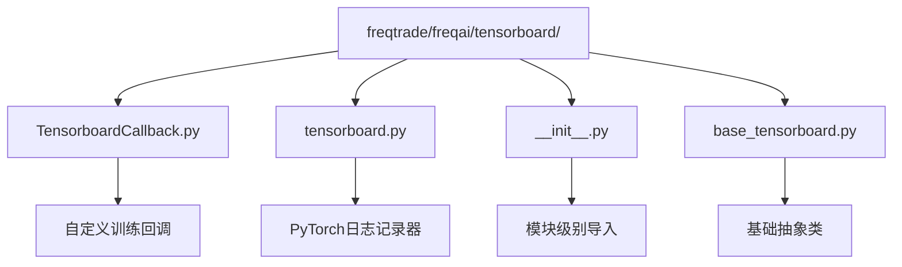
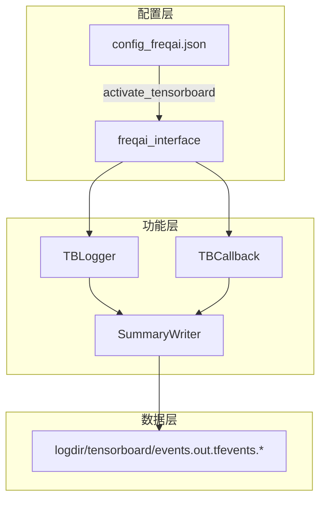
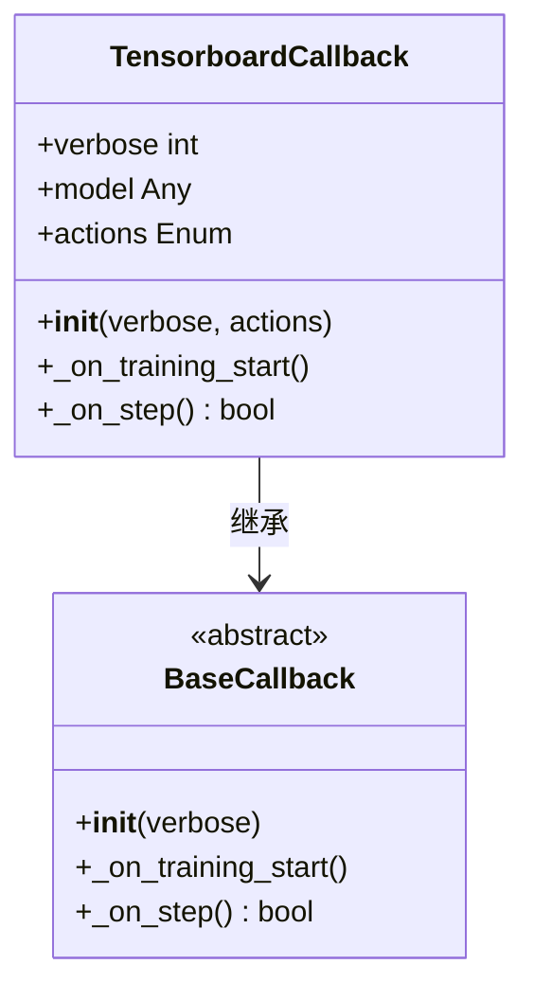
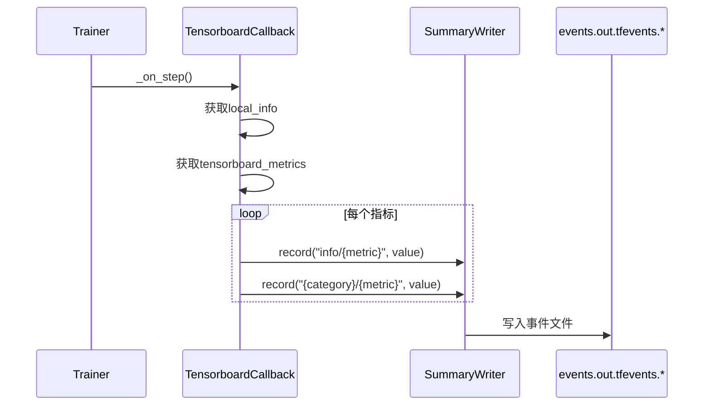
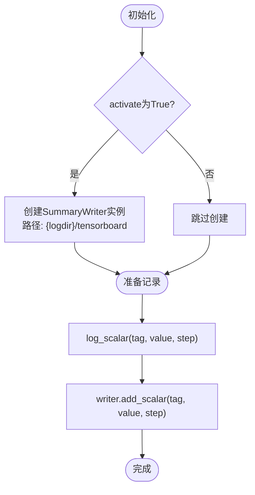

# TensorBoard实时可视化监控

<cite>
**Referenced Files in This Document**  
- [TensorboardCallback.py](file://freqtrade/freqai/tensorboard/TensorboardCallback.py)
- [tensorboard.py](file://freqtrade/freqai/tensorboard/tensorboard.py)
- [__init__.py](file://freqtrade/freqai/tensorboard/__init__.py)
- [freqai_interface.py](file://freqtrade/freqai/freqai_interface.py)
- [utils.py](file://freqtrade/freqai/utils.py)
- [config_freqai.example.json](file://config_examples/config_freqai.example.json)
</cite>

## 目录
1. [简介](#简介)
2. [项目结构](#项目结构)
3. [核心组件](#核心组件)
4. [架构概述](#架构概述)
5. [详细组件分析](#详细组件分析)
6. [依赖分析](#依赖分析)
7. [性能考量](#性能考量)
8. [故障排除指南](#故障排除指南)
9. [结论](#结论)

## 简介
本文档详细说明如何通过`activate_tensorboard`参数启用TensorBoard以实时监控FreqAI模型训练过程。文档解释了其在训练期间记录损失曲线、梯度分布、权重直方图等关键指标的机制，结合`TensorboardCallback`类的实现，展示了日志写入路径、事件文件生成方式以及与PyTorch/TensorFlow模型的集成方法。同时提供启动TensorBoard服务的命令行示例，以及如何解读标量、图表和嵌入视图中的数据，并包括常见配置错误（如日志路径冲突、端口占用）的排查方法。

## 项目结构
FreqAI的TensorBoard功能主要位于`freqtrade/freqai/tensorboard/`目录下，包含核心回调类、日志记录器和初始化模块。该功能通过配置文件中的`activate_tensorboard`参数控制，并与模型训练流程深度集成。



**Diagram sources**
- [TensorboardCallback.py](file://freqtrade/freqai/tensorboard/TensorboardCallback.py)
- [tensorboard.py](file://freqtrade/freqai/tensorboard/tensorboard.py)
- [__init__.py](file://freqtrade/freqai/tensorboard/__init__.py)
- [base_tensorboard.py](file://freqtrade/freqai/tensorboard/base_tensorboard.py)

**Section sources**
- [TensorboardCallback.py](file://freqtrade/freqai/tensorboard/TensorboardCallback.py)
- [tensorboard.py](file://freqtrade/freqai/tensorboard/tensorboard.py)

## 核心组件
FreqAI的TensorBoard监控功能由`TensorboardCallback`和`TensorboardLogger`两个核心组件构成。`activate_tensorboard`参数作为总开关，控制着整个监控系统的启用与禁用。当参数为`True`时，系统会创建`SummaryWriter`实例，将训练过程中的关键指标写入指定的日志目录。

**Section sources**
- [TensorboardCallback.py](file://freqtrade/freqai/tensorboard/TensorboardCallback.py#L9-L60)
- [tensorboard.py](file://freqtrade/freqai/tensorboard/tensorboard.py#L16-L60)
- [freqai_interface.py](file://freqtrade/freqai/freqai_interface.py#L115-L115)

## 架构概述
FreqAI的TensorBoard集成架构采用分层设计，上层为配置接口，中层为功能实现，底层为日志写入。用户通过配置文件启用功能，`freqai_interface`根据配置初始化`tb_logger`，在训练过程中通过回调机制将指标数据传递给`SummaryWriter`。



**Diagram sources**
- [config_freqai.example.json](file://config_examples/config_freqai.example.json)
- [freqai_interface.py](file://freqtrade/freqai/freqai_interface.py#L115-L115)
- [utils.py](file://freqtrade/freqai/utils.py#L196-L204)
- [tensorboard.py](file://freqtrade/freqai/tensorboard/tensorboard.py#L16-L30)

## 详细组件分析

### TensorboardCallback分析
`TensorboardCallback`类继承自`BaseCallback`，用于在强化学习模型训练过程中记录额外的指标和周期性摘要报告。它通过`_on_step`方法在每一步训练后收集环境信息和自定义指标，并将其记录到TensorBoard中。

#### 对于对象导向组件：


**Diagram sources**
- [TensorboardCallback.py](file://freqtrade/freqai/tensorboard/TensorboardCallback.py#L9-L60)

#### 对于API/服务组件：


**Diagram sources**
- [TensorboardCallback.py](file://freqtrade/freqai/tensorboard/TensorboardCallback.py#L50-L60)

### TensorboardLogger分析
`TensorboardLogger`是针对PyTorch模型的专用日志记录器，它封装了`torch.utils.tensorboard.SummaryWriter`，提供`log_scalar`方法来记录标量值，如损失、准确率等。该类在初始化时根据`activate`参数决定是否创建`SummaryWriter`实例。

#### 对于复杂逻辑组件：


**Diagram sources**
- [tensorboard.py](file://freqtrade/freqai/tensorboard/tensorboard.py#L16-L29)

## 依赖分析
TensorBoard功能的实现依赖于多个模块和外部库。核心依赖关系包括`freqai_interface`对`utils.py`中`get_tb_logger`函数的调用，以及`tensorboard.py`对`torch.utils.tensorboard`的导入。当PyTorch不可用时，系统会优雅地降级到基础日志记录器。

```mermaid
graph TD
A[freqai_interface.py] --> B[utils.py]
B --> C[get_tb_logger]
C --> D{model_type == "pytorch"?}
D --> |是| E[TBLogger]
D --> |否| F[BaseTensorboardLogger]
E --> G[tensorboard.py]
G --> H[torch.utils.tensorboard.SummaryWriter]
F --> I[base_tensorboard.py]
```

**Diagram sources**
- [freqai_interface.py](file://freqtrade/freqai/freqai_interface.py#L115-L115)
- [utils.py](file://freqtrade/freqai/utils.py#L196-L204)
- [tensorboard.py](file://freqtrade/freqai/tensorboard/tensorboard.py)
- [base_tensorboard.py](file://freqtrade/freqai/tensorboard/base_tensorboard.py)

**Section sources**
- [freqai_interface.py](file://freqtrade/freqai/freqai_interface.py#L115-L115)
- [utils.py](file://freqtrade/freqai/utils.py#L196-L204)

## 性能考量
启用TensorBoard监控会带来一定的性能开销，主要体现在磁盘I/O和内存使用上。建议在生产环境中谨慎使用，或仅在调试和模型开发阶段启用。日志文件会持续增长，需要定期清理或配置自动归档策略。

## 故障排除指南
常见问题包括日志路径权限不足、端口被占用以及PyTorch依赖缺失。若TensorBoard无法启动，首先检查日志目录是否存在且可写，然后确认`tensorboard`命令是否可用。对于端口冲突，可使用`--port`参数指定其他端口。

**Section sources**
- [tensorboard.py](file://freqtrade/freqai/tensorboard/tensorboard.py#L16-L30)
- [__init__.py](file://freqtrade/freqai/tensorboard/__init__.py)

## 结论
通过`activate_tensorboard`参数，FreqAI提供了强大的模型训练可视化能力。该功能与PyTorch无缝集成，能够实时监控训练过程中的关键指标，帮助用户更好地理解模型行为和优化训练过程。正确配置和使用TensorBoard，可以显著提升模型开发和调试的效率。