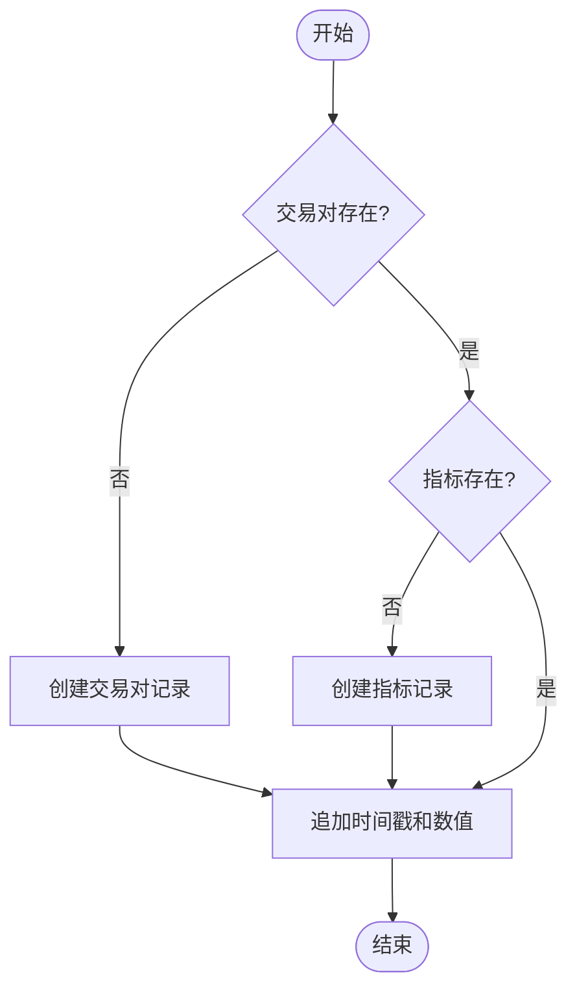
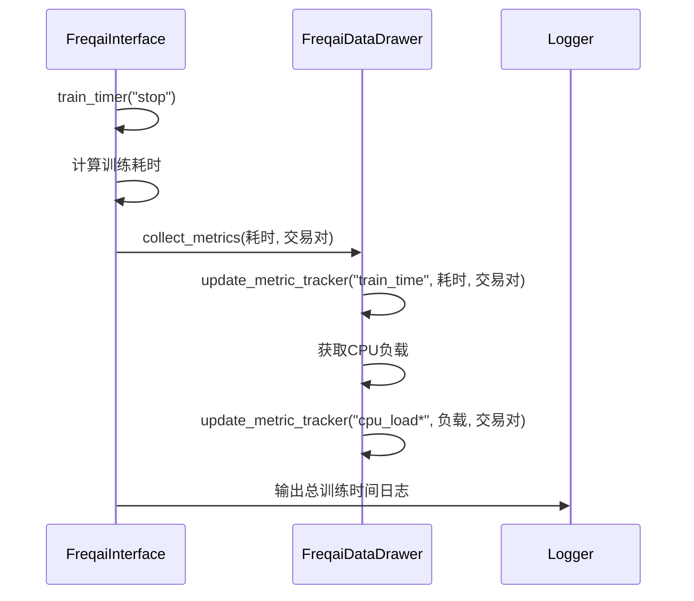

# 训练指标持久化与日志解读

<cite>
**Referenced Files in This Document**   
- [data_drawer.py](file://freqtrade/freqai/data_drawer.py)
- [config_freqai.example.json](file://config_examples/config_freqai.example.json)
- [config_schema.py](file://freqtrade/config_schema/config_schema.py)
- [freqai_interface.py](file://freqtrade/freqai/freqai_interface.py)
</cite>

## 目录
1. [write_metrics_to_disk参数详解](#write_metrics_to_disk参数详解)
2. [指标数据收集与聚合流程](#指标数据收集与聚合流程)
3. [监控日志结构与关键条目解读](#监控日志结构与关键条目解读)
4. [常见问题与日志线索映射表](#常见问题与日志线索映射表)

## write_metrics_to_disk参数详解

`write_metrics_to_disk` 是FreqAI模块中的一个布尔型配置参数，用于控制训练和推理指标的磁盘写入行为。该参数在配置文件的 `freqai` 部分进行设置，其默认值为 `false`。

### 触发条件
当 `write_metrics_to_disk` 设置为 `true` 时，系统将启用指标持久化功能。具体触发条件如下：
- **初始化检查**：在 `FreqaiDataDrawer` 类初始化时，`load_metric_tracker_from_disk` 方法会检查此参数。若为 `true`，则尝试从磁盘加载已存在的指标追踪器（metric tracker）。
- **数据写入**：在训练和推理过程中，当 `freqai_info.get("write_metrics_to_disk", False)` 为 `true` 时，相关的指标数据（如训练时间、推理时间、CPU负载等）才会被记录到内存中的 `metric_tracker` 字典，并最终通过 `save_metric_tracker_to_disk` 方法写入磁盘。

### 数据格式与存储路径
- **数据格式**：指标数据以JSON格式序列化存储。`metric_tracker` 字典的结构为嵌套字典，包含每个交易对（pair）的多种指标，每种指标又包含时间戳（timestamp）和数值（value）两个列表。
- **存储路径**：指标文件默认存储在用户数据目录下的 `user_data/freqai/` 路径中，具体文件名为 `metric_tracker.json`。该路径由 `FreqaiDataDrawer` 的 `full_path` 属性和 `metric_tracker_path` 属性共同确定。

**Section sources**
- [data_drawer.py](file://freqtrade/freqai/data_drawer.py#L162-L169)
- [config_schema.py](file://freqtrade/config_schema/config_schema.py#L1056-L1058)
- [config_freqai.example.json](file://config_examples/config_freqai.example.json)

## 指标数据收集与聚合流程

指标数据的收集、聚合与序列化过程主要由 `FreqaiDataDrawer` 类和 `FreqaiInterface` 类协同完成。

### 核心组件：DataDrawer类
`FreqaiDataDrawer` 类是指标管理的核心，负责内存中指标数据的存储和磁盘持久化。

#### update_metric_tracker方法
`update_metric_tracker` 方法是指标收集的入口。它接收三个参数：`metric`（指标名称）、`value`（指标值）和 `pair`（交易对）。该方法首先检查 `metric_tracker` 字典中是否存在对应交易对和指标的记录，若不存在则创建。然后，将当前时间戳和指标值分别追加到对应的时间戳列表和数值列表中。此操作在 `metric_tracker_lock` 锁的保护下进行，确保线程安全。



**Diagram sources**
- [data_drawer.py](file://freqtrade/freqai/data_drawer.py#L107-L120)

#### collect_metrics方法
`collect_metrics` 方法用于收集与训练相关的综合指标。它调用 `update_metric_tracker` 方法，将训练耗时、1分钟、5分钟和15分钟的CPU平均负载等信息记录下来。

### 指标聚合与触发
指标的聚合由 `FreqaiInterface` 类中的定时器方法触发。

#### 推理耗时监控
`inference_timer` 方法在每次完成一个交易对的推理后被调用。当 `do` 参数为 `"stop"` 时，它计算本次推理的耗时，并通过 `update_metric_tracker` 将 `"inference_time"` 指标写入 `metric_tracker`。

#### 训练耗时与系统负载监控
`train_timer` 方法在每次完成一个交易对的训练后被调用。当 `do` 参数为 `"stop"` 时，它不仅计算训练耗时并记录 `"train_time"` 指标，还会调用 `collect_metrics` 方法，该方法会进一步收集并记录CPU负载等系统指标。



**Diagram sources**
- [freqai_interface.py](file://freqtrade/freqai/freqai_interface.py#L745-L755)
- [data_drawer.py](file://freqtrade/freqai/data_drawer.py#L122-L131)

### 序列化过程
当指标数据被收集到内存中的 `metric_tracker` 后，系统会在适当时机将其序列化到磁盘。`save_metric_tracker_to_disk` 方法负责此操作。它使用 `rapidjson.dump` 将 `metric_tracker` 字典以JSON格式写入 `metric_tracker.json` 文件。此方法在 `save_lock` 锁的保护下执行，防止并发写入冲突。

**Section sources**
- [data_drawer.py](file://freqtrade/freqai/data_drawer.py#L107-L131)
- [freqai_interface.py](file://freqtrade/freqai/freqai_interface.py#L723-L755)

## 监控日志结构与关键条目解读

系统日志是监控FreqAI运行状态的重要工具。以下是关键日志条目的结构和含义解读。

### 日志结构示例
```
INFO - Loading existing metric tracker from disk.
INFO - Total time spent inferencing pairlist 12.34 seconds
INFO - Total time spent training pairlist 45.67 seconds
WARNING - No common dates found between new predictions and historic predictions. You likely left your FreqAI instance offline for more than 100 candles.
```

### 关键日志条目解读
- **`Loading existing metric tracker from disk.`**：此日志表明系统成功从磁盘加载了已存在的 `metric_tracker.json` 文件。这通常发生在 `write_metrics_to_disk` 为 `true` 且之前已生成过指标文件时。
- **`Could not find existing metric tracker, starting from scratch`**：此日志表示系统未能找到 `metric_tracker.json` 文件，将从零开始创建新的指标追踪器。这在首次运行或删除了旧指标文件时出现。
- **`Total time spent inferencing pairlist X.XX seconds`**：此日志汇总了当前周期内对整个交易对列表进行推理的总耗时。如果该时间过长，可能预示着模型推理效率低下或系统资源不足。
- **`Total time spent training pairlist X.XX seconds`**：此日志汇总了当前周期内对整个交易对列表进行训练的总耗时。长时间的训练可能与数据量过大、模型复杂或硬件性能瓶颈有关。
- **`No common dates found between new predictions and historic predictions...`**：此警告表明历史预测数据与新预测数据之间存在时间断层，通常是因为FreqAI实例离线时间过长，导致历史数据无法衔接。这会影响预测的连续性。

**Section sources**
- [data_drawer.py](file://freqtrade/freqai/data_drawer.py#L167-L169)
- [freqai_interface.py](file://freqtrade/freqai/freqai_interface.py#L712-L715, L750-L753)

## 常见问题与日志线索映射表

| 问题类型 | 日志线索 | 可能原因 | 解决方案 |
| :--- | :--- | :--- | :--- |
| **模型过拟合** | 训练时间 (`train_time`) 显著增加，但回测收益 (`profit_total`) 未同步提升 | 模型过于复杂，学习了训练数据的噪声 | 简化模型结构，增加正则化，或使用更早的停止训练策略 |
| **数据泄露** | 推理耗时 (`inference_time`) 异常低，且预测结果过于理想 | 特征工程中可能引入了未来数据 | 严格检查 `feature_engineering` 函数，确保所有特征仅基于历史数据计算 |
| **资源瓶颈** | CPU负载 (`cpu_load*`) 持续接近1.0，训练/推理耗时 (`train_time`/`inference_time`) 波动大 | CPU资源耗尽，导致任务排队等待 | 降低 `data_kitchen_thread_count`，减少并行处理线程数，或升级硬件 |
| **数据不连续** | `No common dates found...` 警告频繁出现 | FreqAI实例频繁重启或长时间离线 | 确保实例稳定运行，或在恢复后手动检查并修复数据衔接问题 |
| **配置未生效** | `Could not find existing metric tracker...` 即使 `write_metrics_to_disk` 为 `true` | 配置文件未正确加载或路径错误 | 检查配置文件语法，确认 `freqai` 部分的 `write_metrics_to_disk` 已设置为 `true` |

**Section sources**
- [data_drawer.py](file://freqtrade/freqai/data_drawer.py#L107-L131, L162-L169)
- [freqai_interface.py](file://freqtrade/freqai/freqai_interface.py#L709-L755)