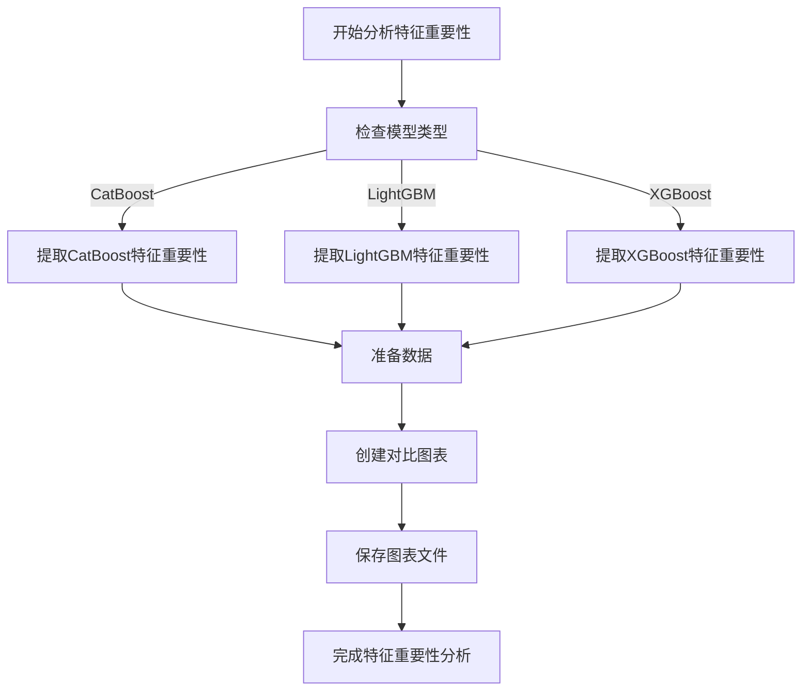
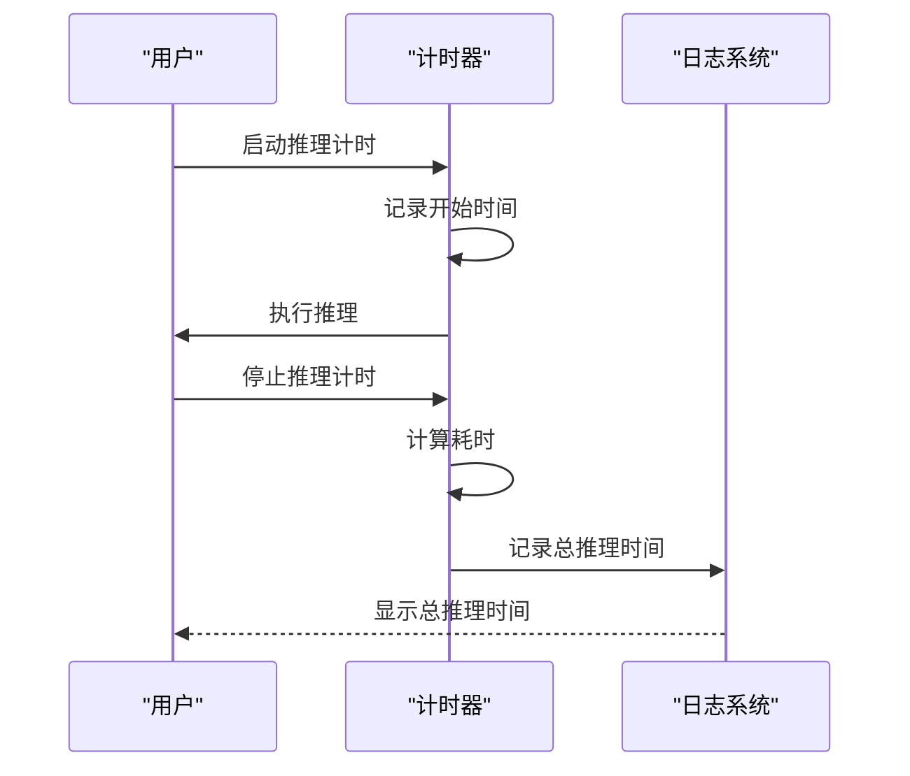

# 训练监控与性能分析

<cite>
**本文档引用的文件**
- [freqai_interface.py](file://freqtrade/freqai/freqai_interface.py)
- [tensorboard.py](file://freqtrade/freqai/tensorboard/tensorboard.py)
- [base_tensorboard.py](file://freqtrade/freqai/tensorboard/base_tensorboard.py)
- [plotting.py](file://freqtrade/plot/plotting.py)
- [data_drawer.py](file://freqtrade/freqai/data_drawer.py)
- [utils.py](file://freqtrade/freqai/utils.py)
</cite>

## 目录
1. [TensorBoard实时监控](#tensorboard实时监控)
2. [特征重要性分析](#特征重要性分析)
3. [性能瓶颈分析](#性能瓶颈分析)
4. [训练指标持久化](#训练指标持久化)
5. [监控日志解读](#监控日志解读)
6. [常见问题排查](#常见问题排查)

## TensorBoard实时监控

`activate_tensorboard` 参数用于启用TensorBoard实时监控训练过程。当该参数设置为 `True` 时，系统会自动记录训练过程中的关键指标，包括损失曲线、梯度分布等。这些指标通过TensorBoard可视化界面展示，帮助用户实时监控模型的训练状态和性能表现。该功能通过 `get_tb_logger` 函数实现，根据模型类型和激活状态创建相应的日志记录器。

**Section sources**
- [freqai_interface.py](file://freqtrade/freqai/freqai_interface.py#L115)
- [utils.py](file://freqtrade/freqai/utils.py#L185-L205)
- [tensorboard.py](file://freqtrade/freqai/tensorboard/tensorboard.py#L1-L62)
- [base_tensorboard.py](file://freqtrade/freqai/tensorboard/base_tensorboard.py#L1-L31)

## 特征重要性分析

`plot_feature_importances` 参数控制是否生成特征重要性图表。当设置为非零值时，系统会调用 `plot_feature_importance` 函数，该函数能够提取模型的特征重要性，并生成最佳和最差特征的对比图表。此功能支持多种模型类型，包括CatBoost、LightGBM和XGBoost，通过分析特征重要性，用户可以更好地理解模型的决策过程，优化特征工程。

**Diagram sources**
- [utils.py](file://freqtrade/freqai/utils.py#L150-L184)

**Section sources**
- [utils.py](file://freqtrade/freqai/utils.py#L150-L184)
- [plotting.py](file://freqtrade/plot/plotting.py#L1-L717)

## 性能瓶颈分析

`inference_timer` 和 `train_timer` 是两个关键的性能分析工具。`inference_timer` 用于跟踪在FreqAI中完成一次白名单遍历所花费的累计时间，如果时间超过单个K线周期的1/4，则会警告用户性能下降。`train_timer` 则用于跟踪训练完整白名单对所花费的累计时间。这两个计时器帮助用户识别和解决性能瓶颈，确保模型训练和推理的高效性。

**Diagram sources**
- [freqai_interface.py](file://freqtrade/freqai/freqai_interface.py#L711-L753)

**Section sources**
- [freqai_interface.py](file://freqtrade/freqai/freqai_interface.py#L711-L753)

## 训练指标持久化

`write_metrics_to_disk` 参数控制是否将训练指标持久化到磁盘。当该参数设置为 `True` 时，系统会将训练时间、CPU负载等关键指标保存到磁盘，供后续分析使用。这一功能通过 `data_drawer` 模块中的 `update_metric_tracker` 和 `collect_metrics` 方法实现，确保了训练过程的可追溯性和可分析性。

**Section sources**
- [data_drawer.py](file://freqtrade/freqai/data_drawer.py#L1-L766)
- [freqai_interface.py](file://freqtrade/freqai/freqai_interface.py#L711-L753)

## 监控日志解读

监控日志提供了训练过程的详细信息，包括总推理时间、总训练时间、CPU负载等。用户应重点关注以下几点：
- **总推理时间**：如果接近或超过单个K线周期的1/4，可能影响交易决策的及时性。
- **CPU负载**：持续高负载可能表明系统资源不足，需要优化模型或增加计算资源。
- **训练时间**：过长的训练时间可能影响模型的实时性，需要考虑模型简化或并行化训练。

**Section sources**
- [freqai_interface.py](file://freqtrade/freqai/freqai_interface.py#L711-L753)
- [data_drawer.py](file://freqtrade/freqai/data_drawer.py#L1-L766)

## 常见问题排查

1. **性能下降警告**：检查模型复杂度，考虑简化模型或增加计算资源。
2. **高CPU负载**：优化数据预处理流程，减少不必要的计算。
3. **训练时间过长**：考虑使用更高效的算法或并行化训练过程。
4. **特征重要性异常**：重新评估特征工程，确保特征的相关性和有效性。

**Section sources**
- [freqai_interface.py](file://freqtrade/freqai/freqai_interface.py#L711-L753)
- [data_drawer.py](file://freqtrade/freqai/data_drawer.py#L1-L766)
- [utils.py](file://freqtrade/freqai/utils.py#L150-L184)