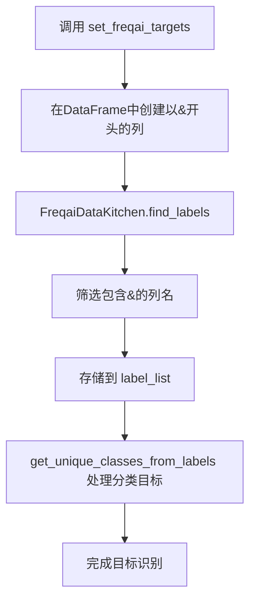

# 目标变量定义

<cite>
**Referenced Files in This Document**   
- [FreqaiExampleStrategy.py](file://freqtrade/templates/FreqaiExampleStrategy.py)
- [FreqaiExampleHybridStrategy.py](file://freqtrade/templates/FreqaiExampleHybridStrategy.py)
- [interface.py](file://freqtrade/strategy/interface.py)
- [data_kitchen.py](file://freqtrade/freqai/data_kitchen.py)
- [freqai_interface.py](file://freqtrade/freqai/freqai_interface.py)
</cite>

## 目录
1. [引言](#引言)
2. [set_freqai_targets方法实现](#set_freqai_targets方法实现)
3. [&前缀命名规则与识别机制](#前缀命名规则与识别机制)
4. [回归与分类目标定义实例](#回归与分类目标定义实例)
5. [使用Pandas操作构建目标值](#使用pandas操作构建目标值)
6. [通过metadata访问交易对信息](#通过metadata访问交易对信息)
7. [多目标预测配置与模型选择](#多目标预测配置与模型选择)
8. [目标定义与特征工程的协调](#目标定义与特征工程的协调)

## 引言
在FreqAI系统中，策略的目标变量定义是机器学习模型训练和预测的核心环节。通过`set_freqai_targets`方法，用户可以为模型指定预测目标，这些目标可以是未来价格变动（回归）或趋势方向（分类）。所有目标列必须以`&`符号开头，这是FreqAI系统识别目标变量的关键机制。本文档将详细阐述如何在策略中定义这些目标，包括命名规则、实现方式、具体实例以及与特征工程的协调关系。

## set_freqai_targets方法实现
`set_freqai_targets`是FreqAI策略中必须实现的方法，用于为机器学习模型设置预测目标。该方法接收包含市场数据的DataFrame和当前交易对的元数据，并返回添加了目标列的DataFrame。方法的实现位于策略类中，继承自`IStrategy`接口。在FreqAI工作流程中，该方法在`freqai_interface.py`中被调用，用于在训练和回测阶段为数据框设置目标值。方法的执行是FreqAI数据处理管道的关键步骤，确保模型能够学习到正确的预测目标。

**Section sources**
- [interface.py](file://freqtrade/strategy/interface.py#L995-L1009)
- [freqai_interface.py](file://freqtrade/freqai/freqai_interface.py#L343-L363)

## &前缀命名规则与识别机制
在FreqAI系统中，所有目标列必须以`&`符号作为前缀，这是系统识别目标变量的强制性命名规则。这一规则在`set_freqai_targets`方法的文档字符串中明确指出。系统通过`FreqaiDataKitchen`类中的`find_labels`方法来识别这些目标列。该方法遍历DataFrame的列名，筛选出包含`&`符号的列，并将其存储在`label_list`属性中。随后，`get_unique_classes_from_labels`方法会调用`find_labels`，并进一步处理分类目标，提取唯一的类别名称。这种基于符号的识别机制确保了系统能够准确地区分特征（以`%`开头）和目标，从而正确地构建训练数据集。

**Diagram sources**
- [data_kitchen.py](file://freqtrade/freqai/data_kitchen.py#L410-L412)
- [data_kitchen.py](file://freqtrade/freqai/data_kitchen.py#L898-L900)

**Section sources**
- [interface.py](file://freqtrade/strategy/interface.py#L995-L1009)
- [data_kitchen.py](file://freqtrade/freqai/data_kitchen.py#L410-L412)

## 回归与分类目标定义实例
FreqAI提供了清晰的实例来展示如何定义不同类型的预测目标。在`FreqaiExampleStrategy.py`中，定义了一个回归目标`&-s_close`，它表示未来一段时间内收盘价的平均变动率。该目标通过将未来收盘价的滚动均值除以当前收盘价并减1来计算。而在`FreqaiExampleHybridStrategy.py`中，则定义了一个分类目标`&s-up_or_down`，它表示未来价格是上涨还是下跌。该目标使用`np.where`函数，根据未来收盘价是否高于当前收盘价来分配"up"或"down"的字符串标签。这两个实例分别代表了回归和分类任务，展示了FreqAI在不同类型预测问题上的应用。

**Section sources**
- [FreqaiExampleStrategy.py](file://freqtrade/templates/FreqaiExampleStrategy.py#L183-L208)
- [FreqaiExampleHybridStrategy.py](file://freqtrade/templates/FreqaiExampleHybridStrategy.py#L213-L232)

## 使用Pandas操作构建目标值
构建目标值通常涉及使用Pandas库中的`shift`和`rolling`等时间序列操作。`shift`方法用于将数据沿时间轴移动，常用于创建未来或过去的值。例如，`dataframe["close"].shift(-50)`获取50根K线后的收盘价，用于预测未来价格。`rolling`方法则用于计算滚动窗口统计量，如均值、最大值和最小值。在`FreqaiExampleStrategy.py`中，`rolling`被用来计算未来一段时间内收盘价的平均值，从而平滑短期波动，得到更稳定的目标。这些操作的组合使得用户能够灵活地定义复杂的预测目标，例如未来价格的变动范围或趋势强度。

**Section sources**
- [FreqaiExampleStrategy.py](file://freqtrade/templates/FreqaiExampleStrategy.py#L183-L208)

## 通过metadata访问交易对信息
在`set_freqai_targets`方法中，`metadata`参数提供了访问当前交易对信息的途径。`metadata`是一个字典，其中包含如`"pair"`（交易对名称）等关键信息。在`FreqaiExampleStrategy.py`的文档字符串中明确指出，可以通过`metadata["pair"]`来访问当前交易对。这使得用户可以根据不同的交易对动态地调整目标定义逻辑。例如，可以为高波动性的交易对设置更长的预测周期，或为特定交易对应用不同的目标计算公式。这种灵活性增强了策略的适应性和通用性。

**Section sources**
- [FreqaiExampleStrategy.py](file://freqtrade/templates/FreqaiExampleStrategy.py#L173-L222)

## 多目标预测配置与模型选择
FreqAI支持多目标预测，用户可以在`set_freqai_targets`方法中定义多个以`&`开头的目标列。例如，可以同时预测未来价格的变动率（`&-s_close`）和变动范围（`&-s_range`）。然而，进行多目标预测需要使用支持多输出的模型，如`CatboostRegressorMultiTarget`。在`FreqaiExampleStrategy.py`的注释中明确提到，多目标预测需要配置相应的多输出预测模型。用户需要在配置文件中将`freqaimodel`设置为`CatboostRegressorMultiTarget`，以确保模型能够处理多个输出目标。这种配置要求确保了模型架构与预测任务的匹配。

**Section sources**
- [FreqaiExampleStrategy.py](file://freqtrade/templates/FreqaiExampleStrategy.py#L208-L222)

## 目标定义与特征工程的协调
目标定义与特征工程在时间序列上必须保持协调。特征工程通常使用`%`前缀的列来定义输入特征，而目标定义则使用`&`前缀的列。两者共同构成了模型的输入-输出对。在时间上，特征通常是基于历史数据计算的，而目标则是基于未来数据定义的。这种时间上的错位（特征在前，目标在后）是时间序列预测的基础。`FreqaiDataKitchen`确保了特征和目标在同一个数据框中被正确对齐，使得模型能够在给定历史特征的情况下，学习预测未来的值。这种协调关系是构建有效预测模型的关键。

**Section sources**
- [data_kitchen.py](file://freqtrade/freqai/data_kitchen.py#L409-L412)
- [data_kitchen.py](file://freqtrade/freqai/data_kitchen.py#L246-L248)