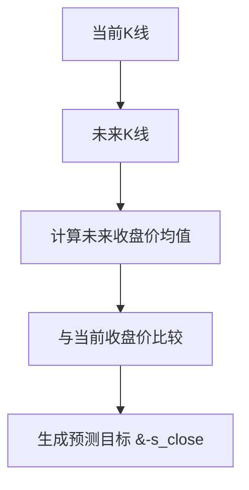
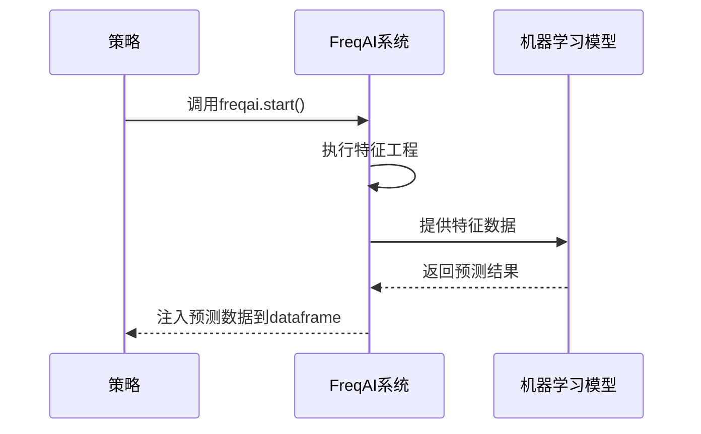
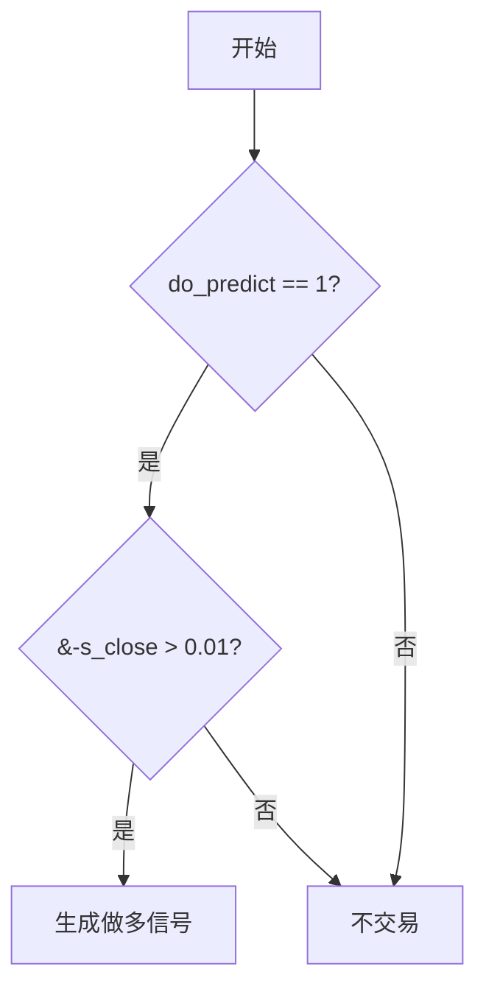
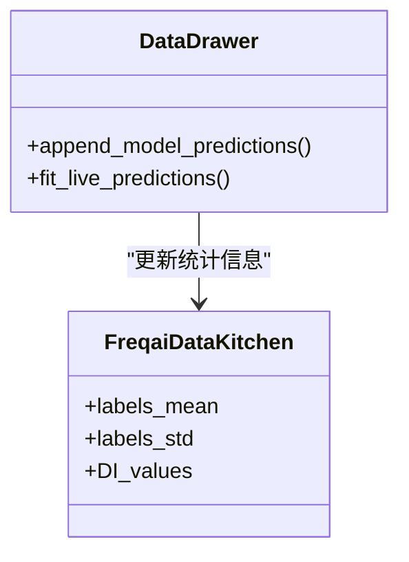

# 策略集成与预测应用

<cite>
**本文档中引用的文件**   
- [FreqaiExampleStrategy.py](file://freqtrade/templates/FreqaiExampleStrategy.py)
- [config.json](file://user_data/config.json)
- [data_drawer.py](file://freqtrade/freqai/data_drawer.py)
- [BaseRegressionModel.py](file://freqtrade/freqai/base_models/BaseRegressionModel.py)
- [freqai_interface.py](file://freqtrade/freqai/freqai_interface.py)
</cite>

## 目录
1. [简介](#简介)
2. [预测目标定义](#预测目标定义)
3. [模型集成与指标填充](#模型集成与指标填充)
4. [交易信号生成](#交易信号生成)
5. [模型输出后处理](#模型输出后处理)
6. [配置参数调整](#配置参数调整)
7. [性能监控与工具](#性能监控与工具)

## 简介
本文档详细说明如何将FreqAI机器学习模型集成到交易策略中，以FreqaiExampleStrategy.py为范例。文档阐述了策略中如何定义预测目标、利用模型输出进行交易决策，以及如何通过配置文件调整模型行为。

**Section sources**
- [FreqaiExampleStrategy.py](file://freqtrade/templates/FreqaiExampleStrategy.py#L1-L30)

## 预测目标定义
在FreqAI策略中，`set_freqai_targets`方法用于定义机器学习模型的预测目标。所有目标列名必须以`&`符号开头，以便FreqAI系统识别。在FreqaiExampleStrategy示例中，`&-s_close`被定义为未来一段时间内收盘价的平均变化率，计算方式为未来`label_period_candles`根K线的收盘价均值与当前收盘价的比率减去1。该目标用于回归模型预测价格变动趋势。对于分类模型，可以使用字符串标签，如`up`或`down`来表示价格走势方向。

**Diagram sources **
- [FreqaiExampleStrategy.py](file://freqtrade/templates/FreqaiExampleStrategy.py#L173-L222)

**Section sources**
- [FreqaiExampleStrategy.py](file://freqtrade/templates/FreqaiExampleStrategy.py#L173-L222)

## 模型集成与指标填充
`populate_indicators`方法是策略与FreqAI模型集成的核心。该方法调用`self.freqai.start()`来启动模型预测流程，此过程会自动执行特征工程、模型推理，并将预测结果注入到数据框中。特征工程通过`feature_engineering_expand_all`、`feature_engineering_expand_basic`和`feature_engineering_standard`三个方法分阶段完成，分别处理周期性扩展特征、基础扩展特征和标准特征。模型预测完成后，原始数据框将包含预测值、预测置信度等关键信息。

**Diagram sources **
- [FreqaiExampleStrategy.py](file://freqtrade/templates/FreqaiExampleStrategy.py#L224-L230)
- [freqai_interface.py](file://freqtrade/freqai/freqai_interface.py#L484-L505)

**Section sources**
- [FreqaiExampleStrategy.py](file://freqtrade/templates/FreqaiExampleStrategy.py#L224-L230)

## 交易信号生成
交易信号的生成依赖于模型的预测输出。`populate_entry_trend`和`populate_exit_trend`方法利用`&-s_close`等预测字段和`do_predict`标志来构建买卖条件。`do_predict`是一个布尔标志，表示模型是否认为当前数据可靠，可用于交易决策。例如，做多条件为`do_predict == 1`且`&-s_close > 0.01`，即模型认为数据可靠且预测未来价格将上涨超过1%。这些条件通过逻辑与操作组合，并使用`reduce`函数进行简化，最终在数据框中设置`enter_long`或`exit_short`等信号列。

**Diagram sources **
- [FreqaiExampleStrategy.py](file://freqtrade/templates/FreqaiExampleStrategy.py#L232-L264)

**Section sources**
- [FreqaiExampleStrategy.py](file://freqtrade/templates/FreqaiExampleStrategy.py#L232-L264)

## 模型输出后处理
FreqAI系统对模型输出进行后处理，以提供更丰富的信息。`data_drawer.py`中的`append_model_predictions`方法负责将预测结果、预测均值、标准差以及`do_predict`标志等信息追加到历史预测数据中。`fit_live_predictions`方法用于计算预测结果的统计特性，它使用高斯分布拟合最近`fit_live_predictions_candles`根K线的预测值，从而得到`&-s_close_mean`和`&-s_close_std`等统计量。这些统计量可用于评估当前预测的罕见程度，辅助制定更精细的交易策略。

**Diagram sources **
- [data_drawer.py](file://freqtrade/freqai/data_drawer.py#L358-L382)
- [freqai_interface.py](file://freqtrade/freqai/freqai_interface.py#L679-L709)

**Section sources**
- [data_drawer.py](file://freqtrade/freqai/data_drawer.py#L358-L382)
- [freqai_interface.py](file://freqtrade/freqai/freqai_interface.py#L679-L709)

## 配置参数调整
模型行为通过`config.json`文件中的`freqai`参数进行调整。关键参数包括`label_period_candles`（定义预测目标的时间范围）、`DI_threshold`（设置数据离群值检测的阈值）和`fit_live_predictions_candles`（指定用于拟合预测分布的历史K线数量）。`feature_parameters`下的`indicator_periods_candles`、`include_timeframes`和`include_corr_pairlist`等参数控制特征工程的广度和深度。通过修改这些配置，用户可以优化模型的预测性能和交易策略的鲁棒性。

**Section sources**
- [config.json](file://user_data/config.json#L51-L87)

## 性能监控与工具
FreqAI提供了性能监控和工具函数来分析模型表现。`plot_config`允许用户在回测结果图中可视化模型输出，如`&-s_close`和`do_predict`。`plot_features`参数启用时，系统会生成特征重要性图表，帮助用户理解哪些技术指标对模型预测贡献最大。此外，通过`freqai_info`可以访问模型的元数据和训练状态，便于进行调试和性能分析。这些工具对于持续优化策略至关重要。

**Section sources**
- [FreqaiExampleStrategy.py](file://freqtrade/templates/FreqaiExampleStrategy.py#L15-L25)
- [freqai_interface.py](file://freqtrade/freqai/freqai_interface.py#L622-L649)