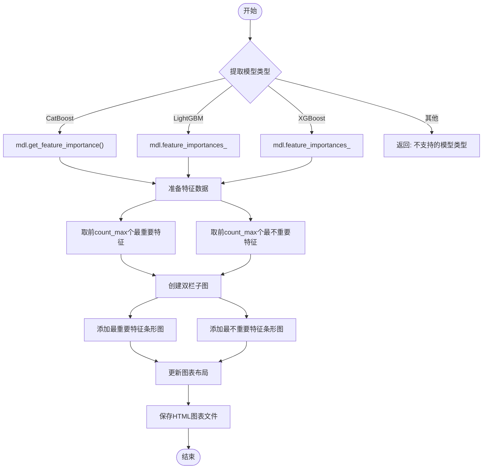
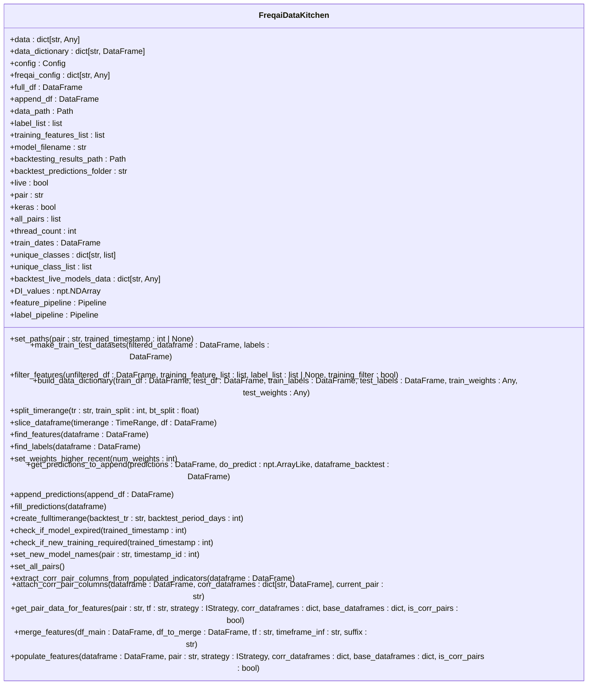
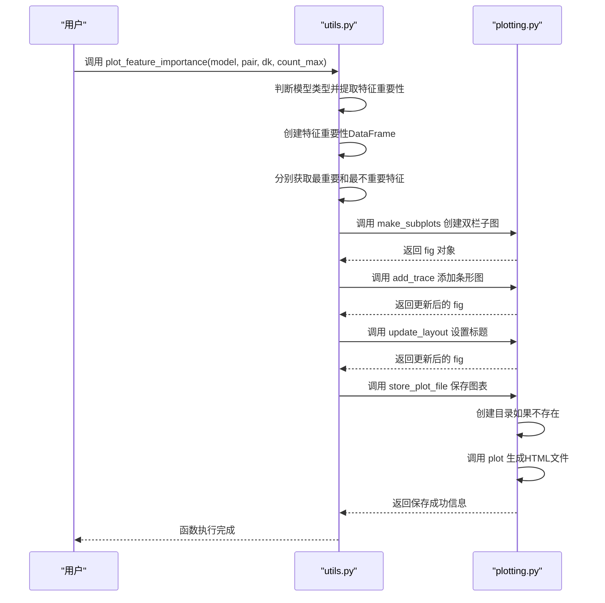
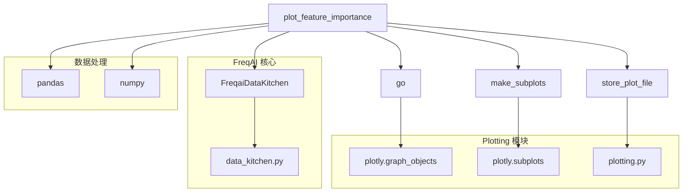

# 特征重要性可视化与诊断

<cite>
**本文档引用的文件**   
- [utils.py](file://freqtrade/freqai/utils.py#L93-L154)
- [plotting.py](file://freqtrade/plot/plotting.py#L608-L621)
- [data_kitchen.py](file://freqtrade/freqai/data_kitchen.py#L34-L735)
</cite>

## 目录
1. [简介](#简介)
2. [核心功能分析](#核心功能分析)
3. [参数详解](#参数详解)
4. [调用示例与输出解读](#调用示例与输出解读)
5. [模型调试中的诊断应用](#模型调试中的诊断应用)
6. [依赖关系分析](#依赖关系分析)

## 简介
`plot_feature_importance` 是 FreqAI 框架中的一个关键工具函数，用于可视化机器学习模型的特征重要性。该函数能够从 CatBoost、LightGBM、XGBoost 等主流模型中提取特征重要性数据，并生成直观的双栏水平条形图，分别展示最重要和最不重要的特征。通过分析特征重要性分布，交易者可以识别冗余或噪声特征，优化特征工程流程，从而提升模型的泛化能力和预测准确性。

**Section sources**
- [utils.py](file://freqtrade/freqai/utils.py#L93-L154)

## 核心功能分析

`plot_feature_importance` 函数的核心功能是为机器学习模型生成特征重要性可视化图表。该函数首先从输入的模型对象中提取特征重要性数据，支持多种主流机器学习库，包括 CatBoost、LightGBM 和 XGBoost。对于多输出模型（如 `FreqaiMultiOutputRegressor`），函数会为每个输出标签分别处理。



**Diagram sources**
- [utils.py](file://freqtrade/freqai/utils.py#L93-L154)

**Section sources**
- [utils.py](file://freqtrade/freqai/utils.py#L93-L154)

## 参数详解

### model 参数
`model` 参数是已训练的机器学习模型对象。该函数支持从多种模型库中提取特征重要性：
- **CatBoost**: 通过 `get_feature_importance()` 方法获取
- **LightGBM**: 通过 `feature_importances_` 属性获取
- **XGBoost**: 通过 `feature_importances_` 属性获取

如果模型类型不被支持，函数会记录日志并提前返回。

### pair 参数
`pair` 参数是交易对名称，如 "BTC/USD"。该参数用于图表标题，帮助用户识别当前分析的是哪个交易对的模型。

### dk 参数
`dk` 参数是 `FreqaiDataKitchen` 对象，这是一个非持久化的数据容器，用于存储当前交易对和循环的数据。它包含了训练特征的列名信息，这对于将特征重要性数值与实际特征名称对应起来至关重要。



**Diagram sources**
- [data_kitchen.py](file://freqtrade/freqai/data_kitchen.py#L34-L735)

### count_max 参数
`count_max` 参数控制图表中显示的特征数量，默认值为 25。该参数决定了在"最重要特征"和"最不重要特征"两个子图中各显示多少个特征。

**Section sources**
- [utils.py](file://freqtrade/freqai/utils.py#L93-L154)
- [data_kitchen.py](file://freqtrade/freqai/data_kitchen.py#L34-L735)

## 调用示例与输出解读

### 调用示例
```python
from freqtrade.freqai.utils import plot_feature_importance

# 假设 model, pair, dk 已经定义
plot_feature_importance(
    model=model,
    pair="BTC/USD",
    dk=dk,
    count_max=20
)
```

### 输出解读
函数生成一个 HTML 格式的交互式图表，包含两个水平条形图：
1. **左图（最重要特征）**: 显示特征重要性最高的 `count_max` 个特征，按重要性从下到上递增排列。
2. **右图（最不重要特征）**: 显示特征重要性最低的 `count_max` 个特征，同样按重要性从下到上递增排列。

图表标题会显示交易对名称。生成的文件会以 `"{dk.model_filename}-{label}.html"` 的格式保存在 `dk.data_path` 目录下。



**Diagram sources**
- [utils.py](file://freqtrade/freqai/utils.py#L93-L154)
- [plotting.py](file://freqtrade/plot/plotting.py#L608-L621)

**Section sources**
- [utils.py](file://freqtrade/freqai/utils.py#L93-L154)
- [plotting.py](file://freqtrade/plot/plotting.py#L608-L621)

## 模型调试中的诊断应用

`plot_feature_importance` 在模型调试中扮演着关键角色。通过分析生成的特征重要性图表，用户可以：

1. **识别关键特征**: 观察哪些特征对模型预测贡献最大，验证这些特征是否符合交易逻辑。
2. **发现噪声特征**: 识别那些重要性接近零的特征，这些特征可能是噪声或冗余的，可以考虑从特征集中移除。
3. **优化特征工程**: 根据特征重要性分布调整特征构造策略，例如对重要特征进行更精细的处理或构造其衍生特征。
4. **验证模型合理性**: 检查模型是否过度依赖少数几个特征，这可能导致过拟合。理想的特征重要性分布应该相对均衡。

通过定期生成和分析特征重要性图表，交易者可以持续监控模型的健康状况，及时发现潜在问题并进行优化。

**Section sources**
- [utils.py](file://freqtrade/freqai/utils.py#L93-L154)

## 依赖关系分析

`plot_feature_importance` 函数依赖于多个模块和类，形成了一个完整的功能链条。



**Diagram sources**
- [utils.py](file://freqtrade/freqai/utils.py#L93-L154)
- [plotting.py](file://freqtrade/plot/plotting.py#L608-L621)
- [data_kitchen.py](file://freqtrade/freqai/data_kitchen.py#L34-L735)

**Section sources**
- [utils.py](file://freqtrade/freqai/utils.py#L93-L154)
- [plotting.py](file://freqtrade/plot/plotting.py#L608-L621)
- [data_kitchen.py](file://freqtrade/freqai/data_kitchen.py#L34-L735)