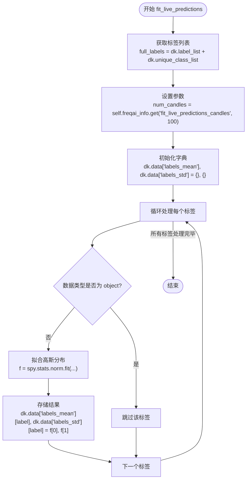
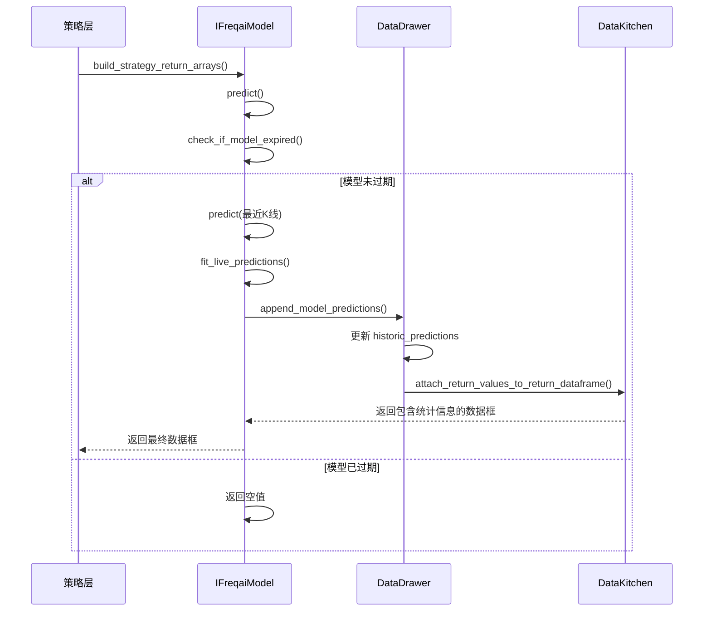

# 预测值统计拟合机制

<cite>
**Referenced Files in This Document**   
- [freqai_interface.py](file://freqtrade/freqai/freqai_interface.py)
- [data_drawer.py](file://freqtrade/freqai/data_drawer.py)
- [data_kitchen.py](file://freqtrade/freqai/data_kitchen.py)
</cite>

## 目录
1. [方法概述](#方法概述)
2. [核心实现](#核心实现)
3. [调用流程分析](#调用流程分析)
4. [参数影响](#参数影响)
5. [策略应用](#策略应用)

## 方法概述

`fit_live_predictions` 方法是 FreqAI 框架中的一个关键组件，负责基于历史预测数据对当前标签进行高斯分布拟合。该方法通过计算滚动窗口内的均值和标准差，为策略层提供统计信息，帮助识别预测值的相对位置，从而实现动态的交易决策。

**Section sources**
- [freqai_interface.py](file://freqtrade/freqai/freqai_interface.py#L692-L709)

## 核心实现

`fit_live_predictions` 方法的核心功能是利用 `scipy.stats.norm.fit` 函数对历史预测数据进行高斯分布拟合。该方法首先从 `historic_predictions` 字典中获取当前交易对的历史预测数据，然后对每个标签计算其在指定滚动窗口内的均值和标准差。

**Diagram sources**
- [freqai_interface.py](file://freqtrade/freqai/freqai_interface.py#L692-L709)

**Section sources**
- [freqai_interface.py](file://freqtrade/freqai/freqai_interface.py#L692-L709)

## 调用流程分析

`fit_live_predictions` 方法的调用流程涉及多个组件的协同工作。在实时交易模式下，该方法由 `build_strategy_return_arrays` 方法调用，而在回测模式下，则由 `backtesting_fit_live_predictions` 方法模拟调用。

**Diagram sources**
- [freqai_interface.py](file://freqtrade/freqai/freqai_interface.py#L470-L505)
- [data_drawer.py](file://freqtrade/freqai/data_drawer.py#L300-L380)
- [data_kitchen.py](file://freqtrade/freqai/data_kitchen.py#L1000-L1035)

**Section sources**
- [freqai_interface.py](file://freqtrade/freqai/freqai_interface.py#L470-L505)
- [data_drawer.py](file://freqtrade/freqai/data_drawer.py#L300-L380)
- [data_kitchen.py](file://freqtrade/freqai/data_kitchen.py#L1000-L1035)

## 参数影响

`num_candles` 参数控制着拟合窗口的大小，对模型的适应性有显著影响。该参数的值由 `fit_live_predictions_candles` 配置项决定，若未设置则默认为100根K线。

| 参数 | 默认值 | 影响 |
|------|--------|------|
| `fit_live_predictions_candles` | 100 | 控制滚动窗口大小，影响统计量的稳定性和响应速度 |

较小的窗口大小会使统计量对近期变化更敏感，但可能增加噪声；较大的窗口大小则会使统计量更稳定，但可能滞后于市场变化。

**Section sources**
- [freqai_interface.py](file://freqtrade/freqai/freqai_interface.py#L702-L707)

## 策略应用

此机制通过将预测值的均值和标准差注入到数据容器中，供策略层使用。策略可以利用这些统计信息计算Z-score，从而判断当前预测值的相对位置，实现动态的入场与出场决策。

例如，当预测值的Z-score超过某个阈值时，策略可以认为这是一个极端事件，从而触发相应的交易动作。这种基于统计分布的决策方法能够帮助策略更好地适应市场的变化，提高交易的鲁棒性。

**Section sources**
- [freqai_interface.py](file://freqtrade/freqai/freqai_interface.py#L692-L709)
- [data_drawer.py](file://freqtrade/freqai/data_drawer.py#L367-L368)