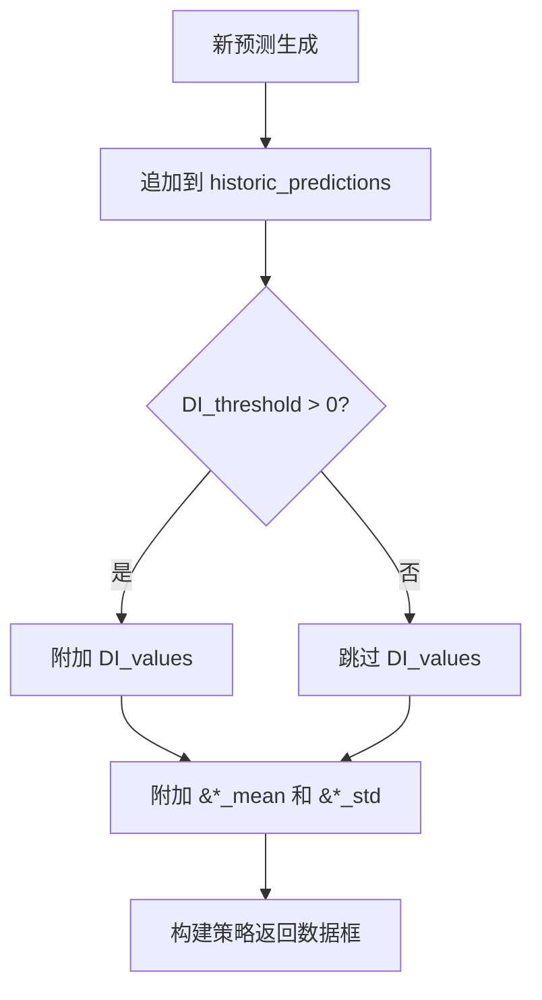

# 预测结果后处理

<cite>
**Referenced Files in This Document**   
- [data_drawer.py](file://freqtrade/freqai/data_drawer.py)
- [freqai_interface.py](file://freqtrade/freqai/freqai_interface.py)
- [data_kitchen.py](file://freqtrade/freqai/data_kitchen.py)
- [utils.py](file://freqtrade/freqai/utils.py)
</cite>

## 目录
1. [简介](#简介)
2. [核心机制](#核心机制)
3. [DI_values异常状态检测](#di_values异常状态检测)
4. [统计字段自动附加](#统计字段自动附加)
5. [特征重要性图表生成](#特征重要性图表生成)

## 简介
FreqAI系统通过一套复杂的后处理机制，将原始模型预测结果转化为策略可直接使用的动态统计基准。该机制的核心在于利用历史预测数据（historic_predictions）计算滚动均值和标准差，为策略提供基于Z-score的相对位置评估能力。同时，系统通过DI_values（Dissimilarity Index）检测异常市场状态，过滤不可靠预测，并通过`&*_mean`和`&*_std`等统计字段的自动附加，使策略能够做出更智能的决策。

## 核心机制

FreqAI系统通过`fit_live_predictions`功能实现预测结果的后处理。该功能利用存储在`FreqaiDataDrawer`中的历史预测数据（historic_predictions），为策略提供动态的统计基准。

在`IFreqaiModel`的`build_strategy_return_arrays`方法中，当系统处于实时（live）模式且配置了`fit_live_predictions_candles`参数时，会调用`fit_live_predictions`方法。该方法从`historic_predictions`中提取指定数量（由`fit_live_predictions_candles`参数控制）的最近预测值，使用`scipy.stats.norm.fit`函数对每个预测标签（label）进行高斯分布拟合，计算出滚动均值（`labels_mean`）和标准差（`labels_std`）。

这些计算出的统计量随后被附加到当前的预测结果中，使策略能够基于预测值的相对位置（如Z-score）进行决策。例如，一个远高于历史均值的预测值可能被视为极端信号，策略可以据此调整其交易行为。

**Section sources**
- [freqai_interface.py](file://freqtrade/freqai/freqai_interface.py#L470-L505)
- [data_drawer.py](file://freqtrade/freqai/data_drawer.py#L332-L397)

## DI_values异常状态检测

DI_values（Dissimilarity Index）是FreqAI系统用于检测异常市场状态和过滤不可靠预测的关键指标。它通过计算当前市场特征与历史训练数据分布的差异度来工作。

当`feature_parameters`中的`DI_threshold`参数被设置为大于0的值时，系统会在数据预处理管道中激活`DissimilarityIndex`变换器。该变换器会为每个预测样本计算一个DI值，该值量化了当前市场状态与模型训练时所见状态的“不相似性”。

在`append_model_predictions`方法中，如果`DI_threshold`被启用，当前的DI值会被直接从`FreqaiDataKitchen`的`DI_values`数组中取出，并附加到`historic_predictions`数据框中。策略可以利用这个值来判断当前预测的可靠性：当DI值超过`DI_threshold`时，表明市场状态异常，模型的预测可能不再可靠，策略应避免进行交易。

**Section sources**
- [data_drawer.py](file://freqtrade/freqai/data_drawer.py#L332-L397)
- [freqai_interface.py](file://freqtrade/freqai/freqai_interface.py#L180-L185)

## 统计字段自动附加

系统通过`append_model_predictions`方法自动将`&*_mean`和`&*_std`等统计字段附加到预测结果中。

该过程发生在每次新的预测生成后。`append_model_predictions`方法首先将新的预测值（`predictions`）追加到`historic_predictions`数据框的末尾。然后，它会遍历所有预测标签，查找并附加对应的均值和标准差字段。

具体实现是通过`dk.data["labels_mean"]`和`dk.data["labels_std"]`字典获取`fit_live_predictions`计算出的统计量，并将它们写入`historic_predictions`数据框中对应`{label}_mean`和`{label}_std`的列。最终，策略通过`attach_return_values_to_return_dataframe`方法获取的返回数据框中，就包含了这些动态的统计基准，使策略能够基于预测值的相对位置做出更智能的决策。

**Diagram sources **
- [data_drawer.py](file://freqtrade/freqai/data_drawer.py#L332-L397)

**Section sources**
- [data_drawer.py](file://freqtrade/freqai/data_drawer.py#L332-L397)

## 特征重要性图表生成

系统利用`utils.py`中的`plot_feature_importance`工具生成特征重要性图表，以辅助模型诊断和优化。

该工具函数接收训练好的模型、交易对和`FreqaiDataKitchen`实例作为输入。它首先根据模型类型（如CatBoost、LightGBM、XGBoost）提取特征重要性。然后，它使用`plotly`库创建一个包含两个子图的图表：左侧显示最重要的特征，右侧显示最不重要的特征。

生成的图表以HTML格式保存在模型数据路径下，文件名为`{model_filename}-{label}.html`。用户可以通过这些图表直观地了解哪些特征对模型预测贡献最大，从而进行特征工程的优化和模型的诊断。

**Section sources**
- [utils.py](file://freqtrade/freqai/utils.py#L93-L154)