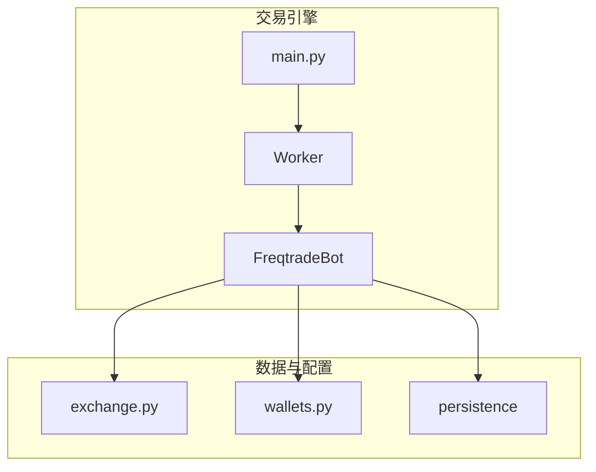
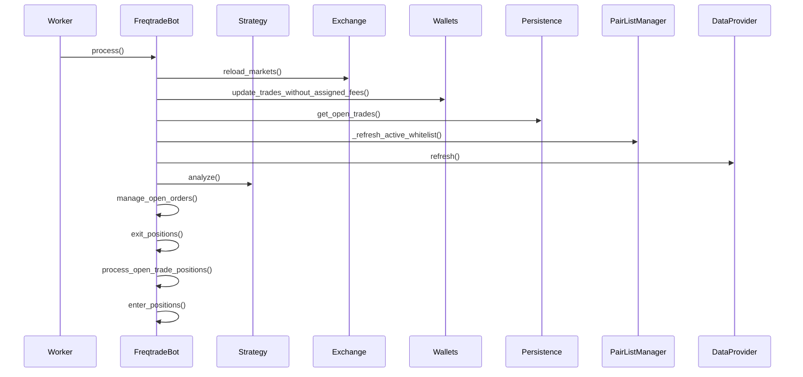
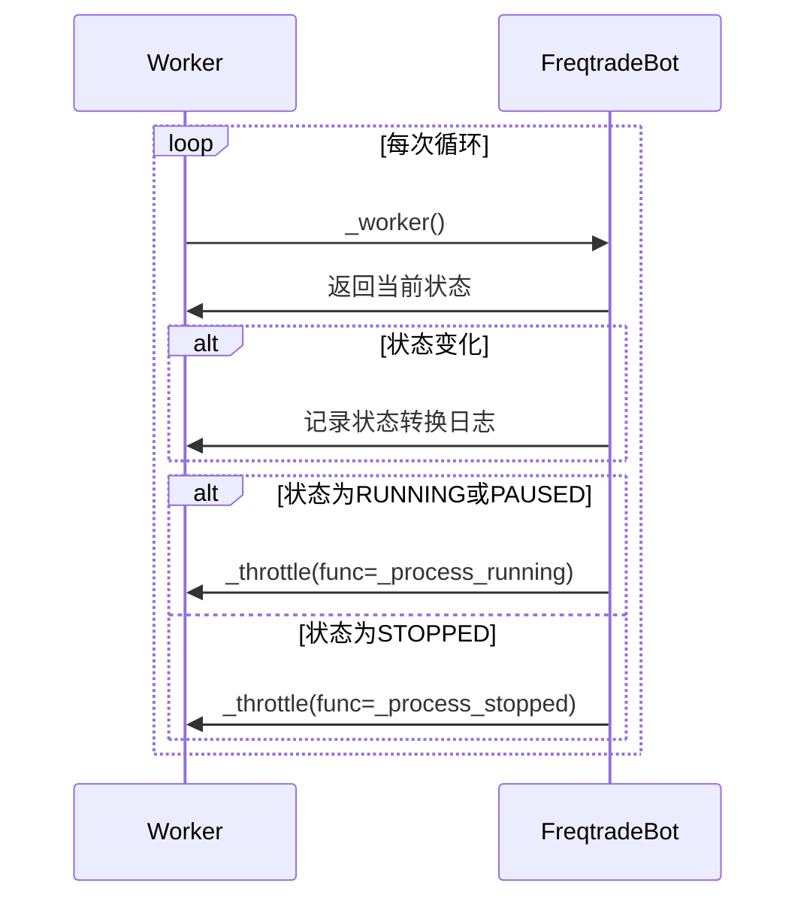
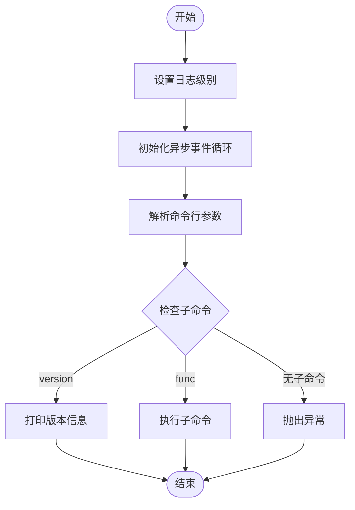
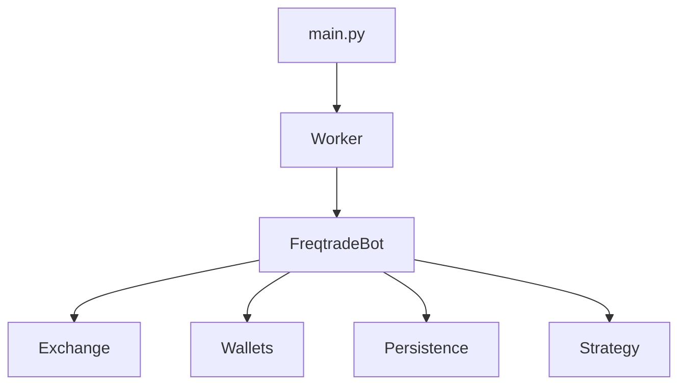

# 交易引擎核心

<cite>
**本文档引用的文件**
- [freqtradebot.py](file://freqtrade/freqtradebot.py)
- [worker.py](file://freqtrade/worker.py)
- [main.py](file://freqtrade/main.py)
- [exchange.py](file://freqtrade/exchange/exchange.py)
- [wallets.py](file://freqtrade/wallets.py)
- [trade_model.py](file://freqtrade/persistence/trade_model.py)
</cite>

## 目录
1. [引言](#引言)
2. [项目结构](#项目结构)
3. [核心组件](#核心组件)
4. [架构概述](#架构概述)
5. [详细组件分析](#详细组件分析)
6. [依赖分析](#依赖分析)
7. [性能考虑](#性能考虑)
8. [故障排除指南](#故障排除指南)
9. [结论](#结论)

## 引言
本文档深入解析了Freqtrade交易引擎的内部工作机制，重点围绕`freqtradebot.py`中的交易循环生命周期管理。文档详细阐述了主控逻辑如何协调市场数据获取、策略信号生成、订单执行和钱包状态更新。同时，分析了`worker.py`中的异步任务调度与事件驱动架构，以及`main.py`的启动流程。此外，还解释了`exchange.py`抽象层如何统一管理多个交易所的API差异，并实现可靠的订单路由。涵盖了现货、期货和杠杆交易模式的资金计算、保证金管理和风险控制机制。通过交易流程时序图和状态机模型，帮助开发者理解并发处理与异常恢复策略。

## 项目结构
Freqtrade项目采用模块化设计，主要分为命令行接口、配置管理、数据处理、交易执行、持久化和插件系统等部分。核心交易逻辑位于`freqtrade`目录下，其中`freqtradebot.py`是交易引擎的核心，`worker.py`负责异步任务调度，`main.py`是程序的入口点。`exchange`目录包含了与不同交易所交互的抽象层，`persistence`目录负责交易数据的持久化，`strategy`目录则包含了交易策略的接口定义。

**Section sources**
- [freqtradebot.py](file://freqtrade/freqtradebot.py)
- [worker.py](file://freqtrade/worker.py)
- [main.py](file://freqtrade/main.py)

## 核心组件
`freqtradebot.py`文件中的`FreqtradeBot`类是整个交易引擎的核心。它负责协调市场数据获取、策略信号生成、订单执行和钱包状态更新。`worker.py`文件中的`Worker`类负责异步任务调度和事件驱动架构，确保交易引擎能够高效地处理各种任务。`main.py`文件是程序的入口点，负责解析命令行参数并启动交易引擎。

**Section sources**
- [freqtradebot.py](file://freqtrade/freqtradebot.py#L72-L2615)
- [worker.py](file://freqtrade/worker.py#L25-L238)
- [main.py](file://freqtrade/main.py#L26-L74)

## 架构概述
Freqtrade的架构设计遵循模块化和分层原则，确保了系统的可维护性和可扩展性。交易引擎的核心是`FreqtradeBot`类，它通过`Worker`类进行异步任务调度，确保交易逻辑的高效执行。`main.py`作为程序的入口点，负责初始化配置并启动交易引擎。`exchange.py`提供了与不同交易所交互的抽象层，使得交易引擎能够支持多个交易所。`wallets.py`负责管理钱包状态，确保交易过程中的资金安全。

**Diagram sources**
- [freqtradebot.py](file://freqtrade/freqtradebot.py#L72-L2615)
- [worker.py](file://freqtrade/worker.py#L25-L238)
- [main.py](file://freqtrade/main.py#L26-L74)
- [exchange.py](file://freqtrade/exchange/exchange.py#L119-L3946)
- [wallets.py](file://freqtrade/wallets.py#L35-L437)

## 详细组件分析

### FreqtradeBot 分析
`FreqtradeBot`类是交易引擎的核心，负责协调市场数据获取、策略信号生成、订单执行和钱包状态更新。它通过`process`方法周期性地检查市场数据，生成交易信号，并执行相应的订单操作。

#### 交易循环生命周期
`FreqtradeBot`的`process`方法是交易循环的核心，它按照以下步骤执行：
1. 检查市场数据是否需要重新加载。
2. 更新未分配费用的交易。
3. 查询持久化层中的开放交易。
4. 刷新活动交易对白名单。
5. 刷新K线数据。
6. 执行策略分析。
7. 管理开放订单。
8. 处理退出位置。
9. 检查是否需要调整当前仓位。
10. 寻找新的入场机会。

**Diagram sources**
- [freqtradebot.py](file://freqtrade/freqtradebot.py#L246-L300)

### Worker 分析
`Worker`类负责异步任务调度和事件驱动架构，确保交易引擎能够高效地处理各种任务。它通过`_worker`方法周期性地检查服务状态，并根据状态执行相应的操作。

#### 异步任务调度
`Worker`的`_worker`方法是异步任务调度的核心，它按照以下步骤执行：
1. 获取当前服务状态。
2. 如果状态发生变化，记录状态转换日志。
3. 根据当前状态执行相应的操作（如启动、停止或暂停）。
4. 根据配置的时间间隔执行任务。

**Diagram sources**
- [worker.py](file://freqtrade/worker.py#L82-L142)

### Main 分析
`main.py`文件是程序的入口点，负责解析命令行参数并启动交易引擎。它通过`main`函数初始化配置，并根据配置启动相应的子命令。

#### 启动流程
`main`函数的启动流程如下：
1. 设置日志级别。
2. 初始化异步事件循环。
3. 解析命令行参数。
4. 根据参数调用相应的子命令。

**Diagram sources**
- [main.py](file://freqtrade/main.py#L26-L74)

## 依赖分析
Freqtrade的各个组件之间存在紧密的依赖关系。`FreqtradeBot`依赖于`Worker`进行异步任务调度，依赖于`Exchange`进行市场数据获取和订单执行，依赖于`Wallets`进行钱包状态管理。`Worker`依赖于`FreqtradeBot`进行交易逻辑的执行。`main.py`依赖于`Worker`启动交易引擎。

**Diagram sources**
- [main.py](file://freqtrade/main.py#L26-L74)
- [worker.py](file://freqtrade/worker.py#L25-L238)
- [freqtradebot.py](file://freqtrade/freqtradebot.py#L72-L2615)

## 性能考虑
Freqtrade在设计时充分考虑了性能问题。通过异步任务调度和事件驱动架构，确保了交易引擎的高效执行。`FreqtradeBot`的`process`方法通过`_measure_execution`装饰器监控策略分析的执行时间，避免因分析耗时过长导致订单延迟。`Worker`的`_throttle`方法通过`time.sleep`确保任务执行的间隔，避免频繁的市场数据请求。

## 故障排除指南
在使用Freqtrade时，可能会遇到各种问题。以下是一些常见的故障排除方法：
- **市场数据获取失败**：检查网络连接和交易所API密钥是否正确。
- **订单执行失败**：检查账户余额和交易对是否支持。
- **策略信号生成异常**：检查策略代码是否存在逻辑错误。
- **钱包状态更新失败**：检查数据库连接和权限设置。

**Section sources**
- [freqtradebot.py](file://freqtrade/freqtradebot.py#L72-L2615)
- [worker.py](file://freqtrade/worker.py#L25-L238)
- [main.py](file://freqtrade/main.py#L26-L74)

## 结论
Freqtrade是一个功能强大的交易引擎，通过模块化和分层设计，确保了系统的可维护性和可扩展性。`FreqtradeBot`类作为核心组件，协调市场数据获取、策略信号生成、订单执行和钱包状态更新。`Worker`类通过异步任务调度和事件驱动架构，确保了交易引擎的高效执行。`main.py`作为程序的入口点，负责初始化配置并启动交易引擎。通过深入解析这些核心组件，开发者可以更好地理解和使用Freqtrade进行量化交易。