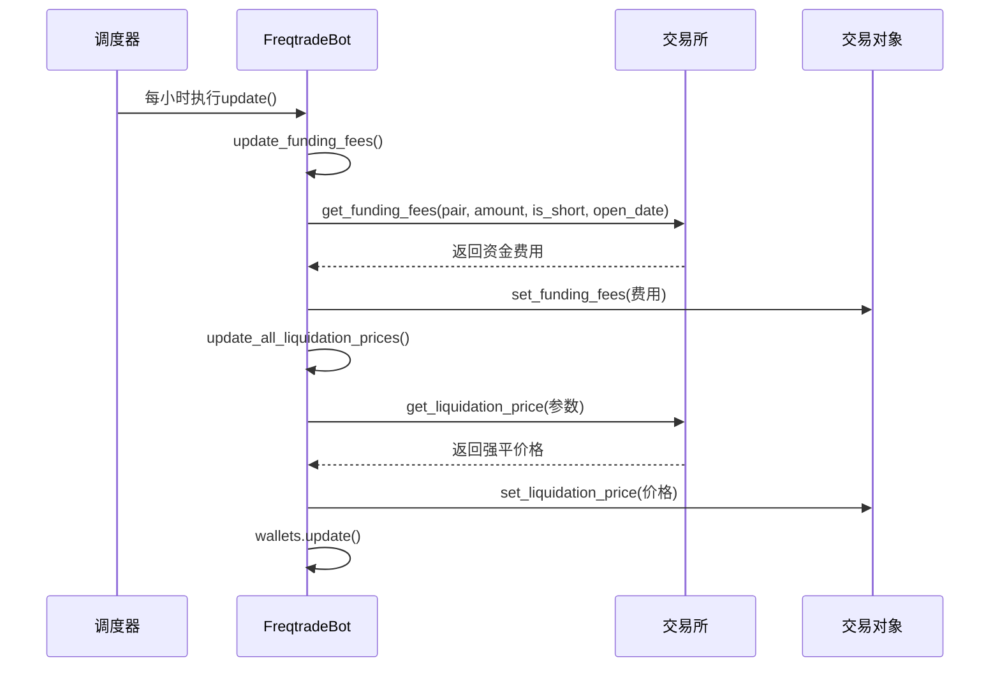

# 交易模式详解

<cite>
**本文档引用文件**   
- [freqtradebot.py](file://freqtrade/freqtradebot.py)
- [liquidation_price.py](file://freqtrade/leverage/liquidation_price.py)
- [interest.py](file://freqtrade/leverage/interest.py)
- [tradingmode.py](file://freqtrade/enums/tradingmode.py)
- [marginmode.py](file://freqtrade/enums/marginmode.py)
</cite>

## 目录
1. [现货、期货与杠杆交易模式概述](#现货期货与杠杆交易模式概述)
2. [资金计算与保证金机制](#资金计算与保证金机制)
3. [风险控制策略与强平价格计算](#风险控制策略与强平价格计算)
4. [交叉与逐仓保证金实现原理](#交叉与逐仓保证金实现原理)
5. [资金费用更新与持仓管理协同机制](#资金费用更新与持仓管理协同机制)
6. [配置示例与性能影响分析](#配置示例与性能影响分析)

## 现货、期货与杠杆交易模式概述

Freqtrade支持三种核心交易模式：现货（SPOT）、期货（FUTURES）和杠杆交易（MARGIN）。这些模式通过`TradingMode`枚举类进行定义，分别对应`SPOT`、`FUTURES`和`MARGIN`三种状态。交易模式在`FreqtradeBot`初始化时从配置文件中读取，默认为现货模式。不同模式在资金使用、风险敞口和收益计算方面存在显著差异。现货模式使用账户全额资金进行交易，风险相对较低；期货和杠杆模式则通过保证金机制放大收益与风险，适用于对市场方向有较强判断的交易者。

**Section sources**
- [tradingmode.py](file://freqtrade/enums/tradingmode.py#L1-L16)
- [freqtradebot.py](file://freqtrade/freqtradebot.py#L78-L187)

## 资金计算与保证金机制

在期货和杠杆交易中，资金计算逻辑与现货模式有本质区别。系统通过`get_valid_enter_price_and_stake`方法验证并调整交易价格、数量和杠杆倍数。该方法首先获取入场价格，然后根据策略定义的`leverage`函数计算实际杠杆，最终将杠杆值限制在交易所允许的最大范围内。保证金的计算基于交易对、入场价格、杠杆倍数和交易数量，确保交易请求符合交易所的最小和最大持仓要求。资金可用性由`Wallets`组件管理，通过`get_available_stake_amount`方法获取当前可用的交易资金。

**Section sources**
- [freqtradebot.py](file://freqtrade/freqtradebot.py#L1080-L1179)

## 风险控制策略与强平价格计算

风险控制是期货和杠杆交易的核心。Freqtrade通过`update_liquidation_prices`函数计算并更新持仓的强平价格。该函数根据保证金模式的不同采用不同的计算逻辑：在交叉保证金模式下，系统获取所有持仓的总抵押品价值，然后遍历所有开放交易，调用交易所的`get_liquidation_price`方法计算每个仓位的强平价格；在逐仓保证金模式下，强平价格的计算仅基于单个仓位的质押金额。强平价格的计算考虑了持仓方向（多头或空头）、开仓价格、数量、杠杆倍数和钱包余额等关键参数，确保风险评估的准确性。

```mermaid
flowchart TD
Start([开始更新强平价格]) --> CheckMode["判断保证金模式"]
CheckMode --> |交叉保证金| GetCollateral["获取总抵押品价值"]
GetCollateral --> GetOpenTrades["获取所有开放交易"]
GetOpenTrades --> LoopTrades["遍历每个交易"]
LoopTrades --> CalcLiquidation["调用交易所计算强平价格"]
CalcLiquidation --> UpdateTrade["更新交易的强平价格"]
UpdateTrade --> NextTrade["下一个交易"]
NextTrade --> LoopTrades
LoopTrades --> End1([结束])
CheckMode --> |逐仓保证金| CheckTrade["检查交易对象"]
CheckTrade --> |存在| CalcIsolated["计算单个仓位强平价格"]
CalcIsolated --> UpdateSingle["更新该交易的强平价格"]
UpdateSingle --> End2([结束])
CheckTrade --> |不存在| RaiseError["抛出依赖异常"]
RaiseError --> End3([结束])
```

**Diagram sources**
- [liquidation_price.py](file://freqtrade/leverage/liquidation_price.py#L12-L68)

## 交叉与逐仓保证金实现原理

交叉保证金（CROSS）和逐仓保证金（ISOLATED）是两种不同的风险隔离机制。交叉保证金模式下，账户内所有仓位共享同一资金池作为抵押品，一个仓位的亏损可能影响其他仓位的安全性，但资金利用率更高。逐仓保证金模式下，每个仓位都有独立的抵押品，风险被严格隔离，一个仓位的强平不会影响其他仓位，但需要为每个仓位单独分配资金。在代码实现中，`MarginMode`枚举类定义了`CROSS`和`ISOLATED`两种模式。`FreqtradeBot`在初始化时读取配置中的`margin_mode`参数，并在处理期货交易时根据该模式调用相应的强平价格更新逻辑。

**Section sources**
- [marginmode.py](file://freqtrade/enums/marginmode.py#L1-L17)
- [freqtradebot.py](file://freqtrade/freqtradebot.py#L356-L364)

## 资金费用更新与持仓管理协同机制

在期货交易中，资金费用（Funding Fees）是持有仓位的重要成本。`FreqtradeBot`通过`update_funding_fees`方法定期更新所有开放交易的资金费用。该方法遍历所有开放交易，调用交易所的`get_funding_fees`接口获取每个仓位的资金费用，并通过`set_funding_fees`方法更新到交易对象中。此过程与强平价格更新和钱包余额更新协同进行，由一个定时任务调度器（Scheduler）统一管理。当交易模式为期货时，系统会每小时在特定分钟（1分和31分）执行一次`update`函数，该函数内部按顺序调用`update_funding_fees`、`update_all_liquidation_prices`和`wallets.update`，确保持仓信息的实时性和一致性。

**Diagram sources**
- [freqtradebot.py](file://freqtrade/freqtradebot.py#L78-L187)
- [freqtradebot.py](file://freqtrade/freqtradebot.py#L366-L377)

## 配置示例与性能影响分析

用户可通过配置文件选择合适的交易模式。现货模式配置简单，只需设置`"trading_mode": "spot"`；期货模式需额外配置`"margin_mode"`为`"cross"`或`"isolated"`。交叉保证金模式适合追求高资金利用率的激进策略，但需警惕全仓强平风险；逐仓保证金模式适合稳健策略，风险可控但资金效率较低。性能方面，期货模式因需频繁计算强平价格和更新资金费用，对系统资源消耗略高于现货模式。建议根据风险偏好选择模式：保守型用户选择现货，平衡型用户选择逐仓期货，激进型用户选择交叉期货。

**Section sources**
- [freqtradebot.py](file://freqtrade/freqtradebot.py#L78-L187)
- [liquidation_price.py](file://freqtrade/leverage/liquidation_price.py#L12-L68)