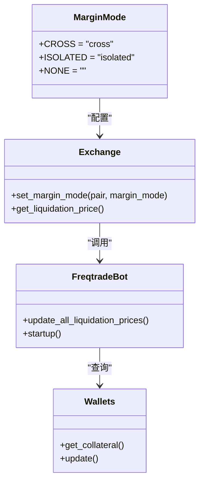
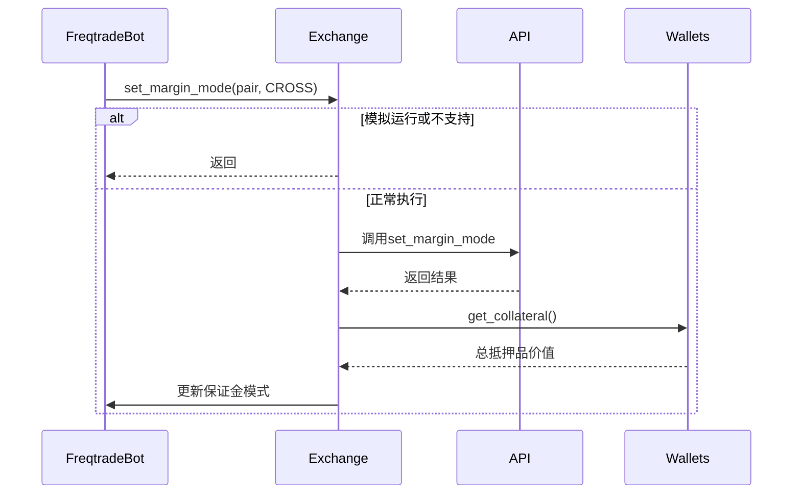
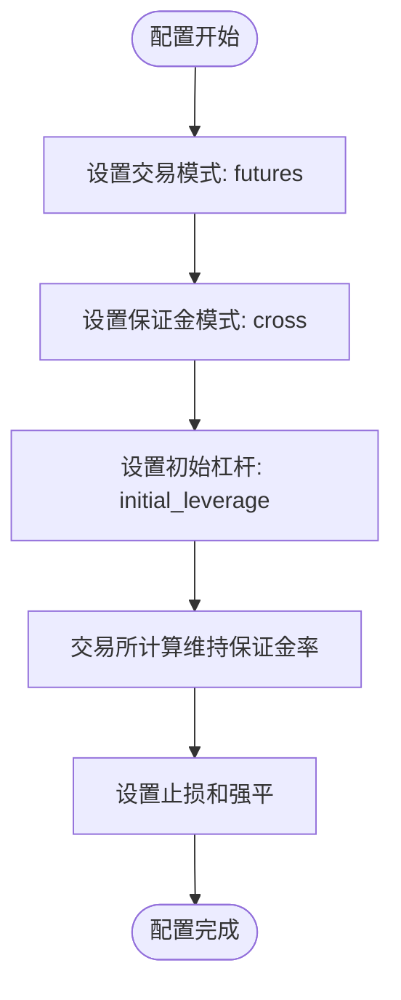

# 交叉保证金模式

<cite>
**本文档中引用的文件**  
- [marginmode.py](file://freqtrade/enums/marginmode.py)
- [exchange.py](file://freqtrade/exchange/exchange.py)
- [freqtradebot.py](file://freqtrade/freqtradebot.py)
- [liquidation_price.py](file://freqtrade/leverage/liquidation_price.py)
- [config_full.example.json](file://config_examples/config_full.example.json)
</cite>

## 目录
1. [交叉保证金模式概述](#交叉保证金模式概述)
2. [核心实现机制](#核心实现机制)
3. [账户保证金池共享机制](#账户保证金池共享机制)
4. [交易所API交互流程](#交易所api交互流程)
5. [仓位管理与盈亏动态影响](#仓位管理与盈亏动态影响)
6. [配置示例与杠杆关系](#配置示例与杠杆关系)
7. [强平价格计算机制](#强平价格计算机制)
8. [与隔离保证金模式对比](#与隔离保证金模式对比)
9. [实战配置建议](#实战配置建议)

## 交叉保证金模式概述

交叉保证金（CROSS）模式是Freqtrade中一种高级的保证金交易模式，允许账户所有仓位共享同一保证金池。在这种模式下，账户的整体资金状况决定了所有仓位的风险水平，而非单个仓位独立计算。这种机制提高了资金利用率，但也增加了风险扩散的可能性。当启用MarginMode.CROSS时，账户的所有仓位将共同使用账户的总权益作为保证金，从而实现更高效的杠杆使用。

**Section sources**
- [marginmode.py](file://freqtrade/enums/marginmode.py#L3-L15)

## 核心实现机制

交叉保证金模式的核心实现依赖于MarginMode枚举类和Exchange类的set_margin_mode方法。MarginMode枚举定义了CROSS、ISOLATED和NONE三种模式，其中CROSS模式允许所有仓位共享保证金池。当配置中启用CROSS模式时，系统会通过set_margin_mode方法与交易所API交互，设置特定交易对的保证金模式。这种设计确保了交易策略能够灵活地在不同保证金模式间切换，同时保持与交易所的兼容性。

**Diagram sources**
- [marginmode.py](file://freqtrade/enums/marginmode.py#L3-L15)
- [exchange.py](file://freqtrade/exchange/exchange.py#L3614-L3646)
- [freqtradebot.py](file://freqtrade/freqtradebot.py#L226-L244)

## 账户保证金池共享机制

在交叉保证金模式下，账户所有仓位共享同一保证金池的技术实现主要通过Wallets类的get_collateral方法完成。当margin_mode设置为CROSS时，系统会计算账户的总抵押品价值作为所有仓位的共同保证金基础。这种共享机制意味着单个仓位的盈亏会直接影响整个账户的保证金水平，从而影响其他仓位的风险状况。资金利用率得到最大化，因为不需要为每个仓位单独预留保证金，但这也带来了风险扩散的问题，即一个仓位的大幅亏损可能影响到其他仓位的安全。

**Section sources**
- [liquidation_price.py](file://freqtrade/leverage/liquidation_price.py#L12-L68)
- [freqtradebot.py](file://freqtrade/freqtradebot.py#L356-L364)

## 交易所API交互流程

交叉保证金模式与交易所API的交互主要通过Exchange类的set_margin_mode方法实现。该方法首先检查是否处于模拟运行模式或交易所是否支持setMarginMode功能，然后调用底层ccxt库的set_margin_mode方法与交易所进行通信。交互流程包括：验证配置参数、构建API请求、发送请求到交易所、处理响应结果。如果请求失败，系统会根据错误类型进行相应的异常处理，如临时错误会进行重试，而操作性错误则会抛出异常。这种设计确保了与不同交易所的兼容性和稳定性。

**Diagram sources**
- [exchange.py](file://freqtrade/exchange/exchange.py#L3614-L3646)
- [liquidation_price.py](file://freqtrade/leverage/liquidation_price.py#L12-L68)

## 仓位管理与盈亏动态影响

在freqtradebot.py中，仓位管理逻辑通过update_all_liquidation_prices方法实现对整体保证金水平的动态影响。当启用交叉保证金模式时，系统会定期更新所有开放仓位的强平价格，这些计算基于账户的总抵押品价值而非单个仓位的保证金。盈亏的动态影响体现在：当某个仓位盈利时，账户总权益增加，从而提高其他仓位的安全边际；反之，当某个仓位亏损时，账户总权益减少，可能导致其他仓位面临更高的强平风险。这种联动效应要求交易者更加关注整体账户的风险管理。

**Section sources**
- [freqtradebot.py](file://freqtrade/freqtradebot.py#L356-L364)
- [liquidation_price.py](file://freqtrade/leverage/liquidation_price.py#L12-L68)

## 配置示例与杠杆关系

配置文件中的initial_leverage设置与维持保证金率之间存在密切关系。在config_full.example.json中，trading_mode设置为futures，margin_mode设置为cross，同时initial_leverage定义了初始杠杆倍数。维持保证金率由交易所根据杠杆倍数自动计算，通常杠杆越高，维持保证金率也越高。例如，10倍杠杆可能对应1%的维持保证金率，而20倍杠杆可能对应2%的维持保证金率。这种关系确保了在高杠杆交易时有足够的风险缓冲，防止因小幅价格波动就导致强平。

**Diagram sources**
- [config_full.example.json](file://config_examples/config_full.example.json#L28-L30)
- [exchange.py](file://freqtrade/exchange/exchange.py#L173-L176)

## 强平价格计算机制

强平价格的计算在交叉保证金模式下需要考虑账户整体头寸，这是因为所有仓位共享同一保证金池。计算过程首先获取账户的总抵押品价值，然后基于所有开放仓位的持仓量、开仓价格和杠杆倍数，计算整体的强平阈值。与隔离保证金模式不同，交叉保证金模式的强平价格不是基于单个仓位的保证金，而是基于账户的整体风险状况。这意味着即使某个仓位本身有足够的保证金，但如果账户整体权益因其他仓位亏损而下降，该仓位仍可能面临强平风险。

**Section sources**
- [liquidation_price.py](file://freqtrade/leverage/liquidation_price.py#L12-L68)
- [freqtradebot.py](file://freqtrade/freqtradebot.py#L356-L364)

## 与隔离保证金模式对比

交叉保证金模式与隔离保证金模式在风险特性和资金利用方面存在显著差异。交叉保证金模式在极端行情下存在连锁爆仓风险，因为一个仓位的大幅亏损可能影响到其他仓位的安全，但其优势在于高杠杆使用和资金利用率。相比之下，隔离保证金模式为每个仓位分配独立的保证金，避免了风险扩散，但在资金利用效率上较低。对于趋势交易策略，交叉保证金模式更适合，因为它允许在趋势确认后集中使用杠杆，最大化收益潜力，但需要更严格的风险控制措施来防范连锁爆仓风险。

**Section sources**
- [marginmode.py](file://freqtrade/enums/marginmode.py#L3-L15)
- [exchange.py](file://freqtrade/exchange/exchange.py#L173-L176)

## 实战配置建议

对于趋势交易策略，建议的实战配置包括：将trading_mode设置为futures，margin_mode设置为cross，initial_leverage根据风险偏好设置在5-10倍之间。同时，应配置合理的止损策略和仓位管理规则，如使用动态止损和分批建仓。监控账户整体风险状况，避免过度集中持仓。在极端行情下，考虑临时降低杠杆倍数或切换到隔离保证金模式以控制风险。定期评估策略表现，根据市场状况调整配置参数，确保风险收益比处于可接受范围。

**Section sources**
- [config_full.example.json](file://config_examples/config_full.example.json#L28-L30)
- [freqtradebot.py](file://freqtrade/freqtradebot.py#L226-L244)