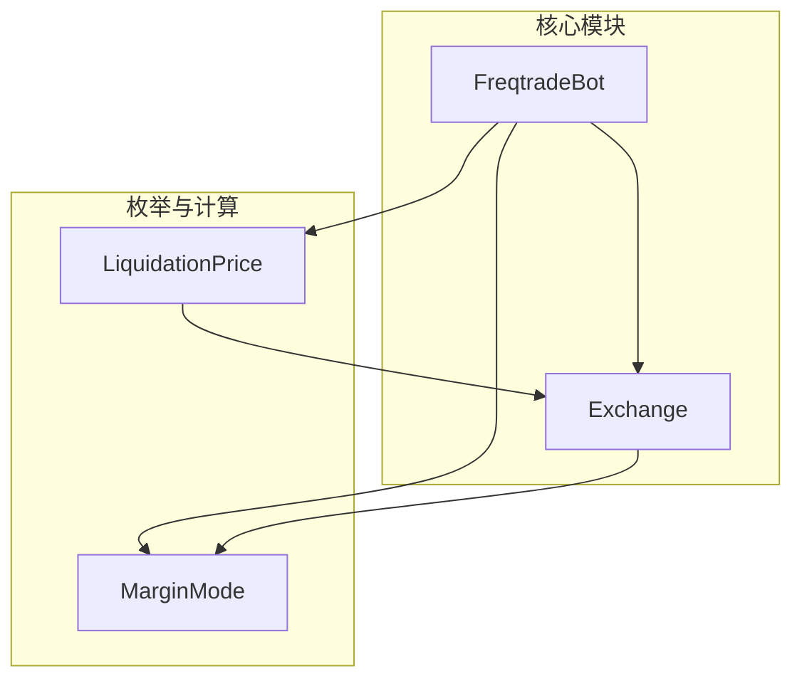
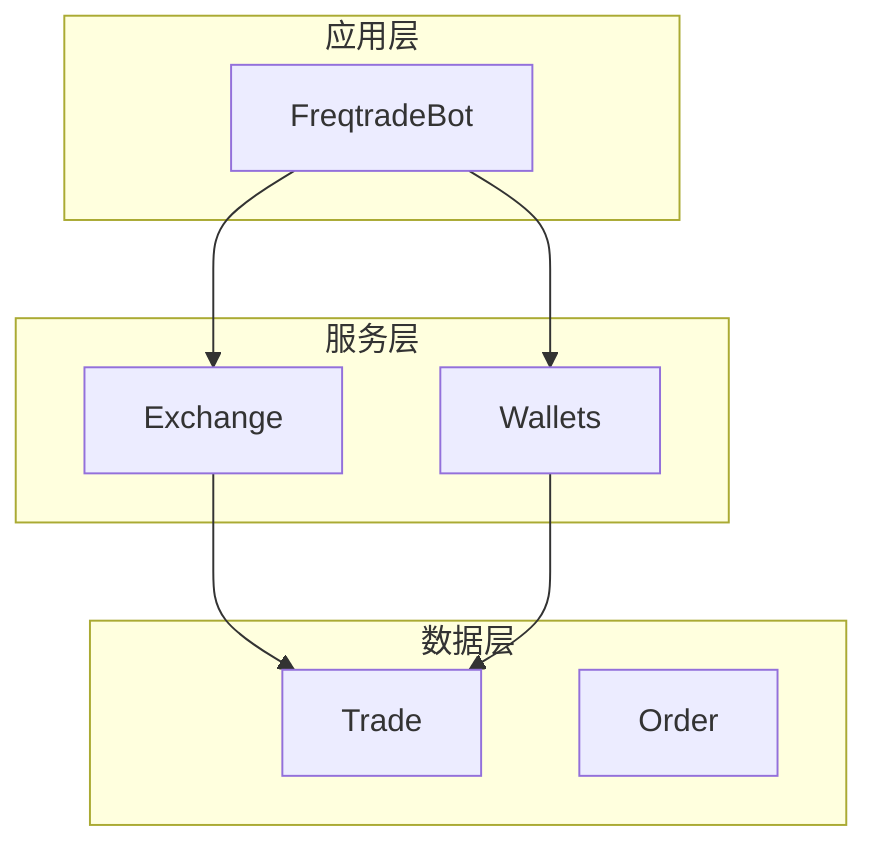
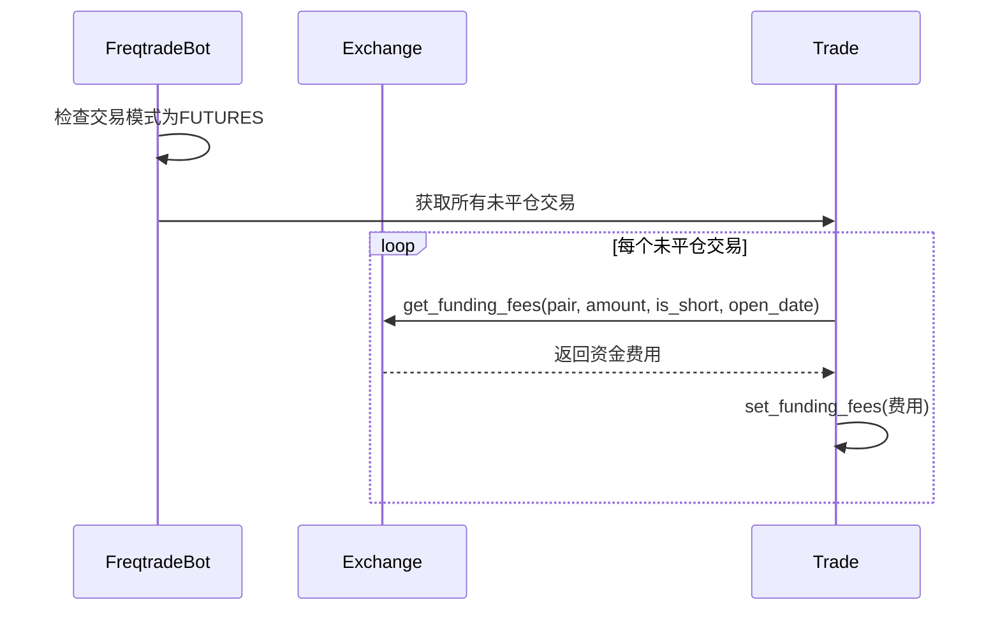
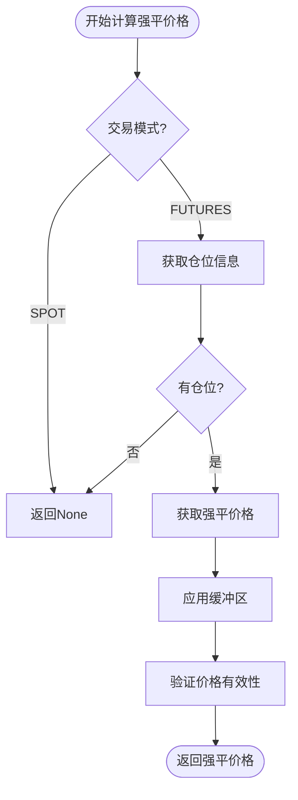
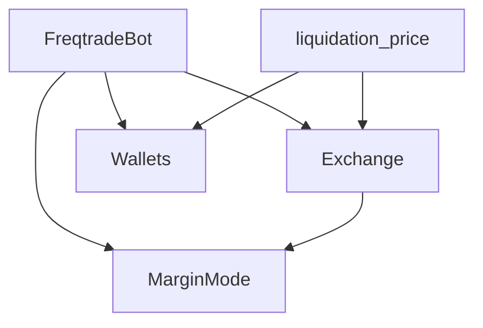

# 期货交易模式

<cite>
**本文档中引用的文件**  
- [freqtradebot.py](file://freqtrade/freqtradebot.py)
- [marginmode.py](file://freqtrade/enums/marginmode.py)
- [liquidation_price.py](file://freqtrade/leverage/liquidation_price.py)
- [exchange.py](file://freqtrade/exchange/exchange.py)
</cite>

## 目录
1. [项目结构](#项目结构)
2. [核心组件](#核心组件)
3. [架构概述](#架构概述)
4. [详细组件分析](#详细组件分析)
5. [依赖分析](#依赖分析)

## 项目结构

Freqtrade 项目的期货交易功能主要集中在 `freqtrade` 核心模块中。系统通过 `freqtradebot.py` 作为主控制器，协调资金费率更新、强平价格计算和保证金模式管理。`enums` 目录下的 `marginmode.py` 定义了交叉与逐仓保证金模式的枚举值，而 `leverage` 目录中的 `liquidation_price.py` 负责强平价格的计算逻辑。`exchange` 模块提供了与交易所交互的底层实现，包括资金费率获取和保证金模式设置。

**图表来源**  
- [freqtradebot.py](file://freqtrade/freqtradebot.py#L78-L187)
- [marginmode.py](file://freqtrade/enums/marginmode.py#L3-L15)
- [liquidation_price.py](file://freqtrade/leverage/liquidation_price.py#L0-L69)
- [exchange.py](file://freqtrade/exchange/exchange.py#L1303-L1306)

**章节来源**  
- [freqtradebot.py](file://freqtrade/freqtradebot.py#L78-L187)
- [marginmode.py](file://freqtrade/enums/marginmode.py#L3-L15)

## 核心组件

系统在 `TradingMode.FUTURES` 模式下，通过 `FreqtradeBot` 类的 `update_funding_fees` 方法定期更新资金费率。该方法遍历所有未平仓交易，调用交易所接口获取资金费用并更新到交易记录中。同时，`update_all_liquidation_prices` 方法负责在交叉保证金模式下批量更新所有交易的强平价格。`MarginMode` 枚举定义了 `CROSS` 和 `ISOLATED` 两种模式，影响着仓位的风险隔离方式。

**章节来源**  
- [freqtradebot.py](file://freqtrade/freqtradebot.py#L356-L377)
- [marginmode.py](file://freqtrade/enums/marginmode.py#L3-L15)

## 架构概述

系统采用分层架构，`FreqtradeBot` 作为应用层，负责调度和协调。`Exchange` 类作为服务层，封装了与交易所的交互逻辑。`Wallets` 和 `Trade` 模型作为数据层，管理账户和交易状态。定时任务通过 `Scheduler` 实现，确保资金费率和强平价格的定期更新。整个架构支持期货交易的核心功能，包括资金费率处理、强平价格计算和保证金模式管理。

**图表来源**  
- [freqtradebot.py](file://freqtrade/freqtradebot.py#L78-L187)
- [exchange.py](file://freqtrade/exchange/exchange.py#L1303-L1306)
- [wallets.py](file://freqtrade/wallets.py)
- [trade_model.py](file://freqtrade/persistence/trade_model.py)

## 详细组件分析

### 资金费率更新分析

系统在期货模式下，通过定时任务每小时执行一次资金费率更新。`update_funding_fees` 方法是这一过程的核心，它确保了交易记录中的资金费用保持最新。

**图表来源**  
- [freqtradebot.py](file://freqtrade/freqtradebot.py#L366-L377)
- [exchange.py](file://freqtrade/exchange/exchange.py#L883-L900)

### 强平价格计算分析

强平价格的计算由 `get_liquidation_price` 方法实现，该方法根据交易模式和保证金模式采用不同的计算逻辑。在交叉保证金模式下，系统会考虑账户整体的盈亏和维持保证金。

**图表来源**  
- [exchange.py](file://freqtrade/exchange/exchange.py#L3796-L3843)
- [liquidation_price.py](file://freqtrade/leverage/liquidation_price.py#L35-L68)

## 依赖分析

系统组件间存在明确的依赖关系。`FreqtradeBot` 依赖于 `Exchange` 进行交易所交互，依赖于 `Wallets` 管理账户资金。`MarginMode` 枚举被 `Exchange` 和 `FreqtradeBot` 共同使用，以确定保证金模式。`liquidation_price.py` 模块依赖于 `Exchange` 获取市场数据，并依赖于 `Wallets` 获取账户余额。

**图表来源**  
- [freqtradebot.py](file://freqtrade/freqtradebot.py#L78-L187)
- [exchange.py](file://freqtrade/exchange/exchange.py#L1303-L1306)
- [liquidation_price.py](file://freqtrade/leverage/liquidation_price.py#L0-L69)

**章节来源**  
- [freqtradebot.py](file://freqtrade/freqtradebot.py#L78-L187)
- [exchange.py](file://freqtrade/exchange/exchange.py#L1303-L1306)
- [liquidation_price.py](file://freqtrade/leverage/liquidation_price.py#L0-L69)