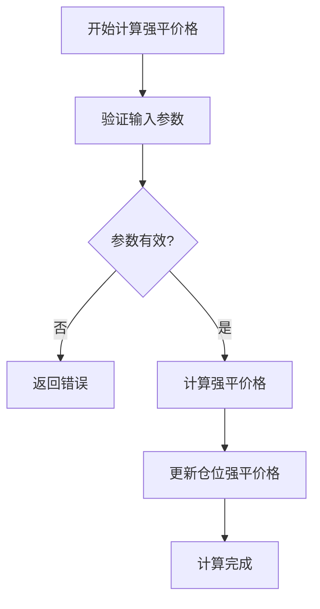

# 逐仓保证金模式

<cite>
**本文档中引用的文件**  
- [liquidation_price.py](file://freqtrade/leverage/liquidation_price.py)
- [exchange.py](file://freqtrade/exchange/exchange.py)
- [marginmode.py](file://freqtrade/enums/marginmode.py)
- [tradingmode.py](file://freqtrade/enums/tradingmode.py)
- [config_schema.py](file://freqtrade/config_schema/config_schema.py)
</cite>

## 目录
1. [引言](#引言)
2. [核心设计原理](#核心设计原理)
3. [强平价格计算模型](#强平价格计算模型)
4. [交易所层面的仓位隔离机制](#交易所层面的仓位隔离机制)
5. [initial_leverage参数的作用域](#initial_leverage参数的作用域)
6. [追加保证金（ADL）机制](#追加保证金（adl）机制)
7. [多仓位并发管理配置范例](#多仓位并发管理配置范例)
8. [风险控制优势与资金效率对比](#风险控制优势与资金效率对比)
9. [结论](#结论)

## 引言
逐仓保证金（ISOLATED）模式是Freqtrade中用于管理杠杆交易的一种重要机制。该模式的核心设计理念是为每个仓位创建独立的保证金账户，从而实现风险的完全隔离。当某个仓位发生亏损时，其影响仅限于该仓位的保证金，不会波及到其他仓位或整体账户资金。这种设计特别适用于需要高风险控制的交易策略，如网格交易和套利策略。本文将深入解析该模式的技术实现，重点阐述其在数学模型、接口调用和配置管理方面的具体实现方式。

## 核心设计原理
逐仓保证金模式的设计原理基于每个仓位拥有独立的保证金账户。在Freqtrade中，这一设计通过`MarginMode.ISOLATED`枚举值来标识，并在交易配置中明确指定。当启用逐仓模式时，每个新开立的仓位都会被分配一个独立的保证金，该保证金的计算和管理完全独立于其他仓位。这种设计确保了即使某个仓位因市场波动而触发强平，其损失也仅限于该仓位的保证金，不会影响到账户中的其他资金。此外，该模式还支持对每个仓位单独设置杠杆倍数，使得交易者可以根据不同交易对的风险特征灵活调整杠杆水平。

**Section sources**
- [marginmode.py](file://freqtrade/enums/marginmode.py#L3-L15)

## 强平价格计算模型
在逐仓保证金模式下，强平价格的计算完全基于单个仓位的开仓价、杠杆和维持保证金率。Freqtrade通过`update_liquidation_prices`函数实现这一计算逻辑。当交易处于逐仓模式时，该函数会根据仓位的开仓价、杠杆倍数和保证金金额，独立计算出该仓位的强平价格。计算过程中不考虑账户的其他资金或仓位，确保了计算的独立性和准确性。强平价格的计算公式通常为：强平价格 = 开仓价 × (1 - 维持保证金率 / 杠杆倍数)。这一数学模型确保了每个仓位的风险敞口被精确控制，避免了因市场波动导致的连锁强平风险。



**Diagram sources**
- [liquidation_price.py](file://freqtrade/leverage/liquidation_price.py#L12-L68)

**Section sources**
- [liquidation_price.py](file://freqtrade/leverage/liquidation_price.py#L12-L68)

## 交易所层面的仓位隔离机制
逐仓保证金模式在交易所层面的实现依赖于`exchange.py`中的接口调用。Freqtrade通过`Exchange`类与交易所进行交互，确保每个仓位的保证金和杠杆设置在交易所层面得到正确执行。当创建新仓位时，`Exchange`类会根据配置的`margin_mode`参数，向交易所发送相应的API请求，以建立独立的保证金账户。这一过程包括验证交易所是否支持逐仓模式、设置仓位的杠杆倍数以及监控仓位的保证金比率。通过这些接口调用，Freqtrade确保了在不同交易所上的一致性行为，同时利用交易所提供的原生功能来实现高效的仓位管理。

**Section sources**
- [exchange.py](file://freqtrade/exchange/exchange.py#L119-L817)

## initial_leverage参数的作用域
在逐仓保证金模式中，`initial_leverage`参数的作用域仅限于当前仓位。这意味着每个仓位可以独立设置其杠杆倍数，而不受其他仓位的影响。这一特性使得交易者能够根据不同的市场条件和风险偏好，为每个交易对配置最优的杠杆水平。例如，在波动性较高的市场中，交易者可以选择较低的杠杆以降低风险；而在趋势明确的市场中，则可以使用较高的杠杆以提高收益。`initial_leverage`参数的局部作用域设计，增强了交易策略的灵活性和适应性。

**Section sources**
- [config_schema.py](file://freqtrade/config_schema/config_schema.py#L0-L756)

## 追加保证金（ADL）机制
追加保证金（ADL）机制是逐仓保证金模式中的一个重要组成部分，用于在仓位保证金不足时自动补充资金。在Freqtrade中，ADL机制的触发条件通常包括仓位的保证金比率低于预设阈值，或市场波动导致仓位面临强平风险。当满足触发条件时，系统会自动从账户的可用资金中划拨资金至该仓位的保证金账户，以维持其正常运作。这一机制有效防止了因短期市场波动导致的非预期强平，提高了交易的稳定性和可靠性。

**Section sources**
- [exchange.py](file://freqtrade/exchange/exchange.py#L119-L817)

## 多仓位并发管理配置范例
在实际应用中，多仓位并发管理是逐仓保证金模式的一个典型场景。以下是一个配置范例，展示了如何在Freqtrade中设置多个独立的仓位：

```json
{
  "trading_mode": "futures",
  "margin_mode": "isolated",
  "max_open_trades": 5,
  "stake_amount": 100,
  "initial_leverage": 10,
  "pairlists": [
    {
      "method": "StaticPairList",
      "number_assets": 5
    }
  ]
}
```

该配置允许同时管理最多5个仓位，每个仓位使用100单位的保证金，并设置10倍杠杆。通过这种方式，交易者可以在不同的交易对上同时执行交易策略，而每个仓位的风险和收益都是独立计算的。

**Section sources**
- [config_schema.py](file://freqtrade/config_schema/config_schema.py#L0-L756)

## 风险控制优势与资金效率对比
逐仓保证金模式相较于全仓模式（CROSS）具有更强的风险隔离性，但资金效率较低。在逐仓模式下，每个仓位的保证金是独立的，因此一个仓位的亏损不会影响到其他仓位，这为交易者提供了更高的风险控制能力。然而，由于每个仓位都需要预留一定的保证金，整体资金利用率相对较低。相比之下，全仓模式将所有资金集中管理，资金效率更高，但一旦某个仓位发生大幅亏损，可能会影响到整个账户的安全。因此，逐仓模式更适合追求稳健收益和严格风险控制的交易策略。

**Section sources**
- [marginmode.py](file://freqtrade/enums/marginmode.py#L3-L15)
- [tradingmode.py](file://freqtrade/enums/tradingmode.py#L3-L14)

## 结论
逐仓保证金模式通过为每个仓位创建独立的保证金账户，实现了风险的完全隔离。结合精确的强平价格计算模型和灵活的杠杆设置，该模式为交易者提供了强大的风险控制工具。尽管其资金效率低于全仓模式，但在需要高风险控制的交易策略中，逐仓模式的优势尤为明显。通过合理配置和管理，交易者可以在保证资金安全的同时，实现稳定的收益增长。