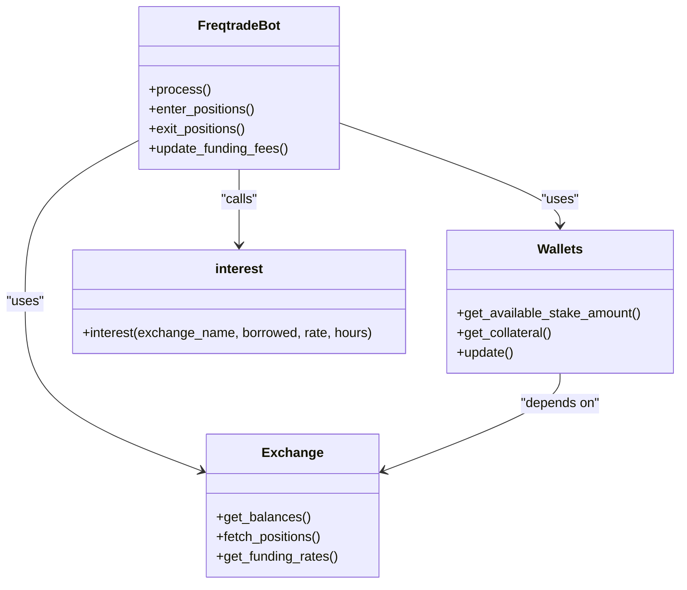
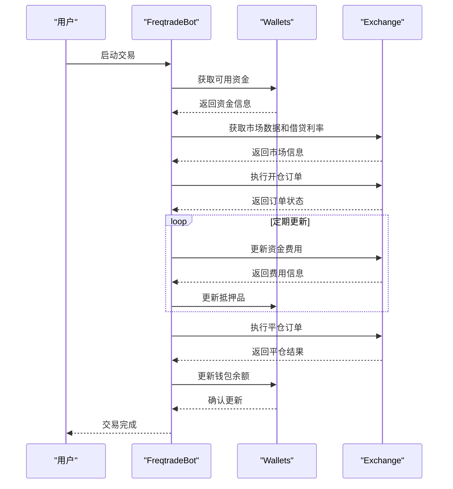
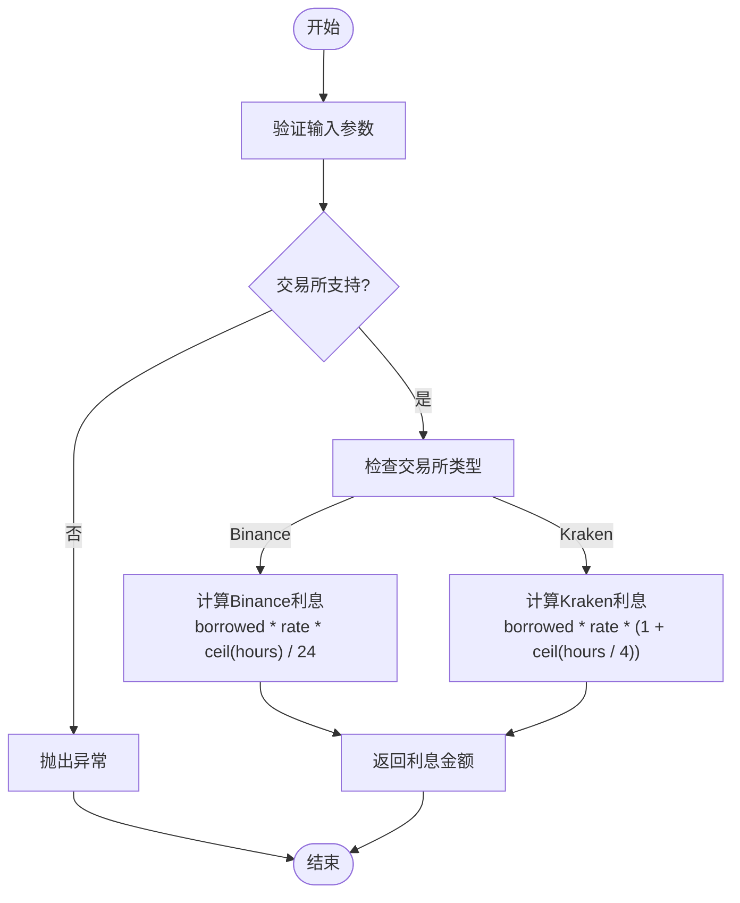

# 杠杆交易模式

<cite>
**Referenced Files in This Document**   
- [interest.py](file://freqtrade\leverage\interest.py)
- [freqtradebot.py](file://freqtrade\freqtradebot.py)
- [tradingmode.py](file://freqtrade\enums\tradingmode.py)
- [liquidation_price.py](file://freqtrade\leverage\liquidation_price.py)
- [wallets.py](file://freqtrade\wallets.py)
- [binance.py](file://freqtrade\exchange\binance.py)
- [kraken.py](file://freqtrade\exchange\kraken.py)
- [config_binance.example.json](file://config_examples\config_binance.example.json)
- [config_kraken.example.json](file://config_examples\config_kraken.example.json)
</cite>

## 目录
1. [杠杆交易模式概述](#杠杆交易模式概述)
2. [核心组件分析](#核心组件分析)
3. [资金管理与仓位生命周期](#资金管理与仓位生命周期)
4. [利息计算算法实现](#利息计算算法实现)
5. [杠杆交易与期货交易对比](#杠杆交易与期货交易对比)
6. [主流交易所配置范例](#主流交易所配置范例)
7. [最佳实践建议](#最佳实践建议)

## 杠杆交易模式概述

Freqtrade框架通过`TradingMode.MARGIN`枚举值定义了杠杆交易模式，该模式允许用户在支持的交易所上进行借贷交易，以放大投资回报。系统通过`freqtradebot.py`中的核心逻辑协调资金管理、仓位开平仓以及利息计算等关键流程。当配置`trading_mode`为`MARGIN`时，系统将启用杠杆交易功能，利用`exchange`接口获取借贷利率，并通过`interest.py`模块精确计算利息支出。整个流程旨在实现抵押品与债务的动态平衡，确保交易策略在杠杆环境下稳健运行。

**Section sources**
- [tradingmode.py](file://freqtrade\enums\tradingmode.py#L3-L14)
- [freqtradebot.py](file://freqtrade\freqtradebot.py#L0-L799)

## 核心组件分析

杠杆交易模式的核心组件包括`interest.py`中的利息计算函数、`freqtradebot.py`中的资金管理逻辑以及`exchange`接口的实现。`interest.py`模块提供了计算杠杆交易利息的核心算法，支持Binance和Kraken等主流交易所的特定计息规则。`freqtradebot.py`作为系统主控制器，负责协调开仓、展期和平仓等操作，确保交易流程的连贯性。`exchange`接口则提供了与具体交易所交互的抽象层，使得系统能够灵活支持不同交易所的杠杆交易功能。



**Diagram sources**
- [freqtradebot.py](file://freqtrade\freqtradebot.py#L0-L799)
- [wallets.py](file://freqtrade\wallets.py#L35-L437)
- [exchange.py](file://freqtrade\exchange\exchange.py#L0-L100)
- [interest.py](file://freqtrade\leverage\interest.py#L0-L36)

**Section sources**
- [freqtradebot.py](file://freqtrade\freqtradebot.py#L0-L799)
- [interest.py](file://freqtrade\leverage\interest.py#L0-L36)
- [wallets.py](file://freqtrade\wallets.py#L35-L437)

## 资金管理与仓位生命周期

在`TradingMode.MARGIN`配置下，系统通过`freqtradebot.py`中的资金管理逻辑实现杠杆仓位的全生命周期管理。开仓时，系统首先通过`Wallets`类计算可用资金，然后调用`exchange`接口获取当前市场数据和借贷利率。展期过程中，系统会定期更新资金费用，并调整仓位的抵押品。平仓时，系统计算最终收益并更新钱包余额。整个流程通过`update_liquidation_prices`函数确保仓位的抵押品与债务保持动态平衡，防止因市场波动导致的强制平仓。



**Diagram sources**
- [freqtradebot.py](file://freqtrade\freqtradebot.py#L0-L799)
- [wallets.py](file://freqtrade\wallets.py#L35-L437)
- [exchange.py](file://freqtrade\exchange\exchange.py#L0-L100)

**Section sources**
- [freqtradebot.py](file://freqtrade\freqtradebot.py#L0-L799)
- [wallets.py](file://freqtrade\wallets.py#L35-L437)

## 利息计算算法实现

`interest.py`模块实现了杠杆交易利息计算的核心算法，采用高精度计算以确保结果的准确性。该算法根据交易所的不同采用不同的计息规则：对于Binance，利息按小时向上取整后计算；对于Kraken，利息计算考虑了复利周期的影响。算法通过`FtPrecise`类实现高精度浮点运算，避免了传统浮点数计算中的精度损失。跨时段结算处理通过将时间分割为小时单位并分别计算，确保了长时间持仓的利息计算准确性。



**Diagram sources**
- [interest.py](file://freqtrade\leverage\interest.py#L0-L36)

**Section sources**
- [interest.py](file://freqtrade\leverage\interest.py#L0-L36)

## 杠杆交易与期货交易对比

杠杆交易与期货交易在资金效率、风险特性和交易所支持方面存在显著差异。杠杆交易通常提供较低的杠杆倍数但具有更简单的结算机制，而期货交易则提供更高的杠杆倍数但伴随着更复杂的资金费用结构。在风险特性上，杠杆交易的强制平仓价格计算相对简单，而期货交易需要考虑维持保证金和未实现盈亏等因素。交易所支持方面，Binance和Kraken等主流交易所均提供两种交易模式，但具体的交易规则和费用结构有所不同。

**Section sources**
- [binance.py](file://freqtrade\exchange\binance.py#L0-L542)
- [kraken.py](file://freqtrade\exchange\kraken.py#L0-L206)

## 主流交易所配置范例

### Binance配置范例
Binance的杠杆交易配置需要设置`trading_mode`为`MARGIN`，并指定`stake_currency`为USDT等稳定币。配置文件中应包含交易所API密钥、交易对白名单以及适当的资金管理参数。

```json
{
    "max_open_trades": 3,
    "stake_currency": "USDT",
    "stake_amount": 30,
    "trading_mode": "margin",
    "exchange": {
        "name": "binance",
        "key": "your_exchange_key",
        "secret": "your_exchange_secret"
    }
}
```

### Kraken配置范例
Kraken的配置与Binance类似，但需注意Kraken的交易对命名规则和资金费用计算方式的差异。配置文件中应明确指定`fiat_display_currency`以确保正确的资金显示。

```json
{
    "max_open_trades": 5,
    "stake_currency": "EUR",
    "stake_amount": 10,
    "trading_mode": "margin",
    "exchange": {
        "name": "kraken",
        "key": "your_exchange_key",
        "secret": "your_exchange_key"
    }
}
```

**Section sources**
- [config_binance.example.json](file://config_examples\config_binance.example.json#L0-L84)
- [config_kraken.example.json](file://config_examples\config_kraken.example.json#L0-L90)

## 最佳实践建议

1. **资金管理**：合理设置`tradable_balance_ratio`参数，确保有足够的资金应对市场波动。
2. **风险控制**：使用`pair_blacklist`避免高波动性交易对，降低强制平仓风险。
3. **参数优化**：根据交易所的具体规则调整`unfilledtimeout`等参数，提高订单执行效率。
4. **监控与调试**：启用`api_server`进行实时监控，及时发现和解决交易问题。
5. **安全措施**：妥善保管API密钥，避免在配置文件中明文存储敏感信息。

**Section sources**
- [config_binance.example.json](file://config_examples\config_binance.example.json#L0-L84)
- [config_kraken.example.json](file://config_examples\config_kraken.example.json#L0-L90)