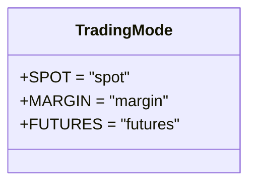
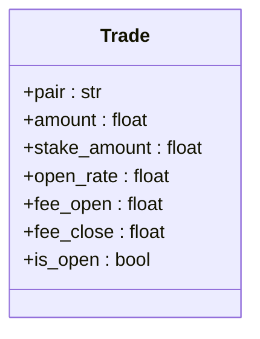

# 现货交易模式

<cite>
**本文档中引用的文件**  
- [freqtradebot.py](file://freqtrade/freqtradebot.py)
- [exchange.py](file://freqtrade/exchange/exchange.py)
- [wallets.py](file://freqtrade/wallets.py)
- [tradingmode.py](file://freqtrade/enums/tradingmode.py)
- [trade_model.py](file://freqtrade/persistence/trade_model.py)
</cite>

## 目录
1. [简介](#简介)
2. [现货交易模式配置与校验](#现货交易模式配置与校验)
3. [资金计算与钱包管理](#资金计算与钱包管理)
4. [订单执行与持仓管理](#订单执行与持仓管理)
5. [现货交易入口信号处理流程](#现货交易入口信号处理流程)
6. [现货与期货模式对比](#现货与期货模式对比)
7. [配置示例](#配置示例)
8. [结论](#结论)

## 简介
Freqtrade 是一个功能强大的加密货币交易机器人，支持多种交易模式，包括现货（SPOT）、杠杆（MARGIN）和期货（FUTURES）。本文档深入解析 Freqtrade 中的现货交易模式实现机制，重点阐述在 `TradingMode.SPOT` 配置下，资金计算、订单执行和持仓管理的完整流程。通过分析核心模块 `freqtradebot.py`、`exchange.py` 和 `wallets.py`，揭示现货交易的入口信号处理逻辑、资金分配策略以及与期货模式的关键差异，帮助用户理解何时选择现货交易作为最优方案。

## 现货交易模式配置与校验
在 Freqtrade 中，交易模式通过配置文件中的 `trading_mode` 参数进行设置。当配置为 `TradingMode.SPOT` 时，系统将启用现货交易模式。

### 交易模式枚举
现货交易模式由 `TradingMode` 枚举类定义，位于 `freqtrade/enums/tradingmode.py` 文件中。该枚举明确区分了现货、杠杆和期货等不同交易方式。



**Diagram sources**
- [tradingmode.py](file://freqtrade/enums/tradingmode.py#L9-L9)

### 交易模式校验
`exchange.py` 文件中的 `validate_trading_mode_and_margin_mode` 方法负责校验配置的交易模式和保证金模式是否被当前交易所支持。对于现货模式，由于不涉及保证金，`margin_mode` 参数被忽略。

```python
def validate_trading_mode_and_margin_mode(
    self,
    trading_mode: TradingMode,
    margin_mode: MarginMode | None,
):
    if trading_mode != TradingMode.SPOT and (
        (trading_mode, margin_mode) not in self._supported_trading_mode_margin_pairs
    ):
        mm_value = margin_mode and margin_mode.value
        raise ConfigurationError(
            f"Freqtrade does not support '{mm_value}' '{trading_mode}' on {self.name}."
        )
```

**Section sources**
- [exchange.py](file://freqtrade/exchange/exchange.py#L883-L900)

## 资金计算与钱包管理
现货交易的资金管理是其核心，主要由 `wallets.py` 模块负责。该模块跟踪用户在交易所的资产变动，并为新交易计算可用的投注金额。

### 钱包数据结构
`Wallets` 类使用 `Wallet` 命名元组来表示每种货币的余额，包含可用（free）、已用（used）和总额（total）三个字段。

### 可用资金计算
`get_available_stake_amount` 方法计算当前可用于新交易的总投注金额。它考虑了已配置的 `tradable_balance_ratio` 和当前已占用的资金。

```python
def get_available_stake_amount(self) -> float:
    free = self.get_free(self._stake_currency)
    return min(self.get_total_stake_amount() - Trade.total_open_trades_stakes(), free)
```

### 单笔交易资金分配
`get_trade_stake_amount` 方法根据配置的 `stake_amount` 和 `max_open_trades` 计算单笔交易的具体投注金额。当 `stake_amount` 设置为 `UNLIMITED_STAKE_AMOUNT` 时，系统会将可用资金平均分配给所有可能的交易。

```python
def get_trade_stake_amount(
    self, pair: str, max_open_trades: IntOrInf, update: bool = True
) -> float:
    # ... 更新钱包 ...
    stake_amount = self._config["stake_amount"]
    if stake_amount == UNLIMITED_STAKE_AMOUNT:
        stake_amount = self._calculate_unlimited_stake_amount(
            available_amount, val_tied_up, max_open_trades
        )
    return self._check_available_stake_amount(stake_amount, available_amount)
```

**Section sources**
- [wallets.py](file://freqtrade/wallets.py#L150-L200)

## 订单执行与持仓管理
现货交易的订单执行和持仓管理主要在 `freqtradebot.py` 中实现，通过 `enter_positions` 和 `create_trade` 方法协调。

### 持仓管理
在现货模式下，持仓信息主要通过 `Trade` 模型（位于 `persistence/trade_model.py`）进行管理。每个 `Trade` 对象代表一个打开的交易，记录了交易对、投注金额、开仓价格、手续费等关键信息。



**Diagram sources**
- [trade_model.py](file://freqtrade/persistence/trade_model.py#L300-L350)

### 订单执行流程
当一个交易被创建时，系统会根据策略生成的信号，通过交易所 API 执行买入订单。相关的费用（如交易费）会在订单成交后被记录到 `Trade` 对象中。

## 现货交易入口信号处理流程
现货交易的入口信号处理流程始于 `enter_positions` 方法，该方法遍历当前白名单中的交易对，并为每个符合条件的交易对调用 `create_trade` 方法。

### `enter_positions` 方法
该方法首先获取当前活跃的交易对白名单，并移除已有持仓的交易对，以避免重复开仓。

```python
def enter_positions(self) -> int:
    trades_created = 0
    whitelist = deepcopy(self.active_pair_whitelist)
    # 移除已有持仓的交易对
    for trade in Trade.get_open_trades():
        if trade.pair in whitelist:
            whitelist.remove(trade.pair)
    # ... 遍历白名单 ...
    for pair in whitelist:
        with self._exit_lock:
            trades_created += self.create_trade(pair)
    return trades_created
```

### `create_trade` 方法
这是创建新交易的核心逻辑。它会检查交易信号、资金锁、深度市场等条件，最终决定是否执行交易。

```python
def create_trade(self, pair: str) -> bool:
    # 获取分析后的数据
    analyzed_df, _ = self.dataprovider.get_analyzed_dataframe(pair, self.strategy.timeframe)
    # 检查是否有进入信号
    (signal, enter_tag) = self.strategy.get_entry_signal(pair, self.strategy.timeframe, analyzed_df)
    if signal:
        # 检查交易对是否被锁定
        if self.strategy.is_pair_locked(pair, candle_date=nowtime, side=signal):
            return False
        # 计算投注金额
        stake_amount = self.wallets.get_trade_stake_amount(pair, self.config["max_open_trades"])
        # 执行进入
        return self.execute_entry(pair, stake_amount, enter_tag=enter_tag, is_short=(signal == SignalDirection.SHORT))
    return False
```

**Section sources**
- [freqtradebot.py](file://freqtrade/freqtradebot.py#L602-L710)

## 现货与期货模式对比
| 特性 | 现货交易 (SPOT) | 期货交易 (FUTURES) |
| :--- | :--- | :--- |
| **风险控制** | 风险仅限于投入的本金，无爆仓风险。 | 存在杠杆，风险远高于本金，有爆仓风险。 |
| **手续费计算** | 主要计算交易手续费（maker/taker fee）。 | 除交易手续费外，还需计算资金费用（funding fees）。 |
| **性能表现** | 逻辑相对简单，计算开销较小。 | 需要实时计算资金费用和维持保证金，计算开销较大。 |
| **资金管理** | 使用 `Wallet` 结构跟踪余额。 | 使用 `PositionWallet` 结构跟踪仓位和保证金。 |
| **持仓管理** | 持仓即为实际拥有的资产。 | 持仓是合约头寸，与实际资产分离。 |

## 配置示例
以下是一个典型的现货交易模式配置示例：

```json
{
  "trading_mode": "spot",
  "margin_mode": "",
  "stake_currency": "USDT",
  "stake_amount": 100,
  "max_open_trades": 5,
  "dry_run": true,
  "exchange": {
    "name": "binance",
    "key": "",
    "secret": ""
  }
}
```

## 结论
Freqtrade 的现货交易模式提供了一个安全、直接的加密货币交易方式。通过 `TradingMode.SPOT` 配置，系统会禁用杠杆和保证金相关功能，并通过 `wallets.py` 模块精确管理用户的资金。入口信号处理流程清晰，从 `enter_positions` 到 `create_trade`，再到最终的订单执行，整个过程高效且可靠。与期货模式相比，现货模式在风险控制上更为保守，适合风险偏好较低的投资者。用户应根据自身的风险承受能力和投资目标，选择最适合的交易模式。