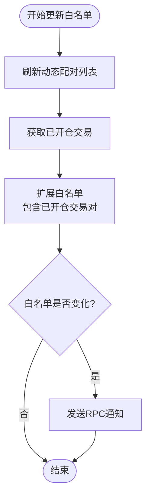
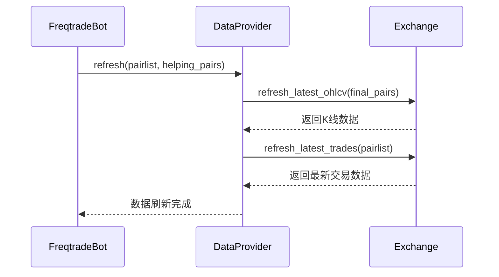

# 数据刷新机制

<cite>
**Referenced Files in This Document**   
- [freqtradebot.py](file://freqtrade/freqtradebot.py)
- [dataprovider.py](file://freqtrade/data/dataprovider.py)
</cite>

## 目录
1. [数据刷新流程概述](#数据刷新流程概述)
2. [白名单更新机制](#白名单更新机制)
3. [数据提供者协同工作](#数据提供者协同工作)
4. [多时间框架数据同步](#多时间框架数据同步)
5. [增量更新与数据完整性](#增量更新与数据完整性)

## 数据刷新流程概述

FreqtradeBot的`process()`方法在每个交易周期中执行数据刷新阶段，该阶段是交易决策的基础。此过程首先通过`_refresh_active_whitelist()`方法更新活跃的交易对白名单，然后调用`DataProvider.refresh()`方法来获取最新的市场数据。

数据刷新的核心在于协调三个关键组件：主交易对列表、信息性交易对以及数据提供者。`DataProvider.refresh()`方法接收两个参数：由`pairlists.create_pair_list()`生成的主周期交易对列表和由`strategy.gather_informative_pairs()`获取的信息周期交易对列表。这种设计确保了策略分析所需的所有时间框架和交易对的数据都能被正确加载。

**Section sources**
- [freqtradebot.py](file://freqtrade/freqtradebot.py#L246-L300)

## 白名单更新机制

`_refresh_active_whitelist()`方法负责维护活跃的交易对白名单，这是确保数据完整性的关键步骤。该方法首先从配对列表管理器（PairListManager）中获取最新的动态配对列表，然后将当前已开仓的交易对添加到白名单中。

这种双重机制确保了即使某个交易对因市场条件变化而被移出动态配对列表，只要存在未平仓的交易，该交易对的数据仍会被持续加载。这避免了因数据缺失导致的策略分析错误。当白名单发生变化时，系统会通过RPC通知发送更新消息，使外部监控系统能够及时获知交易对的变化。

**Diagram sources**
- [freqtradebot.py](file://freqtrade/freqtradebot.py#L327-L346)

**Section sources**
- [freqtradebot.py](file://freqtrade/freqtradebot.py#L327-L346)

## 数据提供者协同工作

数据提供者（DataProvider）作为系统的核心组件，负责协调数据获取过程。在`refresh()`方法中，它将主周期交易对列表和信息周期交易对列表合并，然后通过交易所实例批量获取所有必要的K线数据。

`pairlists.create_pair_list()`方法根据当前的白名单和配置生成主周期的交易对列表，而`strategy.gather_informative_pairs()`则由策略类实现，用于指定需要额外时间框架数据的交易对。这种分离设计使得策略可以灵活地请求不同时间框架的数据，而配对列表管理器则专注于主交易周期的筛选。

**Diagram sources**
- [dataprovider.py](file://freqtrade/data/dataprovider.py#L437-L451)

**Section sources**
- [dataprovider.py](file://freqtrade/data/dataprovider.py#L437-L451)

## 多时间框架数据同步

数据提供者通过`available_pairs`属性管理多个时间框架和交易对的数据同步。当`refresh()`方法被调用时，它会将主周期和信息周期的所有交易对组合成一个最终的交易对列表，并一次性向交易所请求数据。

这种批量请求机制不仅提高了网络效率，还确保了不同时间框架数据的时间一致性。数据提供者内部维护一个缓存字典`__cached_pairs`，以交易对、时间框架和蜡烛类型为键存储最新的数据分析结果。这种缓存机制避免了重复计算，提高了策略分析的效率。

**Section sources**
- [dataprovider.py](file://freqtrade/data/dataprovider.py#L38-L621)

## 增量更新与数据完整性

在增量更新模式下，数据提供者通过`refresh_latest_trades()`方法确保交易数据的完整性。当配置中启用了公共交易数据时，系统会定期从交易所获取最新的交易记录，并将其与现有的K线数据进行整合。

数据完整性通过两个层面来保证：首先，在每个周期开始时更新白名单，确保所有相关市场的数据都被加载；其次，通过交易所的`refresh_latest_ohlcv()`方法获取最新的K线数据，确保策略分析基于最新的市场信息。这种双重保障机制使得系统能够在保持高性能的同时，确保交易决策的准确性和及时性。

**Section sources**
- [dataprovider.py](file://freqtrade/data/dataprovider.py#L453-L461)