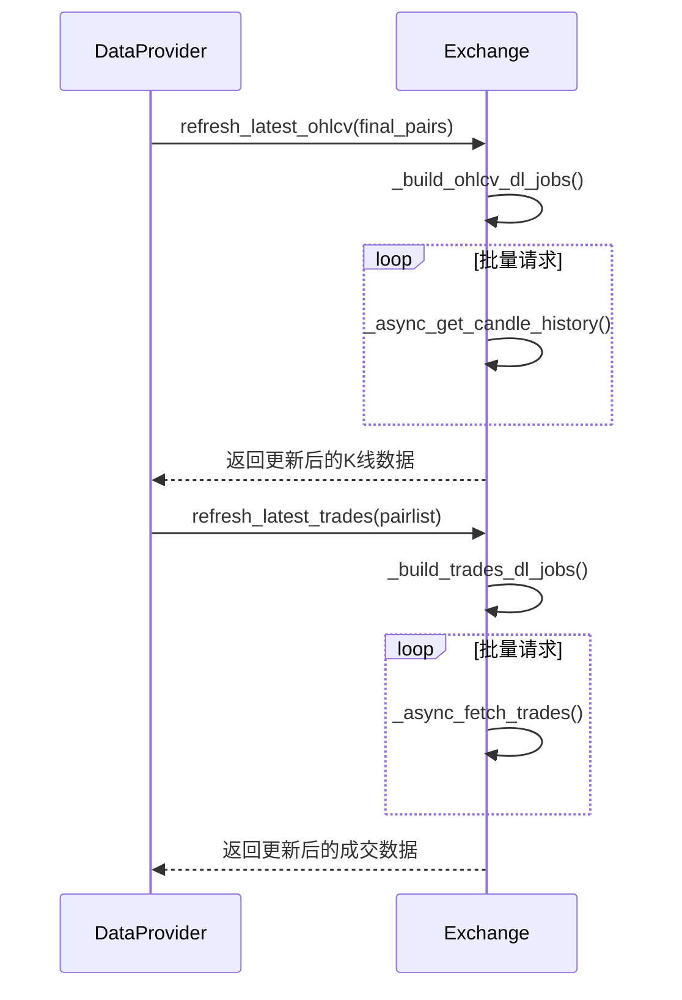
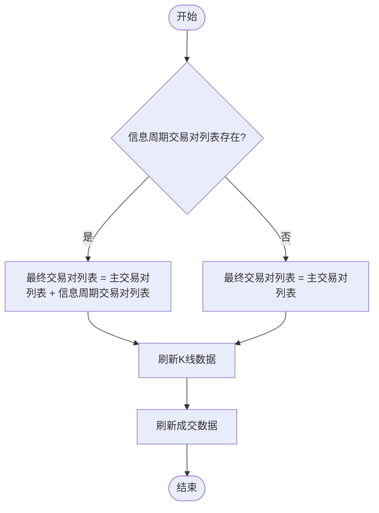
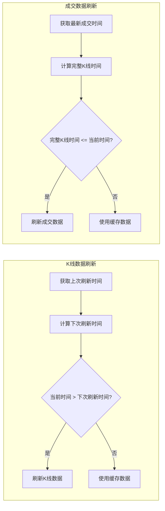
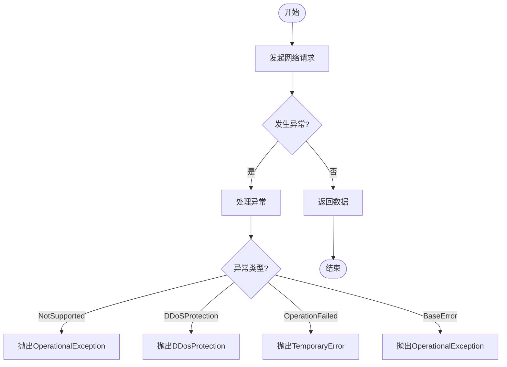
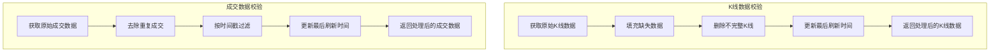

# 数据提供者刷新流程

<cite>
**本文档引用的文件**
- [dataprovider.py](file://freqtrade/data/dataprovider.py)
- [exchange.py](file://freqtrade/exchange/exchange.py)
</cite>

## 目录
1. [简介](#简介)
2. [数据刷新流程](#数据刷新流程)
3. [主交易对与信息周期交易对合并处理](#主交易对与信息周期交易对合并处理)
4. [增量数据获取策略](#增量数据获取策略)
5. [错误处理机制与网络异常恢复](#错误处理机制与网络异常恢复)
6. [数据一致性校验](#数据一致性校验)

## 简介
数据提供者（DataProvider）是Freqtrade系统中负责提供市场数据的核心组件，包括K线（OHLCV）数据、订单簿数据和最新成交数据。该系统通过`DataProvider.refresh()`方法协调`Exchange.refresh_latest_ohlcv()`方法，实现多时间框架、多交易对的K线数据批量更新。本文档详细解析该流程，阐述主交易对列表与信息周期交易对列表的合并处理逻辑，以及增量数据获取策略如何保证数据完整性与时效性，并说明数据刷新过程中的错误处理机制和网络异常恢复策略。

## 数据刷新流程
`DataProvider.refresh()`方法是数据刷新的核心入口，它被每个交易周期调用，负责协调K线数据和最新成交数据的更新。该方法首先检查交易所实例是否存在，然后将主交易对列表与信息周期交易对列表合并，形成最终需要刷新的交易对列表。接着，它调用`Exchange.refresh_latest_ohlcv()`方法来刷新K线数据，随后调用`refresh_latest_trades()`方法来刷新最新成交数据。

**Diagram sources**
- [dataprovider.py](file://freqtrade/data/dataprovider.py#L437-L451)
- [exchange.py](file://freqtrade/exchange/exchange.py#L2698-L2751)

**Section sources**
- [dataprovider.py](file://freqtrade/data/dataprovider.py#L437-L451)
- [exchange.py](file://freqtrade/exchange/exchange.py#L2698-L2751)

## 主交易对与信息周期交易对合并处理
在数据刷新过程中，系统需要同时处理主交易对列表和信息周期交易对列表。主交易对列表是用户配置的交易对，而信息周期交易对列表是策略中用于计算指标的额外交易对。`DataProvider.refresh()`方法通过将这两个列表合并来形成最终的交易对列表。如果信息周期交易对列表存在，则将其与主交易对列表相加；否则，仅使用主交易对列表。这种合并处理确保了所有需要的数据都能被及时更新。

**Diagram sources**
- [dataprovider.py](file://freqtrade/data/dataprovider.py#L437-L451)

**Section sources**
- [dataprovider.py](file://freqtrade/data/dataprovider.py#L437-L451)

## 增量数据获取策略
系统采用增量数据获取策略来保证数据的完整性和时效性。对于K线数据，系统通过`_now_is_time_to_refresh()`方法判断是否需要刷新。该方法比较当前时间与上次刷新时间加上时间框架的间隔，如果当前时间大于该值，则需要刷新。对于成交数据，系统通过`_now_is_time_to_refresh_trades()`方法判断是否需要刷新。该方法检查最新成交数据的时间戳，如果最新成交数据的时间戳小于当前时间，则需要刷新。这种增量获取策略避免了不必要的网络请求，提高了数据获取的效率。

**Diagram sources**
- [exchange.py](file://freqtrade/exchange/exchange.py#L2784-L2790)
- [exchange.py](file://freqtrade/exchange/exchange.py#L3064-L3074)

**Section sources**
- [exchange.py](file://freqtrade/exchange/exchange.py#L2784-L2790)
- [exchange.py](file://freqtrade/exchange/exchange.py#L3064-L3074)

## 错误处理机制与网络异常恢复
在数据刷新过程中，系统实现了完善的错误处理机制和网络异常恢复策略。对于网络请求，系统使用`@retrier_async`装饰器来实现重试逻辑。当网络请求失败时，系统会自动重试，直到成功或达到最大重试次数。对于异常处理，系统捕获各种可能的异常，如`ccxt.NotSupported`、`ccxt.DDoSProtection`、`ccxt.OperationFailed`等，并根据异常类型进行相应的处理。例如，对于`ccxt.DDoSProtection`异常，系统会抛出`DDosProtection`异常；对于`ccxt.OperationFailed`异常，系统会抛出`TemporaryError`异常。这种错误处理机制确保了系统在网络异常情况下的稳定运行。

**Diagram sources**
- [exchange.py](file://freqtrade/exchange/exchange.py#L2793-L2870)

**Section sources**
- [exchange.py](file://freqtrade/exchange/exchange.py#L2793-L2870)

## 数据一致性校验
为了保证数据的一致性，系统在数据处理过程中进行了多项校验。对于K线数据，系统在`_process_ohlcv_df()`方法中对数据进行处理，包括填充缺失数据、删除不完整K线等。对于成交数据，系统在`_process_trades_df()`方法中对数据进行处理，包括去除重复成交、按时间戳过滤等。此外，系统还通过`_pairs_last_refresh_time`字典记录每个交易对的最后刷新时间，用于判断是否需要刷新数据。这些数据一致性校验措施确保了数据的准确性和可靠性。

**Diagram sources**
- [exchange.py](file://freqtrade/exchange/exchange.py#L2659-L2696)
- [exchange.py](file://freqtrade/exchange/exchange.py#L2907-L2932)

**Section sources**
- [exchange.py](file://freqtrade/exchange/exchange.py#L2659-L2696)
- [exchange.py](file://freqtrade/exchange/exchange.py#L2907-L2932)